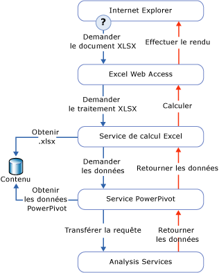

# Accès aux données Power Pivot
[!INCLUDE[ssas-appliesto-sqlas](../../includes/ssas-appliesto-sqlas.md)]
  Cette rubrique décrit les différentes méthodes de récupération des données d’un classeur [!INCLUDE[ssGemini](../../includes/ssgemini-md.md)] publié dans une bibliothèque SharePoint.  
  
 [!INCLUDE[ssGemini](../../includes/ssgemini-md.md)] sont stockées dans un classeur Excel. La chaîne de connexion est une URL vers un classeur sur un site SharePoint.  
  
 [!INCLUDE[ssGemini](../../includes/ssgemini-md.md)] sont le plus souvent utilisées par le classeur qui les contient, notamment les données sous-jacentes des tableaux croisés dynamiques et des graphiques croisés dynamiques. Les données [!INCLUDE[ssGemini](../../includes/ssgemini-md.md)] peuvent également être utilisées en tant que source de données externe ; dans ce cas, un classeur, un tableau de bord ou un rapport se connectent à un fichier Excel (.xlsx) distinct dans SharePoint et récupèrent les données pour une utilisation ultérieure. Les outils clients utilisant généralement des données [!INCLUDE[ssGemini](../../includes/ssgemini-md.md)] sont Excel, [!INCLUDE[ssCrescent](../../includes/sscrescent-md.md)], les autres rapports Reporting Services et PerformancePoint.  
  
 Sur le bureau, le complément [!INCLUDE[ssGemini](../../includes/ssgemini-md.md)] utilise AMO et ADOMD.NET pour créer, traiter et interroger les données [!INCLUDE[ssGemini](../../includes/ssgemini-md.md)] dans l’espace de travail client.  
  
 Sur une batterie de serveurs SharePoint, Excel Services utilise le fournisseur OLE DB MSOLAP local pour la connexion aux données [!INCLUDE[ssGemini](../../includes/ssgemini-md.md)] . Le fournisseur envoie la demande de connexion à un serveur [!INCLUDE[ssGemini](../../includes/ssgemini-md.md)] pour SharePoint de la batterie. Ce serveur charge les données, exécute la requête, et retourne l'ensemble de résultats.  
  
##   Exécution de requêtes sur les données Power Pivot dans SharePoint  
 Lorsque vous visualisez un classeur [!INCLUDE[ssGemini](../../includes/ssgemini-md.md)] à partir d’une bibliothèque SharePoint, les données [!INCLUDE[ssGemini](../../includes/ssgemini-md.md)] qui figurent dans le classeur sont détectées, extraites et traitées séparément sur les instances de serveur Analysis Services dans la batterie de serveurs, tandis qu'Excel Services restitue la couche présentation. Vous pouvez afficher le classeur complètement traité dans une fenêtre de navigateur ou dans une application de bureau Excel 2010 dotée du complément [!INCLUDE[ssGemini](../../includes/ssgemini-md.md)] .  
  
 Le diagramme suivant illustre le parcours d'une demande de traitement de requêtes dans la batterie de serveurs. Étant donné que les données [!INCLUDE[ssGemini](../../includes/ssgemini-md.md)] font partie d'un classeur Excel 2010, une demande de traitement de requête se présente lorsqu'un utilisateur ouvre un classeur Excel à partir d'une bibliothèque SharePoint et interagit avec un tableau croisé dynamique ou un graphique croisé dynamique qui contient des données [!INCLUDE[ssGemini](../../includes/ssgemini-md.md)] .  
  
   
  
 Les composants Excel Services et [!INCLUDE[ssGemini](../../includes/ssgemini-md.md)] pour SharePoint traitent des parties différentes du même fichier de classeur (.xlsx). Excel Services détecte les données [!INCLUDE[ssGemini](../../includes/ssgemini-md.md)] et en demande le traitement par un serveur [!INCLUDE[ssGemini](../../includes/ssgemini-md.md)] de la batterie de serveurs. Le serveur [!INCLUDE[ssGemini](../../includes/ssgemini-md.md)] alloue la demande à une instance du [!INCLUDE[ssGeminiSrv](../../includes/ssgeminisrv-md.md)] , qui extrait les données du classeur dans la bibliothèque de contenu et charge les données. Les données stockées en mémoire font l'objet d'une nouvelle fusion dans le classeur rendu et sont retransmises à Excel Web Access en vue de leur présentation dans une fenêtre de navigateur.  
  
 Certaines données d’un classeur [!INCLUDE[ssGemini](../../includes/ssgemini-md.md)] ne sont pas gérées par [!INCLUDE[ssGemini](../../includes/ssgemini-md.md)] pour SharePoint. Excel Services traite les tableaux et les données des cellules d'une feuille de calcul. Seuls les tableaux croisés dynamiques, les graphiques croisés dynamiques et les segments qui vont à l’encontre des données [!INCLUDE[ssGemini](../../includes/ssgemini-md.md)] sont gérés par [!INCLUDE[ssGemini](../../includes/ssgemini-md.md)] pour SharePoint.  
  
## Voir aussi  
 [Se connecter à Analysis Services](../../analysis-services/instances/connect-to-analysis-services.md)   
 [Accès aux données de modèle tabulaire](../../analysis-services/tabular-models/tabular-model-data-access.md)  
  
  
