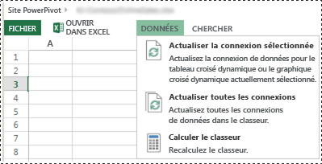
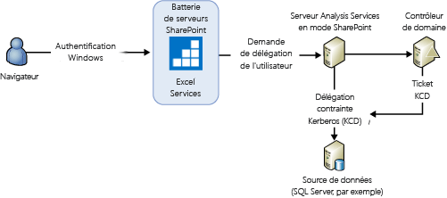
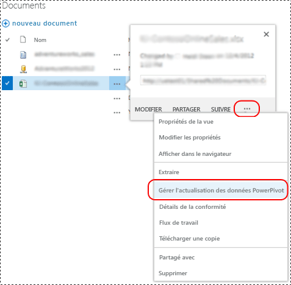
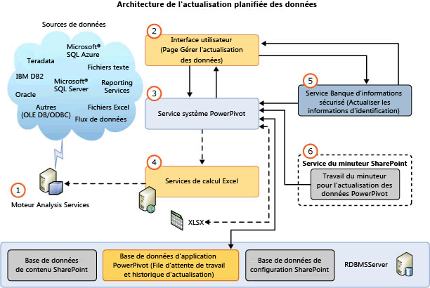
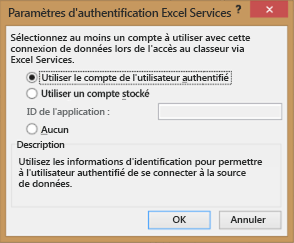

# Actualisation des données Power Pivot avec SharePoint 2013
[!INCLUDE[ssas-appliesto-sqlas](../../includes/ssas-appliesto-sqlas.md)]
  La conception de l'actualisation des modèles de données [!INCLUDE[ssGemini](../../includes/ssgemini-md.md)] dans SharePoint 2013 utilise Excel Services en tant que composant principal pour charger et actualiser des modèles de données sur une instance de [!INCLUDE[ssCurrent](../../includes/sscurrent-md.md)] [!INCLUDE[ssASnoversion](../../includes/ssasnoversion-md.md)] exécutée en mode SharePoint. Le serveur [!INCLUDE[ssASnoversion](../../includes/ssasnoversion-md.md)] s'exécute en externe sur la batterie de serveurs SharePoint. L'architecture d'Excel Services dans SharePoint 2013 prend en charge l' **actualisation interactive des données** et l' **actualisation planifiée des données**.  
  
 **[!INCLUDE[applies](../../includes/applies-md.md)]**  SharePoint 2013  
  
 **Dans cette rubrique :**  
  
-   [Interactive Data Refresh](#bkmk_interactive_refresh)  
  
-   [Authentification Windows pour les connexions de données du classeur et l'actualisation interactive des données](#bkmk_windows_auth_interactive_data_refresh)  
  
-   [Scheduled Data Refresh](#bkmk_scheduled_refresh)  
  
-   [Architecture de l'actualisation planifiée des données dans SharePoint 2013](#bkmk_refresh_architecture)  
  
-   [Considérations supplémentaires relatives à l'authentification](#datarefresh_additional_authentication)  
  
-   [Informations supplémentaires](#bkmk_moreinformation)  
  
## Arrière-plan  
 Excel Services dans SharePoint Server 2013 gère l’actualisation des données pour les classeurs Excel 2013 et génère le traitement du modèle de données sur un serveur [!INCLUDE[ssCurrent](../../includes/sscurrent-md.md)] [!INCLUDE[ssASnoversion](../../includes/ssasnoversion-md.md)] qui s’exécute en mode SharePoint. Pour les classeurs Excel 2010, Excel Services gère également le chargement et l'enregistrement des classeurs et des modèles de données. Toutefois, Excel Services repose sur le service système [!INCLUDE[ssGemini](../../includes/ssgemini-md.md)] pour envoyer des commandes de traitement au modèle de données. Le tableau suivant récapitule les composants qui envoient des commandes de traitement pour l'actualisation des données en fonction de la version du classeur. L'environnement donné est une batterie de serveurs SharePoint 2013 configurée pour utiliser un [!INCLUDE[ssCurrent](../../includes/sscurrent-md.md)] Analysis Server qui s'exécute en mode SharePoint.  
  
||||  
|-|-|-|  
||Classeurs Excel 2013|Classeurs Excel 2010|  
|Déclencher l'actualisation des données|**Interactive :** Utilisateur authentifié   **Planifiée :** [!INCLUDE[ssGemini](../../includes/ssgemini-md.md)] Service système|[!INCLUDE[ssGemini](../../includes/ssgemini-md.md)] Service système|  
|Charger le classeur depuis les bases de données de contenu|Excel Services dans SharePoint 2013|Excel Services dans SharePoint 2013|  
|Charger le modèle de données sur l'instance Analysis Services|Excel Services dans SharePoint 2013|Excel Services dans SharePoint 2013|  
|Envoyer les commandes de traitement à l'instance Analysis Services|Excel Services dans SharePoint 2013|[!INCLUDE[ssGemini](../../includes/ssgemini-md.md)] Service système|  
|Mettre à jour les données du classeur|Excel Services dans SharePoint 2013|Excel Services dans SharePoint 2013|  
|Enregistrer le classeur et le modèle de données dans la base de données de contenu|**Interactive :** N/A   **Planifiée :** Excel Services dans SharePoint 2013|Excel Services dans SharePoint 2013|  
  
 Le tableau suivant récapitule les fonctionnalités d'actualisation prises en charge dans une batterie de serveurs SharePoint 2013 configurée pour utiliser un [!INCLUDE[ssCurrent](../../includes/sscurrent-md.md)] Analysis Server s'exécutant en mode SharePoint :  
  
|Classeur créé dans|actualisation planifiée des données|Actualisation interactive|  
|-------------------------|----------------------------|-------------------------|  
|2008 R2 [!INCLUDE[ssGemini](../../includes/ssgemini-md.md)] pour Excel|Non pris en charge. Mettre à niveau le classeur **(\*)**|Non pris en charge. Mettre à niveau le classeur **(\*)**|  
|2012 [!INCLUDE[ssGemini](../../includes/ssgemini-md.md)] pour Excel|Pris en charge|Non pris en charge. Mettre à niveau le classeur **(\*)**|  
|Excel 2013|Pris en charge|Pris en charge|  
  
 **(\*)** Pour plus d’informations, consultez [Mettre à niveau les classeurs et l’actualisation planifiée des données &#40;SharePoint 2013&#41;](../../analysis-services/instances/install-windows/upgrade-workbooks-and-scheduled-data-refresh-sharepoint-2013.md).  
  
##   Interactive Data Refresh  
 L'actualisation des données interactive ou manuelle dans SharePoint Server 2013 Excel Services permet d'actualiser les modèles de données avec les données de la source de données d'origine. L'actualisation interactive des données est disponible après avoir configuré une application Excel Services lorsque vous inscrivez un serveur [!INCLUDE[ssASnoversion](../../includes/ssasnoversion-md.md)] exécuté en mode SharePoint. Pour plus d’informations, consultez [(SharePoint Server 2013) de paramètres de modèle de données de gérer les Services Excel](http://technet.microsoft.com/library/jj219780.aspx) (http://technet.microsoft.com/library/jj219780.aspx).  
  
> [!NOTE]  
>  L'actualisation interactive des données est disponible uniquement pour les classeurs créés dans Excel 2013. Si vous actualisez un classeur Excel 2010, Excel Services affiche un message d’erreur de type « Échec de l’opération[!INCLUDE[ssGemini](../../includes/ssgemini-md.md)] : le classeur a été créé dans une version antérieure d’Excel et [!INCLUDE[ssGemini](../../includes/ssgemini-md.md)] ne peut pas être actualisé tant que le fichier n’est pas mis à niveau. » Pour plus d’informations sur la mise à niveau des classeurs, consultez [Mettre à niveau les classeurs et l’actualisation planifiée des données &#40;SharePoint 2013&#41;](../../analysis-services/instances/install-windows/upgrade-workbooks-and-scheduled-data-refresh-sharepoint-2013.md).  
  
 **Point clé de l'actualisation interactive :**  
  
-   L'actualisation interactive des données actualise uniquement les données dans la session de l'utilisateur actuel. Les données ne sont pas automatiquement enregistrées dans l'élément de classeur dans la base de données de contenu SharePoint.  
  
-   **Informations d’identification :** L’actualisation interactive des données peut utiliser l’identité de l’utilisateur actuellement connecté en tant qu’informations d’identification, ou informations d’identification stockées, pour la connexion à la source de données. Les informations d'identification utilisées dépendent des paramètres d'authentification d'Excel Services définis pour la connexion du classeur à la source de données externe.  
  
-   **Classeurs pris en charge :**  classeurs créés dans Excel 2013.  
  
 **Pour actualiser les données :**  
  
-   Consultez l'illustration qui suit les étapes.  
  
1.  Dans une bibliothèque de documents SharePoint, ouvrez un classeur [!INCLUDE[ssGemini](../../includes/ssgemini-md.md)] dans le navigateur.  
  
2.  Dans la fenêtre du navigateur, cliquez sur le menu du **Données** puis cliquez sur **Actualiser la connexion sélectionnée** ou sur **Actualiser toutes les connexions**.  
  
3.  Excel Services charge la base de données [!INCLUDE[ssGemini](../../includes/ssgemini-md.md)] , la traite et lui demande d’actualiser le cache du classeur Excel.  
  
4.  **Remarque :** le classeur mis à jour n'est pas automatiquement enregistré dans la bibliothèque de documents.  
  
   
  
###   Authentification Windows pour les connexions de données du classeur et l'actualisation interactive des données  
 Excel Services envoie au serveur Analysis Services une commande de traitement qui indique au serveur d'emprunter l'identité d'un compte d'utilisateur. Pour obtenir des droits d’administrateur système suffisants pour exécuter le processus de délégation-emprunt d’identité d’utilisateur, le compte de service Analysis Services doit disposer du privilège **Agir en tant que partie du système d’exploitation** sur le serveur local. Le serveur Analysis Services doit également pouvoir déléguer les informations d'identification de l'utilisateur aux sources de données. Le résultat de la requête est envoyé à Excel Services.  
  
 Expérience utilisateur typique : lorsqu’un client sélectionne « Actualiser toutes les connexions » dans un classeur Excel 2013 qui contient un modèle [!INCLUDE[ssGemini](../../includes/ssgemini-md.md)] , il voit un message d’erreur semblable au suivant :  
  
-   **Échec de l’actualisation des données externes :** une erreur s’est produite lors de l’utilisation du modèle de données dans le classeur. Réessayez. Nous n’avons pas pu actualiser une ou plusieurs connexions de données dans ce classeur.  
  
 Selon le fournisseur de données que vous utilisez, vous pouvez voir des messages semblables aux suivants dans le journal ULS.  
  
 **Avec SQL Native Client :**  
  
-   Nous n’avons pas pu créer de connexion externe ou exécuter la requête. Message du fournisseur : L'objet hors ligne « DataSource », qui fait référence aux ID « 20102481-39c8-4d21-bf63-68f583ad22bb », a été spécifié mais n'a pas été utilisé.  Erreur OLE DB ou ODBC : Une erreur liée au réseau ou spécifique à l'instance s'est produite lors de l'établissement d'une connexion à SQL Server. Le serveur est introuvable ou n'est pas accessible. Vérifiez si le nom de l'instance est correct et si SQL Server est configuré pour autoriser les connexions distantes. Pour plus d'informations, consultez la documentation en ligne de SQL Server. 08001 ; Fournisseur SSL : Le package de sécurité requis n'existe pas ; 08001 ; Le client ne peut pas établir de connexion ; 08001 ; Chiffrement non pris en charge sur le client ; 08001 ;  , ConnectionName: ThisWorkbookDataModel, Workbook: book1.xlsx.  
  
 **Avec le Fournisseur Microsoft OLE DB pour SQL Server :**  
  
-   Nous n’avons pas pu créer de connexion externe ou exécuter la requête. Message du fournisseur : L'objet hors ligne 'DataSource', qui fait référence aux ID '6e711bfa-b62f-4879-a177-c5dd61d9c242', a été spécifié mais n'a pas été utilisé. Erreur OLE DB ou ODBC. , ConnectionName : ThisWorkbookDataModel, Classeur : OLEDB Provider.xlsx.  
  
 **Avec le Fournisseur de données .NET Framework pour SQL Server :**  
  
-   Nous n’avons pas pu créer de connexion externe ou exécuter la requête. Message du fournisseur : L'objet hors ligne 'DataSource', qui fait référence aux ID 'f5fb916c-3eac-4d07-a542-531524c0d44a', a été spécifié mais n'a pas été utilisé.  Erreurs dans le moteur relationnel de haut niveau. L'exception suivante s'est produite lors de l'utilisation de l'interface IDbConnection : Impossible de charger le fichier ou l'assembly « System.Transactions, Version=4.0.0.0, Culture=neutral, PublicKeyToken=b77a5c561934e089 » ou l'une de ses dépendances. Soit un niveau d'emprunt d'identité requis n'a pas été fourni, soit le niveau d'emprunt d'identité fourni n'est pas valide. (Exception de HRESULT : 0x80070542).  , ConnectionName: ThisWorkbookDataModel, Workbook: NETProvider.xlsx.  
  
 **Résumé des étapes de configuration** Pour configurer le privilège **Agir en tant que partie du système d’exploitation** sur le serveur local :  
  
1.  Sur le serveur Analysis Services en mode SharePoint, ajoutez le compte de service Analysis Services au privilège « Agir en tant que partie du système d'exploitation » :  
  
    1.  Exécutez «`secpol.msc`».  
  
    2.  Cliquez sur **Stratégie de sécurité locale**, puis sur **Stratégies locales**, et sur **Attribution des droits utilisateur**.  
  
    3.  Ajoutez le compte de service.  
  
2.  Redémarrez Excel Services et redémarrez le serveur Analysis Services.  
  
3.  La délégation du compte de service Excel Services ou du service d'émission de jetons Revendications vers Windows (C2WTS) à l'instance Analysis Services n'est pas nécessaire. Par conséquent, aucune configuration pour KCD depuis Excel Services ou C2WTS vers le service Analysis Services [!INCLUDE[ssGemini](../../includes/ssgemini-md.md)] n’est nécessaire. Si la source de données principale se trouve sur le même serveur que l'instance [!INCLUDE[ssASnoversion](../../includes/ssasnoversion-md.md)] , la délégation contrainte Kerberos n'est pas nécessaire. Toutefois, le compte de service [!INCLUDE[ssASnoversion](../../includes/ssasnoversion-md.md)] doit posséder le droit Agir en tant que partie du système d'exploitation.  
  
   
  
 Pour plus d’informations, consultez [agir en tant que partie du système d’exploitation](http://technet.microsoft.com/library/cc784323\(WS.10\).aspx) (http://technet.microsoft.com/library/cc784323(WS.10).aspx).  
  
##   Scheduled Data Refresh  
 **Points clés de l'actualisation planifiée des données :**  
  
-   Nécessite le déploiement du complément [!INCLUDE[ssGemini](../../includes/ssgemini-md.md)] pour SharePoint. Pour plus d’informations, consultez [Installer ou désinstaller le complément Power Pivot pour SharePoint &#40;SharePoint 2013&#41;](../../analysis-services/instances/install-windows/install-or-uninstall-the-power-pivot-for-sharepoint-add-in-sharepoint-2013.md).  
  
-   Un utilisateur configure une planification d'actualisation pour un classeur. À l’heure planifiée, le service système [!INCLUDE[ssGemini](../../includes/ssgemini-md.md)] envoie une requête dans Excel Services pour :  
  
    -   Charger et traiter la base de données [!INCLUDE[ssGemini](../../includes/ssgemini-md.md)] .  
  
    -   Actualiser le classeur.  
  
    -   Enregistrer le classeur dans la base de données de contenu.  
  
-   **Informations d'identification :** Utilise les informations d'identification stockées. N'utilise pas l'identité de l'utilisateur actuel.  
  
-   **Classeurs pris en charge :** classeurs créés à l’aide du complément [!INCLUDE[ssSQL11](../../includes/sssql11-md.md)][!INCLUDE[ssGemini](../../includes/ssgemini-md.md)] pour Excel 2010 ou à l’aide d’Excel 2013. Les classeurs créés dans Excel 2010 avec le complément [!INCLUDE[ssKilimanjaro](../../includes/sskilimanjaro-md.md)][!INCLUDE[ssGemini](../../includes/ssgemini-md.md)] ne sont pas pris en charge. Mettre à niveau le classeur au moins au format [!INCLUDE[ssSQL11](../../includes/sssql11-md.md)][!INCLUDE[ssGemini](../../includes/ssgemini-md.md)] . Pour plus d’informations, consultez [Mettre à niveau les classeurs et l’actualisation planifiée des données &#40;SharePoint 2013&#41;](../../analysis-services/instances/install-windows/upgrade-workbooks-and-scheduled-data-refresh-sharepoint-2013.md).  
  
 Pour afficher la page de **Gérer l'actualisation des données** :  
  
-   Consultez l'illustration qui suit les étapes.  
  
1.  Dans une bibliothèque de documents SharePoint, cliquez sur le **menu Ouvrir** (**...**) pour un classeur [!INCLUDE[ssGemini](../../includes/ssgemini-md.md)].  
  
2.  Cliquez sur le second **menu Ouvrir**, puis sur **Gérer l’actualisation des données [!INCLUDE[ssGemini](../../includes/ssgemini-md.md)]**.  
  
3.  Dans la page **Gérer l'actualisation des données** , cliquez sur **Activer** puis configurez la planification de l'actualisation.  
  
4.  À l’heure indiquée, le service système [!INCLUDE[ssGemini](../../includes/ssgemini-md.md)] envoie une requête dans Excel Services pour :  
  
    -   Charger et traiter le modèle de données [!INCLUDE[ssGemini](../../includes/ssgemini-md.md)] .  
  
    -   Actualiser le classeur.  
  
    -   Enregistrer le classeur dans la base de données de contenu.  
  
   
  
> [!TIP]  
>  Pour plus d’informations sur l’actualisation des classeurs depuis SharePoint online, consultez [actualisation des classeurs Excel avec les modèles PowerPivot depuis SharePoint Online (livre blanc)](http://technet.microsoft.com/library/jj992650.aspx) (http://technet.microsoft.com/library/jj992650.aspx).  
  
##   Architecture de l'actualisation planifiée des données dans SharePoint 2013  
 L'illustration suivante présente l'architecture d'actualisation des données dans SharePoint 2013 et SQL Server 2012 SP1.  
  
   
  
|| Description||  
|-|-----------------|-|  
|**(1)**|Moteur Analysis Services|Un serveur [!INCLUDE[ssCurrent](../../includes/sscurrent-md.md)][!INCLUDE[ssASnoversion](../../includes/ssasnoversion-md.md)] exécuté en mode SharePoint. Le serveur s'exécute à l'extérieur de la batterie de serveurs SharePoint.|  
|**(2)**|Interface utilisateur|L'interface utilisateur est composée de deux pages. Une pour définir la planification et la seconde pour afficher l'historique de l'actualisation. Les pages n’accèdent pas directement aux bases de données d’application du service [!INCLUDE[ssGemini](../../includes/ssgemini-md.md)] mais utilisent le service système [!INCLUDE[ssGemini](../../includes/ssgemini-md.md)] pour accéder aux bases de données.|  
|**(3)**|[!INCLUDE[ssGemini](../../includes/ssgemini-md.md)] Service système|Le service est installé quand vous déployez le complément [!INCLUDE[ssGemini](../../includes/ssgemini-md.md)] pour SharePoint.   Le service est utilisé pour les opérations suivantes :|  
|||Ce service héberge le moteur de planification de l'actualisation, qui appelle des API Excel Services pour actualiser les données des classeurs Excel 2013. Pour les classeurs Excel 2010, le service traite directement le modèle de données mais continue à répondre dans Excel Services pour charger le modèle de données et mettre à jour le classeur.|  
|||Ce service fournit des méthodes pour que les composants tels que les pages de l'interface utilisateur puissent communiquer avec le service système.|  
|||Gère les demandes d’accès externe aux classeurs en tant que source de données, reçues via le service Web [!INCLUDE[ssGemini](../../includes/ssgemini-md.md)] .|  
|||Administration des demandes d'actualisation planifiée des données pour les travaux du minuteur et les pages de configuration. Le service gère les demandes de lecture des données vers et depuis la base de données d'application du service et déclenche l'actualisation des données avec Excel Services.|  
|||Traitement de l'utilisation et travail du minuteur associé.|  
|**(4)**|Services de calcul Excel|Responsables du chargement des modèles de données.|  
|**(5)**|Service Banque d'informations sécurisé|Si les paramètres d'authentification dans le classeur sont configurés pour **Utiliser le compte de l'utilisateur authentifié** ou sur **Aucun**, les informations d'identification stockées dans l'ID d'application cible du service Banque d'informations sécurisé sont utilisées pour l'actualisation des données. Pour plus d'informations, consultez la section [Considérations supplémentaires relatives à l'authentification](#datarefresh_additional_authentication) de cette rubrique.|  
|**(6)**|[!INCLUDE[ssGemini](../../includes/ssgemini-md.md)] travail du minuteur pour l’actualisation des données|Indique au service système [!INCLUDE[ssGemini](../../includes/ssgemini-md.md)] de se connecter à Excel Services pour actualiser les modèles de données.|  
  
 [!INCLUDE[ssASnoversion](../../includes/ssasnoversion-md.md)] requiert des fournisseurs de données et des bibliothèques clientes appropriés afin que le serveur [!INCLUDE[ssASnoversion](../../includes/ssasnoversion-md.md)] en mode SharePoint puisse accéder aux sources de données.  
  
> [!NOTE]  
>  Étant donné que le service système [!INCLUDE[ssGemini](../../includes/ssgemini-md.md)] ne charge et n’enregistre plus les modèles [!INCLUDE[ssGemini](../../includes/ssgemini-md.md)] , la plupart des paramètres de mise en cache des modèles sur un serveur d’applications ne s’appliquent pas à une batterie de serveurs SharePoint 2013.  
  
## Données du journal d'actualisation des données  
 **Données d’utilisation :** vous pouvez consulter les données d’utilisation de l’actualisation des données dans le tableau de bord de gestion [!INCLUDE[ssGemini](../../includes/ssgemini-md.md)] . Pour afficher les données d'utilisation :  
  
1.  Dans l’Administration centrale SharePoint, dans le groupe **Paramètres généraux de l’application**, cliquez sur **Tableau de bord de gestion [!INCLUDE[ssGemini](../../includes/ssgemini-md.md)]**.  
  
2.  En bas du tableau de bord, consultez **Actualisation des données - Activité récente** et **Actualisation des données - Défaillances récentes**.  
  
3.  Pour plus d'informations sur les données d'utilisation et la façon de les activer, consultez [Power Pivot Management Dashboard and Usage Data](../../analysis-services/power-pivot-sharepoint/power-pivot-management-dashboard-and-usage-data.md).  
  
 **Données du journal de diagnostics :** vous pouvez afficher les données du journal de diagnostics SharePoint associées à l'actualisation des données. D’abord, vérifiez la configuration de la journalisation des diagnostics pour le **Service [!INCLUDE[ssGemini](../../includes/ssgemini-md.md)]** dans la page **Surveillance** de l’Administration centrale de SharePoint. Vous devrez peut-être augmenter le niveau de journalisation pour l'« événement le moins critique » dans le journal. Par exemple, définissez temporairement la valeur sur **Commentaires** et réexécutez les opérations d'actualisation des données.  
  
 Les entrées de journal contiennent :  
  
-   La **zone** du **Service [!INCLUDE[ssGemini](../../includes/ssgemini-md.md)]**.  
  
-   La catégorie de l' **Actualisation des données**.  
  
 Passez en revue la **configuration de la journalisation des diagnostics**. Pour plus d’informations, consultez [Configurer et afficher les fichiers journaux SharePoint et la journalisation des diagnostics &#40;Power Pivot pour SharePoint&#41;](../../analysis-services/power-pivot-sharepoint/configure-and-view-sharepoint-and-diagnostic-logging.md).
  
##   Considérations supplémentaires relatives à l'authentification  
 Les paramètres de la boîte de dialogue **Paramètres d'authentification Excel Services** dans Excel 2013 déterminent l'identité Windows qu'Excel Services et [!INCLUDE[ssASnoversion](../../includes/ssasnoversion-md.md)] utilisent pour l'actualisation des données.  
  
-   **Utiliser le compte de l’utilisateur authentifié**: Excel Services effectue l’actualisation des données sous l’identité de l’utilisateur actuellement connecté.  
  
-   **Utiliser un compte stocké**: suppose un ID d'application de service Banque d'informations sécurisé de SharePoint, qu'Excel Services utilise pour extraire le nom d'utilisateur et le mot de passe afin d'authentifier l'actualisation des données.  
  
-   **Aucun**: le **Compte de service autonome** d'Excel Services est utilisé. Le compte de service est associé à un proxy de service Banque d'informations sécurisé. Configurez les paramètres dans la page **Paramètres d'application Excel Services** , dans la section **Données externes** .  
  
 Pour ouvrir la boîte de dialogue des paramètres d'authentification :  
  
1.  Dans Excel 2013, cliquez sur l'onglet **Données** .  
  
2.  Cliquez sur **Connexions** dans le ruban.  
  
3.  Dans **Boîte de dialogue des connexions du classeur**, sélectionnez la connexion et cliquez sur **Propriétés**.  
  
4.  Dans **Propriétés de connexion** , cliquez sur **Définition**, puis cliquez sur le bouton **Paramètres d'authentification…** .  
  
   
  
 Pour plus d’informations sur l’authentification de l’actualisation des données et l’utilisation des informations d’identification, consultez la publication de blog [Actualisation des données Power Pivot dans SharePoint 2013](http://blogs.msdn.com/b/analysisservices/archive/2012/12/21/refreshing-powerpivot-data-in-sharepoint-2013.aspx).  
  
##   Informations supplémentaires  
 [Résolution des problèmes d’actualisation des données Power Pivot](http://social.technet.microsoft.com/wiki/contents/articles/3870.troubleshooting-powerpivot-data-refresh.aspx).  
  
 [Excel Services dans SharePoint 2013](http://msdn.microsoft.com/library/sharepoint/jj164076\(v=office.15\)) (http://msdn.microsoft.com/library/sharepoint/jj164076(v=office.15).  
  
## Voir aussi  
 [Installation d’Analysis Services en mode Power Pivot](../../analysis-services/instances/install-windows/install-analysis-services-in-power-pivot-mode.md)  
  
  
