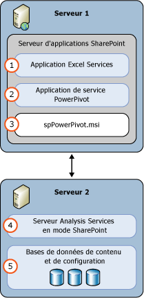

# Power Pivot pour SharePoint (SSAS)
  Un serveur [!INCLUDE[ssASnoversion](../../includes/ssasnoversion-md.md)] en mode [!INCLUDE[ssGemini](../../includes/ssgemini-md.md)] assure l’hébergement sur serveur des données [!INCLUDE[ssGemini](../../includes/ssgemini-md.md)] dans une batterie de serveurs SharePoint. [!INCLUDE[ssGemini](../../includes/ssgemini-md.md)] sont un modèle de données analytiques que vous créez à l’aide de l’une des applications suivantes :  
  
-   Complément [!INCLUDE[ssGemini](../../includes/ssgemini-md.md)] pour Excel 2010  
  
-   Excel 2013  
  
-   Excel 2016  
  
 **[!INCLUDE[applies](../../includes/applies-md.md)]**  [!INCLUDE[ssGeminiShort](../../includes/ssgeminishort-md.md)] 2016 | [!INCLUDE[ssGeminiShort](../../includes/ssgeminishort-md.md)] 2013  
  
 L’hébergement sur serveur de ces données requiert SharePoint, Excel Services et une installation de [!INCLUDE[ssGemini](../../includes/ssgemini-md.md)] pour SharePoint. Les données sont chargées sur [!INCLUDE[ssGemini](../../includes/ssgemini-md.md)] pour les instances SharePoint où elles peuvent être actualisées selon des fréquences planifiées à l’aide de la fonction d’actualisation des données [!INCLUDE[ssGemini](../../includes/ssgemini-md.md)] fournie par le serveur pour les classeurs Excel 2010, ou fournie par [!INCLUDE[ssGemini](../../includes/ssgemini-md.md)] pour les classeurs Excel 2013 et 2016.  
  
## Power Pivot pour SharePoint 2016  
 [!INCLUDE[ssCurrent](../../includes/sscurrent-md.md)] [!INCLUDE[ssGeminiShort](../../includes/ssgeminishort-md.md)] prend en charge l’utilisation par [!INCLUDE[msCoName](../../includes/msconame-md.md)] SharePoint 2016 et [!INCLUDE[offOnlineServer](../../includes/offonlineserver-md.md)] de classeurs Excel contenant des modèles de données et des rapports Power View [!INCLUDE[ssRSnoversion](../../includes/ssrsnoversion-md.md)].  
  
 Excel dans [!INCLUDE[offOnlineServer](../../includes/offonlineserver-md.md)] comprend la fonctionnalité de modèle de données qui permet l’interaction avec un classeur [!INCLUDE[ssGemini](../../includes/ssgemini-md.md)] dans le navigateur. Vous n’avez pas besoin de déployer le complément [!INCLUDE[ssGemini](../../includes/ssgemini-md.md)] pour SharePoint 2016 dans la batterie de serveurs. Vous devez seulement installer un serveur [!INCLUDE[ssASnoversion](../../includes/ssasnoversion-md.md)] en mode [!INCLUDE[ssGemini](../../includes/ssgemini-md.md)] et inscrire le serveur auprès de [!INCLUDE[offOnlineServer](../../includes/offonlineserver-md.md)].  
  
 Le déploiement du complément [!INCLUDE[ssGemini](../../includes/ssgemini-md.md)] pour SharePoint 2016 ajoute de nouvelles fonctionnalités à votre batterie de serveurs SharePoint. Ces fonctionnalités supplémentaires comprennent la Galerie [!INCLUDE[ssGemini](../../includes/ssgemini-md.md)] et l’actualisation planifiée des données.  
  
   
  
## Power Pivot pour SharePoint 2013  
 [!INCLUDE[ssCurrent](../../includes/sscurrent-md.md)] [!INCLUDE[ssGeminiShort](../../includes/ssgeminishort-md.md)] prend en charge l’utilisation de [!INCLUDE[msCoName](../../includes/msconame-md.md)] SharePoint 2013 Excel Services pour gérer les classeurs Excel contenant des modèles de données et des rapports [!INCLUDE[ssRSnoversion](../../includes/ssrsnoversion-md.md)] Power View.  
  
 Excel Services dans SharePoint 2013 comprend la fonctionnalité de modèle de données qui permet l'interaction avec un classeur [!INCLUDE[ssGemini](../../includes/ssgemini-md.md)] dans le navigateur. Vous n’avez pas besoin de déployer le complément [!INCLUDE[ssGemini](../../includes/ssgemini-md.md)] pour SharePoint 2013 dans la batterie de serveurs. Vous devez uniquement installer un serveur [!INCLUDE[ssASnoversion](../../includes/ssasnoversion-md.md)] en mode SharePoint et inscrire le serveur dans les paramètres **Modèle de données** d'Excel Services.  
  
 Le déploiement du complément [!INCLUDE[ssGemini](../../includes/ssgemini-md.md)] pour SharePoint 2013 ajoute de nouvelles fonctionnalités à votre batterie de serveurs SharePoint. Ces fonctionnalités supplémentaires comprennent la Galerie [!INCLUDE[ssGemini](../../includes/ssgemini-md.md)] , l’actualisation planifiée des données et le tableau de bord de gestion [!INCLUDE[ssGemini](../../includes/ssgemini-md.md)] .  
  
   
  
##   Dans cette section  
 [Administration et configuration d’un serveur Power Pivot dans l’Administration centrale](../../analysis-services/power-pivot-sharepoint/power-pivot-server-administration-and-configuration-in-central-administration.md)  
  
 [Configuration de Power Pivot à l’aide de Windows PowerShell](../../analysis-services/power-pivot-sharepoint/power-pivot-configuration-using-windows-powershell.md)  
  
 [Outils de configuration de Power Pivot](../../analysis-services/power-pivot-sharepoint/power-pivot-configuration-tools.md)  
  
 [Authentification et autorisation PowerPivot](../../analysis-services/power-pivot-sharepoint/power-pivot-authentication-and-authorization.md)  
  
 [Configurer des règles d’intégrité PowerPivot](../../analysis-services/power-pivot-sharepoint/configure-power-pivot-health-rules.md)  
  
 [Tableau de bord de gestion Power Pivot et données d’utilisation](../../analysis-services/power-pivot-sharepoint/power-pivot-management-dashboard-and-usage-data.md)  
  
 [Galerie Power Pivot](../Topic/Power%20Pivot%20Gallery.md)  
  
 [Accès aux données Power Pivot](../../analysis-services/power-pivot-sharepoint/power-pivot-data-access.md)  
  
 [Actualisation des données Power Pivot](../../analysis-services/power-pivot-sharepoint/power-pivot-data-refresh.md)  
  
 [Flux de données Power Pivot](../../analysis-services/power-pivot-sharepoint/power-pivot-data-feeds.md)  
  
 [Connexion de modèle sémantique BI Power Pivot &#40;.bism&#41;](../../analysis-services/power-pivot-sharepoint/power-pivot-bi-semantic-model-connection-bism.md)  
  
 **Sections connexes**  
  
## Rubriques supplémentaires  
 [Mettre à niveau Power Pivot pour SharePoint](../../database-engine/install-windows/upgrade-power-pivot-for-sharepoint.md)  
  
 [Installation d’Analysis Services en mode Power Pivot](../../analysis-services/instances/install-windows/install-analysis-services-in-power-pivot-mode.md)  
  
 [Référence PowerShell pour Power Pivot pour SharePoint](../../analysis-services/powershell/powershell-reference-for-power-pivot-for-sharepoint.md)  
  
 [Exemple de topologies et coûts des licences pour SQL Server 2016 Business Intelligence](../Topic/Example%20License%20Topologies%20and%20Costs%20%20for%20SQL%20Server%202016%20Business%20Intelligence.md)  
  
## Voir aussi  
 [Planification et déploiement Power Pivot](http://go.microsoft.com/fwlink/?linkID=220972)   
 [Récupération d’urgence pour Power Pivot pour SharePoint](http://go.microsoft.com/fwlink/p/?LinkId=389570)  
  
  