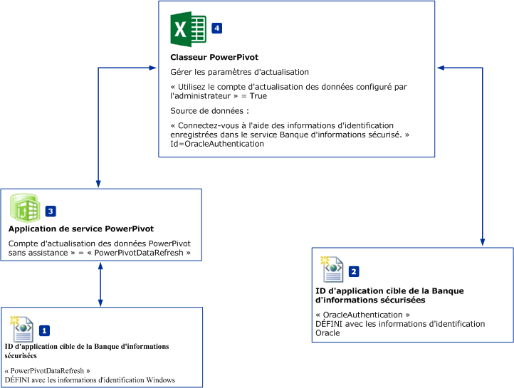
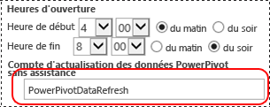

# Planifier l’actualisation des données et Sources de données - aucune authentification Windows
[!INCLUDE[ssas-appliesto-sqlas](../../includes/ssas-appliesto-sqlas.md)]
  Cette rubrique décrit un flux de travail d’actualisation planifiée des données [!INCLUDE[ssGemini](../../includes/ssgemini-md.md)] pour SharePoint pouvant utiliser des sources de données qui ne prennent **PAS** en charge l’authentification Windows. Par exemple, des sources de données Oracle ou IDM DB2. Les illustrations et les étapes figurant dans cette rubrique font référence à des sources de données Oracle, mais le même flux de travail s'applique aux autres sources de données.  
  
||  
|-|  
|**[!INCLUDE[applies](../../includes/applies-md.md)]** SharePoint 2010 &#124; SharePoint 2013.|  
  
 **Présentation :** créer deux applications cibles Banque d'informations sécurisées. Configurez la première application cible (PowerPivotDataRefresh) en vue d'utiliser les informations d'identification Windows. Configurez la deuxième application cible avec les informations d'identification d'une source de données qui ne prend pas en charge l'authentification Windows, une base de données Oracle par exemple. La deuxième application cible utilise également la première application cible pour le compte d'actualisation des données sans assistance.  
  
   
  
-   **(1) PowerPivotDatarefresh :** ID d’application cible de la Banque d’informations sécurisées qui est défini avec l’authentification Windows.  
  
-   **(2) OracleAuthentication :** ID d’application cible de la Banque d’informations sécurisées qui est défini avec les informations d’identification Oracle.  
  
-   **(3)** L’application de service [!INCLUDE[ssGemini](../../includes/ssgemini-md.md)] est configurée de manière à utiliser l’application cible « PowerPivotDataRefresh » pour le **compte d’actualisation des données sans assistance**.  
  
-   **(4)** Le classeur PowerPivot utilise des données Oracle. Les paramètres d’actualisation du classeur spécifient que la connexion de source de données utilise l’application cible **(2)** pour les informations d’identification.  
  
## Configuration requise  
  
-   Présence d’une application de service [!INCLUDE[ssGemini](../../includes/ssgemini-md.md)] .  
  
-   Présence d'une application du service Banque d'informations sécurisées.  
  
-   Présence d’un classeur Excel avec un modèle de données [!INCLUDE[ssGemini](../../includes/ssgemini-md.md)] .  
  
## Pour créer un ID d'application cible qui utilise l'authentification Windows  
  
1.  Dans l'administration centrale de SharePoint, cliquez sur **Gérer les applications de service**.  
  
2.  Cliquez sur le nom de votre application de service Banque d'informations sécurisées.  
  
3.  Sur la page **Gérer** , cliquez sur **Nouveau**.   
  
4.  Sur la page **Créer une nouvelle application cible du magasin sécurisé** , configurez les valeurs suivantes :  
  
    -   **ID de l'application cible :** PowerPivotDataRefresh.  
  
    -   **Nom complet :** PowerPivotDataRefresh.  
  
    -   **Adresse de messagerie du contact :** ?  
  
    -   **Type d'application cible :** Groupe.  
  
    -   **URL de la page de l'application cible :** aucune.  
  
5.  Cliquez sur **Suivant**.  
  
6.  Sur la page Informations d'identification, ne changez pas les deux noms de champ par défaut, ainsi que les types de champ pour **Nom d'utilisateur Windows** et **Mot de passe Windows**.  
  
7.  Cliquez sur **Suivant**.  
  
8.  Sur la page **Paramètres d'appartenance** , ajoutez au moins un **administrateur d'application cible** , puis ajoutez des membres qui ont besoin d'accéder à l'application cible.  
  
9. Cliquez sur **OK**.  
  
10. Le nouvel ID d'application cible est ajouté à la liste. Sélectionnez l’ID d’application cible et cliquez sur **définir les informations d’identification**.  
  
11. Tapez le Nom d'utilisateur Windows et le Mot de passe Windows, puis cliquez sur **OK**.  
  
## Pour créer un ID d'application cible qui utilise les informations d'identification Oracle  
  
1.  Dans l'administration centrale de SharePoint, cliquez sur **Gérer les applications de service**.  
  
2.  Cliquez sur le nom de votre application de service Banque d'informations sécurisées.  
  
3.  Sur le **gérer** , cliquez sur **nouveau**.  
  
4.  Sur la page **Créer une nouvelle application cible du magasin sécurisé** , configurez les valeurs suivantes :  
  
    -   **ID de l'application cible :** OracleAuthentication.  
  
    -   **Nom complet :** OracleAuthentication.  
  
    -   **Adresse de messagerie du contact :** ?  
  
    -   **Type d'application cible :** Groupe.  
  
    -   **URL de la page de l'application cible :** aucune.  
  
5.  Cliquez sur **Suivant**.  
  
6.  Sur la page **Informations d’identification** , remplacez le nom du premier champ par **Oracle User ID** , puis remplacez **Type de champ** par **User Name**.  
  
     Remplacez le nom du second champ par **Oracle Password** , puis remplacez **Type de champ** par **Password**.  
  
7.  Cliquez sur **Suivant**.  
  
8.  Sur la page **Paramètres d'appartenance** , ajoutez au moins un **administrateur d'application cible** , puis ajoutez des membres qui ont besoin d'accéder à l'application cible.  
  
9. Cliquez sur **OK**.  
  
10. Le nouvel ID d'application cible est ajouté à la liste. Sélectionnez l’ID d’application cible et cliquez sur **définir les informations d’identification**.  
  
11. Tapez l'ID d'utilisateur Oracle, ainsi que le mot de passe Oracle, puis cliquez sur **OK**.  
  
 Pour plus d’informations, consultez la section « Pour créer une application cible pour l’authentification SQL Server » dans [avec l’authentification SQL Server (SharePoint Server 2013), utilisez le magasin sécurisé](http://technet.microsoft.com/library/gg298949.aspx) (http://technet.microsoft.com/library/gg298949.aspx).  
  
## Pour configurer l’application de service Power Pivot  
  
1.  Dans l'administration centrale de SharePoint, cliquez sur Gérer les applications de service.  
  
2.  Cliquez sur le nom de votre application de service [!INCLUDE[ssGemini](../../includes/ssgemini-md.md)] , par exemple « Application de service [!INCLUDE[ssGemini](../../includes/ssgemini-md.md)] par défaut ».  
  
3.  Cliquez sur **Configurer les paramètres d'application de service** dans la section Actions.  
  
4.  Dans la section **Actualisation des données** , affectez au **[!INCLUDE[ssGemini](../../includes/ssgemini-md.md)] sans assistance**la valeur**PowerPivotDataRefresh** , puis cliquez sur **OK**.  
  
       
  
## Pour configurer le classeur  
  
1.  Accédez à votre classeur dans le [!INCLUDE[ssGemini](../../includes/ssgemini-md.md)] la galerie, puis cliquez sur **gérer l’actualisation des données**.  
  
2.  Si la page **Historique d'actualisation des données** s'affiche, cliquez sur **Configurer la planification**.  
  
3.  Cliquez sur **Activer**.  
  
4.  Cliquez sur **Aussi actualiser dès que possible**.  
  
5.  Dans la section **Informations d'identification** , cliquez sur **Utilisez le compte d'actualisation des données configuré par l'administrateur**.  
  
6.  Désactivez la case **Toutes les sources de données**.  
  
7.  Sélectionnez **Actualiser** pour la source de données qui utilise les données Oracle. Le nom de la source de données peut être modifié dans Microsoft Excel dans le menu **Données**, **Connexions**, **Propriétés** .  
  
8.  Sous votre source de données, sélectionnez **Utiliser la planification par défaut**.  
  
9. Sélectionnez **Connectez-vous à l'aide des informations d'identification enregistrées dans le service Banque d'informations sécurisé (SSS) pour la connexion à la source de données. Entrez l’ID utilisé pour consulter les informations d’identification dans la zone Identification SSS**.  
  
10. Dans la zone **ID :** , tapez **OracleAuthentication**.  
  
11. Cliquez sur **OK**.  
  
     Si un message d'erreur semblable au suivant s'affiche : `The provided Secure Store target application is either incorrectly configured or does not exist`.  
  
     Les deux solutions courantes sont les suivantes :  
  
    -   Vérifiez que l'ID d'application cible est correct.  
  
    -   Vérifiez que vous définissez les informations d'identification pour l'application cible.  
  
## Pour vérifier l'actualisation des données avec la nouvelle authentification  
 Lorsque vous cliquez sur **OK**, la page **Historique d'actualisation** s'affiche. Après quelques minutes, vous devez voir apparaître un nouvel élément dans l'historique d'actualisation du fait que vous avez sélectionné **Aussi actualiser dès que possible**dans les étapes précédentes. La valeur par défaut du travail du minuteur **Travail du minuteur d’actualisation des données [!INCLUDE[ssGemini](../../includes/ssgemini-md.md)]** est de 1 minute. Si aucun nouvel élément n'apparaît dans l'historique d'actualisation, patientez quelques minutes, puis actualisez votre navigateur. Si le problème persiste, vérifiez la valeur actuelle du travail du minuteur.  
  
## Informations supplémentaires  
  
-   [Configurer le service Banque d'informations sécurisé dans SharePoint 2013](http://technet.microsoft.com/library/ee806866.aspx).  
  
-   Consultez la section « Actualisation planifiée des données » de la rubrique [Actualisation des données Power Pivot avec SharePoint 2013 et SQL Server 2012 SP1 (Analysis Services)](http://msdn.microsoft.com/library/jj879294.aspx#bkmk_windows_auth_interactive_data_refresh).  
  
  
