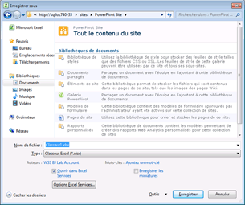

# Utiliser la galerie PowerPivot
[!INCLUDE[ssas-appliesto-sqlas](../../includes/ssas-appliesto-sqlas.md)]
  [!INCLUDE[ssGemini](../../includes/ssgemini-md.md)] est une bibliothèque de documents SharePoint spéciale qui fournit des fonctions d’aperçu et de gestion des documents pour les classeurs Excel publiés et les rapports Reporting Services contenant des données [!INCLUDE[ssGemini](../../includes/ssgemini-md.md)] .  
  
> [!NOTE]  
>  En fonction de la configuration de votre serveur, vous pouvez voir des messages d'avertissement ou d'erreur dans la zone d'aperçu de documents spécifiques. Les messages peuvent apparaître lorsqu'un classeur Excel est configuré pour actualiser automatiquement ses données à chacune de ses ouvertures. Des messages d'avertissement de l'actualisation des données apparaîtront à la place d'une image d'aperçu si Excel Services est configuré pour afficher des messages d'erreur pour avertir de l'actualisation des données. Les administrateurs de la batterie de serveurs ou du service peuvent modifier les paramètres de configuration pour permettre l'affichage d'un aperçu de la feuille de travail réelle. Pour plus d’informations, voir [Créer un emplacement approuvé pour les sites Power Pivot dans l’Administration centrale](../../analysis-services/power-pivot-sharepoint/create-a-trusted-location-for-power-pivot-sites-in-central-administration.md).  
  
##   Dans cette rubrique  
 [Configuration requise](#prereq)  
  
 [Icônes dans la Galerie PowerPivot](#icons)  
  
 [Enregistrer un classeur Excel dans la Galerie PowerPivot](#add)  
  
 [Créer des rapports ou des classeurs basés sur un classeur PowerPivot publié](#newdocs)  
  
 [Ouvrir un classeur ou un rapport en mode page entière](#view)  
  
 [Planifier l’actualisation des données des classeurs PowerPivot dans la Galerie PowerPivot](#newdr)  
  
 [Supprimer un classeur ou un rapport dans la galerie PowerPivot](#delete)  
  
 [Actualiser une image miniature](#image)  
  
 [Problèmes connus](#bkmk_known_issues)  
  
##   Configuration requise  
  
> [!NOTE]  
>  La Galerie PowerPivot requiert Microsoft Silverlight.  Le navigateur Microsoft Edge ne prend pas en charge Silverlight.   
> Pour afficher le contenu de la bibliothèque dans Edge, cliquez sur l’onglet **Bibliothèque** dans la Galerie PowerPivot, puis définissez l’affichage de la bibliothèque de documents sur **Tous les documents**.    
> Pour modifier l’affichage par défaut, cliquez sur l’onglet **Bibliothèque** , puis sur Modifier l’affichage. Cliquez sur Définir cet affichage comme affichage par défaut, puis sur OK pour enregistrer l’affichage par défaut.  
>  Pour plus d'informations sur les composants pris en charge par Edge, consultez le billet du blog Windows intitulé [A break from the past, part 2: Saying goodbye to ActiveX, VBScript...](https://blogs.windows.com/msedgedev/2015/05/06/a-break-from-the-past-part-2-saying-goodbye-to-activex-vbscript-attachevent/)  
  
 Pour obtenir la liste complète des prérequis, consultez [Create and Customize Power Pivot Gallery](../../analysis-services/power-pivot-sharepoint/create-and-customize-power-pivot-gallery.md).  
  
##   Icônes dans la Galerie PowerPivot  
 Les icônes fournissent une indication visuelle sur la disponibilité et l'état du contenu.  
  
|Icône| Description|  
|----------|-----------------|  
||L'icône de sablier apparaît lors de la génération d'une image miniature de chaque page dans le document. Actualisez la page pour afficher la mise à jour de l'image.|  
||l’icône de pages apparaît lorsqu’un classeur ou un rapport possède plus de pages que la Galerie [!INCLUDE[ssGemini](../../includes/ssgemini-md.md)] ne peut en afficher. Pour consulter toutes les pages, vous devez utiliser une application cliente.|  
||L'icône d'erreur apparaît lorsqu'une image miniature n'a pas pu être restituée pour le document. Le document est publié dans la bibliothèque, mais ne peut pas être restitué dans les vues personnalisées de la Galerie [!INCLUDE[ssGemini](../../includes/ssgemini-md.md)] . Vous devez pouvoir consulter le document dans une application cliente, telle que le complément [!INCLUDE[ssGemini](../../includes/ssgemini-md.md)] pour Excel.|  
||l’icône de contenu indisponible s’affiche lorsque le document téléchargé ne peut pas être restitué dans la Galerie [!INCLUDE[ssGemini](../../includes/ssgemini-md.md)] . Les types de document pris en charge sont les classeurs et rapports [!INCLUDE[ssGemini](../../includes/ssgemini-md.md)] créés dans le Générateur de rapports de SQL Server 2008 R2 Reporting Services.   Cette icône apparaît également si vous recyclez un document de la Corbeille.   Si vous obtenez cette icône pour un document qui présentait auparavant une image d'aperçu valide, vous pouvez actualiser l'image en modifiant une propriété du document, puis en enregistrant vos modifications.|  
||L'icône de contenu verrouillée apparaît lorsque les images miniatures ont été volontairement désactivées pour ce document. [!INCLUDE[ssGemini](../../includes/ssgemini-md.md)] ne génère pas d’images miniatures ni les classeurs Excel qui ne contiennent pas de données [!INCLUDE[ssGemini](../../includes/ssgemini-md.md)] , ni pour les classeurs [!INCLUDE[ssGemini](../../includes/ssgemini-md.md)] ou les rapports Reporting Services qui ne répondent pas aux conditions requises pour la génération d’instantanés. Pour plus d'informations, consultez la section « Configuration requise » de cette rubrique.|  
  
##   Enregistrer un classeur Excel dans la Galerie PowerPivot  
 Vous pouvez publier des classeurs [!INCLUDE[ssGemini](../../includes/ssgemini-md.md)] dans la bibliothèque à l'aide de toutes les techniques de partage offertes par Excel 2010. Par exemple, dans Excel 2010, vous pouvez utiliser l'option Enregistrer sous pour spécifier tout ou partie d'un chemin d'accès SharePoint à une bibliothèque.  
  
1.  Enregistrez le fichier.  
  
2.  1.  **Excel 2010 :** dans le menu Fichier, cliquez sur **Enregistrer​​ et envoyer**.  
  
    2.  Cliquez sur **Enregistrer dans SharePoint**.  
  
    3.  Cliquez sur **Options de publication** si vous souhaitez utiliser les options Excel Services pour sélectionner des feuilles ou paramètres individuels que vous souhaitez publier. Par exemple, l'onglet Paramètres dans Options Excel Services vous permet de choisir les découpages qui apparaissent dans le classeur publié.  
  
    1.  **Excel 2013 :**  dans le menu Fichier, cliquez sur **Enregistrer**.  
  
    2.  Cliquez sur **Options du Mode Navigateur** si vous souhaitez utiliser les options Excel Services pour sélectionner des feuilles ou paramètres individuels que vous souhaitez publier. Par exemple, l'onglet Paramètres dans Options Excel Services vous permet de choisir les découpages qui apparaissent dans le classeur publié.  
  
3.  Dans la boîte de dialogue Enregistrer sous, dans la zone Nom de fichier, entrez l'URL complète ou partielle de la Galerie [!INCLUDE[ssGemini](../../includes/ssgemini-md.md)] . Si vous entrez une partie de l'adresse URL (le nom du serveur par exemple), vous pouvez parcourir le site pour rechercher la bibliothèque [!INCLUDE[ssGemini](../../includes/ssgemini-md.md)] . Pour ce faire, cliquez sur **Enregistrer** afin d'établir une connexion au serveur spécifié.  
  
       
  
1.  À l'aide de la boîte de dialogue Enregistrer sous, sélectionnez la bibliothèque [!INCLUDE[ssGemini](../../includes/ssgemini-md.md)] dans votre site.  
  
2.  Cliquez sur **Ouvrir** pour ouvrir la bibliothèque.  
  
3.  Cliquez sur **Enregistrer** pour publier le classeur dans la bibliothèque.  
  
 Dans une fenêtre de navigateur, vérifiez que le document s'affiche dans la bibliothèque [!INCLUDE[ssGemini](../../includes/ssgemini-md.md)] . Les documents publiés récemment sont affichés dans la liste. Les paramètres de bibliothèque déterminent où le document apparaît (par exemple, trié par ordre croissant par date, ou alphabétiquement par nom). Vous devrez peut-être actualiser la fenêtre du navigateur pour afficher les ajouts les plus récents.  
  
#### Télécharger un classeur dans la Galerie PowerPivot  
 Vous avez également la possibilité de télécharger un classeur si vous souhaitez démarrer à partir de SharePoint et sélectionner sur votre ordinateur le fichier à publier.  
  
1.  Dans un site SharePoint, ouvrez la Galerie [!INCLUDE[ssGemini](../../includes/ssgemini-md.md)] .  
  
2.  Dans le ruban de la bibliothèque, cliquez sur **Documents**.  
  
3.  Dans **Télécharger un document**, sélectionnez une option de téléchargement, puis entrez le nom et l'emplacement du fichier à télécharger. Les paramètres de bibliothèque déterminent où le document apparaît. Vous devrez peut-être actualiser la fenêtre du navigateur pour afficher l'ajout le plus récent.  
  
##   Créer des rapports ou des classeurs basés sur un classeur PowerPivot publié  
 Pour les classeurs [!INCLUDE[ssGemini](../../includes/ssgemini-md.md)] que vous publiez dans la Galerie [!INCLUDE[ssGemini](../../includes/ssgemini-md.md)] , vous pouvez créer d'autres classeurs ou rapports Reporting Services qui utilisent le classeur publié comme source de données connectée.  
  
|||  
|-|-|  
||Cliquez sur la partie du bouton Nouveau rapport représentant une flèche vers le bas pour lancer le Générateur de rapports ou Excel 2010. [!INCLUDE[ssGemini](../../includes/ssgemini-md.md)] La Galerie doit utiliser l’une des vues prédéfinies (Théâtre, Galerie ou Carrousel) pour que le bouton Nouveau rapport soit disponible.|  
  
#### Créer un rapport du Générateur de rapports.  
 Pour créer un rapport basé sur un classeur [!INCLUDE[ssGemini](../../includes/ssgemini-md.md)] dans la bibliothèque, Reporting Services doit être configuré pour l’intégration dans SharePoint des mêmes sites qui contiennent la Galerie [!INCLUDE[ssGemini](../../includes/ssgemini-md.md)] . Lorsque vous sélectionnez l'option Créer un rapport du Générateur de rapports, le Générateur de rapports est téléchargé à partir du serveur de rapports et installé sur la station de travail locale, lors de sa première utilisation. Un fichier de rapport d’espace réservé est créé pour le nouveau rapport et enregistré dans la Galerie [!INCLUDE[ssGemini](../../includes/ssgemini-md.md)] . Les informations de connexion au classeur [!INCLUDE[ssGemini](../../includes/ssgemini-md.md)] sont créées automatiquement comme une nouvelle source de données dans le rapport. Ensuite, vous pouvez générer les datasets et la mise en page du rapport dans l'espace de conception. Lorsque vous utilisez le Générateur de rapports pour assembler votre rapport, vous pouvez enregistrer vos modifications et le résultat final sur le document de rapport dans la bibliothèque. Pour éviter des déconnexions de données ultérieures, veillez à conserver les fichiers du classeur et du rapport ensemble dans la même bibliothèque.  
  
#### Ouvrir le nouveau classeur Excel  
 Pour créer un classeur Excel à partir d'un classeur existant, vous devez déjà disposer d'Excel et de [!INCLUDE[ssGeminiClient](../../includes/ssgeminiclient-md.md)] sur l'ordinateur local. La sélection de l’option Ouvrir le nouveau classeur Excel entraîne le démarrage d’Excel, l’ouverture d’un fichier de classeur (.xlsx) vierge et le chargement des données [!INCLUDE[ssGemini](../../includes/ssgemini-md.md)] en arrière-plan comme source de données connectée. Seules les données provenant de la fenêtre [!INCLUDE[ssGemini](../../includes/ssgemini-md.md)] dans le classeur d’origine sont utilisées dans le nouveau classeur. Les tableaux ou graphiques croisés dynamiques du classeur d'origine sont exclus. Le nouveau classeur établit une liaison aux données du classeur d'origine. Les données ne sont pas copiées vers le nouveau classeur.  
  
##   Ouvrir un classeur ou un rapport en mode page entière  
 Cliquez sur une image miniature visible sur le document prévisualisé pour ouvrir celui-ci en mode page entière, indépendamment de l'aperçu de la Galerie [!INCLUDE[ssGemini](../../includes/ssgemini-md.md)] . [!INCLUDE[ssGemini](../../includes/ssgemini-md.md)] s'ouvrent dans un navigateur. Les rapports Reporting Services s'ouvrent dans le composant WebPart Visionneuse de rapports qui fait partie du déploiement de Reporting Services sur un serveur SharePoint.  
  
 Vous avez également la possibilité d'ouvrir le classeur dans Excel sur une station de travail cliente au lieu de l'afficher dans un navigateur. Vous devez disposer d’Excel 2013 ou d’Excel 2010 et du complément [!INCLUDE[ssGeminiClient](../../includes/ssgeminiclient-md.md)] pour afficher le fichier. Vous pouvez utiliser Excel 2007 pour ouvrir le fichier, mais pas pour ajouter un tableau croisé dynamique sur les données. Par conséquent, les versions Excel 2013 et Excel 2010 sont recommandées pour afficher et créer des données [!INCLUDE[ssGemini](../../includes/ssgemini-md.md)] . Si vous ne disposez pas des applications requises, vous devez utiliser un navigateur pour afficher le classeur dans SharePoint.  
  
##   Planifier l’actualisation des données des classeurs PowerPivot dans la Galerie PowerPivot  
 [!INCLUDE[ssGemini](../../includes/ssgemini-md.md)] d'un classeur Excel publié peuvent être actualisées à des fréquences planifiées.  
  
|||  
|-|-|  
||Cliquez sur le bouton Gérer l'actualisation des données pour créer ou afficher une planification qui récupère les données mises à jour à partir des sources de données connectées. Pour obtenir des instructions sur la création d’une planification, consultez [Planifier une actualisation des données (PowerPivot pour SharePoint)](http://msdn.microsoft.com/en-us/8571208f-6aae-4058-83c6-9f916f5e2f9b).|  
  
##   Supprimer un classeur ou un rapport dans la galerie PowerPivot  
 Pour supprimer un document de la bibliothèque, basculez tout d'abord en mode d'affichage Tous les documents.  
  
1.  Dans un site SharePoint, ouvrez la Galerie [!INCLUDE[ssGemini](../../includes/ssgemini-md.md)] .  
  
2.  Dans le ruban, cliquez sur **Bibliothèque**.  
  
3.  Dans Gérer les affichages, dans la liste Affichage actuel, cliquez sur la flèche bas et sélectionnez Tous les documents.  
  
4.  Sélectionnez le classeur ou le rapport que vous voulez supprimer.  
  
5.  Dans Documents (Fichiers), dans Gérer, cliquez sur le bouton **Supprimer un document** .  
  
##   Actualiser une image miniature  
 Procédez comme suit pour regénérer une image miniature d’un document dans la Galerie [!INCLUDE[ssGemini](../../includes/ssgemini-md.md)] .  
  
1.  Basculez la Galerie [!INCLUDE[ssGemini](../../includes/ssgemini-md.md)] en mode Tous les documents. Pour cela, cliquez sur **Bibliothèque** dans le ruban et remplacez **Affichage actuel** par **Tous les documents**.  
  
2.  Sélectionnez le classeur ou le rapport pour lequel vous souhaitez actualiser l'image miniature.  
  
3.  Cliquez sur la flèche Bas à droite, puis sélectionnez **Modifier les propriétés**.  
  
4.  Cliquez sur **Enregistrer**. L'enregistrement du document force le service d'instantanés à régénérer l'image d'aperçu.  
  
##   Problèmes connus  
  
### Le type de document n'est pas pris en charge.  
 Le type de contenu **Document de Galerie [!INCLUDE[ssGemini](../../includes/ssgemini-md.md)]** n’est pas pris en charge. Si vous activez le type de contenu **Document de Galerie [!INCLUDE[ssGemini](../../includes/ssgemini-md.md)]** pour une bibliothèque de documents et que vous tentez de créer un document de ce type, un message d’erreur similaire à l’un des suivants s’affiche :  
  
-   Le « nouveau document » nécessite une application et un navigateur Web compatibles avec Microsoft SharePoint Foundation. Pour ajouter un document dans cette bibliothèque de documents, cliquez sur le bouton « Télécharger un document ».  
  
-   « L'adresse Internet 'http://[server name]/testSite/PowerPivot Gallery/ReportGallery/Forms/Template.xlsx' n'est pas valide. » Microsoft Excel ne peut pas accéder au fichier 'http://[server name]/testSite/PowerPivot Gallery/ReportGallery/Forms/Template.xlsx'. Plusieurs raisons sont possibles :  
  
 Le type de contenu **Document de Galerie [!INCLUDE[ssGemini](../../includes/ssgemini-md.md)]** n’est pas automatiquement ajouté aux bibliothèques de documents. Ce problème ne se produit pas, sauf si vous activez manuellement le type de contenu non pris en charge.  
  
## Voir aussi  
 [Create a trusted location for Power Pivot sites in Central Administration](../../analysis-services/power-pivot-sharepoint/create-a-trusted-location-for-power-pivot-sites-in-central-administration.md)   
 [Supprimer la galerie PowerPivot](../../analysis-services/power-pivot-sharepoint/delete-power-pivot-gallery.md)   
 [Créer et personnaliser la galerie PowerPivot](../../analysis-services/power-pivot-sharepoint/create-and-customize-power-pivot-gallery.md)   
 [Planifier une actualisation des données (PowerPivot pour SharePoint)](http://msdn.microsoft.com/en-us/8571208f-6aae-4058-83c6-9f916f5e2f9b)  
  
  
