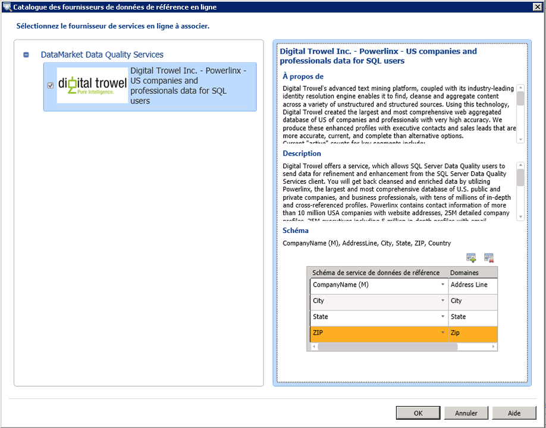

# Attacher un domaine ou un domaine composite à des données de référence

[!INCLUDE[appliesto-ss-xxxx-xxxx-xxx-md-winonly](../includes/appliesto-ss-xxxx-xxxx-xxx-md-winonly.md)]

  Cette rubrique explique comment attacher des domaines/domaines composites dans une base de connaissances à un service de données de référence dans Windows Azure Marketplace pour générer des connaissances sur les données de référence de haute qualité. Chaque service de données de référence contient un schéma (colonnes de données). Après avoir attaché un domaine ou un domaine composite à un service de données de référence, vous devez mapper le domaine joint, ou chaque domaine au sein du domaine composite joint, aux colonnes appropriées du schéma de service des données de référence. L'attachement d'un domaine composite à un service de données de référence vous permet d'attacher un seul domaine à un service de données de référence, puis de mapper les différents domaines du domaine composite aux colonnes appropriées du schéma de service des données de référence.  
  
> [!WARNING]  
>  Le domaine composite associé à un service de données de référence est disponible dans la liste déroulante des domaines lors du mappage des domaines aux colonnes du schéma de service de données de référence. Ne mappez pas le domaine composite à une colonne dans le schéma de service de données de référence ; vous devez uniquement mapper les domaines individuels au sein d'un domaine composite aux colonnes appropriées dans le schéma de service de données de référence. Sinon, cela génère une erreur.  
  
 Un schéma de service de données de référence peut avoir une colonne obligatoire qui doit être mappée au domaine approprié si vous choisissez d'utiliser le schéma. La colonne obligatoire d'un schéma de données de référence est identifiée par « (M) » au niveau de son nom. Par exemple, **Adresse** est la colonne de schéma obligatoire dans **Melissa Data – Address Data** et **CompanyName** est la colonne de schéma obligatoire dans **Digital Trowel Inc. – Us companies and professional data for SQL users**.  
  
 Dans cette rubrique, nous allons créer quatre domaines : **Address Line**, **City**, **State**et **Zip**, sous un domaine composite **Address Verification**; joignez le domaine composite au service de données de référence **Melissa Data – Address Check** , puis mappez les domaines dans le domaine composite aux colonnes appropriées dans le schéma de service de données de référence.  
  
## Avant de commencer  
  
###   Conditions préalables  
 Vous devez avoir configuré [!INCLUDE[ssDQSnoversion](../includes/ssdqsnoversion-md.md)] (DQS) pour utiliser les services de données de référence. Consultez [Configurer DQS pour utiliser des données de référence](../data-quality-services/configure-dqs-to-use-reference-data.md).  
  
###   Sécurité  
  
#### Autorisations  
 Vous devez disposer du rôle de dqs_kb_editor sur la base de données de DQS_MAIN pour mapper les domaines aux données de référence.  
  
##   Mapper les domaines aux données de référence de Melissa Data  
  
1.  [!INCLUDE[ssDQSInitialStep](../includes/ssdqsinitialstep-md.md)] [Exécutez l’application Data Quality Client](../data-quality-services/run-the-data-quality-client-application.md).  
  
2.  Dans l'écran d'accueil [!INCLUDE[ssDQSClient](../includes/ssdqsclient-md.md)] , sous **Gestion des bases de connaissances**, cliquez sur **Nouvelle base de connaissances**.  
  
3.  Dans l'écran **Nouvelle Base de connaissances** , tapez un nom pour la nouvelle base de connaissances, cliquez sur l'activité **Gestion de l'arborescence du domaine** , puis cliquez **Créer**.  
  
4.  Dans l'écran **Gestion de l'arborescence du domaine** , cliquez sur l'icône **Créer un domaine** pour créer un domaine. Créez les quatre domaines suivants : **Adresse**, **Ville**, **État**et **Code postal**.  
  
5.  Cliquez sur l'icône **Créer un domaine composite** pour créer un domaine composite. Dans la boîte de dialogue **Créer un domaine composite** , tapez **Contrôle d'adresse** dans la zone **Nom du domaine composite** et incluez tous les domaines créés à l'étape 3 du domaine composite. Cliquez sur **OK**.  
  
6.  Dans le volet **Domaine** à gauche, sélectionnez le domaine composite en cliquant sur **Contrôle d'adresse**, puis cliquez sur l'onglet **Données de référence** à droite.  
  
7.  Cliquez sur l'icône **Parcourir** .  
  
8.  Dans la boîte de dialogue **Catalogue des fournisseurs de données de référence en ligne** :  
  
    1.  Sous **DataMarket Data Quality Services**, sélectionnez la zone de **Melissa Data – Contrôle d'adresse** .  
  
    2.  Mappez les colonnes du service de données de référence Melissa Data – Address Check aux domaines appropriés (Address Line, City, State et Zip). Vous mappez les colonnes en sélectionnant une colonne de service de données de référence dans la colonne **Schéma de service de données de référence** , puis en sélectionnant le domaine approprié dans la colonne **Domaine** . Pour ajouter des lignes à la table, cliquez sur l'icône **Ajouter une entrée de schéma** .  
  
    3.  Cliquez sur **OK** pour enregistrer les modifications et fermez la boîte de dialogue **Catalogue des fournisseurs de données de référence en ligne** .  
  
           
  
        > [!NOTE]  
        >  -   Dans la boîte de dialogue **Catalogue des fournisseurs de données de référence en ligne** , le nœud **DataMarket Data Quality Services** affiche tous les fournisseurs de services de données de référence auxquels vous vous êtes abonné dans Windows Azure Marketplace. Si vous avez configuré des fournisseurs tiers directs en ligne de services de données de référence dans DQS, ils apparaîtront sous un autre nœud appelé **Fournisseurs tiers directs en ligne** (non disponible à présent car aucun tiers fournisseur tiers direct en ligne n'est configuré dans DQS).  
  
9. Retournez à l'onglet **Données de référence** . Dans la zone **Paramètres des fournisseurs**, modifiez les valeurs dans les zones suivantes, si nécessaire :  
  
    -   **Seuil de correction automatique**: les corrections des services de données de référence avec un niveau de confiance supérieur à ces valeurs de seuil seront automatiquement effectuées. Entrez une valeur en notation décimale de la valeur de pourcentage correspondante. Par exemple, entrez 0,9 pour 90 %.  
  
    -   **Candidats suggérés**: nombre des candidats suggérés à afficher à partir du service de données de référence.  
  
    -   **Confiance minimale**: les suggestions du service des données de référence avec un niveau de confiance inférieur à cette valeur sont ignorées. Entrez une valeur en notation décimale de la valeur de pourcentage correspondante. Par exemple, entrez 0,6 pour 60 %.  
  
10. Cliquez sur **Terminer** pour publier la base de connaissances. Un message de confirmation s'affiche après que la base de connaissances a été publiée avec succès.  
  
 Vous pouvez maintenant utiliser cette base de connaissances pour l'activité de nettoyage dans un projet de qualité des données afin de normaliser et nettoyer les adresses américaines de vos données sources selon les connaissances fournies par Melissa Data via Windows Azure Marketplace.  
  
##   Suivi : Après le mappage d'un domaine aux données de référence  
 Créez un projet de qualité des données et exécutez l'activité de nettoyage sur vos données sources contenant les adresses américaines en les comparant à la base de connaissances créée dans cette rubrique. Consultez [Nettoyer les données à l’aide de la connaissance des données de référence &#40;externes&#41;](../data-quality-services/cleanse-data-using-reference-data-external-knowledge.md).  
  
##  Voir aussi  
 [Services de données de référence dans DQS](../data-quality-services/reference-data-services-in-dqs.md)   
 [Nettoyage de données](../data-quality-services/data-cleansing.md)  
  
  
