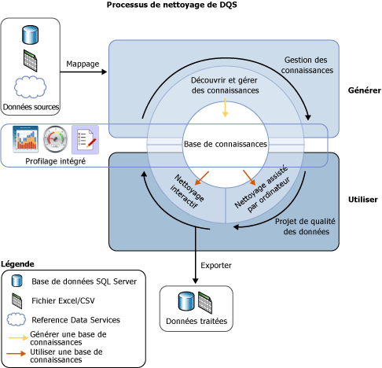
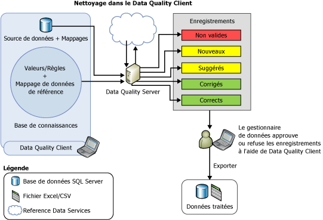

# Data Cleansing

[!INCLUDE[appliesto-ss-xxxx-xxxx-xxx-md-winonly](../includes/appliesto-ss-xxxx-xxxx-xxx-md-winonly.md)]

  Le nettoyage de données est le processus qui consiste à analyser la qualité des données contenues dans une source de données, à approuver/refuser manuellement les suggestions formulées par le système et à apporter les modifications correspondantes aux données. Le nettoyage de données dans [!INCLUDE[ssDQSnoversion](../includes/ssdqsnoversion-md.md)] (DQS) inclut un processus assisté par ordinateur qui analyse la conformité des données par rapport aux connaissances contenues dans une base de connaissances et un processus interactif qui permet au gestionnaire de données d'examiner et de modifier les résultats du processus assisté par ordinateur afin de s'assurer que le nettoyage de données correspond exactement à ce qu'il souhaite faire.  
  
 Le gestionnaire de données peut également procéder au nettoyage des données dans le cadre du processus de création de package d'Integration Services. Dans ce cas, le gestionnaire de données utilise le composant [!INCLUDE[ssDQSCleansingLong](../includes/ssdqscleansinglong-md.md)] qui nettoie automatiquement les données à l'aide d'une base de connaissances existante. Pour plus d’informations, consultez [Transformation de nettoyage DQS](../integration-services/data-flow/transformations/dqs-cleansing-transformation.md).  
  
 La fonctionnalité de nettoyage de données de DQS présente les avantages suivants :  
  
-   Identifie les données incomplètes ou incorrectes dans la source de données (fichier Excel ou base de données SQL Server), puis les corrige ou vous informe de la présence de données non valides.  
  
-   Fournit un processus de nettoyage des données en deux étapes : *assisté par ordinateur* et *interactif*. Le processus assisté par ordinateur utilise les connaissances figurant dans une base de connaissances DQS pour traiter automatiquement les données et suggérer des remplacements/corrections. Le processus suivant est interactif. Il permet au gestionnaire de données d'approuver, de rejeter ou de modifier les modifications proposées par DQS au cours du nettoyage assisté par ordinateur.  
  
-   Normalise et enrichit les données client à l'aide de valeurs de domaine, de règles de domaine et de données de référence. Par exemple, normalisez l'utilisation du terme en remplaçant « St ». par « Street »,  enrichissez les données en remplissant les éléments manquants en remplaçant « 1 Microsoft way Redmond 98006 » par « 1 Microsoft Way, Redmond, WA 98006 ».  
  
-   Fournit une interface de type Assistant à la fois simple, intuitive, et cohérente permettant à l'utilisateur de parcourir les données et d'examiner les erreurs dans un ensemble de données très volumineux.  
  
 L'illustration suivante montre le processus de nettoyage des données dans DQS :  
  
   
  
##   Nettoyage assisté par ordinateur  
 Le processus de nettoyage des données dans DQS applique la base de connaissances aux données à nettoyer et propose des modifications aux données. Le gestionnaire de données a accès à chaque modification proposée, ce qui lui permet d'évaluer et de corriger les modifications. Pour effectuer le nettoyage des données, le gestionnaire de données procède comme suit :  
  
1.  Création d'un projet de qualité des données, sélection d'une base de connaissances par rapport à laquelle vous souhaitez analyser et nettoyer vos données sources, puis sélection de l'activité **Nettoyage** . Plusieurs projets de qualité de données peuvent utiliser la même base de connaissances.  
  
2.  Spécification de la table/vue de la base de données ou d'un fichier Excel contenant les données sources à nettoyer. La base de données ou le fichier Excel peut être identique à celui ou celle utilisé(e) pour la découverte des connaissances, ou il peut s'agir d'une base de données ou d'un fichier Excel différent.  
  
    > [!NOTE]  
    >  Si vous sélectionnez la même source de données pour les activités de découverte des connaissances et de nettoyage, les données ne seront pas modifiées. Il est recommandé de lancer la découverte des connaissance sur des exemples de données, puis de nettoyer vos données sources en fonction des connaissances acquises pendant l'activité de découverte des connaissances.  
  
3.  Mappage des champs de données à nettoyer aux domaines/domaines composites appropriés dans la base de connaissances. Si vous mappez un champ à un domaine composite, le mappage est effectué entre le champ et le domaine composite, et non avec les domaines individuels du domaine composite. En outre, le nettoyage des données du champ mappé s'effectue selon les règles spécifiées pour le domaine composite, et non pour les différents domaines du domaine composite. Pour plus d'informations sur les domaines composites, consultez [DQS Knowledge Bases and Domains](../data-quality-services/dqs-knowledge-bases-and-domains.md).  
  
4.  Lancez le processus de nettoyage assisté par ordinateur en cliquant sur **Démarrer** sur la page **Nettoyer** .  
  
 Le processus de nettoyage des données recherche la meilleure correspondance d'une instance de données aux valeurs de domaine de données connues. Le processus applique les connaissances de qualité des données à toutes les données sources, contrairement au processus de découverte des connaissances qui est exécuté sur un pourcentage des exemples de données.  
  
 Le processus assisté par ordinateur affiche les informations de qualité des données dans le [!INCLUDE[ssDQSClient](../includes/ssdqsclient-md.md)] qui sera utilisé pour le processus de nettoyage interactif. Outre le respect des règles de syntaxe, DQS utilise également des données de référence et des algorithmes avancés pour catégoriser les données en fonction d'un *niveau de confiance*. Le niveau de confiance indique le degré de certitude de DQS quant à la correction ou la suggestion. Le niveau de confiance est basé sur les valeurs de seuil suivantes :  
  
-   Une valeur de *seuil de correction automatique* au-delà de laquelle DQS suggère une modification et l'implémente sauf si le gestionnaire de données la refuse. Vous pouvez spécifier la valeur de seuil de correction automatique sous l'onglet **Paramètres généraux** de l'écran **Configuration** . Pour plus d’informations, consultez [Configurer les valeurs de seuil pour le nettoyage et la correspondance](../data-quality-services/configure-threshold-values-for-cleansing-and-matching.md).  
  
-   Une valeur de *seuil de suggestion automatique* , en-deçà du seuil de correction automatique, au-delà de laquelle DQS suggère une modification et l'implémente si le gestionnaire de données l'approuve. Vous pouvez spécifier la valeur de seuil de suggestion automatique sous l'onglet **Paramètres généraux** de l'écran **Configuration** . Pour plus d’informations, consultez [Configurer les valeurs de seuil pour le nettoyage et la correspondance](../data-quality-services/configure-threshold-values-for-cleansing-and-matching.md).  
  
 Toute valeur dont le niveau de confiance est inférieur à la valeur du seuil de suggestion automatique est conservée en l'état par DQS, sauf si le gestionnaire de données spécifie une modification.  
  
##   Nettoyage interactif  
 En s'appuyant sur le processus de nettoyage assisté par ordinateur, DQS fournit au gestionnaire de données les informations dont il a besoin pour prendre une décision à propos de la modification des données. DQS classe les données dans les cinq onglets suivants :  
  
-   **Suggérés**: valeurs pour lesquelles DQS a identifié des suggestions dont le niveau de confiance est supérieur à la valeur du *seuil de suggestion automatique* mais inférieur à la valeur du *seuil de correction automatique* . Vous devez examiner ces valeurs et les approuver ou les refuser, selon le cas.  
  
-   **Nouveau**: valeurs valides pour lesquelles DQS ne dispose pas de suffisamment d'informations (suggestion) et qui ne peuvent donc être mappées à aucun autre onglet. En outre, cet onglet contient également les valeurs dont le niveau de confiance est inférieur à la valeur du *seuil de suggestion automatique* , mais suffisamment élevé pour être considéré comme valide.  
  
-   **Non valide**: valeurs qui ont été marquées comme valides dans le domaine de la base de connaissances ou valeurs qui ne respectent pas une règle de domaine ou des données de référence. Cet onglet contient également les valeurs qui sont rejetées par l'utilisateur dans l'un des quatre autres onglets pendant le processus de nettoyage interactif.  
  
-   **Corrigé**: valeurs corrigées par DQS pendant le processus de nettoyage automatisé lorsque DQS a trouvé une correction pour la valeur dont le niveau de confiance est supérieur à la valeur du *seuil de correction automatique* . Cet onglet contient également les valeurs pour lesquelles l'utilisateur a spécifié une valeur correcte dans la colonne **Corriger vers** lors du nettoyage interactif, puis approuvé en cliquant sur la case d'option dans la colonne **Approuver** de l'un des quatre autres onglets.  
  
-   **Correct**: valeurs considérées comme correctes. Par exemple, la valeur correspond à une valeur de domaine. Si nécessaire, vous pouvez remplacer le nettoyage DQS en refusant les valeurs affichées sous cet onglet, ou en spécifiant un autre mot dans la colonne **Corriger vers** , puis en cliquant sur la case d'option dans la colonne **Accepter** . Cet onglet contient également les valeurs qui ont été approuvées par l'utilisateur lors du nettoyage interactif en cliquant sur la case d'option dans la colonne **Approuver** sous l'onglet **Nouveau** ou **Non valide** .  
  
> [!NOTE]  
>  Sous les onglets **Suggérés**, **Corrigé**et **Correct** , DQS affiche la valeur de début d'un domaine, le cas échéant, dans la colonne **Corriger vers** en fonction de la valeur de domaine correspondante.  
  
 Le gestionnaire de données utilise [!INCLUDE[ssDQSClient](../includes/ssdqsclient-md.md)] pour consulter les modifications proposées par DQS et décider s'il faut les implémenter ou non. Il peut vérifier que les valeurs que DQS a désignées comme correctes le sont effectivement. Il peut vérifier que les modifications déjà apportées par DQS, avec un niveau de confiance élevé, doivent effectivement l'être. Il peut décider s'il faut approuver les modifications suggérées automatiquement. Enfin, il peut examiner les valeurs qui n'ont pas été modifiées, au cas où il souhaiterait apporter une modification non détectée par le processus assisté par ordinateur.  
  
 DQS fusionne toutes modifications que le gestionnaire de données a apportées avec les résultats du nettoyage des données assisté par ordinateur. Ces modifications restent avec le projet ; elles ne sont toutefois pas ajoutées à la base de connaissances. Au cours du nettoyage des données, la base de connaissances associée est en lecture seule.  
  
 Une fois le processus de nettoyage de données terminé, vous pouvez choisir d'exporter les données traitées dans une nouvelle table dans une base de données SQL Server, un fichier .csv ou un fichier Excel. Les données source sur lesquelles le nettoyage est effectué sont conservées dans leur état d'origine. Le gestionnaire de données peut utiliser les données nettoyées individuellement pour corriger les données source proprement dites.  
  
 L'illustration suivante montre le nettoyage de données à l'aide de l'application [!INCLUDE[ssDQSClient](../includes/ssdqsclient-md.md)] :  
  
   
  
##   Correction de la valeur de début  
 La correction de la valeur de début s'applique aux valeurs de domaine qui ont des synonymes, lorsque l'utilisateur veut utiliser une des valeurs synonymes comme valeur de début en remplacement d'autres valeurs pour homogénéiser la représentation de la valeur. Par exemple, « New York », « NYC », et « Big Apple » sont des synonymes, et l'utilisateur veut utiliser « New York » comme valeur de début au lieu de « NYC » et « Big Apple ». DQS prend en charge la correction de la valeur de début pendant le processus de nettoyage pour vous aider à normaliser vos données. La correction de la valeur de début est effectuée uniquement si cette option a été activée pour le domaine lors de sa création. Par défaut, la correction de la valeur de début est activée pour tous les domaines, sauf si vous avez désactivé la case à cocher **Utiliser des valeurs de début** lors de la création d'un domaine. Pour plus d'informations sur cette case à cocher, consultez [Set Domain Properties](../data-quality-services/set-domain-properties.md).  
  
##   Normalisation des données nettoyées  
 Vous pouvez choisir s'il faut exporter les données nettoyées au format normalisé en fonction du format de sortie défini pour les domaines. Lors de la création d'un domaine, vous pouvez sélectionner la mise en forme qui est appliquée lorsque les valeurs de données du domaine sont générées. Pour plus d'informations sur la spécification des formats de sortie pour un domaine, consultez la liste **Mettre en forme la sortie vers** de la rubrique [Set Domain Properties](../data-quality-services/set-domain-properties.md).  
  
 Lors de l'exportation des données nettoyées dans la page **Exporter** de l'Assistant de nettoyage de projet de qualité des données, spécifiez si vous souhaitez que les données nettoyées soient exportées au format normalisé en activant la case à cocher **Normaliser la sortie** . Par défaut, les données nettoyées sont exportées au format normalisé (autrement dit, la case à cocher est activée). Pour plus d’informations sur l’exportation des données nettoyées, consultez [Nettoyer des données à l’aide des connaissances DQS &#40;internes&#41;](../data-quality-services/cleanse-data-using-dqs-internal-knowledge.md).  
  
##   Tâches associées  
  
|Description de la tâche|Rubrique|  
|----------------------|-----------|  
|Explique comment configurer les valeurs de seuil pour l'activité de nettoyage.|[Configure Threshold Values for Cleansing and Matching](../data-quality-services/configure-threshold-values-for-cleansing-and-matching.md)|  
|Explique comment nettoyer les données à l'aide des connaissances intégrées à DQS.|[Nettoyer des données à l’aide de la base de connaissances DQS &#40;interne&#41;](../data-quality-services/cleanse-data-using-dqs-internal-knowledge.md)|  
|Explique comment nettoyer les données à l'aide des connaissances du service de données de référence.|[Nettoyer des données à l’aide de la connaissance des données de référence &#40;externes&#41;](../data-quality-services/cleanse-data-using-reference-data-external-knowledge.md)|  
|Explique comment nettoyer un domaine composite.|[Nettoyer les données dans un domaine composite](../data-quality-services/cleanse-data-in-a-composite-domain.md)|  
  
##  Voir aussi  
 [Projets de qualité des données &#40;DQS&#41;](../data-quality-services/data-quality-projects-dqs.md)   
 [Correspondance de données](../data-quality-services/data-matching.md)  
  
  
