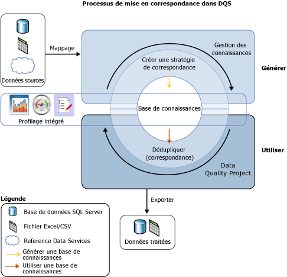

# Correspondance de données

[!INCLUDE[appliesto-ss-xxxx-xxxx-xxx-md-winonly](../includes/appliesto-ss-xxxx-xxxx-xxx-md-winonly.md)]

  Le processus de correspondance de données de [!INCLUDE[ssDQSnoversion](../includes/ssdqsnoversion-md.md)] (DQS) permet de réduire la duplication de données et d'améliorer la précision de données dans une source de données. La correspondance analyse le degré de duplication dans tous les enregistrements d'une source de données unique, en retournant les probabilités pondérées d'une correspondance entre chaque ensemble d'enregistrements comparé. Vous pouvez alors décider quels enregistrements sont des correspondances et entreprendre l'action appropriée sur les données sources.  
  
 Le processus de correspondance de DQS présente les avantages suivants :  
  
-   La correspondance vous permet d'éliminer les différences entre des valeurs de données qui doivent être égales, en déterminant la valeur correcte et en réduisant les erreurs que des différences de données peuvent entraîner. Par exemple, les noms et les adresses sont souvent les informations d'identification d'une source de données, en particulier les données client, mais les données peuvent devenir incorrectes et se détériorer dans le temps. L'exécution d'une correspondance pour identifier et corriger ces erreurs peut considérablement faciliter l'utilisation et la maintenance des données.  
  
-   La correspondance vous permet de garantir l'uniformité de valeurs qui sont équivalentes, mais qui ont été entrées dans un format ou un style différent.  
  
-   La correspondance identifie les correspondances exactes et approximatives, vous permettant de supprimer les données en double lorsque vous la définissez. Vous définissez le point auquel une correspondance approximative est en fait une correspondance. Vous définissez les champs qui sont évalués pour la correspondance, et ceux qui ne sont pas.  
  
-   DQS vous permet de créer une stratégie de correspondance à l'aide d'un processus assisté par ordinateur, de la modifier de manière interactive en fonction des résultats de la correspondance, et de l'ajouter à une base de connaissances réutilisable.  
  
-   Vous pouvez réindexer des données copiées de la source vers la table de mise en lots, ou ne pas les réindexer, en fonction de l'état de la stratégie de correspondance et des données sources. Ne pas réindexer les données peut améliorer les performances.  
  
 Vous pouvez exécuter le processus de correspondance en combinaison avec d'autres processus de nettoyage des données pour améliorer la qualité globale des données. Vous pouvez également effectuer une déduplication des données à l'aide de la fonctionnalités DQS intégrée à Master Data Services. Pour plus d’informations, consultez [Vue d’ensemble de Master Data Services &#40;MDS&#41;](../master-data-services/master-data-services-overview-mds.md).  
  
 L'illustration suivante montre le processus de correspondance des données dans DQS :  
  
   
  
##   Comment effectuer une correspondance des données  
 Comme avec d'autres processus de qualité des données dans DQS, vous effectuez une correspondance en créant une base de connaissances et en exécutant une activité de correspondance dans un projet de qualité des données en procédant comme suit :  
  
1.  Créez une stratégie de correspondance dans la base de connaissances.  
  
2.  Exécutez un processus de déduplication dans une activité de correspondance qui fait partie d'un projet de qualité des données.  
  
###   Création d'une stratégie de correspondance  
 Pour préparer la base de connaissances afin d'effectuer une correspondance, vous devez créer une stratégie de correspondance dans la base de connaissances pour définir la façon dont DQS affecte la probabilité de correspondance. Une stratégie de correspondance se compose d'une ou de plusieurs règles de correspondance qui identifient les domaines qui sont utilisés quand DQS évalue le degré de correspondance d'un enregistrement avec un autre, et spécifient le poids de chaque valeur de domaine dans l'estimation de correspondance. Vous spécifiez dans la règle si des valeurs de domaine doivent être une correspondance exacte ou si elles peuvent juste être semblables, et avec quel degré de similarité. Vous pouvez également spécifier si une correspondance de domaine est requise.  
  
 Dans l'Assistant de gestion des bases de connaissances, l'activité de stratégie de correspondance analyse des exemples de données en appliquant chaque règle de correspondance pour comparer deux enregistrements à la fois dans la plage des enregistrements. Les enregistrements dont les scores de correspondance sont supérieurs à un minimum spécifié sont regroupés dans des clusters dans les résultats de correspondance. Ces résultats de correspondance ne sont pas ajoutés à la base de connaissances ; vous les utilisez pour affiner les règles de correspondance. La création d'une stratégie de correspondance peut être un processus itératif dans lequel vous modifiez des règles de correspondance basées sur les résultats de correspondance ou les statistiques de profilage.  
  
 Vous pouvez spécifier, pour un domaine, que les chaînes de données seront normalisées lors du chargement de données de la source de données vers le domaine. Ce processus consiste à remplacer les caractères spéciaux par une valeur Null ou un espace, ce qui supprime souvent la différence entre deux chaînes. Cela peut augmenter la précision de la correspondance, et peut souvent permettre à un résultat de correspondance de dépasser le seuil de correspondance minimal, alors qu'il ne passerait pas sans normalisation.  
  
> [!NOTE]  
>  Des valeurs Null dans les champs de correspondance de deux enregistrements sont considérées comme une correspondance.  
  
 La stratégie de correspondance est exécutée sur les domaines mappés aux exemples de données. Vous pouvez spécifier si les données sont, ou non, copiées de la source de données vers la table de mise en lots et réindexées lorsque vous exécutez la stratégie de correspondance. Vous pouvez effectuer cette opération aussi bien lors de la création de la base de connaissances que lors de l'exécution du projet de correspondance. Ne pas réindexer les données peut entraîner une amélioration des performances. La réindexation n'est pas nécessaire si la condition suivante est remplie : la stratégie de correspondance n'a pas changé, et vous n'avez pas mis à jour la source de données, remappé la stratégie, sélectionné une nouvelle source de données ou mappé un ou plusieurs nouveaux domaines.  
  
 Chaque règle de correspondance est enregistrée dans la base de connaissances lors de sa création. Toutefois, une base de connaissances peut être utilisée dans un projet de qualité des données uniquement lorsqu'elle est publiée. En outre, tant que la base de connaissances n'est pas publiée, les règles de correspondance qu'elle contient ne peuvent pas être modifiées par un utilisateur autre que celui qui l'a créée.  
  
###   Exécution d'un projet de correspondance  
 DQS effectue la déduplication des données en comparant chaque ligne des données sources à chaque autre ligne, en utilisant la stratégie de correspondance définie dans la base de connaissances, et en générant une probabilité de correspondance des lignes. Cette opération s'effectue dans un projet de qualité des données avec le type Correspondance. La correspondance est l'une des principales étapes dans un projet de qualité des données. Elle s'effectue mieux après un nettoyage des données, car les données à mettre en correspondance sont alors exemptes d'erreur. Avant d'exécuter un processus de correspondance, vous pouvez exporter les résultats du projet de nettoyage vers une table de données ou un fichier .csv, puis créer un projet de correspondance dans lequel vous mappez les résultats du nettoyage aux domaines qu'il contient.  
  
 Un projet de correspondance des données se compose d'un processus assisté par ordinateur et d'un processus interactif. Le projet de correspondance applique les règles de correspondance de la stratégie de correspondance à la source de données à évaluer. Ce processus évalue la probabilité que deux lignes soient des correspondances dans un score de correspondance. Seuls les enregistrements ayant une probabilité de correspondance supérieure à une valeur définie par le gestionnaire de données dans la stratégie de correspondance sont considérés comme une correspondance.  
  
 Lorsque DQS exécute l'analyse de correspondance, il crée des clusters des enregistrements qu'il considère comme des correspondances. DQS identifie de façon aléatoire un des enregistrements de chaque cluster comme l'enregistrement pivot, ou principal. Le gestionnaire de données vérifie les résultats de correspondance, puis refuse tout enregistrement qui n'est pas une correspondance appropriée pour un cluster. Le gestionnaire de données sélectionne ensuite une règle de survivance que DQS utilise pour déterminer l'enregistrement qui survivra au processus de correspondance et remplacer les enregistrements correspondants. La règle de survivance peut être « Enregistrement pivot » (par défaut), « Enregistrement le plus complet et le plus long », « Enregistrement le plus complet » ou « Enregistrement le plus long ». DQS détermine l'enregistrement survivant (principal) de chaque cluster en fonction de l'enregistrement se rapprochant le plus du ou des critères dans la règle de survivance. Si plusieurs enregistrements d'un cluster donné respectent à la règle de survivance, DQS sélectionne l'un de ces enregistrements de façon aléatoire. DQS vous donne la possibilité d'afficher les clusters qui ont des enregistrements en commun sous la forme d'un seul cluster en sélectionnant « Afficher les clusters qui ne se chevauchent pas ». Vous devez exécuter le processus de correspondance pour afficher les résultats en fonction de ce paramètre.  
  
 Vous pouvez exporter les résultats du processus de correspondance vers une table SQL Server ou vers un fichier .csv. Vous pouvez exporter les résultats de correspondance sous deux formes : soit les enregistrements à correspondance et les enregistrements sans correspondance, soit les enregistrements survivants qui incluent uniquement l'enregistrement survivant d'un cluster et les résultats sans correspondances. Dans les enregistrements survivants, si le même enregistrement est identifié en tant que survivant pour plusieurs clusters, cet enregistrement ne sera exporté qu'une seule fois.  
  
## Dans cette section  
 Vous pouvez effectuer les tâches suivantes liées à la correspondance dans DQS :  
  
|||  
|-|-|  
|Créer et tester les règles de correspondance dans une stratégie de correspondance|[Créer une stratégie de correspondance](../data-quality-services/create-a-matching-policy.md)|  
|Exécuter une correspondance dans un projet de qualité des données|[Exécuter un projet de correspondance](../data-quality-services/run-a-matching-project.md)|  
  
  
