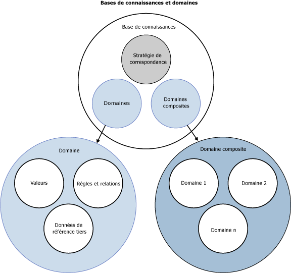

# Bases de connaissances et domaines DQS

[!INCLUDE[appliesto-ss-xxxx-xxxx-xxx-md-winonly](../includes/appliesto-ss-xxxx-xxxx-xxx-md-winonly.md)]

  Cette rubrique explique en quoi consiste une base de connaissances dans [!INCLUDE[ssDQSnoversion](../includes/ssdqsnoversion-md.md)] (DQS). Pour nettoyer les données, vous devez disposer de connaissances sur les données. Pour préparer les connaissances d'un projet de qualité des données, vous créez et gérez une base de connaissances que DQS peut utiliser pour identifier les données incorrectes ou non valides. DQS vous permet d'utiliser des processus assistés par ordinateur et interactifs pour créer, générer, et mettre à jour votre base de connaissances. Les connaissances contenues dans une base de connaissances sont conservées dans des domaines, chacun d'entre eux étant spécifique à un champ de données. La base de connaissances est un référentiel de connaissances sur vos données qui vous permet de comprendre vos données et de préserver leur intégrité.  
  
 Les bases de connaissances DQS présentent les avantages suivants :  
  
-   La génération des connaissances sur les données est un processus détaillé. Le processus DQS d'extraction automatique des connaissances sur les données à partir d'exemples de données facilite grandement les opérations.  
  
-   DQS vous permet de voir son analyse des données et d'enrichir les connaissances dans la base de connaissances en créant des règles et en modifiant les valeurs des données. Vous pouvez répéter ces opérations à plusieurs reprises pour améliorer les connaissances au fil du temps.  
  
-   Vous pouvez tirer parti de connaissances préexistantes relatives à la qualité des données en basant une base de connaissances sur une base de données existante, en important les connaissances de domaine dans la base de données à partir de fichiers, en réimportant les connaissances d'un projet dans une base de connaissances ou en utilisant la base de connaissances DQS par défaut, appelée Données DQS.  
  
-   Vous pouvez garantir la qualité des données en les comparant aux données gérées par un fournisseur de données de référence.  
  
-   Il existe une distinction claire entre la génération d'une base de connaissances et son application lors du processus de correction des données, ce qui vous offre la souplesse nécessaire pour générer et mettre à jour la base de connaissances.  
  
 Le gestionnaire de données utilise l'application [!INCLUDE[ssDQSClient](../includes/ssdqsclient-md.md)] pour exécuter et contrôler les étapes assistées par ordinateur et effectuer les étapes interactives.  
  
 L'illustration suivante montre des différents composants d'une base de connaissances et d'un domaine dans DQS :  
  
   
  
##   Comment créer et générer une base de connaissances DQS  
 La création d'une base de connaissances DQS requiert les processus et les composants suivants :  
  
 **Découverte des connaissances**  
 Un processus assisté par ordinateur qui génère les connaissances dans une base de connaissances en traitant un exemple de données  
  
 **Gestion de l'arborescence du domaine**  
 Un processus interactif qui permet au gestionnaire de données de vérifier et de modifier les connaissances figurant dans les domaines de la base de connaissances, chacun entre deux étant associé à un champ de données. Ce processus peut inclure la définition de propriétés au niveau du champ, la création de règles, la modification de valeurs spécifiques, l'utilisation de services de données de référence ou la configuration de relations à base de termes ou inter-champs.  
  
 **Reference Data Services**  
 Processus de gestion de domaines qui vous permet de valider vos données en les comparant à des données gérées et garanties par un fournisseur de données de référence.  
  
 **Stratégie de correspondance**  
 Stratégie qui définit la manière dont DQS traite les enregistrements pour identifier les doublons et les non-correspondances potentiels. Elle est intégrée à la base de connaissances dans le cadre d'un processus interactif assisté par ordinateur.  
  
##   Découverte des connaissances  
 À la base, la création d'une base de connaissances est un processus assisté par ordinateur. L'activité de découverte des connaissances génère la base de connaissances en analysant un exemple de données en fonction de critères de qualité des données à la recherche d'incohérences dans les données et d'erreurs de syntaxe et en proposant des modifications à apporter aux données. Cette analyse est basée sur des algorithmes intégrés dans DQS.  
  
 Le gestionnaire de données prépare le processus en liant une base de connaissances à une vue ou une table de base de données SQL Server qui contient des exemples de données semblables aux données que la base de connaissances utilisera pour l'analyse. Le gestionnaire de données mappe ensuite un domaine de base de connaissances à chaque colonne des exemples de données à analyser. Un domaine peut être soit un domaine unique mappé à un champ unique, soit un domaine composite comprenant plusieurs domaines mappés chacun à une partie des données contenues dans un champ unique (consultez « Domaines composites » ci-dessous). Lorsque vous exécutez une découverte des connaissances, DQS extrait les informations de qualité des données des exemples de données dans des domaines de la base de connaissances. Après avoir exécuté l'analyse de découverte des connaissances, vous disposez d'une base de connaissances à l'aide de laquelle vous pouvez procéder à la correction des données.  
  
 La base de connaissances DQS est extensible. Dans le cadre de l'activité de découverte des connaissances, vous pouvez ajouter des connaissances à la base de connaissances de manière interactive après l'analyse de découverte des connaissances assistée par ordinateur. Vous pouvez ajouter manuellement des modifications de valeurs et vous pouvez importer des valeurs de domaine à partir d'un fichier Excel. En outre, vous pouvez réexécuter le processus de découverte des connaissances ultérieurement en cas de modification des données fournies en exemple. Vous pouvez appliquer des connaissances supplémentaires à partir de l'activité de l'activité de gestion de l'arborescence du domaine et de l'activité de mise en correspondance de données (voir ci-dessous).  
  
 Le processus de découverte des connaissances n'a pas besoin d'être effectué sur les mêmes données que celles sur lesquelles la correction est effectuée. DQS offre la souplesse nécessaire à la création de connaissances à partir d'un ensemble de champs de base de données et à son application à un deuxième ensemble de données connexes devant être nettoyées. Le gestionnaire de données peut créer une base de connaissances de toutes pièces, à partir d'une base de connaissances existante, ou importer une base de connaissances à partir d'un fichier de données. Vous pouvez également réexécuter la découverte des connaissances sur une base de connaissances existante. Vous pouvez gérer plusieurs bases de connaissances sur un même [!INCLUDE[ssDQSServer](../includes/ssdqsserver-md.md)]. Vous pouvez également connecter plusieurs instances d'une application à la même base de connaissances. DQS empêche les conflits d'accès concurrentiel en verrouillant la base de connaissances pour un utilisateur qui l'ouvre dans une session de gestion des connaissances.  
  
### Non-respect de la casse dans DQS  
 Les valeurs dans DQS ne respectent pas la casse. Par conséquent, lorsque DQS procède à la découverte des connaissances, à la gestion des domaines ou à la mise en correspondance, il ne distingue pas les valeurs en fonction de la casse utilisée. Lorsque vous gérez les valeurs, si vous ajoutez une valeur qui diffère d'une autre valeur uniquement par sa casse, elles seront considérées comme une seule et même valeur et non comme des synonymes. Si deux valeurs qui diffèrent uniquement par leur casse sont comparées lors du processus de mise en correspondance, elles seront considérées comme une correspondance exacte.  
  
 Toutefois, vous pouvez contrôler la casse des valeurs que vous exportez dans les résultats de nettoyage. Pour cela, vous devez définir la propriété de domaine **Mettre en forme la sortie vers** (consultez [Définir des propriétés de domaine](../data-quality-services/set-domain-properties.md)) et activer la case à cocher **Normaliser la sortie** quand vous exportez les résultats de nettoyage (consultez [Nettoyer des données à l’aide de la base de connaissances DQS &#40 ;interne&#41;](../data-quality-services/cleanse-data-using-dqs-internal-knowledge.md)).  
  
##   Gestion de l'arborescence du domaine  
 La gestion des domaines permet au gestionnaire de données de modifier et d'enrichir de manière interactive les métadonnées générées par l'activité découverte des connaissances assistée par ordinateur. Chaque modification que vous apportez est appliquée à un domaine de la base de connaissances. Dans l'activité de gestion de domaines, vous pouvez effectuer les opérations suivantes :  
  
-   Créer un domaine. Le nouveau domaine peut être lié à ou copié à partir d'un champ existant.  
  
-   Définir les propriétés de domaine qui s'appliquent à chaque terme du domaine.  
  
-   Appliquer des règles de domaine qui se chargent de la validation ou de la normalisation pour une plage de valeurs que vous définissez.  
  
-   Appliquer de manière interactive les modifications apportées à toute valeur de données spécifique dans le domaine.  
  
-   Utiliser le correcteur orthographique de DQS pour vérifier la syntaxe, l'orthographe et la structure grammaticale des valeurs de chaîne.  
  
-   Importer un domaine à partir d'un fichier de données .dqs ou des valeurs de domaine à partir d'un fichier Microsoft Excel.  
  
-   Réimporter dans une base de connaissances les valeurs identifiées par un processus de nettoyage d'un projet de qualité des données.  
  
-   Joindre un domaine aux données de référence gérées par un fournisseur de données de référence, ce qui implique la comparaison des valeurs de domaine aux données de référence pour déterminer leur intégrité et leur exactitude. Vous pouvez également définir des paramètres de fournisseur de données.  
  
-   Appliquer des relations basées sur des termes à un domaine unique.  
  
 Une fois l'activité de gestion de domaines terminée, vous pouvez publier la base de connaissances pour l'utiliser dans un projet de données.  
  
### Définition des propriétés de domaine  
 Les propriétés de domaine définissent et pilotent le traitement qui sera appliqué aux valeurs associées. Vous pouvez définir le type de données et la langue des valeurs, spécifier que les données sources seront nettoyées avec la valeur de début (si cette option est désactivée, les données sources seront nettoyées avec le terme approprié mais pas avec la valeur de début), vérifier la normalisation des données en configurant la mise en forme qui sera appliquée lorsque les valeurs de données du domaine sont générées et définir les algorithmes (erreur de syntaxe, vérificateur d'orthographe et normalisation de chaîne) qui seront appliqués.  
  
### Reference Data Services  
 Dans le processus de gestion de domaines, vous pouvez joindre des données de référence en ligne à un domaine. Voici la procédure à suivre pour comparer les données de votre domaine aux données gérées par un fournisseur de données de référence. Vous devez tout d'abord configurer le fournisseur de données de référence à l'aide des fonctions de configuration de DQS disponibles dans la section **Administration** de l'application [!INCLUDE[ssDQSClient](../includes/ssdqsclient-md.md)] . Pour plus d’informations, consultez [Reference Data Services in DQS](../data-quality-services/reference-data-services-in-dqs.md).  
  
### Application de règles de domaine  
 Vous pouvez créer des règles de domaine pour la validation des données. Une règle de domaine garantit l'exactitude des données, qu'il s'agisse d'une contrainte de base, telle que les termes possibles qu'une valeur de chaîne peut utiliser, ou d'une expression régulière plus complexe, telle que les formes valides d'une adresse de messagerie.  
  
 Pour un domaine composite, vous pouvez créer une règle de domaine composite qui spécifie une relation entre une valeur d'un domaine unique et une valeur d'un autre domaine unique qui font tous deux partie d'un domaine composite.  
  
### Définition de valeurs de domaine  
 Après avoir généré une base de connaissances, vous pouvez renseigner et afficher les valeurs de données dans chaque domaine de la base de connaissances. Après la découverte des connaissances, DQS affiche le nombre d'occurrences de chaque terme, l'état de chaque terme et toutes les corrections proposées. Vous pouvez gérer ces connaissances comme suit :  
  
-   Modifier l'état d'une valeur de sorte qu'elle soit correcte, erronée ou non valide.  
  
-   Ajouter une valeur spécifique à ou supprimer une valeur spécifique de la base de connaissances  
  
-   Modifier la relation d'une valeur à une autre valeur, notamment en indiquant une valeur de remplacement pour un terme erroné ou non valide  
  
-   Ajouter, supprimer ou modifier les connaissances associées au domaine.  
  
 Les valeurs peuvent être créées spécifiquement par l'utilisateur ou dans le cadre des fonctionnalités de découverte ou d'importation de données. Cela vous permet d'aligner le domaine avec l'entreprise et de faciliter son extension.  
  
 Vous pouvez définir des valeurs de domaine soit dans le cadre de l'activité de gestion de domaines, soit à l'étape de gestion des valeurs de domaine à la fin de l'activité de découverte des connaissances. La fonctionnalité valeur-domaine est la même dans les deux activités.  
  
### Définition de relations à base de termes  
 Dans la gestion de domaines, vous pouvez spécifier une relation à base de termes pour un domaine unique, en spécifiant une modification à apporter à une seule valeur.  
  
### Domaines composites  
 Un domaine composite est une structure composée d'au moins deux domaines uniques qui contiennent chacun les connaissances relatives aux données communes. Parmi les exemples de données qui peuvent être traités par les domaines composites figurent les prénoms et noms de famille dans un champ de nom ou le numéro, la rue, la ville, le code postal et le pays dans un champ d'adresse. Lorsque vous mappez un champ unique à un domaine composite, DQS analyse les données de ce champ dans les différents domaines qui constituent le domaine composite.  
  
 Parfois, un domaine unique ne représente pas l'intégralité des données d'un champ. En regroupant deux domaines ou plus dans un domaine composite, vous pouvez représenter les données de manière efficace. Les avantages offerts par l'utilisation de domaines composites sont les suivants :  
  
-   L'analyse des différents domaines uniques qui constituent un domaine composite peut permettre d'évaluer plus efficacement la qualité des données.  
  
-   Lorsque vous utilisez un domaine composite, vous pouvez également créer des règles inter-domaines qui vous permettent de vérifier que la relation entre les données de plusieurs champs est appropriée. Par exemple, vous pouvez vérifier que la chaîne « Londres » dans un champ de ville correspond à la chaîne « Angleterre » dans un champ de pays. Notez que les règles de domaine prévalent sur les règles inter-domaines.  
  
-   Les données des champs composites peuvent être jointes à une source de données de référence, auquel cas le domaine composite sera envoyé au fournisseur de données de référence. Cela se produit souvent avec les données d'adresse.  
  
 La manière dont les données représentées par un domaine composite sont analysées est déterminée par les propriétés du domaine composite. Les données peuvent être analysées par un délimiteur, l'ordre des domaines, ou selon la connaissance dans les domaines joints au domaine composite (en sélectionnant la propriété **Utiliser l'analyse de Base de connaissances** dans le domaine composite). Pour plus d’informations, consultez [Set Composite Domain Properties](../data-quality-services/create-a-composite-domain.md#CompositeDomainProperties).  
  
 Les domaines composites sont gérés différemment des domaines uniques. Vous ne gérez pas les valeurs d'un champ composite ; vous gérez les valeurs des champs uniques qui constituent le champ composite. Toutefois, dans la liste de domaines de l'activité de gestion de l'arborescence du domaine, vous pouvez voir les relations entre les différentes valeurs d'un champ composite et les statistiques qui s'y rapportent. Par exemple, vous pouvez voir le nombre d'instances d'une adresse unique composée des cinq mêmes valeurs de chaîne. Lors de l'étape Découverte de l'activité de découverte des connaissances, le profilage est effectué sur les domaines uniques d'un domaine composite et non sur le domaine composite. En revanche, lors du nettoyage interactif, vous nettoyez les données du champ composite et non les domaines uniques.  
  
 La correspondance peut être effectuée sur les domaines uniques qui constituent le champ composite, mais pas sur le champ composite proprement dit.  
  
##   Correspondance de données  
 En plus d'apporter des modifications manuelles à une base de connaissances par le biais de la gestion de domaines, vous pouvez ajouter des connaissances correspondantes à une base de connaissances. Afin de préparer DQS pour le processus de déduplication de données, vous devez créer une stratégie de correspondance que DQS utilisera pour calculer la probabilité d'une correspondance. La stratégie comprend une ou plusieurs règles de correspondance créées par le gestionnaire de données pour identifier la manière dont DQS doit comparer les lignes de données. Le gestionnaire de données détermine les champs de données de la ligne qui doivent être comparés, ainsi que la pondération de chaque champ dans la comparaison. Le gestionnaire de données détermine également quel doit être le niveau de probabilité pour qu'une valeur soit considérée comme une correspondance. DQS ajoute les règles de correspondance à la base de connaissances pour les utiliser lors de l'activité de correspondance dans le projet de qualité des données.  
  
 Pour plus d'informations sur la base de connaissances et la mise en correspondance des données, consultez [Correspondance de données](../data-quality-services/data-matching.md).  
  
## Dans cette section  
 Vous pouvez effectuer les opérations suivantes sur une base de connaissances et ses domaines :  
  
|||  
|-|-|  
|Créer, ouvrir, ajouter des connaissances à et procéder à la découverte sur une base de connaissances|[Construction d’une base de connaissances](../data-quality-services/building-a-knowledge-base.md)|  
|Effectuer des opérations d'importation et d'exportation sur les domaines et les bases de connaissances|[Importation et exportation de connaissances](../data-quality-services/importing-and-exporting-knowledge.md)|  
|Créer un domaine unique, une règle de domaine, des relations basées sur des termes et modifier les valeurs de domaine|[Gestion d’un domaine](../data-quality-services/managing-a-domain.md)|  
|Créer un domaine composite, créer une règle inter-domaines et utiliser les relations de valeur|[Gestion d’un domaine composite](../data-quality-services/managing-a-composite-domain.md)|  
|Utiliser Données DQS, la base de connaissances par défaut intégrée à DQS|[Utilisation de la base de connaissances par défaut DQS](../data-quality-services/using-the-dqs-default-knowledge-base.md)|  
  
  
