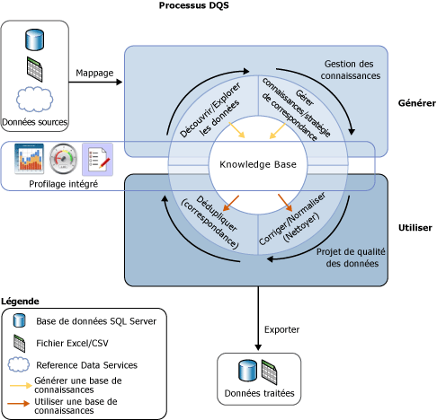

# Présentation de Data Quality Services

[!INCLUDE[appliesto-ss-xxxx-xxxx-xxx-md-winonly](../includes/appliesto-ss-xxxx-xxxx-xxx-md-winonly.md)]

  La solution de qualité des données fournie par [!INCLUDE[ssDQSnoversion](../includes/ssdqsnoversion-md.md)] (DQS) permet aux gestionnaires de données et aux professionnels de l'informatique de préserver la qualité de leurs données et de s'assurer que ces dernières sont adaptées à leur utilisation professionnelle. DQS est une solution reposant sur des connaissances qui offre des méthodes interactives et assistées par ordinateur pour gérer l'intégrité et la qualité de vos sources de données. DQS vous permet de découvrir, de générer et de gérer les connaissances relatives à vos données. Vous pouvez ensuite utiliser ces connaissances pour procéder au nettoyage, à la mise en correspondance et au profilage des données. Vous pouvez également tirer parti des services en nuage de fournisseurs de données de référence dans un projet de qualité des données DQS.  
  
##   Besoin de DQS pour les entreprises  
 Des données incorrectes peuvent provenir d'erreurs de saisie utilisateur, d'une altération dans la transmission ou le stockage, de définitions incompatibles dans le dictionnaire de données ou d'autres problèmes de traitement et de qualité des données. L'agrégation de données issues de différentes sources qui utilisent différents standards de données peut se solder par des données incohérentes, tout comme l'application d'une règle arbitraire ou le remplacement des données d'historique. Des données incorrectes ont une incidence sur la capacité d'une entreprise à effectuer ses fonctions métier et à fournir des services à ses clients, ce qui peut entraîner une perte de crédibilité et de revenu, le mécontentement de la clientèle et des problèmes de conformité. Souvent, les systèmes automatisés ne fonctionnent pas avec des données incorrectes et ces dernières sont à l'origine d'une perte de temps et d'énergie pour les personnes chargées des corrections manuelles. Des données incorrectes peuvent causer des dégâts importants en termes d'analyse de données, de création de rapports, d'exploration de données et de stockage.  
  
 Des données de qualité supérieure sont essentielles à la rentabilité des entreprises et des institutions. Les organisations de toutes tailles peuvent utiliser DQS pour améliorer la valeur informative de leurs données afin que celles-ci soient mieux adaptées à l'usage prévu. Une solution de qualité des données peut améliorer la fiabilité, l'accessibilité et la réutilisabilité des données. Elle peut améliorer exhaustivité, l'exactitude, la conformité et la cohérence de vos données, résolvant ainsi les problèmes dus à des données incorrectes dans les charges de travail de business intelligence ou d'entrepôt de données, ainsi que dans les systèmes opérationnels OLTP.  
  
 DQS permet à un utilisateur professionnel, un travailleur de l'information ou un professionnel de l'informatique non spécialiste des bases de données ou de la programmation de créer, de gérer et d'exécuter les opérations de qualité des données de son organisation avec un minimum de configuration ou de préparation.  
  
##   Répondre au besoin avec DQS  
 La qualité des données n'est pas définie en termes absolus. Elle dépend de la pertinence des données vis-à-vis de l'objectif qu'elle doit atteindre. DQS identifie les données potentiellement incorrectes et vous fournit une estimation de la probabilité d'inexactitude des données. DQS vous fournit une présentation sémantique des données afin de vous permettre de déterminer leur pertinence. DQS vous permet de résoudre les problèmes résultant de la non-exhaustivité, de l'absence de conformité, de l'incohérence, de l'inexactitude, de la non-validité et de la duplication des données.  
  
 DQS offre les fonctionnalités suivantes pour résoudre les problèmes de qualité des données.  
  
-   **Nettoyage des données :** modification, suppression ou enrichissement de données incorrectes ou incomplètes à l'aide de processus assistés par ordinateur et interactifs. Pour plus d’informations, consultez [Data Cleansing](../data-quality-services/data-cleansing.md).  
  
-   **Correspondance :** identification des doublons sémantiques lors d'un processus basé sur les règles vous permettant de déterminer ce qui constitue une correspondance et de procéder à la déduplication. Pour plus d’informations, consultez [Data Matching](../data-quality-services/data-matching.md).  
  
-   **Reference Data Services :** vérification de la qualité des données à l'aide des services d'un fournisseur de données de référence. Vous pouvez utiliser les services de données de référence de la [Place de marché Microsoft Azure](http://azure.microsoft.com/marketplace/) pour nettoyer, valider, mettre en correspondance et enrichir vos données. Pour plus d’informations, consultez [Reference Data Services in DQS](../data-quality-services/reference-data-services-in-dqs.md).  
  
-   **Profilage :** analyse d'une source de données pour offrir un aperçu de la qualité des données à chaque étape des processus de découverte des connaissances, de gestion des domaines, de mise en correspondance et de nettoyage des données. Le profilage est un outil puissant de la solution de qualité des données DQS. Vous pouvez créer une solution de qualité des données dans laquelle le profilage est tout aussi important que la gestion des connaissances, la mise en correspondance ou le nettoyage des données. Pour plus d’informations, consultez [Data Profiling and Notifications in DQS](../data-quality-services/data-profiling-and-notifications-in-dqs.md).  
  
-   **Analyse :** suivi et détermination de l'état des activités de qualité des données. L'analyse vous permet de vérifier que votre solution de qualité des données fait ce pour quoi elle a été conçue. Pour plus d’informations, consultez [DQS Administration](../data-quality-services/dqs-administration.md).  
  
-   **Base de connaissances :** Data Quality Services est une solution reposant sur des connaissances qui analyse les données en fonction des connaissances que vous générez avec DQS. Ainsi, vous pouvez créer des processus de qualité des données qui améliorent continuellement les connaissances, et par conséquent, la qualité des données.  
  
 L'illustration ci-dessous montre le processus DQS :  
  
   
  
##   Solution reposant sur des connaissances  
 La base de connaissances DQS est un référentiel comportant trois types de connaissances : des connaissances prêtes à l'emploi, des connaissances générées par [!INCLUDE[ssDQSServer](../includes/ssdqsserver-md.md)]et des connaissances générées par l'utilisateur. DQS vous permet de stocker les connaissances relatives à vos données dans la base de connaissances, d'ajouter des règles d'entreprise, de modifier les connaissances à votre convenance, puis de les appliquer pour tester l'intégrité et l'exactitude des données. Une fois la base de connaissances générée, vous pouvez l'améliorer en continu, puis la réutiliser dans de nombreux processus d'amélioration de la qualité des données.  
  
 Les connaissances stockées dans une base de données de connaissances identifient les données potentiellement incorrectes et proposent des modifications à apporter à ces données. Elles peuvent rechercher des correspondances de données, vous permettant ainsi de procéder à la déduplication des données. Elles peuvent comparer des données sources avec des données de référence basées dans le Cloud qui sont conservées et garanties par les fournisseurs de qualité des données. Le gestionnaire de données ou le professionnel de l'informatique vérifie les connaissances stockées dans la base de connaissances et les modifications à apporter aux données, puis exécute les services de nettoyage, de déduplication et de données de référence.  
  
 Une base de connaissances stocke toutes les connaissances relatives à un type de source de données spécifique. Par exemple, vous pouvez gérer une base de connaissances pour une base de données client et une autre pour une base de données employés. Les connaissances sont présentes dans un ou plusieurs domaines de données, chacun constituant une représentation sémantique d'un type de données dans un champ de données. Une base de connaissances correspondant à une base de données client peut disposer de domaines pour les noms, les, adresses, les contacts et les informations de contact des entreprises, et ainsi de suite. Un domaine contient une liste de valeurs approuvées, de valeurs non valides et de données erronées. Les connaissances de domaine incluent des associations de synonymes, des relations de termes, des règles de validation et d'entreprise et des stratégies de correspondance. Fort de ces connaissances, le gestionnaire de données peut prendre une décision informée quant à la correction ou non d'instances spécifiques des valeurs figurant dans un domaine.  
  
 DQS vous permet d'effectuer des opérations d'importation et d'exportation dans une base de connaissances. Vous pouvez importer ou exporter des domaines ou des bases de connaissances à l'aide d'un fichier DQS. Vous pouvez importer des valeurs ou des domaines à partir d'un fichier Excel. Vous pouvez également réimporter dans un domaine les valeurs identifiées par un processus de nettoyage à partir de la base de connaissances. Ces opérations vous permettent d'améliorer en continu une base de connaissances et de vous assurer que les connaissances acquises par le biais de décisions et de découvertes sont répercutées sur la base de connaissances.  
  
 La solution à base de connaissances de DQS utilise deux étapes fondamentales pour nettoyer les données :  
  
-   Un processus de **gestion des connaissances** qui génère la base de connaissances  
  
-   **Projet de qualité de données** qui propose des modifications à apporter aux données sources en fonction des connaissances figurant dans la base de connaissances.  
  
 Pour plus d’informations, consultez [Bases de connaissances et domaines DQS](../data-quality-services/dqs-knowledge-bases-and-domains.md) et [Projets de qualité de données &#40;DQS&#41;](../data-quality-services/data-quality-projects-dqs.md).  
  
##   Composants de DQS  
 Data Quality Services se compose de [!INCLUDE[ssDQSServer](../includes/ssdqsserver-md.md)] et de [!INCLUDE[ssDQSClient](../includes/ssdqsclient-md.md)]. Ces composants vous permettent de fournir des services de qualité des données distinctement des autres opérations de SQL Server. Les deux sont installés à partir du programme d'installation de SQL Server.  
  
 [!INCLUDE[ssDQSServer](../includes/ssdqsserver-md.md)] est implémenté sous la forme de trois catalogues SQL Server que vous pouvez gérer et analyser dans SQL Server Management Studio (DQS_MAIN, DQS_PROJECTS et DQS_STAGING_DATA). DQS_MAIN inclut les procédures stockées DQS, le moteur DQS et les bases de connaissances publiées. DQS_PROJECTS inclut les données requises pour la gestion des bases de connaissances et les activités de projet DQS. DQS_STAGING_DATA fournit une base de données de transit intermédiaire dans laquelle vous pouvez copier vos données sources pour effectuer des opérations DQS, puis exporter vos données traitées.  
  
 [!INCLUDE[ssDQSClient](../includes/ssdqsclient-md.md)] est une application autonome qui vous permet d'effectuer la gestion des connaissances, les projets de qualité des données et l'administration dans une même interface utilisateur. L'application est conçue pour les gestionnaires de données et les administrateurs de DQS. Il s'agit d'un fichier exécutable autonome qui se charge de la découverte des connaissances, de la gestion des domaines, de la création des stratégies de correspondance, du nettoyage, de la mise en correspondance, du profilage et de l'analyse des données, ainsi que de l'administration du serveur. [!INCLUDE[ssDQSClient](../includes/ssdqsclient-md.md)] peut être installé et exécuté sur le même ordinateur que [!INCLUDE[ssDQSServer](../includes/ssdqsserver-md.md)] ou à distance sur un ordinateur distinct. De nombreuses opérations de [!INCLUDE[ssDQSClient](../includes/ssdqsclient-md.md)] sont pilotées par un Assistant pour simplifier l'utilisation.  
  
##   Fonctionnalités de qualité des données offertes par Integration Services et Master Data Services  
 La fonctionnalité de qualité des données prise en charge par Data Quality Services est intégrée à un composant de SQL Server Integration Services (SSIS) et aux fonctionnalités de Master Data Services (MDS) pour vous permettre d'exécuter des processus de qualité des données au sein de ces services.  
  
 **[!INCLUDE[ssDQSCleansingLong](../includes/ssdqscleansinglong-md.md)]**  
  
 [!INCLUDE[ssDQSCleansingLong](../includes/ssdqscleansinglong-md.md)] vous permet de procéder au nettoyage des données dans le cadre d'un package Integration Services. Lorsque le package est exécuté, le nettoyage des données est exécuté sous la forme d'un fichier de commandes. Il s'agit d'une alternative à l'exécution d'un projet de nettoyage dans l'application [!INCLUDE[ssDQSClient](../includes/ssdqsclient-md.md)] . Vous pouvez vous assurer de la qualité des données de manière automatique. Il n'est pas nécessaire d'effectuer les étapes interactives d'un projet de nettoyage de données dans l'application [!INCLUDE[ssDQSClient](../includes/ssdqsclient-md.md)] . Vous pouvez inclure le processus de nettoyage des données dans un flux de données qui contient d'autres composants Integration Services. Pour plus d’informations, consultez [Transformation de nettoyage DQS](../integration-services/data-flow/transformations/dqs-cleansing-transformation.md).  
  
 **Processus de qualité des données dans Master Data Services**  
  
 La fonctionnalité Data Quality Services a été intégrée dans Master Data Services (MDS), de sorte que vous pouvez exécuter une déduplication sur les données sources et les données de référence dans le complément Microsoft SQL Server 2014 Master Data Services pour Microsoft Excel. Pour effectuer la correspondance, chargez les données gérées par MDS dans une feuille de calcul Excel, associez-les aux données non gérées par MDS, puis effectuez la correspondance dans Excel. Les composants de [!INCLUDE[ssDQSServer](../includes/ssdqsserver-md.md)] doivent être installés avec MDS. Pour plus d’informations, consultez  [Mise en correspondance de la qualité des données dans le complément MDS pour Excel](../master-data-services/microsoft-excel-add-in/data-quality-matching-in-the-mds-add-in-for-excel.md).  
  
  
