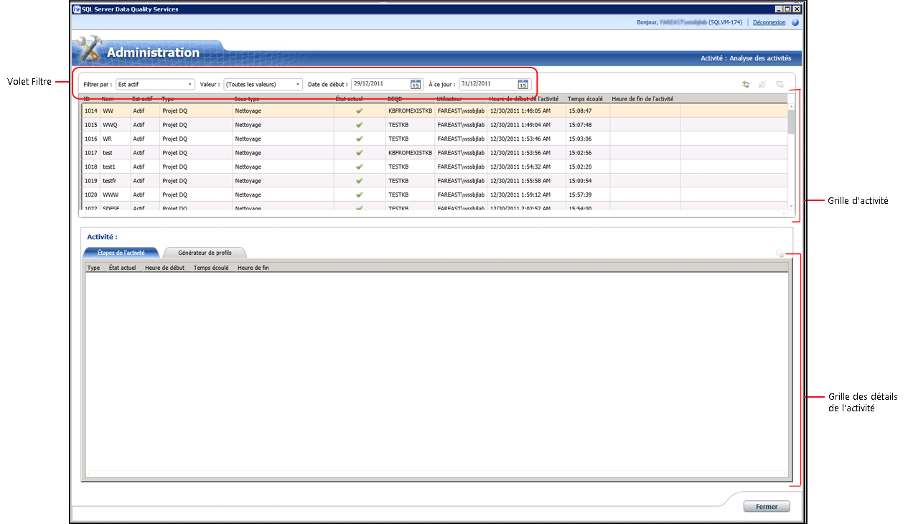

# Surveiller les activit&#233;s DQS
  Cette rubrique décrit comment surveiller de manière centralisée les activités suivantes dans [!INCLUDE[ssDQSnoversion](../includes/ssdqsnoversion-md.md)] (DQS) : découverte des connaissances, gestion des domaines, stratégie de correspondance, nettoyage des données, correspondance de données et nettoyage SSIS.  
  
##   Avant de commencer  
  
###   Limitations et restrictions  
 Seuls les utilisateurs avec le rôle dqs_administrator sur la base de données DQS_Main peuvent terminer une activité ou arrêter un processus dans une activité.  
  
###   Sécurité  
  
####   Autorisations  
  
-   Vous devez disposer du rôle dqs_kb_editor ou dqs_kb_operator sur la base de données DQS_MAIN pour afficher les activités DQS.  
  
-   Vous devez disposer du rôle dqs_administrator sur la base de données DQS_MAIN pour terminer une activité ou arrêter un processus dans une activité en plus d'afficher les activités DQS.  
  
##   Afficher les activités DQS  
  
1.  [!INCLUDE[ssDQSInitialStep](../includes/ssdqsinitialstep-md.md)] [Exécutez l’Application Data Quality Client](../data-quality-services/run-the-data-quality-client-application.md).  
  
2.  Dans l'écran d'accueil [!INCLUDE[ssDQSClient](../includes/ssdqsclient-md.md)] , cliquez sur **Analyse des activités**. L'écran de surveillance de l'activité s'affiche.  
  
       
  
3.  L'écran de surveillance affiche des informations sur chaque activité d'une grille d'activité. La grille d'activité affiche les informations suivantes sur chaque activité DQS :  
  
     **ID**: un entier. Numéro d'activité unique généré par le système pour l'analyse des activités.  
  
     **Nom**: nom de la base de connaissances ou du projet de qualité des données utilisé pour cette activité.  
  
     **Est activé**: indique si l’activité est actuellement active ou non. Peut prendre les valeurs suivantes :  
  
    -   **Active**: l'activité est en cours d'exécution.  
  
    -   **Terminé**: l'activité est terminée.  
  
    -   **Terminé**: l'activité a été terminée à l'aide de l'écran de surveillance de l'activité par l'administrateur DQS ou l'activité a été annulée par l'utilisateur lors de l'exécution dans la zone fonctionnelle correspondante dans [!INCLUDE[ssDQSClient](../includes/ssdqsclient-md.md)].  
  
     **Type**: indique le type d’activité. **Sous-type** : indique le flux de travail spécifique exécuté pour un type d’activité. Les types d’activité suivants sont analysés :  
  
    -   Sous-types relatifs à la**gestion des connaissances** :  
  
        -   **Découverte des connaissances**  
  
        -   **Gestion de l'arborescence du domaine**  
  
        -   **Stratégie de correspondance**  
  
    -   Sous-types relatifs au**projet DQ** :  
  
        -   **Nettoyage**  
  
        -   **Correspondance**  
  
    -   Sous-types relatifs au**nettoyage SSIS** :  
  
        -   **Nettoyage**  
  
     **État actuel**: indique l’état actuel d’une activité. L'état d'une activité est déterminé par le dernier processus de calcul. Remarque : il peut y avoir plusieurs processus de calcul dans une activité, tels que l’exécution répétée du processus de découverte (au sein de l’activité de découverte des connaissances). Par conséquent, l'état peut changer plusieurs fois pendant la durée de vie d'une activité.  
  
     Le paramètre**État actuel** peut prendre les valeurs suivantes :  
  
    -   **En cours d'exécution**: le processus de calcul s'exécute.  
  
    -   **Opération réussie**: cet état est défini avant l’exécution d’un processus de calcul, et après l’exécution réussie d’un processus de calcul.  
  
    -   **Échec**: le processus de calcul a échoué.  
  
    -   **Arrêté**: le processus de calcul a été arrêté.  
  
     **DQKB**: nom de la base de connaissances utilisée pour l’activité.  
  
     **Utilisateur**: le nom de l’utilisateur qui a initié l’activité ou le dernier utilisateur ayant travaillé sur l’activité (au cas où ils ne sont pas identiques).  
  
     **Heure de début de l’activité**: date et heure de début de l’activité.  
  
     **Temps écoulé**: temps qui s’est écoulé depuis le début de l’activité. Affiché en notation HH:MM:SS.  
  
     **Heure de fin de l'activité**: date et heure de fin de l’activité.  
  
##   Filtrer les informations sur les activités DQS  
 Vous pouvez utiliser le volet de filtre (**Filtrer par**, **valeur**, **de Date**, et **à jour**) dans l’écran pour filtrer et afficher les activités requises en fonction de certains critères de surveillance de l’activité. Pour filtrer les enregistrements d'activité :  
  
1.  Choisissez le critère de filtrage : si vous souhaitez filtrer les enregistrements d'activité en fonction d'une valeur de l'une des colonnes de la grille des activités (fondée sur les valeurs), d'une plage de dates, ou des deux.  
  
    1.  **Filtrage basé sur la valeur**: sélectionnez un critère de filtre dans la **Filtrer par** liste, puis sélectionnez la valeur appropriée pour le filtrage dans la **valeur** liste. Lors de la sélection d'une option dans la liste **Filtrer par** , la liste **Valeur** est mise à jour avec les valeurs possibles. Vous pouvez effectuer un filtrage selon les champs suivants dans les enregistrements d'activité : **Est activé**, **Type**, **Sous-type**, **État actuel**, **BCQD**et **Utilisateur**.  
  
    2.  **Le filtrage basé sur une plage de date**: sélection des dates appropriées dans les **date de début** et **à jour** contrôles de date. Par défaut, la date affichée dans **Date de début** se situe deux jours avant la date actuelle, tandis que la date affichée dans **Jusqu'à ce jour** correspond à la date actuelle. Le filtrage n'est pas basé sur les dates de *début* et de *fin* , mais sur la plage. Cela signifie que chaque activité qui s'exécutait pendant la plage de dates sélectionnée est affichée.  
  
2.  Cliquez sur l'icône d' **Actualiser la liste des activités** pour appliquer le filtrage, et afficher les activités filtrées DQS uniquement.  
  
##   Afficher les détails des activités DQS  
 Vous pouvez afficher les informations détaillées d'une activité DQS, telles que les étapes d'activité et des informations du Générateur de profils, dans l'écran d'analyse d'activité. Pour cela :  
  
1.  Sélectionnez une activité DQS dans la grille des activités (dans le volet supérieur).  
  
2.  Le volet inférieur affiche les détails de l'activité sélectionnée sous les 2 onglets suivants :  
  
    -   **Étapes de l’activité**: affiche une grille des processus informatiques (étapes de l’activité) qui sont associés à l’activité sélectionnée. Il peut exister plusieurs étapes d'activité affichées pour une activité sous cet onglet. Cela peut se produire au cas où la même étape de l'activité serait exécutée plusieurs fois par l'utilisateur. Par exemple, l'étape d'activité a été arrêtée et démarrée à nouveau. La grille figurant sous cet onglet affiche les informations suivantes pour étape associée à l'activité : **Type**, **État actuel**, **Heure de début**, **Temps écoulé**et **Heure de fin**.  
  
    -   **Générateur de profils**: affiche les informations de profilage des activités en cours et historiques. Pour les activités courantes, les informations sont partielles mais cohérentes. Les informations de profilage d'une activité sont exportées vers un fichier Excel lorsque vous exportez les détails d'activité correspondants dans un fichier Excel. Les informations sont disponibles dans les feuilles de **Générateur de profils – source** et de **Générateur de profils – champs** dans le fichier Excel exporté.  
  
##   Exporter les détails des activités DQS  
 Vous pouvez exporter les propriétés d'activité, les processus d'activité, et les informations de profilage d'une activité de l'écran d'analyse vers un fichier Excel. Pour cela :  
  
1.  Sélectionnez une activité dans la grille des activités (dans le volet supérieur).  
  
2.  Cliquez sur l'icône d' **Exporter l'activité sélectionnée dans Excel** . Vous pouvez également cliquer, avec le bouton droit sur toutes les activités dans la grille d’activité, puis cliquez sur **Exporter l’activité** dans le menu contextuel.  
  
3.  Vous êtes invité à spécifier un nom et un emplacement pour le fichier Excel à enregistrer. Le fichier Excel exporté contient les feuilles suivantes :  
  
    |Nom de la feuille|Description|  
    |----------------|-----------------|  
    |Activité|Contient des informations (colonnes) sur l'activité comme dans la grille des activités.|  
    |Processus|Contient des informations (colonnes) sur les processus dans l’activité en tant que le **étapes de l’activité** onglet.|  
    |Générateur de profils - source|Pour le sous-type **Nettoyage** , contient les informations suivantes sur l'activité : enregistrements, enregistrements corrects, enregistrements corrigés et enregistrements non valides.   Pour les sous-types **Découverte des connaissances**, **Gestion de l'arborescence du domaine**, **Stratégie de correspondance**et **Correspondance** , contient les informations suivantes sur l'activité : enregistrements, valeurs totales, nouvelles valeurs, valeurs uniques et nouvelles valeurs uniques.|  
    |Générateur de profils - champs|Pour les sous-types **Nettoyage** et **Nettoyage SSIS** , contient les informations suivantes sur l'activité : champ, domaine, valeurs corrigées, valeurs suggérées, achèvement et précision.   Pour les sous-types **Découverte des connaissances**, **Gestion de l'arborescence du domaine**, **Stratégie de correspondance**et **Correspondance** , contient les informations suivantes sur l'activité : champ, domaine, nouveau, unique, valide dans le domaine, et achèvement.|  
  
##   Terminer une activité DQS  
 Les administrateurs DQS (rôle dqs_administrator) peuvent se terminer une activité en cours d’exécution (actif) qui n’est pas du type **nettoyage SSIS**. La fin d'une activité arrête tous les processus en cours d'exécution dans l'activité et supprime tout ce qui est lié à cette activité. Cette opération ne peut pas être annulée. Terminer une activité dans l'écran de surveillance de l'activité est équivalent à annuler l'activité correspondante en cliquant sur **Annuler** lors de l'exécution dans la zone fonctionnelle de [!INCLUDE[ssDQSClient](../includes/ssdqsclient-md.md)]. Pour terminer une activité :  
  
1.  Sélectionnez une activité en cours d'exécution dans la grille des activités (volet supérieur).  
  
2.  Cliquez sur l'icône **Terminer l'activité sélectionnée** . Vous pouvez également cliquer, avec le bouton droit sur l’activité dans la grille d’activité, puis cliquez sur **Terminer l’activité** dans le menu contextuel.  
  
3.  Un message s'affiche pour confirmer votre action. Cliquez sur **Oui**.  
  
##   Arrêter un processus d'une activité DQS  
 Les administrateurs DQS (rôle dqs_administrator) peuvent s’arrêter un processus en cours d’exécution (actif) dans une activité qui n’est pas du type **nettoyage SSIS**. L'arrêt d'un processus dans l'écran de surveillance de l'activité est équivalent à arrêter le processus dans l'activité correspondante de la zone fonctionnelle de [!INCLUDE[ssDQSClient](../includes/ssdqsclient-md.md)]. Par exemple, arrêt du processus de nettoyage assisté par ordinateur dans une activité de nettoyage, ou arrêt du processus correspondant dans une activité correspondante. Un processus arrêté ne peut pas être redémarré depuis l'écran de surveillance des activités. Vous devrez redémarrer le processus depuis la zone fonctionnelle correspondante dans [!INCLUDE[ssDQSClient](../includes/ssdqsclient-md.md)]. Dans ce cas, une ligne supplémentaire est ajoutée à la grille des processus sous l'onglet **Étapes de l'activité** . L'état du processus arrêté continue à afficher **Arrêté**. Pour arrêter un processus :  
  
1.  Sélectionnez un processus en cours d’exécution dans la grille des détails de l'activité (volet inférieur).  
  
2.  Cliquez sur l'icône **Arrêter le processus sélectionné** . Vous pouvez également cliquer, avec le bouton droit sur le processus dans la grille des détails de l’activité, puis cliquez sur **Arrêter le processus** dans le menu contextuel.  
  
3.  Un message s'affiche pour confirmer votre action. Cliquez sur **Oui**.  
  
  