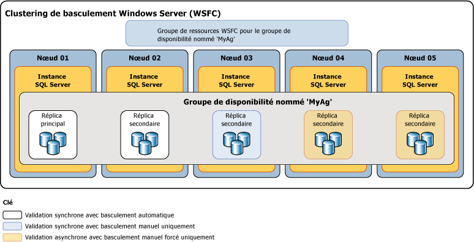

# Modes de disponibilité (Groupes de disponibilité Always On)
[!INCLUDE[appliesto-ss-xxxx-xxxx-xxx-md](../../../includes/appliesto-ss-xxxx-xxxx-xxx-md.md)]

  Dans [!INCLUDE[ssHADR](../../../includes/sshadr-md.md)], le *mode de disponibilité* est une propriété de réplica qui détermine si un réplica de disponibilité donné peut fonctionner en mode de validation synchrone. Pour chaque réplica de disponibilité, le mode de disponibilité doit être configuré pour le mode de validation synchrone, pour le mode de validation asynchrone ou pour le mode de configuration uniquement.  Si le réplica principal est configuré pour le *mode de validation asynchrone*, il n’attend pas que le réplica secondaire écrive des enregistrements dans le journal des transactions entrantes sur le disque (pour *renforcer le journal*). Si un réplica secondaire donné est configuré en mode de validation asynchrone, le réplica principal n'attend pas que ce réplica secondaire renforce le journal. Si le réplica principal et un réplica secondaire donné sont configurés pour le *mode de validation synchrone*, le réplica principal attend que le réplica secondaire confirme qu’il a renforcé le journal (sauf si le réplica secondaire n’envoie pas de commande ping au réplica principal pendant la *période d’expiration de session*du réplica principal). 
  

> [!NOTE]  
>  Si la période d'expiration de session du réplica principal est dépassée par un réplica secondaire, le réplica principal passe temporairement en mode de validation asynchrone pour ce réplica secondaire. Lorsque le réplica secondaire se reconnecte au réplica principal, ils reprennent le mode de validation synchrone.  
  
 **Dans cette rubrique :**  
  
-   [Modes de disponibilité pris en charge](#SupportedAvModes)  
  
-   [Asynchronous-Commit Availability Mode](#AsyncCommitAvMode)  
  
-   [Synchronous-Commit Availability Mode](#SyncCommitAvMode)  
  
-   [Tâches associées](#RelatedTasks)  
  
-   [Contenu connexe](#RelatedContent)  
  
##   Modes de disponibilité pris en charge  
 [!INCLUDE[ssHADR](../../../includes/sshadr-md.md)] prend en charge trois modes de disponibilité (le mode avec validation asynchrone, le mode avec validation synchrone et le mode de configuration uniquement) de la façon suivante :  
  
-   Le*mode avec validation asynchrone* est une solution de récupération d’urgence qui fonctionne bien quand les réplicas de disponibilité sont séparés par des distances considérables. Si chaque réplica secondaire s'exécute en mode avec validation asynchrone, le réplica principal n'attend pas que les réplicas secondaires renforcent le journal. En revanche, immédiatement après l'écriture d'un enregistrement de journal dans le journal local, le réplica principal envoie une confirmation de transaction au client. Le réplica principal s'exécute avec une latence de transaction minimale par rapport à un réplica secondaire configuré pour le mode avec validation asynchrone.  Si le serveur principal actuel est configuré pour le mode de disponibilité avec validation asynchrone, il valide les transactions de façon asynchrone pour tous les réplicas secondaires, indépendamment de leurs paramètres de mode de disponibilité.  
  
     Pour plus d’informations, consultez [Mode de disponibilité avec validation asynchrone](#AsyncCommitAvMode)plus loin dans cette rubrique.  
  
-   Le*mode avec validation synchrone* privilégie la haute disponibilité par rapport aux performances, mais au prix d’une latence accrue des transactions. En mode avec validation synchrone, les transactions attendent que le réplica secondaire ait renforcé le journal sur le disque avant d'envoyer la confirmation de transaction au client. Lorsque la synchronisation des données démarre sur une base de données secondaire, le réplica secondaire commence à appliquer les enregistrements de journal entrants à partir de la base de données primaire correspondante. Dès que tous les enregistrements de journal sont renforcés, la base de données secondaire passe à l'état SYNCHRONIZED. Ensuite, chaque nouvelle transaction est renforcée par le réplica secondaire avant que l'enregistrement du journal soit écrit dans le journal local. Lorsque toutes les bases de données secondaires d'un réplica secondaire sont synchronisées, le mode avec validation synchrone prend en charge le basculement manuel et, éventuellement, le basculement automatique.  
  
     Pour plus d’informations, consultez [Mode de disponibilité avec validation synchrone](#SyncCommitAvMode)plus loin dans cette rubrique.  

-   Le *mode de configuration uniquement* s’applique aux groupes de disponibilité qui ne sont pas sur un cluster de basculement Windows Server. Un réplica en mode de configuration uniquement ne contient pas de données utilisateur. En mode de configuration uniquement, la base de données master du réplica stocke les métadonnées de configuration du groupe de disponibilité. Pour plus d’informations, consultez [Groupe de disponibilité avec réplica en mode de configuration uniquement](../../../linux/sql-server-linux-availability-group-ha.md).
  
 L'illustration suivante montre un groupe de disponibilité avec cinq réplicas de disponibilité. Le réplica principal et un réplica secondaire sont configurés pour le mode avec validation synchrone et basculement automatique. Un autre réplica secondaire est configuré pour le mode avec validation synchrone pour un basculement manuel planifié uniquement, et deux réplicas secondaires sont configurés pour le mode avec validation asynchrone qui prend en charge uniquement le basculement manuel forcé (généralement appelé *basculement forcé*).  
  
   
  
 Le comportement de synchronisation et de basculement entre deux réplicas de disponibilité dépend du mode de disponibilité des deux réplicas. Par exemple, pour qu'une validation synchrone se produise, le réplica principal actuel et le réplica secondaire doivent tous deux être configurés pour la validation synchrone. De même, pour qu'un basculement automatique se produise, les deux réplicas doivent être configurés pour le basculement automatique. Par conséquent, le comportement du scénario de déploiement illustré ci-dessus peut être résumé dans le tableau suivant, qui explore le comportement de chaque réplica principal potentiel :  
  
|Réplica principal actuel|Cibles de basculement automatique|Mode avec validation synchrone et|Mode avec validation asynchrone et|Basculement automatique possible|  
|-----------------------------|--------------------------------|--------------------------------------------|---------------------------------------------|---------------------------------|  
|01|02|02 et 03|04|Oui|  
|02|01|01 et 03|04|Oui|  
|03||01 et 02|04|non|  
|04|||01, 02 et 03|non|  
  
 En général, le nœud 04 (réplica avec validation asynchrone), est déployé dans un site de récupération d'urgence. Le fait que les nœuds 01, 02 et 03 demeurent en mode de validation asynchrone après avoir basculé vers le nœud 04 empêche une dégradation des performances potentielle dans votre groupe de disponibilité en raison de temps de réponse du réseau élevé entre les deux sites.  
  
##   Asynchronous-Commit Availability Mode  
 En *mode avec validation asynchrone*, le réplica secondaire n’est jamais synchronisé avec le réplica principal. Bien qu'une base de données secondaire donnée puisse rattraper la base de données principale correspondante, n'importe quelle base de données secondaire peut être en décalage à tout moment. Le mode avec validation asynchrone peut être utile dans un scénario de récupération d'urgence, lorsque le réplica principal et le réplica secondaire sont séparés par une distance significative et lorsque vous ne souhaitez pas que de petites erreurs aient un impact sur le réplica principal, ou bien dans des situations où les performances sont plus importantes que la protection des données synchronisées. En outre, étant donné que le réplica principal n'attend pas les accusés de réception du réplica secondaire, les problèmes survenant sur ce réplica secondaire n'affectent jamais le réplica principal.  
  
 Un réplica secondaire avec validation asynchrone tente de suivre les enregistrements de journal reçus du réplica principal. Cependant, en mode avec validation asynchrone, les bases de données secondaires ne sont jamais synchronisées et peuvent rester derrière les bases de données principales correspondantes. Généralement, l'intervalle entre une base de données secondaire avec validation asynchrone et la base de données primaire correspondante est faible. Mais l'intervalle peut devenir substantiel si le serveur qui héberge le réplica secondaire est surchargé ou si le réseau est lent.  
  
 La seule forme de basculement prise en charge par le mode avec validation asynchrone est le basculement forcé (avec perte de données possible). Le basculement forcé est un dernier recours adapté uniquement aux situations dans lesquelles le réplica principal reste indisponible pendant une période prolongée et la disponibilité immédiate des bases de données primaires est plus importante que le risque de perte de données. La cible de basculement doit être un réplica dont le rôle est dans l’état SECONDARY ou RESOLVING. La cible de basculement passe dans le rôle principal et ses copies de bases de données deviennent la base de données primaire. Toutes les bases de données secondaires restantes, avec les bases de données primaires précédentes, une fois qu'elles sont disponibles, sont interrompues jusqu'à ce que vous les repreniez manuellement et individuellement. En mode de validation asynchrone, tous les journaux des transactions que le réplica principal d'origine n'avait pas envoyés à l'ancien réplica secondaire sont perdus. Cela signifie que les transactions validées récemment peuvent manquer dans certaines ou toutes les nouvelles bases de données principales. Pour plus d’informations sur le basculement forcé et sur les bonnes pratiques pour son utilisation, consultez [Basculement et modes de basculement &#40;groupes de disponibilité Always On&#41;](../../../database-engine/availability-groups/windows/failover-and-failover-modes-always-on-availability-groups.md).  
  
##   Synchronous-Commit Availability Mode  
 En mode de disponibilité avec validation synchrone (*mode avec validation synchrone*), quand on l’attache à un groupe de disponibilité, une base de données secondaire rattrape la base de données primaire correspondante et passe à l’état SYNCHRONIZED. La base de données secondaire reste à l'état SYNCHRONIZED tant que la synchronisation des données continue. Cela garantit que chaque transaction validée sur une base de données primaire donnée a également été validée sur la base de données secondaire correspondante. Lorsque chaque base de données secondaire sur un réplica secondaire donné est synchronisée, l'état synchronization_health de l'ensemble du réplica secondaire est HEALTHY.  
  
 **Dans cette section :**  
  
-   [Facteurs qui perturbent la synchronisation des données](#DisruptSync)  
  
-   [Fonctionnement de la synchronisation sur un réplica secondaire](#HowSyncWorks)  
  
-   [Mode avec validation synchrone et basculement manuel uniquement](#SyncCommitWithManual)  
  
-   [Mode avec validation synchrone et basculement automatique](#SyncCommitWithAuto)  
  
###   Facteurs qui perturbent la synchronisation des données  
 Une fois que toutes ses bases de données sont synchronisées, un réplica secondaire passe à l'état HEALTHY. Le réplica secondaire synchronisé restera intègre sauf si l'un des événements suivants se produit :  
  
-   Un délai de réseau ou d'ordinateur, ou un autre problème, entraîne l'expiration du délai d'attente de la session entre le réplica secondaire et le réplica principal.  
  
    > [!NOTE]  
    >  Pour plus d’informations sur la propriété session-time des réplicas de disponibilité, consultez [Vue d’ensemble des groupes de disponibilité Always On &#40;SQL Server&#41;](../../../database-engine/availability-groups/windows/overview-of-always-on-availability-groups-sql-server.md).  
  
-   Vous suspendez une base de données secondaire sur le réplica secondaire. Le réplica secondaire cesse d'être synchronisé et son état synchronization-health est marqué comme NOT_HEALTHY. Le réplica secondaire ne peut pas redevenir intègre tant que la base de données secondaire suspendue n'est pas reprise et resynchronisée ou bien n'est pas supprimée du groupe de disponibilité.  
  
-   Vous ajoutez une base de données primaire au groupe de disponibilité. Les réplicas secondaires précédemment synchronisés passent à l'état synchronization-health NOT_HEALTHY. Cet état indique qu'au moins une base de données est à l'état de synchronisation NOT SYNCHRONIZING. Un réplica secondaire donné ne peut pas redevenir HEALTHY tant qu'une base de données secondaire correspondante n'a pas été préparée sur le réplica, associée au groupe de disponibilité et synchronisée avec la nouvelle base de données primaire.  
  
-   Vous modifiez le réplica principal ou le réplica secondaire en mode de disponibilité avec validation asynchrone. Après le passage en mode avec validation asynchrone, le réplica secondaire reste à l'état synchronization-health HEALTHY tant que la synchronisation des données continue. Toutefois, si seul le réplica principal est passé en mode avec validation asynchrone, le réplica secondaire avec validation synchrone passera à l'état synchronization-health PARTIALLY_HEALTHY. Cet état indique qu'au moins une base de données est à l'état de synchronisation SYNCHRONIZING, mais qu'aucune base de données est à l'état NOT SYNCHRONIZING.  
  
-   Vous modifiez un réplica principal en mode de disponibilité avec validation synchrone. Le réplica secondaire est par conséquent marqué comme étant à l'état synchronization-health PARTIALLY_HEALTHY tant que toutes ses bases de données sont à l'état de synchronisation SYNCHRONIZED.  
  
> [!TIP]  
>  Pour afficher l’intégrité de synchronisation d’un groupe de disponibilité, d’un réplica de disponibilité ou d’une base de données de disponibilité, interrogez respectivement la colonne **synchronization_health** ou **synchronization_health_desc** column de [sys.dm_hadr_availability_group_states](../../../relational-databases/system-dynamic-management-views/sys-dm-hadr-availability-group-states-transact-sql.md), [sys.dm_hadr_availability_replica_states](../../../relational-databases/system-dynamic-management-views/sys-dm-hadr-availability-replica-states-transact-sql.md)ou [sys.dm_hadr_database_replica_states](../../../relational-databases/system-dynamic-management-views/sys-dm-hadr-database-replica-states-transact-sql.md).  
  
###   Fonctionnement de la synchronisation sur un réplica secondaire  
 En mode avec validation synchrone, une fois qu’un réplica secondaire est attaché au groupe de disponibilité et a établi une session avec le réplica principal, il écrit les enregistrements de journal entrants sur le disque (*renforcement du journal*) et envoie un message de confirmation au réplica principal. Une fois que le journal renforcé sur la base de données secondaire a rattrapé la fin du journal de la base de données primaire, l'état de la base de données secondaire est défini sur SYNCHRONIZED. Le temps nécessaire à la synchronisation dépend essentiellement du décalage de la base de données secondaire par rapport à la base de données principale au début de la session (ce qui se mesure par le nombre d'enregistrements du journal initialement reçus du réplica principal), de la charge de travail sur la base de données principale et de la vitesse de l'ordinateur de l'instance de serveur qui héberge le réplica secondaire.  
  
 L'opération se déroule de la manière suivante :  
  
1.  À la réception d'une transaction d'un client, le réplica principal écrit le journal de la transaction dans le journal des transactions et envoie simultanément l'enregistrement du journal aux réplicas secondaires.  
  
2.  Une fois qu'un enregistrement est écrit dans le journal des transactions de la base de données primaire, la transaction peut être annulée uniquement en cas de basculement à ce stade sur un secondaire qui n'a pas reçu l'enregistrement. Le réplica principal attend la confirmation du ou des réplicas secondaires avec validation synchrone.  
  
3.  Le réplica secondaire renforce le journal et retourne un accusé de réception au réplica principal.  
  
4.  Dès qu'il reçoit la confirmation du réplica secondaire, le réplica principal termine le traitement de la validation et envoie un message de confirmation au client.  
  
    > [!NOTE]  
    >  Si un réplica secondaire avec validation synchrone expire sans avoir confirmé qu'il a renforcé le journal, le réplica principal marque ce réplica secondaire comme étant en échec. L'état connecté du réplica secondaire passe à DISCONNECTED et le réplica principal cesse d'attendre la confirmation du réplica secondaire. Ce comportement garantit qu'un réplica secondaire avec validation synchrone n'empêche pas le renforcement du journal des transactions sur le réplica principal.  
  
 Le mode avec validation synchrone protège vos données en exigeant que celles-ci soient synchronisées entre deux emplacements, quitte à augmenter un peu la latence de la transaction.  
  
###  Mode avec validation synchrone et basculement manuel uniquement  
 Lorsque ces réplicas sont connectés et la base de données est synchronisés, le basculement manuel est pris en charge. Si le réplica secondaire s'arrête, le réplica principal n'est pas affecté. Le réplica principal est exposé si aucun réplica SYNCHRONIZED n'existe (autrement dit, s'il n'envoie de données à aucun réplica secondaire). Si le réplica principal est perdu, les réplicas secondaires passent à l'état RESOLVING, mais le propriétaire de la base de données peut forcer un basculement vers le réplica secondaire (avec perte de données possible). Pour plus d’informations, consultez [Basculement et modes de basculement &#40;groupes de disponibilité Always On&#41;](../../../database-engine/availability-groups/windows/failover-and-failover-modes-always-on-availability-groups.md).  
  
###   Mode avec validation synchrone et basculement automatique  
 Le basculement automatique offre une haute disponibilité et garantit que la base de données redevient rapidement disponible après la perte du réplica principal. Pour configurer le basculement automatique d’un groupe de disponibilité, vous devez définir le réplica principal actuel et au moins un réplica secondaire en mode de validation synchrone avec basculement automatique. Vous pouvez configurer jusqu’à trois réplicas de basculement automatique.  
  
 En outre, pour qu'un basculement automatique soit possible à tout moment, ce réplica secondaire doit être synchronisé avec le réplica principal (autrement dit, toutes les bases de données secondaires doivent être synchronisées) et le cluster de basculement Windows Server (WSFC) doit avoir le quorum. Si le réplica principal devient indisponible dans ces conditions, il y a basculement automatique. Le réplica secondaire bascule dans le rôle de principal et propose sa base de données comme base de données primaire. Pour plus d’informations consultez la section « Basculement automatique » de la rubrique [Basculement et modes de basculement &#40;groupes de disponibilité Always On&#41;](../../../database-engine/availability-groups/windows/failover-and-failover-modes-always-on-availability-groups.md).  
  
> [!NOTE]  
>  Pour plus d’informations sur le quorum WSFC et [!INCLUDE[ssHADR](../../../includes/sshadr-md.md)], consultez [Modes de quorum WSFC et configuration de vote &#40;SQL Server&#41;](../../../sql-server/failover-clusters/windows/wsfc-quorum-modes-and-voting-configuration-sql-server.md).  
  
##   Tâches associées  
 **Pour modifier le mode de disponibilité et de basculement**  
  
-   [Modifier le mode de disponibilité d’un réplica de disponibilité &#40;SQL Server&#41;](../../../database-engine/availability-groups/windows/change-the-availability-mode-of-an-availability-replica-sql-server.md)  
  
-   [Modifier le mode de basculement d’un réplica de disponibilité &#40;SQL Server&#41;](../../../database-engine/availability-groups/windows/change-the-failover-mode-of-an-availability-replica-sql-server.md)  
  
 **Pour ajuster les votes de quorum**  
  
-   [Afficher les paramètres NodeWeight pour le quorum de cluster](../../../sql-server/failover-clusters/windows/view-cluster-quorum-nodeweight-settings.md)  
  
-   [Configurer les paramètres NodeWeight pour un quorum de cluster](../../../sql-server/failover-clusters/windows/configure-cluster-quorum-nodeweight-settings.md)  
  
-   [Forcer un cluster WSFC à démarrer sans quorum](../../../sql-server/failover-clusters/windows/force-a-wsfc-cluster-to-start-without-a-quorum.md)  
  
 **Pour effectuer un basculement manuel**  
  
-   [Effectuer un basculement manuel planifié d’un groupe de disponibilité &#40;SQL Server&#41;](../../../database-engine/availability-groups/windows/perform-a-planned-manual-failover-of-an-availability-group-sql-server.md)  
  
-   [Effectuer un basculement manuel forcé d’un groupe de disponibilité &#40;SQL Server&#41;](../../../database-engine/availability-groups/windows/perform-a-forced-manual-failover-of-an-availability-group-sql-server.md)  
  
-   [Utiliser l’Assistant Basculer le groupe de disponibilité &#40;SQL Server Management Studio&#41;](../../../database-engine/availability-groups/windows/use-the-fail-over-availability-group-wizard-sql-server-management-studio.md)  
  
 **Pour afficher les états de groupe de disponibilité, de réplica de disponibilité et de base de données**  
  
-   [sys.dm_hadr_availability_group_states &#40;Transact-SQL&#41;](../../../relational-databases/system-dynamic-management-views/sys-dm-hadr-availability-group-states-transact-sql.md)  
  
-   [sys.dm_hadr_availability_replica_states &#40;Transact-SQL&#41;](../../../relational-databases/system-dynamic-management-views/sys-dm-hadr-availability-replica-states-transact-sql.md)  
  
-   [sys.dm_hadr_database_replica_states &#40;Transact-SQL&#41;](../../../relational-databases/system-dynamic-management-views/sys-dm-hadr-database-replica-states-transact-sql.md)  
  
##   Contenu associé  
  
-   [Microsoft SQL Server Always On Solutions Guide for High Availability and Disaster Recovery (Guide de solutions Microsoft SQL Server Always On pour la haute disponibilité et la récupération d’urgence)](http://go.microsoft.com/fwlink/?LinkId=227600)  
  
-   [Blog de l’équipe de SQL Server Always On : Blog officiel de l’équipe de SQL Server Always On](https://blogs.msdn.microsoft.com/sqlalwayson/)  
  
##  Voir aussi  
 [Vue d’ensemble des groupes de disponibilité Always On &#40;SQL Server&#41;](../../../database-engine/availability-groups/windows/overview-of-always-on-availability-groups-sql-server.md)   
 [Basculement et modes de basculement &#40;Groupes de disponibilité AlwaysOn&#41;](../../../database-engine/availability-groups/windows/failover-and-failover-modes-always-on-availability-groups.md)   
 [Clustering de basculement Windows Server &#40;WSFC&#41; avec SQL Server](../../../sql-server/failover-clusters/windows/windows-server-failover-clustering-wsfc-with-sql-server.md)  
  
  
