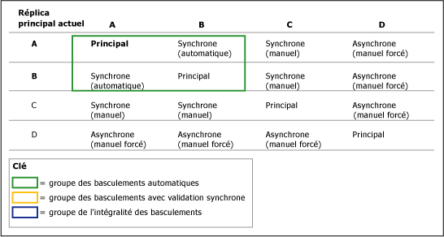
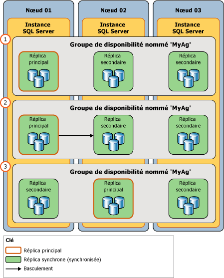

# Basculement et modes de basculement (groupes de disponibilité Always On)
[!INCLUDE[appliesto-ss-xxxx-xxxx-xxx-md](../../../includes/appliesto-ss-xxxx-xxxx-xxx-md.md)]

  Dans le contexte d'un groupe de disponibilité, le rôle principal et le rôle secondaire des réplicas de disponibilité sont généralement interchangeables au moyen d'un processus appelé *basculement*. Trois formes de basculement existent : basculement automatique (sans perte de données), basculement manuel planifié (sans perte de données) et basculement manuel forcé (avec perte de données possible), ce dernier étant généralement appelé *basculement forcé*. Les basculements automatiques et planifiés manuels préservent vos données. Un groupe de disponibilité bascule au niveau d'un réplica de disponibilité. Autrement dit, un groupe de disponibilité bascule vers l’un de ses réplicas secondaires ( *cible de basculement*actuelle).  
  
> [!NOTE]  
>  Les problèmes qui surviennent au niveau de la base de données, tels qu'une base de données devenant suspecte en raison de la perte d'un fichier de données, la suppression d'une base de données ou l'altération d'un journal des transactions, ne provoquent pas le basculement d'un groupe de disponibilité.  
  
 Pendant le basculement, la cible de basculement adopte le rôle principal, récupère ses bases de données et les met en ligne en tant que nouvelles bases de données primaires. Le réplica principal précédent, lorsqu'il est disponible, bascule vers le rôle secondaire, et ses bases de données deviennent des bases de données secondaires. Ces rôles peuvent éventuellement basculer plusieurs fois (ou vers une cible de basculement différente), soit en réponse à plusieurs défaillances, soit pour des raisons administratives.  
  
 Les formes de basculement qu’un réplica de disponibilité donné prend en charge sont spécifiées par la propriété *mode de basculement* . Pour un réplica de disponibilité spécifique, les modes de basculement possibles dépendent du [mode de disponibilité](../../../database-engine/availability-groups/windows/availability-modes-always-on-availability-groups.md) du réplica, comme suit :  
  
-   Les**réplicas avec validation synchrone** prennent en charge deux paramètres : automatique ou manuel. Le paramètre « automatic » prend en charge le basculement automatique et le basculement de manuel. Pour empêcher la perte de données, le basculement automatique et le basculement planifié requièrent que la cible de basculement soit un réplica secondaire avec validation synchrone et présente un état de synchronisation intègre (cela indique que chaque base de données secondaire sur la cible de basculement est synchronisée avec sa base de données primaire correspondante). Si un réplica secondaire ne remplit pas ces deux conditions, il prend en charge seulement le basculement forcé. Notez que le basculement forcé est également pris en charge sur les réplicas dont le rôle est dans l'état RESOLVING.  
  
-   Les**réplicas avec validation asynchrone** prennent en charge uniquement le mode de basculement manuel. De plus, étant donné qu'ils ne sont jamais synchronisés, ils prennent en charge uniquement le basculement forcé.  
  
> [!NOTE]  
>  Suite à un basculement, les applications clientes qui doivent accéder aux bases de données primaires doivent se connecter au nouveau réplica principal. En outre, si le nouveau réplica secondaire est configuré pour autoriser l'accès en lecture seule, les applications clientes en lecture seule peuvent s'y connecter. Pour plus d’informations sur la connexion de clients à un groupe de disponibilité, consultez [Écouteurs de groupe de disponibilité, connectivité client et basculement d’application &#40;SQL Server&#41;](../../../database-engine/availability-groups/windows/listeners-client-connectivity-application-failover.md).  
  
 **Sections de cette rubrique :**  
  
-   [Termes et définitions](#TermsAndDefinitions)  
  
-   [Présentation du basculement](#Overview)  
  
-   [Basculement automatique](#AutomaticFailover)  
  
-   [Basculement manuel planifié (sans perte de données)](#ManualFailover)  
  
-   [Basculement forcé (avec possible perte de données)](#ForcedFailover)  
  
-   [Tâches associées](#RelatedTasks)  
  
-   [Contenu connexe](#RelatedContent)  
  
##   Termes et définitions  
 Basculement automatique  
 Basculement qui se produit automatiquement à la perte du réplica principal. Le basculement automatique est pris en charge uniquement lorsque le réplica principal actuel et un réplica secondaire sont tous les deux configurés en mode de basculement AUTOMATIQUE et que le réplica secondaire est actuellement synchronisé.  Si basculement du réplica principal ou secondaire est en mode MANUEL, un basculement automatique ne peut pas avoir lieu.  
  
 Basculement manuel planifié (sans perte de données)  
 Le basculement manuel planifié, ou *basculement manuel*, est un basculement qui est initié par un administrateur de base de données, en général pour des raisons administratives. Un basculement manuel planifié est pris en charge uniquement si le réplica principal et le réplica secondaire sont configurés en mode de validation synchrone et que le réplica secondaire est actuellement synchronisé (dans l'état SYNCHRONIZED). Lorsque le réplica secondaire cible est synchronisé, un basculement manuel (sans perte de données) est possible même si le réplica principal est hors service car les bases de données secondaires sont prêtes pour le basculement. C'est l'administrateur de base de données qui initie manuellement un basculement manuel.  
  
 Basculement forcé (avec possible perte de données)  
 Basculement qui peut être initié par un administrateur de base de données lorsqu'aucun réplica secondaire n'est synchronisé (SYNCHRONIZED) avec le réplica principal, ou lorsque le réplica principal n'est pas en cours d'exécution et aucun réplica secondaire n'est prêt pour le basculement. Le basculement forcé présente un risque de perte des données et est exclusivement recommandé dans le cas d'une récupération d'urgence. Le basculement forcé est également appelé « basculement manuel forcé » car il ne peut être initié que manuellement. Il s'agit de la seule forme de basculement prise en charge en mode de disponibilité avec validation asynchrone.  
  
 [!INCLUDE[ssFosAutoC](../../../includes/ssfosautoc-md.md)]  
 Dans un groupe de disponibilité donné, paire de réplicas de disponibilité (réplica principal actuel compris) qui est configurée pour le mode de validation synchrone avec basculement automatique, le cas échéant. Un[!INCLUDE[ssFosAuto](../../../includes/ssfosauto-md.md)]entre en vigueur uniquement si le réplica secondaire se trouve actuellement en mode SYNCHRONIZED avec le réplica principal.  
  
 [!INCLUDE[ssFosSyncC](../../../includes/ssfossyncc-md.md)]  
 Dans un groupe de disponibilité donné, un groupe de deux ou trois réplicas de disponibilité (réplica principal actuel compris) qui est configuré pour le mode de validation synchrone, le cas échéant. Un [!INCLUDE[ssFosSync](../../../includes/ssfossync-md.md)]entre en vigueur uniquement si les réplicas secondaires sont configurés pour le mode de basculement manuel et qu’au moins un réplica secondaire se trouve actuellement en mode SYNCHRONIZED avec le réplica principal.  
  
 [!INCLUDE[ssFosEntireC](../../../includes/ssfosentirec-md.md)]  
 Dans un groupe de disponibilité donné, l'ensemble de tous les réplicas de disponibilité dont l'état opérationnel est actuellement ONLINE, quel que soit le mode de disponibilité et le mode de basculement. Le [!INCLUDE[ssFosEntire](../../../includes/ssfosentire-md.md)]est approprié quand aucun réplica secondaire ne se trouve actuellement en mode SYNCHRONIZED avec le réplica principal.  
  
##   Présentation du basculement  
 Le tableau ci-dessous résume les formes de basculement prises en charge dans différents modes de disponibilité et de basculement. Pour chaque couplage, le mode de disponibilité et le mode de basculement les plus efficaces sont déterminés par l'intersection des modes du réplica principal et des modes d'un ou plusieurs réplicas secondaires.  
  
||Mode de validation asynchrone|Mode de validation synchrone avec mode de basculement manuel|Mode de validation synchrone avec mode de basculement automatique|  
|-|-------------------------------|---------------------------------------------------------|------------------------------------------------------------|  
|Basculement automatique|non|non|Oui|  
|Basculement manuel planifié|non|Oui|Oui|  
|basculement forcé|Oui|Oui|Oui**\***|  
  
 **\*** Si vous exécutez une commande de basculement forcé sur un réplica secondaire synchronisé, le réplica secondaire se comporte de la même manière que pour un basculement manuel.  
  
 La durée pendant laquelle la base de données n'est pas disponible lors d'un basculement dépend du type de basculement et de la raison de ce dernier.  
  
> [!IMPORTANT]  
>  Pour pouvoir prendre en charge les connexions clientes après le basculement, à l'exception des bases de données à relation contenant-contenu, les connexions et les travaux définis sur les bases de données primaires précédentes doivent être recréés manuellement sur la nouvelle base de données primaire. Pour plus d’informations, consultez [Gestion des connexions et des travaux pour les bases de données d’un groupe de disponibilité &#40;SQL Server&#41;](../../../database-engine/availability-groups/windows/logins-and-jobs-for-availability-group-databases.md).  
  
### Ensembles de basculement  
 Les formes de basculement possibles pour un groupe de disponibilité donné peuvent être présentées en termes de groupes de basculement. Un groupe de basculement comprend le réplica principal et les réplicas secondaires qui prennent en charge un type donné de basculement, comme suit :  
  
-   **[!INCLUDE[ssFosAutoC](../../../includes/ssfosautoc-md.md)] (facultatif) :**  dans un groupe de disponibilité donné, une paire de réplicas de disponibilité (réplica principal actuel compris) configurés pour le mode de validation synchrone avec basculement automatique, le cas échéant. Un groupe des basculements automatiques est appliqué uniquement si le réplica secondaire se trouve actuellement en mode SYNCHRONIZED avec le réplica principal.  
  
-   **[!INCLUDE[ssFosSyncC](../../../includes/ssfossyncc-md.md)] (facultatif) :**  dans un groupe de disponibilité donné, un ensemble de deux ou trois réplicas de disponibilité (réplica principal actuel compris) configurés pour le mode de validation synchrone, le cas échéant. Un groupe de basculements avec validation synchrone est appliqué uniquement si les réplicas secondaires sont configurés pour le mode de basculement manuel et qu'au moins un réplica secondaire se trouve actuellement en mode SYNCHRONIZED avec le réplica principal.  
  
-   **[!INCLUDE[ssFosEntireC](../../../includes/ssfosentirec-md.md)] :**  dans un groupe de disponibilité donné, l'ensemble de tous les réplicas de disponibilité dont l'état opérationnel est actuellement ONLINE, quel que soit le mode de disponibilité et le mode de basculement. Le groupe de basculements devient approprié lorsqu'aucun réplica secondaire ne se trouve actuellement en mode SYNCHRONIZED avec le réplica principal.  
  
 Lorsque vous configurez un réplica de disponibilité en tant que validation synchrone avec basculement automatique, le réplica de disponibilité devient partie intégrante du [!INCLUDE[ssFosAuto](../../../includes/ssfosauto-md.md)]. Toutefois, l'entrée en vigueur de l'ensemble dépend du réplica principal actuel. Les formes de basculement qui sont en fait possibles à un moment donné dépendent des ensembles de basculement actuellement en vigueur.  
  
 Prenons par exemple un groupe de disponibilité qui dispose de quatre réplicas de disponibilité, comme suit :  
  
|Réplica|Paramètres de mode de disponibilité et de basculement|  
|-------------|--------------------------------------------------|  
|Un|Validation synchrone avec basculement automatique|  
|B|Validation synchrone avec basculement automatique|  
|C|Validation synchrone avec basculement manuel planifié uniquement|  
|D|Validation asynchrone (avec basculement forcé uniquement)|  
  
 Le comportement du basculement pour chaque réplica secondaire dépend du réplica de disponibilité qui correspond actuellement au réplica principal. En principe, pour un réplica secondaire donné, le comportement de basculement est le pire cas pour le réplica principal actuel. L'illustration suivante montre comment le comportement de basculement des réplicas secondaires varie selon le réplica principal actuel, et indique s'il est configuré pour le mode de validation asynchrone (avec basculement forcé uniquement) ou le mode de validation synchrone (avec ou sans basculement automatique).  
  
   
  
##   Automatic Failover  
 Un basculement automatique entraîne la transition automatique d'un réplica secondaire qualifié vers le rôle principal une fois que le réplica principal n'est plus disponible. Le basculement automatique convient idéalement lorsque le nœud WSFC qui héberge le réplica principal est local au nœud qui héberge le réplica secondaire. Cela est dû au fait que la synchronisation des données fonctionne mieux avec une faible latence de message entre les ordinateurs et parce que les connexions clientes peuvent rester locales.  
  
 **Dans cette section :**  
  
-   [Conditions requises pour un basculement automatique](#RequiredConditions)  
  
-   [Fonctionnement du basculement automatique](#HowAutoFoWorks)  
  
-   [Pour activer le basculement automatique](#EnableAutoFo)  
  
###   Conditions requises pour un basculement automatique  
 Le basculement automatique intervient uniquement dans les conditions suivantes :  
  
-   Il existe un groupe de basculements automatiques. Ce groupe se compose d’un réplica principal et d’un réplica secondaire (la *cible du basculement automatique*) qui sont tous les deux configurés pour le mode de validation synchrone et sont définis en mode de basculement automatique (AUTOMATIC). Si le réplica principal est défini en vue d’un basculement manuel (MANUAL), le basculement automatique ne peut pas se produire, même si un réplica secondaire est défini sur le basculement automatique (AUTOMATIC).  
  
     Pour plus d’informations, consultez [Modes de disponibilité &#40;groupes de disponibilité Always On&#41;](../../../database-engine/availability-groups/windows/availability-modes-always-on-availability-groups.md).  
  
-   L'état de synchronisation de la cible de basculement automatique est sain (cela indique que chaque base de données secondaire sur la cible de basculement est synchronisée avec sa base de données primaire correspondante).  
  
    > [!TIP]  
    >  Les groupes de disponibilité Always On surveillent l’intégrité des deux réplicas dans un ensemble de basculements automatiques. Si l'un ou l'autre réplica échoue, l'état d'intégrité du groupe de disponibilité est défini comme critique (CRITICAL). Si le réplica secondaire échoue, le basculement automatique n'est pas possible car la cible de basculement automatique n'est pas disponible. Si le réplica principal échoue, le groupe de disponibilité bascule vers le réplica secondaire. Tant que le réplica principal précédent n'est pas à nouveau en ligne, il n'existe aucune cible de basculement automatique. Dans l'un et l'autre cas, pour garantir la disponibilité, dans le cas improbable d'une erreur de séquence, il est recommandé de configurer un réplica secondaire différent comme cible de basculement automatique.  
    >   
    >  Pour plus d’informations, consultez [Utiliser les stratégies Always On pour afficher l’intégrité d’un groupe de disponibilité &#40;SQL Server&#41;](../../../database-engine/availability-groups/windows/use-always-on-policies-to-view-the-health-of-an-availability-group-sql-server.md) et [Modifier le mode de basculement d’un réplica de disponibilité &#40;SQL Server&#41;](../../../database-engine/availability-groups/windows/change-the-failover-mode-of-an-availability-replica-sql-server.md).  
  
-   Le cluster de basculement Windows Server (WSFC) a le quorum. Pour plus d’informations, consultez [Modes de quorum WSFC et configuration de vote &#40;SQL Server&#41;](../../../sql-server/failover-clusters/windows/wsfc-quorum-modes-and-voting-configuration-sql-server.md).  
  
-   Le réplica principal n'est plus disponible, et les niveaux de condition de basculement définis par votre stratégie de basculement souple ont été atteints. Pour plus d’informations sur les niveaux de condition de basculement, consultez [Stratégie flexible pour le basculement automatique d’un groupe de disponibilité &#40;SQL Server&#41;](../../../database-engine/availability-groups/windows/flexible-automatic-failover-policy-availability-group.md).  
  
###   Fonctionnement du basculement automatique  
 Un basculement automatique initie la série d'actions suivante :  
  
1.  Si l'instance de serveur qui héberge le réplica principal actuel est encore en cours d'exécution, elle modifie l'état des bases de données primaires en DISCONNECTED et déconnecte tous les clients.  
  
2.  Si des enregistrements de journal sont en attente dans les files de récupération sur le réplica secondaire cible, le réplica secondaire applique les enregistrements de journal restants afin de terminer la restauration par progression des bases de données secondaires.  
  
    > [!NOTE]  
    >  Le temps nécessaire pour appliquer le journal à une base de données particulière dépend de la vitesse du système, de la charge de travail récente et de la quantité de journal dans la file de récupération  
  
3.  Le réplica secondaire précédent joue alors le rôle principal. Ses bases de données deviennent les bases de données primaires. Le nouveau réplica principal restaure toutes les transactions non validées (phase de restauration de récupération) le plus rapidement possible. Les verrous isolent ces transactions non validées, ce qui permet une restauration en arrière-plan pendant que les clients utilisent la base de données. Ce processus ne restaure pas les transactions validées.  
  
     Avant qu'une base de données secondaire donnée soit connectée, elle est brièvement marquée comme NOT_SYNCHRONIZED. Avant le démarrage de la récupération de restauration, les bases de données secondaires peuvent se connecter aux nouvelles bases de données primaires et passer rapidement à l'état SYNCHRONIZED. Le meilleur cas est généralement celui où un troisième réplica avec validation synchrone reste dans le rôle secondaire après le basculement.  
  
4.  Par la suite, lorsque l'instance de serveur qui héberge le réplica principal précédent redémarre, il identifie qu'un autre réplica de disponibilité joue maintenant le rôle principal. Le réplica principal précédent joue à présent le rôle secondaire, et ses bases de données deviennent des bases de données secondaires. Le nouveau réplica secondaire se connecte au réplica principal actuel et rattrape sa base de données pour qu'elle soit au niveau des bases de données primaires actuelles le plus rapidement possible. Dès que le nouveau réplica secondaire a resynchronisé ses bases de données, le basculement est à nouveau possible, mais en sens inverse.  
  
###   Pour configurer un basculement automatique  
 Un réplica de disponibilité peut être configuré pour prendre en charge le basculement automatique à tout moment.  
  
 **To configure automatic failover**  
  
1.  Vérifiez que le réplica secondaire est configuré pour utiliser le mode de disponibilité avec validation synchrone. Pour plus d’informations, consultez [Modifier le mode de disponibilité d’un réplica de disponibilité &#40;SQL Server&#41;](../../../database-engine/availability-groups/windows/change-the-availability-mode-of-an-availability-replica-sql-server.md).  
  
2.  Définissez le basculement en mode automatique. Pour plus d’informations, consultez [Modifier le mode de basculement d’un réplica de disponibilité &#40;SQL Server&#41;](../../../database-engine/availability-groups/windows/change-the-failover-mode-of-an-availability-replica-sql-server.md).  
  
3.  Si vous le souhaitez, modifiez la stratégie de basculement flexible du groupe de disponibilité pour spécifier les types d'échecs qui peuvent déclencher un basculement automatique. Pour plus d’informations, consultez [Configurer la stratégie de basculement flexible pour contrôler les conditions du basculement automatique &#40;groupes de disponibilité Always On&#41;](../../../database-engine/availability-groups/windows/configure-flexible-automatic-failover-policy.md) et [Stratégie de basculement pour les instances de cluster de basculement](../../../sql-server/failover-clusters/windows/failover-policy-for-failover-cluster-instances.md).  
  
##   Basculement manuel planifié (sans perte de données)  
 Un basculement manuel provoque la transition d'un réplica secondaire synchronisé vers le rôle principal après qu'un administrateur de base de données a émis une commande de basculement manuel sur l'instance de serveur qui héberge le réplica secondaire cible. Pour prendre en charge le basculement manuel, le réplica secondaire et le réplica principal actuel doivent tous deux être configurés pour le mode de validation synchrone, le cas échéant. Chaque base de données secondaire sur le réplica de disponibilité doit être jointe au groupe de disponibilité et être synchronisée avec sa base de données primaire correspondante (autrement dit, le réplica secondaire doit être synchronisé). Cela garantit que chaque transaction validée sur une base de données primaire précédente a également été validée sur la nouvelle base de données primaire. Par conséquent, les nouvelles bases de données primaires sont identiques aux anciennes bases de données primaires.  
  
 L'illustration suivante montre les étapes d'un basculement planifié :  
  
1.  Avant le basculement, le réplica principal est hébergé par l'instance de serveur sur `Node01`.  
  
2.  C'est l'administrateur de base de données qui initie un basculement planifié. La cible de basculement est le réplica de disponibilité hébergé par l'instance de serveur sur `Node02`.  
  
3.  La cible de basculement (sur `Node02`) devient le nouveau réplica principal. Comme il s'agit d'un basculement planifié, le réplica principal précédent passe sur le rôle secondaire pendant le basculement et met immédiatement ses bases de données en ligne comme bases de données secondaires.  
  
   
  
 **Dans cette section :**  
  
-   [Conditions requises pour un basculement manuel](#ManualFailoverConditions)  
  
-   [Fonctionnement du basculement manuel](#ManualFailoverHowWorks)  
  
-   [Maintien de la disponibilité lors des mises à niveau](#ManualFailoverDuringUpgrades)  
  
###   Conditions requises pour un basculement manuel  
 Pour prendre en charge un basculement manuel, le réplica principal actuel doit être défini en mode de validation synchrone et un réplica secondaire doit être :  
  
-   configuré pour le mode de validation synchrone ;  
  
-   actuellement synchronisé avec le réplica principal.  
  
 Pour basculer manuellement un groupe de disponibilité, vous devez être connecté au réplica secondaire qui va devenir le nouveau réplica principal.  
  
###   Fonctionnement d'un basculement manuel planifié  
 Un basculement manuel planifié, qui doit être initié sur le réplica secondaire cible, démarre la séquence d'actions suivante :  
  
1.  Pour vous assurer qu'aucune nouvelle transaction utilisateur ne se produira sur les bases de données primaires d'origine, le cluster WSFC envoie une demande de mise hors connexion au réplica principal.  
  
2.  Si un journal est en attente dans la file de récupération d'une base de données secondaire, le réplica secondaire termine la restauration par progression de cette base de données secondaire. Le temps requis pour cette opération dépend de la vitesse du système, de la charge de travail récente et de la quantité de journal dans la file de récupération. Pour connaître la taille actuelle de la file de récupération, utilisez le compteur de performance **File de récupération** . Pour plus d’informations, consultez [SQL Server, réplica de base de données](../../../relational-databases/performance-monitor/sql-server-database-replica.md).  
  
    > [!NOTE]  
    >  La durée de basculement peut être régulée en limitant la taille de la file de récupération. Cependant, cela peut entraîner un ralentissement du réplica principal afin de permettre au réplica secondaire de suivre.  
  
3.  Le réplica secondaire devient le nouveau réplica principal, tandis que le réplica principal précédent devient le nouveau réplica secondaire.  
  
4.  Le nouveau réplica principal restaure toutes les transactions non validées et met ses bases de données en ligne comme bases de données primaires. Toutes les bases de données secondaires sont brièvement marquées avec l’état NOT_SYNCHRONIZED jusqu’à ce qu’elles se connectent et se resynchronisent aux nouvelles bases de données primaires. Ce processus ne restaure pas les transactions validées.  
  
5.  Lorsque le réplica principal précédent revient en ligne, il prend le rôle secondaire, et la base de données primaire précédente devient la base de données secondaire. Le nouveau réplica secondaire resynchronise rapidement les nouvelles bases de données secondaires avec les bases de données primaires correspondantes.  
  
    > [!NOTE]  
    >  Dès que le nouveau réplica secondaire a resynchronisé les bases de données, le basculement est à nouveau possible, mais en sens inverse.  
  
 Après le basculement, les clients doivent se reconnecter à la base de données primaire actuelle. Pour plus d’informations, consultez [Écouteurs de groupe de disponibilité, connectivité client et basculement d’application &#40;SQL Server&#41;](../../../database-engine/availability-groups/windows/listeners-client-connectivity-application-failover.md).  
  
###   Maintien de la disponibilité lors des mises à niveau  
 L'administrateur de base de données de vos groupes de disponibilité peut faire appel à des basculements manuels pour maintenir la disponibilité de la base de données lorsque vous mettez à niveau le matériel ou le logiciel. Pour utiliser un groupe de disponibilité pour les mises à niveau logicielles, l'instance de serveur et/ou le nœud ordinateur qui héberge le réplica secondaire cible doivent avoir déjà reçu les mises à niveau. Pour plus d’informations, consultez [Mise à niveau d’instances de réplica d’un groupe de disponibilité Always On](../../../database-engine/availability-groups/windows/upgrading-always-on-availability-group-replica-instances.md).  
  
##   Basculement forcé (avec possible perte de données)  
 Le basculement forcé d’un groupe de disponibilité (avec perte de données possible) est une méthode de récupération d’urgence qui vous permet d’utiliser un réplica secondaire en tant que serveur de secours actif. Le basculement forcé entraînant un risque de perte de données, il convient de l’utiliser avec prudence et parcimonie. Nous recommandons de forcer le basculement uniquement si vous devez restaurer immédiatement le service sur vos base de données de disponibilité et que vous êtes prêt à courir le risque de perdre des données. Pour plus d’informations sur les conditions préalables requises et les recommandations pour forcer un basculement et pour obtenir un exemple de scénario qui utilise un basculement forcé pour effectuer une récupération suite à une défaillance irrémédiable, consultez [Effectuer un basculement manuel forcé d’un groupe de disponibilité &#40;SQL Server&#41;](../../../database-engine/availability-groups/windows/perform-a-forced-manual-failover-of-an-availability-group-sql-server.md).  
  
> [!WARNING]  
>  Le basculement forcé exige que le cluster WSFC dispose d'un quorum. Pour plus d’informations sur la configuration du quorum et le quorum forcé, consultez [Clustering de basculement Windows Server &#40;WSFC&#41; avec SQL Server](../../../sql-server/failover-clusters/windows/windows-server-failover-clustering-wsfc-with-sql-server.md).  
  
 **Dans cette section :**  
  
-   [Fonctionnement du basculement forcé](#ForcedFailoverHowWorks)  
  
-   [Risques posés par le basculement forcé](#ForcedFailoverRisks)  
  
-   [Raisons pour lesquelles le basculement forcé est requis après avoir forcé le quorum](#WhyFFoPostForcedQuorum)  
  
-   [Suivi de la perte de données potentielle](#TrackPotentialDataLoss)  
  
-   [Gestion de la perte de données potentielle](#ForcedFailoverManagingDataLoss)  
  
###   Fonctionnement du basculement forcé  
 Le fait de forcer le basculement initie la transition du rôle principal sur un réplica cible dont le rôle est dans l'état SECONDARY ou RESOLVING. La cible de basculement devient le nouveau réplica principal et sert immédiatement ses copies de base de données aux clients. Lorsque le réplica principal précédent est disponible, il adopte le rôle secondaire, et ses bases de données deviennent des bases de données secondaires.  
  
 Toutes les bases de données secondaires (y compris les anciennes bases de données primaires, lorsqu'elles deviennent disponibles) sont interrompues (SUSPENDED). En fonction de l'état précédent de synchronisation des données d'une base de données secondaire interrompue, il peut convenir pour récupérer des données validées manquantes pour cette base de données primaire. Sur un réplica secondaire configuré pour autoriser l'accès en lecture seule, vous pouvez interroger les bases de données secondaires afin de découvrir manuellement des données manquantes. Vous pouvez alors émettre des instructions [!INCLUDE[tsql](../../../includes/tsql-md.md)] sur les nouvelles bases de données primaires afin d'apporter les modifications nécessaires.  
  
###   Risques posés par le basculement forcé  
 Il est essentiel de comprendre que le basculement forcé peut entraîner la perte de données. La perte de données est possible car le réplica cible ne peut pas communiquer avec le réplica principal et, par conséquent, ne peut pas garantir la synchronisation des bases de données. Le basculement forcé démarre un nouveau point de branchement de récupération. Étant donné que les base de données primaires d'origine et les bases de données secondaires sont situées sur différents branchements de récupération, chacune d'elles contient maintenant des données qui ne figurent pas dans l'autre base de données : chaque base de données primaire d'origine contient toutes les modifications qui n'avaient pas encore été envoyées de sa file d'attente d'envoi à l'ancienne base de données secondaire (le journal non envoyé) ; les anciennes bases de données secondaires contiennent toutes les modifications qui surviennent une fois le basculement forcé effectué.  
  
 Si le basculement est forcé suite à une défaillance du réplica principal, le risque de perte de données varie selon que les journaux de transactions ont été envoyés ou non au réplica secondaire avant la défaillance. En mode de validation asynchrone, une accumulation du journal non envoyé est toujours possible. En mode de validation synchrone, cela est possible uniquement tant que les bases de données secondaires ne sont pas synchronisées.  
  
 Le tableau suivant résume la possibilité de perte de données pour une base de données particulière sur le réplica vers lequel vous forcez le basculement.  
  
|Mode de disponibilité d'un réplica secondaire|Las base de données est-elle synchronisée ?|Une perte de données est-elle possible ?|  
|--------------------------------------------|-------------------------------|----------------------------|  
|Validation synchrone|Oui|non|  
|Validation synchrone|non|Oui|  
|Validation asynchrone|non|Oui|  
  
 Les bases de données secondaires suivent uniquement deux branchements de récupération. Par conséquent, si vous exécutez plusieurs basculements forcés, il est possible que certaines bases de données secondaires qui ont démarré la synchronisation des données avec le basculement forcé précédent, ne puissent pas être reprises. Si cela se produit, les bases de données secondaires qui ne peuvent pas être reprises devront être supprimées du groupe de disponibilité, restaurées au moment approprié et rejoindre le groupe de disponibilité. Une restauration ne fonctionnera pas entre plusieurs branchements de récupération, par conséquent, vous devez veiller à sauvegarder le journal après l'exécution de plus d'un basculement forcé.  
  
###   Raisons pour lesquelles le basculement forcé est requis après avoir forcé le quorum  
 Après avoir forcé le quorum sur le cluster WSFC (*quorum forcé*), vous devez forcer le basculement de chaque groupe de disponibilité (avec perte possible de données). Le basculement forcé est requis, car l'état réel des valeurs de cluster WSFC peut avoir été perdu. Il est nécessaire d'empêcher les basculements normaux après un quorum forcé, car un réplica secondaire non synchronisé pourrait apparaître comme synchronisé sur le cluster WSFC reconfiguré.  
  
 Par exemple, considérez un cluster WSFC qui héberge un groupe de disponibilité sur trois nœuds : le nœud A héberge le réplica principal et les nœuds B et C hébergent un réplica secondaire. Le nœud C est déconnecté du cluster WSFC tandis que le réplica secondaire local est SYNCHRONIZED.  Mais le nœud A et le nœud B conservent un quorum sain et le groupe de disponibilité reste en ligne. Sur le nœud A, le réplica principal continue d'accepter les mises à jour, et sur le nœud B, le réplica secondaire continue d'être synchonisé avec le réplica principal. Le réplica secondaire sur le nœud C n'est plus synchronisé et passe de plus en plus derrière le réplica principal. Toutefois, étant donné que le nœud C est déconnecté, le réplica reste incorrectement dans l'état SYNCHRONIZED.  
  
 Si le quorum est perdu et s'il est ensuite forcé sur le nœud A, l'état de synchronisation du groupe de disponibilité sur le cluster WSFC devrait être correct, et le réplica secondaire sur le nœud C apparaît comme UNSYNCHRONIZED. Toutefois, si le quorum est forcé sur le nœud C, la synchronisation du groupe de disponibilité sera incorrecte. L'état de synchronisation sur le cluster retrouve le même niveau que lorsque le nœud C a été déconnecté, et le réplica secondaire sur le nœud C apparaît *incorrectement* comme SYNCHRONIZED. Puisque les basculements manuels planifiés garantissent la sécurité des données, ils ne sont pas autorisés pour ramener un groupe de disponibilité en ligne après qu'un quorum a été forcé.  
  
###   Suivi de la perte de données potentielle  
 Lorsque le cluster WSFC a un quorum sain, vous pouvez estimer le risque potentiel actuel de perte de données sur les bases de données. Pour un réplica secondaire donné, le risque potentiel actuel de perte de données dépend du décalage des bases de données secondaires par rapport aux bases de données primaires correspondantes. Étant donné que le décalage varie dans le temps, nous vous recommandons de suivre régulièrement la perte de données potentielle de vos bases de données secondaires non synchronisées. Le suivi du décalage implique de comparer le LSN de dernière validation et l'Heure de dernière validation de chaque base de données primaire avec ses bases de données secondaires, comme suit :  
  
1.  Connectez-vous au réplica principal.  
  
2.  Interrogez les colonnes **last_commit_lsn** (LSN de la dernière transaction validée) et **last_commit_time** (heure de la dernière validation) de la vue de gestion dynamique [sys.dm_hadr_database_replica_states](../../../relational-databases/system-dynamic-management-views/sys-dm-hadr-database-replica-states-transact-sql.md) .  
  
3.  Comparez les valeurs retournées pour chaque base de données primaire et pour chacune de ses bases de données secondaires. La différence entre leurs LSN de dernière validation indique le niveau du décalage.  
  
4.  Vous pouvez déclencher une alerte lorsque le niveau de décalage de la base de données, ou d'un ensemble de bases de données, dépasse le décalage maximal autorisé pour une période donnée. Par exemple, la requête peut être exécutée par une tâche qui s'exécute toutes les minutes sur chaque base de données primaire. Si la différence entre la valeur **last_commit_time** d’une base de données primaire et de chacune de ses bases de données secondaires dépasse l’objectif de point de récupération (par exemple, 5 minutes) depuis la dernière exécution du travail, celui-ci peut déclencher une alerte.  
  
> [!IMPORTANT]  
>  Quand le cluster WSFC n’a pas un quorum suffisant ou que le quorum a été forcé, **last_commit_lsn** et **last_commit_time** ont la valeur NULL. Pour plus d’informations sur la façon d’éviter la perte de données après avoir forcé un quorum, consultez « Méthodes possibles pour éviter la perte de données après un quorum forcé » dans [Effectuer un basculement manuel forcé d’un groupe de disponibilité &#40;SQL Server&#41;](../../../database-engine/availability-groups/windows/perform-a-forced-manual-failover-of-an-availability-group-sql-server.md).  
  
###   Gestion de la perte de données potentielle  
 Après un basculement forcé, toutes les bases de données secondaires sont interrompues. Cela inclut les anciennes bases de données principales, une fois que l'ancien réplica principal est repassé en ligne et découvre qu'il s'agit maintenant d'un réplica secondaire. Vous devez reprendre manuellement chaque base de données interrompue individuellement sur chaque réplica secondaire.  
  
 Une fois l'ancien réplica principal disponible, en supposant que ses bases de données ne soient pas endommagées, vous pouvez tenter de gérer la perte de données potentielle. L'approche disponible pour gérer la perte de données potentielle varie selon que le réplica principal d'origine s'est connecté au nouveau réplica principal. En supposant que le réplica principal d'origine puisse accéder à la nouvelle instance principale, la reconnexion se produit automatiquement et de manière transparente.  
  
#### Le réplica principal d'origine s'est reconnecté  
 En général, après une défaillance, lorsque le réplica principal d'origine redémarre, il se reconnecte rapidement à son partenaire. Lors de la reconnexion, le réplica principal d'origine devient le réplica secondaire. Ses bases de données deviennent les bases de données secondaires et passent à l'état SUSPENDED. Les nouvelles bases de données secondaires ne seront pas restaurées sauf si vous les rétablissez.  
  
 Toutefois, les bases de données interrompues sont inaccessibles ; par conséquent, vous ne pouvez pas les inspecter afin d'évaluer les données qui seraient perdues si vous deviez reprendre une base de données en particulier. La décision relative à la reprise ou à la suppression d'une base de données secondaire dépend donc de votre souhait d'accepter ou non le risque de perte de données, comme suit :  
  
-   Si la perte de données est inacceptable, vous devez supprimer les bases de données du groupe de disponibilité afin de les sauver.  
  
     L'administrateur de base de données peut maintenant récupérer les bases de données primaires précédentes et tenter de récupérer les données qui auraient sinon été perdues. Toutefois, lorsqu'une base de données primaire précédente est en ligne, elle diverge de la base de données primaire actuelle. Par conséquent, l'administrateur de base de données doit rendre la base de données supprimée ou la base de données primaire actuelle inaccessible aux clients afin d'éviter toute autre divergence des bases de données et empêcher les problèmes de basculement du client.  
  
-   Si la perte de données est acceptable dans le cadre de vos objectifs professionnels, vous pouvez rétablir les bases de données secondaires.  
  
     La reprise d'une nouvelle base de données secondaire entraîne sa restauration en guise de première étape vers la synchronisation de la base de données. Si des enregistrements de journal se trouvaient dans la file d'attente d'envoi au moment de la défaillance, les transactions correspondantes sont perdues, même si elles ont été validées.  
  
#### Le réplica principal d'origine ne s'est pas reconnecté  
 Si vous pouvez empêcher momentanément le réplica principal d'origine de se reconnecter par le biais du réseau au nouveau réplica principal, vous pouvez inspecter les bases de données primaires d'origine afin d'évaluer les données qui seraient perdues en cas de reprise.  
  
-   Si la perte de données potentielle est acceptable  
  
     Permettez au réplica principal d'origine se reconnecter au nouveau réplica principal. La reconnexion provoque l'interruption des nouvelles bases de données secondaires. Pour démarrer la synchronisation des données sur une base de données, il suffit de reprendre cette dernière. Le nouveau réplica secondaire supprime le branchement de récupération d'origine de cette base de données, ce qui entraîne la perte des transactions qui n'ont jamais été ni reçues ni envoyées par l'ancien réplica secondaire.  
  
-   Si la perte de données est inacceptable  
  
     Si la base de données primaire d'origine contient des données stratégiques qui seront perdues si vous rétablissez la base de données interrompue, vous pouvez préserver les données sur la base de données primaire d'origine en la supprimant du groupe de disponibilité. Cela fait passer la base de données à l'état RESTORING. À ce stade, nous vous recommandons d'essayer de sauvegarder la fin du journal de la base de données supprimée. Ensuite, vous pouvez mettre à jour le réplica principal actuel (l'ancienne base de données secondaire) en exportant les données que vous souhaitez sauver à partir de la base de données primaire d'origine et en les important dans la base de données primaire actuelle. Nous vous recommandons d'effectuer aussi rapidement que possible une sauvegarde complète de la base de données primaire mise à jour.  
  
     Puis, sur l'instance de serveur qui héberge le nouveau réplica secondaire, vous pouvez supprimer la base de données secondaire interrompue et créer une nouvelle base de données secondaire en restaurant cette sauvegarde (et au moins une sauvegarde de fichier journal suivante) à l'aide de RESTORE WITH NORECOVERY. Nous vous recommandons de retarder les sauvegardes de fichiers journaux supplémentaires des bases de données primaires actuelles jusqu'à ce que les bases de données secondaires correspondantes soient rétablies.  
  
> [!WARNING]  
>  La troncation du journal des transactions est différée sur une base de données principale tant que l'une de ses bases de données secondaires est interrompue. De même, l'état de synchronisation d'un réplica secondaire avec validation synchrone ne peut pas effectuer la transition vers l'état HEALTHY tant qu'une base de données locale reste interrompue.  
  
##   Tâches associées  
 **Pour configurer le comportement d'un basculement**  
  
-   [Modifier le mode de disponibilité d’un réplica de disponibilité &#40;SQL Server&#41;](../../../database-engine/availability-groups/windows/change-the-availability-mode-of-an-availability-replica-sql-server.md)  
  
-   [Modifier le mode de basculement d’un réplica de disponibilité &#40;SQL Server&#41;](../../../database-engine/availability-groups/windows/change-the-failover-mode-of-an-availability-replica-sql-server.md)  
  
-   [Configurer la stratégie de basculement flexible pour contrôler les conditions du basculement automatique &#40;groupes de disponibilité Always On&#41;](../../../database-engine/availability-groups/windows/configure-flexible-automatic-failover-policy.md)  
  
 **Pour effectuer un basculement manuel**  
  
-   [Effectuer un basculement manuel planifié d’un groupe de disponibilité &#40;SQL Server&#41;](../../../database-engine/availability-groups/windows/perform-a-planned-manual-failover-of-an-availability-group-sql-server.md)  
  
-   [Effectuer un basculement manuel forcé d’un groupe de disponibilité &#40;SQL Server&#41;](../../../database-engine/availability-groups/windows/perform-a-forced-manual-failover-of-an-availability-group-sql-server.md)  
  
-   [Utiliser l’Assistant Basculer le groupe de disponibilité &#40;SQL Server Management Studio&#41;](../../../database-engine/availability-groups/windows/use-the-fail-over-availability-group-wizard-sql-server-management-studio.md)  
  
-   [Gestion des connexions et des travaux pour les bases de données d’un groupe de disponibilité &#40;SQL Server&#41;](../../../database-engine/availability-groups/windows/logins-and-jobs-for-availability-group-databases.md)  
  
 **Pour configurer le quorum WSFC**  
  
-   [Configurer les paramètres NodeWeight pour un quorum de cluster](../../../sql-server/failover-clusters/windows/configure-cluster-quorum-nodeweight-settings.md)  
  
-   [Afficher les paramètres NodeWeight pour le quorum de cluster](../../../sql-server/failover-clusters/windows/view-cluster-quorum-nodeweight-settings.md)  
  
-   [Forcer un cluster WSFC à démarrer sans quorum](../../../sql-server/failover-clusters/windows/force-a-wsfc-cluster-to-start-without-a-quorum.md)  
  
##   Contenu associé  
  
-   [Microsoft SQL Server Always On Solutions Guide for High Availability and Disaster Recovery (Guide de solutions Microsoft SQL Server Always On pour la haute disponibilité et la récupération d’urgence)](http://go.microsoft.com/fwlink/?LinkId=227600)  
  
-   [Blog de l’équipe de SQL Server Always On : Blog officiel de l’équipe de SQL Server Always On](https://blogs.msdn.microsoft.com/sqlalwayson/)  
  
##  Voir aussi  
 [Vue d’ensemble des groupes de disponibilité Always On &#40;SQL Server&#41;](../../../database-engine/availability-groups/windows/overview-of-always-on-availability-groups-sql-server.md)   
 [Modes de disponibilité &#40;groupes de disponibilité Always On&#41;](../../../database-engine/availability-groups/windows/availability-modes-always-on-availability-groups.md)   
 [Clustering de basculement Windows Server &#40;WSFC&#41; avec SQL Server](../../../sql-server/failover-clusters/windows/windows-server-failover-clustering-wsfc-with-sql-server.md)   
 [Transactions entre bases de données et transactions distribuées pour des groupes de disponibilité Always On et la mise en miroir de bases de données &#40;SQL Server&#41;](../../../database-engine/availability-groups/windows/transactions-always-on-availability-and-database-mirroring.md)   
 [Stratégie de basculement pour les instances de cluster de basculement](../../../sql-server/failover-clusters/windows/failover-policy-for-failover-cluster-instances.md)   
 [Stratégie flexible pour le basculement automatique d’un groupe de disponibilité &#40;Transact-SQL&#41;](../../../database-engine/availability-groups/windows/flexible-automatic-failover-policy-availability-group.md)  
  
  
