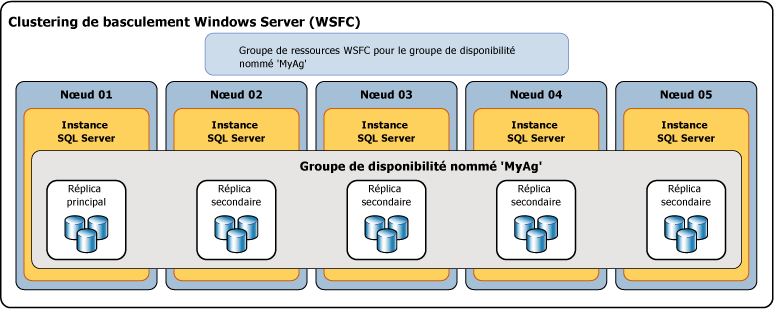

# Vue d’ensemble des groupes de disponibilité Always On (SQL Server)
[!INCLUDE[appliesto-ss-xxxx-xxxx-xxx-md](../../../includes/appliesto-ss-xxxx-xxxx-xxx-md.md)]

 > Pour obtenir des informations sur les versions précédentes de SQL Server, consultez [Vue d’ensemble des groupes de disponibilité Always On (SQL Server)](https://msdn.microsoft.com/en-US/library/ff877884(SQL.120).aspx).

 Cette rubrique présente les concepts [!INCLUDE[ssHADR](../../../includes/sshadr-md.md)] essentiels pour configurer et gérer un ou plusieurs groupes de disponibilité dans [!INCLUDE[ssCurrent](../../../includes/sscurrent-md.md)]. Pour obtenir un résumé des avantages offerts par les groupes de disponibilité et une vue d’ensemble de la terminologie [!INCLUDE[ssHADR](../../../includes/sshadr-md.md)], consultez [Groupes de disponibilité Always On &#40;SQL Server&#41;](../../../database-engine/availability-groups/windows/always-on-availability-groups-sql-server.md).  
  
 Un *groupe de disponibilité* prend en charge un environnement répliqué pour un ensemble discret de bases de données utilisateur, appelées *bases de données de disponibilité*. Vous pouvez créer un groupe de disponibilité pour avoir un haut niveau de disponibilité ou pour une échelle lecture. Un groupe de disponibilité avec un haut niveau de disponibilité est un groupe de bases de données qui basculent en même temps. Un groupe de disponibilité avec échelle lecture est un groupe de bases de données copiées dans d’autres instances de SQL Server pour une charge de travail en lecture seule. Un groupe de disponibilité prend en charge un ensemble de bases de données principales et de un à huit ensembles de bases de données secondaires correspondantes. Les bases de données secondaires ne sont *pas* des sauvegardes. Continuez à sauvegarder vos bases de données et leurs journaux des transactions de manière régulière.  
  
> [!TIP]  
>  Vous pouvez créer n'importe quel type de sauvegarde d'une base de données primaire. Vous pouvez également créer des sauvegardes de journaux et des sauvegardes complètes de copie uniquement des bases de données secondaires. Pour plus d’informations, consultez [Secondaires actifs : sauvegarde sur les réplicas secondaires &#40;groupes de disponibilité Always On&#41;](../../../database-engine/availability-groups/windows/active-secondaries-backup-on-secondary-replicas-always-on-availability-groups.md).   

 Chaque ensemble de bases de données de disponibilité est hébergé par un *réplica de disponibilité*. Deux types de réplicas de disponibilité existent mais il ne peut y avoir qu'un seul *réplica principal* qui héberge les bases de données primaires et un à huit *réplicas secondaires*qui hébergent un ensemble de bases de données secondaires et servent de cibles potentielles d'un basculement du groupe de disponibilité. Un groupe de disponibilité bascule au niveau d'un réplica de disponibilité. Un réplica de disponibilité apporte la redondance uniquement au niveau de la base de données, pour l'ensemble des bases de données d'un groupe de disponibilité. Les basculements ne sont pas dus à des problèmes de base de données, tels qu'une base de données devenant suspecte en raison de la perte d'un fichier de données ou de l'altération d'un journal des transactions.  
  
 Le réplica principal rend les bases de données primaires disponibles pour les connexions en lecture-écriture à partir des clients. Le réplica principal envoie les enregistrements du journal des transactions de chaque base de données primaire à chaque base de données secondaire. Ce processus (appelé *synchronisation des données*) se produit au niveau de la base de données. Chaque réplica secondaire met en cache les enregistrements du journal des transactions (*renforce* le journal) puis les applique à sa base de données secondaire correspondante. La synchronisation des données se produit entre la base de données primaire et chaque base de données secondaire connectée, indépendamment des autres bases de données. Par conséquent, une base de données secondaire peut être interrompue ou échouer sans affecter d'autres bases de données secondaires, et une base de données primaire peut être annulée ou échouer sans affecter d'autres bases de données primaires.  
  
 Éventuellement, vous pouvez configurer un ou plusieurs réplicas secondaires pour prendre en charge l'accès en lecture seule aux bases de données secondaires, et vous pouvez configurer tout réplica secondaire pour permettre des sauvegardes sur des bases de données secondaires.  

 SQL Server 2017 introduit deux architectures différentes pour les groupes de disponibilité. Les *groupes de disponibilité Always On* permettent un haut niveau de disponibilité, la récupération d’urgence et l’équilibrage de l’échelle lecture. Ces groupes de disponibilité nécessitent un gestionnaire de cluster. Dans Windows, le clustering de basculement fournit le gestionnaire du cluster. Dans Linux, vous pouvez utiliser Pacemaker. L’autre architecture est un *groupe de disponibilité avec échelle lecture*. Un groupe de disponibilité avec échelle lecture fournit des réplicas pour les charges de travail en lecture seule, mais pas de haut niveau de disponibilité. Dans un groupe de disponibilité avec échelle lecture, il n’existe pas de gestionnaire du cluster. 
 
 Le déploiement de [!INCLUDE[ssHADR](../../../includes/sshadr-md.md)] pour un haut niveau de disponibilité sur Windows nécessite un clustering de basculement Windows Server (WSFC). Chaque réplica de disponibilité d'un groupe de disponibilité donné doit résider sur un nœud différent du même cluster WSFC. La seule exception survient lors de la migration vers un autre cluster WSFC : un groupe de disponibilité peut temporairement chevaucher deux clusters. 

 >[!NOTE]
 >Pour plus d’informations sur les groupes de disponibilité sur Linux, consultez [Groupe de disponibilité Always On pour SQL Server sur Linux ](../../../linux/sql-server-linux-availability-group-overview.md). 

 Dans une configuration à haut niveau de disponibilité, un rôle de cluster est créé pour chaque groupe de disponibilité que vous créez. Le cluster WSFC surveille ce rôle pour évaluer l'intégrité du réplica principal. Le quorum pour [!INCLUDE[ssHADR](../../../includes/sshadr-md.md)] est basé sur tous les nœuds du cluster WSFC, indépendamment du fait qu'un nœud de cluster donné héberge des réplicas de disponibilité. Contrairement à la mise en miroir de bases de données, il n'existe aucun rôle de témoin dans [!INCLUDE[ssHADR](../../../includes/sshadr-md.md)].  
  
> [!NOTE]  
>  Pour plus d’informations sur la relation entre les composants SQL Server Always On et le cluster WSFC, consultez [Clustering de basculement Windows Server &#40;WSFC&#41; avec SQL Server](../../../sql-server/failover-clusters/windows/windows-server-failover-clustering-wsfc-with-sql-server.md).  
  
 L'illustration suivante montre un groupe de disponibilité qui contient un réplica principal et quatre réplicas secondaires. Jusqu'à huit réplicas secondaires sont pris en charge, notamment un réplica principal et deux réplicas secondaires avec validation synchrone.  
  
   
  
##   Availability Databases  
 Pour ajouter une base de données à un groupe de disponibilité, la base de données doit être une base de données en ligne en lecture-écriture qui existe sur l'instance de serveur qui héberge le réplica principal. Lorsque vous ajoutez une base de données, elle joint le groupe de disponibilité comme base de données primaire, tout en restant disponible aux clients. Il n'existe aucune base de données secondaire correspondante jusqu'à ce que les sauvegardes de la nouvelle base de données primaire soient restaurées dans l'instance de serveur qui héberge le réplica secondaire (avec RESTORE WITH NORECOVERY). La nouvelle base de données secondaire se trouve dans l'état RESTORING jusqu'à ce qu'elle soit jointe au groupe de disponibilité. Pour plus d’informations, consultez [Démarrer un mouvement de données sur une base de données secondaire Always On &#40;SQL Server&#41;](../../../database-engine/availability-groups/windows/start-data-movement-on-an-always-on-secondary-database-sql-server.md).  
  
 Une jointure place la base de données secondaire dans l'état ONLINE et démarre la synchronisation des données avec la base de données primaire correspondante. La*synchronisation des données* correspond au processus selon lequel les modifications apportées à une base de données primaire sont reproduites sur une base de données secondaire. La synchronisation des données implique l'envoi par la base de données primaire d'enregistrements de journal des transactions à la base de données secondaire.  
  
> [!IMPORTANT]  
>  Une base de données de disponibilité est parfois désignée sous le terme de *réplica de base de données* dans [!INCLUDE[tsql](../../../includes/tsql-md.md)], PowerShell et les noms SMO (SQL Server Management Objects). Par exemple, le terme « réplica de base de données » est utilisé dans les noms des vues de gestion dynamique Always On qui retournent des informations sur les bases de données de disponibilité :  **sys.dm_hadr_database_replica_states** et **sys.dm_hadr_database_replica_cluster_states**. Toutefois, dans la documentation en ligne de SQL Server, le terme « réplica » fait généralement référence aux réplicas de disponibilité. Par exemple, les termes « réplica principal » et « réplica secondaire » font toujours référence aux réplicas de disponibilité.  
  
##   Réplicas de disponibilité  
 Chaque groupe de disponibilité définit un ensemble de deux partenaires de basculement ou plus, appelés réplicas de disponibilité. Les*réplicas de disponibilité* sont des composants du groupe de disponibilité. Chaque réplica de disponibilité héberge une copie des bases de données de disponibilité dans le groupe de disponibilité. Pour un groupe de disponibilité donné, les réplicas de disponibilité doivent être hébergés par des instances distinctes de [!INCLUDE[ssNoVersion](../../../includes/ssnoversion-md.md)] qui résident sur différents nœuds d'un cluster WSFC. Chacune de ces instances de serveur doit être activée pour Always On.  
  
 Un instance donnée ne peut héberger qu'un seul réplica de disponibilité par groupe de disponibilité. Toutefois, chaque instance peut être utilisée pour de nombreux groupes de disponibilité. Une instance donnée peut être une instance autonome ou une instance de cluster de basculement [!INCLUDE[ssNoVersion](../../../includes/ssnoversion-md.md)] (FCI). Si vous avez besoin d'une redondance au niveau serveur, utilisez des instances de cluster de basculement.  
  
 Chaque réplica de disponibilité se voit attribuer un rôle initial, soit le *rôle principal* , soit le *rôle secondaire*, qui est hérité par les bases de données de disponibilité de ce réplica. Le rôle d'un réplica donné détermine s'il héberge les bases de données en lecture-écriture ou les bases de données en lecture seule. Un réplica, appelé *réplica principal*, se voit attribuer le rôle principal et héberge les bases de données en lecture-écriture, qui sont appelées *bases de données primaires*. Au moins un autre réplica, appelé *réplica secondaire*, se voit attribuer le rôle secondaire. Un réplica secondaire héberge les bases de données en lecture seule, appelées bases de données secondaires.  
  
> [!NOTE]  
>  Lorsque le rôle d'un réplica de disponibilité est indéterminé, comme lors d'un basculement, ses bases de données sont temporairement dans un état NOT SYNCHRONIZING. Leur rôle est défini sur RESOLVING jusqu'à ce que le rôle du réplica de disponibilité soit résolu. Si un réplica de disponibilité est résolu en rôle principal, ses bases de données deviennent les bases de données primaires. Si un réplica de disponibilité est résolu en rôle secondaire, ses bases de données deviennent les bases de données secondaires.  
  
##   Modes de disponibilité  
 Le mode de disponibilité est une propriété de chaque réplica de disponibilité. Le mode de disponibilité détermine si le réplica principal attend, pour valider des transactions sur une base de données, qu'un réplica secondaire donné ait écrit les enregistrements du journal des transactions sur le disque (journal renforcé). [!INCLUDE[ssHADR](../../../includes/sshadr-md.md)] prend en charge deux modes de disponibilité : le*mode avec validation asynchrone* et le *mode avec validation synchrone*.  
  
-   **Asynchronous-commit mode**  
  
     Un réplica de disponibilité qui utilise ce mode de disponibilité est appelé *réplica en validation asynchrone*. En mode de validation asynchrone, le réplica principal valide les transactions sans attendre d'accusé de réception confirmant qu'un réplica secondaire avec validation asynchrone a renforcé le journal. Le mode de validation asynchrone réduit la latence de transaction sur les bases de données secondaires, mais leur permet d'être antérieures aux bases de données primaires, ce qui rend possible la perte de données.  
  
-   **Synchronous-commit mode**  
  
     Un réplica de disponibilité qui utilise ce mode de disponibilité est appelé *réplica avec validation synchrone*. En mode de validation synchrone, avant de valider des transactions, un réplica principal avec validation synchrone attend qu'un réplica secondaire avec validation synchrone confirme qu'il a terminé le renforcement du journal. Le mode de validation synchrone garantit qu'une fois qu'une base de données secondaire particulière est synchronisée avec la base de données primaire, les transactions validées sont entièrement protégées. Cette protection se fait au prix d'une latence accrue des transactions.  
  
 Pour plus d’informations, consultez [Modes de disponibilité &#40;groupes de disponibilité Always On&#41;](../../../database-engine/availability-groups/windows/availability-modes-always-on-availability-groups.md).  
  
##   Types de basculement  
 Dans le contexte d'une session entre le réplica principal et un réplica secondaire, les rôles principal et secondaire sont potentiellement interchangeables dans un processus appelé *basculement*. Lors d'un basculement, le réplica secondaire cible joue le rôle principal, en devenant le nouveau réplica principal. Le nouveau réplica principal met ses bases de données en ligne comme bases de données primaires, et les applications clientes peuvent se connecter à ces dernières. Lorsque le réplica principal précédent est disponible, il prend le rôle secondaire, en devenant un réplica secondaire. Les bases de données primaires précédentes deviennent les bases de données secondaires et la synchronisation des données reprend.  
  
 Il existe trois types de basculement : automatique, manuel et forcé (avec perte de données possible). La ou les formes de basculement prises en charge par un réplica secondaire dépendent de son mode de disponibilité, et en mode de validation synchrone, du mode de basculement sur le réplica principal et le réplica secondaire cible, comme suit.  
  
-   Le mode de validation synchrone prend en charge deux formes de basculement : le*basculement manuel planifié* et le *basculement automatique*, si le réplica secondaire cible est actuellement synchronisé avec avt1. La prise en charge de ces formes de basculement dépend du paramètre de la *propriété de mode de basculement* sur les serveurs partenaires de basculement. Si le mode de basculement est défini sur « manuel » sur le réplica principal ou secondaire, seul le basculement manuel est pris en charge pour ce réplica secondaire. Si le mode de basculement est défini sur « automatique » dans les réplicas principal et secondaire, les basculements manuel et automatique sont pris en charge sur ce réplica secondaire.  
  
    -   **Basculement manuel planifié** (sans perte de données)  
  
         Un basculement manuel se produit après qu'un administrateur de base de données a émis une commande de basculement et provoqué la transition d'un réplica secondaire synchronisé vers le rôle principal (avec protection garantie des données) et la transition du réplica principal vers le rôle secondaire. Un basculement manuel nécessite qu'à la fois le réplica principal et le réplica secondaire cible s'exécutent en mode de validation synchrone, le réplica secondaire devant déjà être synchronisé.  
  
    -   **Basculement automatique** (sans perte de données)  
  
         Un basculement automatique se produit en réponse à un échec qui provoque la transition d'un réplica secondaire synchronisé vers le rôle principal (avec protection garantie des données). Lorsque le réplica principal précédent devient disponible, il adopte le rôle secondaire. Le basculement automatique nécessite qu'à la fois le réplica principal et le réplica secondaire cible s'exécutent en mode de validation synchrone avec le mode de basculement défini sur « Automatique ». En outre, le réplica secondaire doit déjà être synchronisé, posséder le quorum WSFC et remplir les conditions spécifiées par la [stratégie de basculement souple](../../../database-engine/availability-groups/windows/flexible-automatic-failover-policy-availability-group.md)du groupe de disponibilité.  
  
        > [!IMPORTANT]  
        >  Les instances de cluster de basculement (FCI) SQL Server ne prennent pas en charge le basculement automatique par les groupes de disponibilité. Par conséquent, tout réplica de disponibilité hébergé par une instance de cluster de basculement ne peut être configuré que pour un basculement manuel.  
  
    > [!NOTE]  
    >  Notez que si vous exécutez une commande de basculement forcé sur un réplica secondaire synchronisé, le réplica secondaire se comporte de la même manière que pour un basculement manuel planifié.  
  
-   En mode de validation asynchrone, la seule forme de basculement est le basculement manuel forcé (avec perte de données possible), généralement appelé *basculement forcé*. Le basculement forcé est considéré comme une forme de basculement manuel, car il ne peut être initié que manuellement. Le basculement forcé est une option de récupération d'urgence. Il s'agit de la seule forme de basculement possible lorsque le réplica secondaire cible n'est pas synchronisé avec le réplica principal.  
  
 Pour plus d’informations, consultez [Basculement et modes de basculement &#40;groupes de disponibilité Always On&#41;](../../../database-engine/availability-groups/windows/failover-and-failover-modes-always-on-availability-groups.md).  
  
##   Connexions clientes  
 Vous pouvez fournir la connectivité client au réplica principal d'un groupe de disponibilité donné en créant un écouteur de groupe de disponibilité. Un *écouteur de groupe de disponibilité* fournit un ensemble de ressources joint à un groupe de disponibilité donné pour diriger les connexions clientes vers le réplica de disponibilité approprié.  
  
 Un écouteur de groupe de disponibilité est associé à un nom DNS unique qui sert de nom de réseau virtuel (VNN), une ou plusieurs adresses IP virtuelles (VIP) et un numéro de port TCP. Pour plus d’informations, consultez [Écouteurs de groupe de disponibilité, connectivité client et basculement d’application &#40;SQL Server&#41;](../../../database-engine/availability-groups/windows/listeners-client-connectivity-application-failover.md).  
  
> [!TIP]  
>  Si un groupe de disponibilité a uniquement deux réplicas de disponibilité et n’est pas configuré pour autoriser l’accès en lecture au réplica secondaire, les clients peuvent se connecter au réplica principal à l’aide d’une [chaîne de connexion de mise en miroir de bases de données](../../../database-engine/database-mirroring/connect-clients-to-a-database-mirroring-session-sql-server.md). Cette approche peut être utile temporairement après avoir migré une base de données de la mise en miroir de bases de données vers [!INCLUDE[ssHADR](../../../includes/sshadr-md.md)]. Avant d'ajouter des réplicas secondaires supplémentaires, vous devrez créer un écouteur de groupe de disponibilité pour le groupe de disponibilité, puis mettre à jour vos applications afin d'utiliser le nom réseau de l'écouteur.  
  
##   Réplicas secondaires actifs  
 [!INCLUDE[ssHADR](../../../includes/sshadr-md.md)] prend en charge les réplicas secondaires actifs. Les fonctions secondaires actives prennent en charge les opérations suivantes :  
  
-   **Exécution d'opérations de sauvegarde sur des réplicas secondaires**  
  
     Les réplicas secondaires prennent en charge l’exécution de sauvegardes de journal et de sauvegardes en [copie seule](../../../database-engine/availability-groups/windows/active-secondaries-backup-on-secondary-replicas-always-on-availability-groups.md) d’une base de données complète, de fichiers ou de groupes de fichiers. Vous pouvez configurer le groupe de disponibilité pour spécifier une préférence concernant l'emplacement où les sauvegardes doivent être effectuées. Il est important de comprendre que la préférence n'est pas appliquée par SQL Server. Par conséquent, elle n'a aucune incidence sur les sauvegardes ad hoc. La traduction de cette préférence dépend de la logique, le cas échéant, que vous avez écrite dans vos travaux de sauvegarde pour chacune des bases de données dans un groupe de disponibilité donné. Pour un réplica de disponibilité particulier, vous pouvez spécifier la priorité d'exécution des sauvegardes sur ce réplica par rapport aux autres réplicas dans le même groupe de disponibilité. Pour plus d’informations, consultez [Secondaires actifs : sauvegarde sur les réplicas secondaires &#40;groupes de disponibilité Always On&#41;](../../../database-engine/availability-groups/windows/active-secondaries-backup-on-secondary-replicas-always-on-availability-groups.md).  
  
-   **Accès en lecture seule à un ou plusieurs réplicas secondaires (réplicas secondaires lisibles)**  
  
     Tout réplica de disponibilité peut être configuré pour autoriser l'accès en lecture seule à ses bases de données locales lorsqu'il a le rôle secondaire, bien que certaines opérations ne soient pas totalement prises en charge. De plus, si vous souhaitez empêcher que les charges de travail en lecture seule s'exécutent sur le réplica principal, vous pouvez configurer les réplicas pour autoriser uniquement l'accès en lecture en cas d'exécution sous le rôle principal. Pour plus d’informations, consultez [Secondaires actifs : réplicas secondaires lisibles &#40;groupes de disponibilité Always On&#41;](../../../database-engine/availability-groups/windows/active-secondaries-readable-secondary-replicas-always-on-availability-groups.md).  
  
     Si un groupe de disponibilité a un écouteur de groupe de disponibilité et un ou plusieurs réplicas secondaires lisibles, [!INCLUDE[ssNoVersion](../../../includes/ssnoversion-md.md)] peut acheminer les demandes de connexion d’intention de lecture vers l’un d’entre eux (*routage en lecture seule*). Pour plus d’informations, consultez [Écouteurs de groupe de disponibilité, connectivité client et basculement d’application &#40;SQL Server&#41;](../../../database-engine/availability-groups/windows/listeners-client-connectivity-application-failover.md).  
  
##   Période d'expiration de session  
 La période d'expiration de session est une propriété du réplica de disponibilité qui détermine le temps pendant lequel une connexion avec un autre réplica de disponibilité peut rester inactive avant qu'elle soit fermée. Les réplicas primaire et secondaire exécutent réciproquement une commande ping pour signaler qu'ils sont toujours actifs. La réception d'une commande ping de l'autre réplica au cours de la période de délai d'attente indique que la connexion est toujours ouverte et que les instances de serveur communiquent. À la réception d'un ping, un réplica de disponibilité réinitialise son compteur de période d'expiration de session sur cette connexion.  
  
 La période d'expiration de session évite que l'un ou l'autre réplica attendent indéfiniment de recevoir un ping de l'autre réplica. Si aucun ping n'est reçu de l'autre réplica au cours de la période d'expiration de session, le réplica expire. Sa connexion est fermée, et le réplica expiré passe à l'état DISCONNECTED. Même si un réplica déconnecté est configuré pour le mode de validation synchrone, les transactions n'attendront pas que ce réplica se reconnecte et se resynchronise.  
  
 La période d'expiration de session par défaut pour chaque réplica de disponibilité est de 10 secondes. Cette valeur peut être configurée par l'utilisateur et ne peut être inférieure à 5 secondes. Généralement, le temps d'attente recommandé est de 10 secondes minimum. En définissant une valeur inférieure à 10 secondes, vous permettez qu'un système surchargé déclare à tort un échec.  
  
> [!NOTE]  
>  Pour le rôle de résolution, la période d'expiration de session ne s'applique pas parce que la requête ping ne se produit pas.  
  
##   Réparation de page automatique  
 Chaque réplica de disponibilité essaie d'effectuer une récupération automatiquement à partir de pages endommagées sur une base de données locale en résolvant certains types d'erreurs qui empêchent la lecture d'une page de données. Si un réplica secondaire ne peut pas lire une page, le réplica demande une nouvelle copie de la page du réplica principal. Si le réplica principal ne peut pas lire une page, le réplica diffuse une demande de nouvelle copie à tous les réplicas secondaires et obtient la page du premier qui y répond. Si cette demande aboutit, la page illisible est remplacée par la copie, ce qui permet généralement de résoudre l'erreur.  
  
 Pour plus d'informations, consultez [Automatic Page Repair &#40;Availability Groups: Database Mirroring&#41;](../../../sql-server/failover-clusters/automatic-page-repair-availability-groups-database-mirroring.md).  
  
##   Tâches associées  
  
-   [Commencer à utiliser les groupes de disponibilité Always On &#40;SQL Server&#41;](../../../database-engine/availability-groups/windows/getting-started-with-always-on-availability-groups-sql-server.md)  
  
##   Contenu associé  
  
-   **Blogs :**  
  
     [Always On - HADRON Learning Series: Worker Pool Usage for HADRON Enabled Databases](http://blogs.msdn.com/b/psssql/archive/2012/05/17/Always%20On-hadron-learning-series-worker-pool-usage-for-hadron-enabled-databases.aspx)  
  
     [Blogs de l’équipe de SQL Server Always On : Blog officiel de l’équipe de SQL Server Always On](https://blogs.msdn.microsoft.com/sqlalwayson/)  
  
     [Blogs des ingénieurs du Service clientèle et du Support technique de SQL Server](http://blogs.msdn.com/b/psssql/)  
  
-   **Vidéos :**  
  
     [Microsoft SQL Server Code-Named "Denali" Always On Series,Part 1: Introducing the Next Generation High Availability Solution (Présentation de la solution haute disponibilité de nouvelle génération)](http://channel9.msdn.com/Events/TechEd/NorthAmerica/2011/DBI302)  
  
     [Microsoft SQL Server Code-Named "Denali" Always On Series,Part 2: Building a Mission-Critical High Availability Solution Using Always On (Génération d’une solution haute disponibilité critique à l’aide d’Always On)](http://channel9.msdn.com/Events/TechEd/NorthAmerica/2011/DBI404)  
  
-   **Livres blancs :**  
  
     [Microsoft SQL Server Always On Solutions Guide for High Availability and Disaster Recovery (Guide de solutions Microsoft SQL Server Always On pour la haute disponibilité et la récupération d’urgence)](http://go.microsoft.com/fwlink/?LinkId=227600)  
  
     [Livres blancs de Microsoft pour SQL Server 2012](http://msdn.microsoft.com/library/hh403491.aspx)  
  
     [Livres blancs de l'équipe de consultants clients de SQL Server](http://sqlcat.com/)  
  
##  Voir aussi  
 [Modes de disponibilité &#40;groupes de disponibilité Always On&#41;](../../../database-engine/availability-groups/windows/availability-modes-always-on-availability-groups.md)   
 [Basculement et modes de basculement &#40;groupes de disponibilité Always On&#41;](../../../database-engine/availability-groups/windows/failover-and-failover-modes-always-on-availability-groups.md)   
 [Vue d’ensemble des instructions Transact-SQL pour les groupes de disponibilité Always On &#40;SQL Server&#41;](../../../database-engine/availability-groups/windows/transact-sql-statements-for-always-on-availability-groups.md)   
 [Vue d’ensemble des applets de commande PowerShell pour les groupes de disponibilité Always On &#40;SQL Server&#41;](../../../database-engine/availability-groups/windows/overview-of-powershell-cmdlets-for-always-on-availability-groups-sql-server.md)   
 [Prise en charge de la haute disponibilité pour les bases de données OLTP en mémoire](../../../relational-databases/in-memory-oltp/high-availability-support-for-in-memory-oltp-databases.md)   
 [Conditions préalables requises, restrictions et recommandations pour les groupes de disponibilité Always On &#40;SQL Server&#41;](../../../database-engine/availability-groups/windows/prereqs-restrictions-recommendations-always-on-availability.md)   
 [Création et configuration des groupes de disponibilité &#40;SQL Server&#41;](../../../database-engine/availability-groups/windows/creation-and-configuration-of-availability-groups-sql-server.md)   
 [Secondaires actifs : réplicas secondaires lisibles &#40;groupes de disponibilité Always On&#41;](../../../database-engine/availability-groups/windows/active-secondaries-readable-secondary-replicas-always-on-availability-groups.md)   
 [Secondaires actifs : sauvegarde sur les réplicas secondaires &#40;groupes de disponibilité Always On&#41;](../../../database-engine/availability-groups/windows/active-secondaries-backup-on-secondary-replicas-always-on-availability-groups.md)   
 [Écouteurs de groupe de disponibilité, connectivité client et basculement d’application &#40;SQL Server&#41;](../../../database-engine/availability-groups/windows/listeners-client-connectivity-application-failover.md)  
  
   
