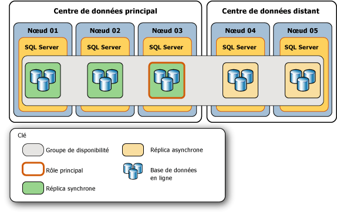
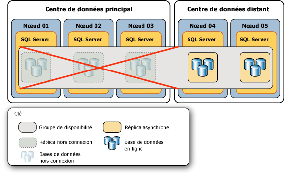
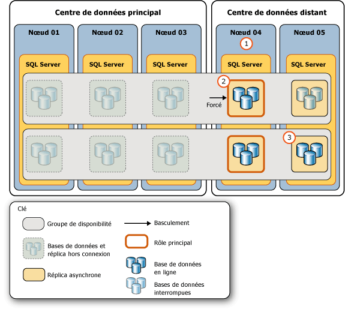
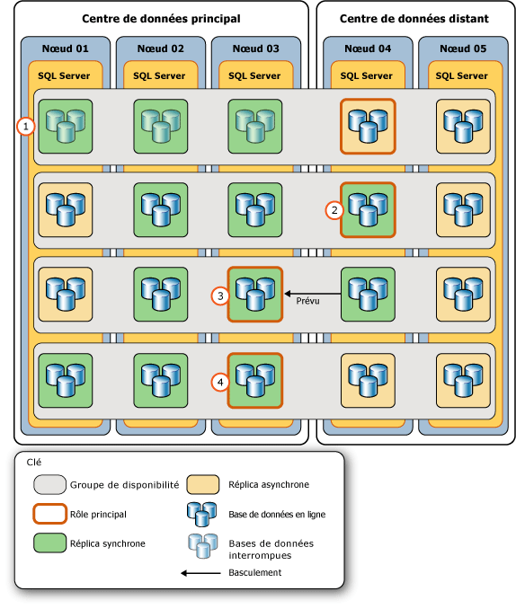

# <a name="perform-a-forced-manual-failover-of-an-availability-group-sql-server"></a>Effectuer un basculement manuel forcé d'un groupe de disponibilité (SQL Server)
[!INCLUDE[appliesto-ss-xxxx-xxxx-xxx-md](../../../includes/appliesto-ss-xxxx-xxxx-xxx-md.md)]
  Cette rubrique explique comment effectuer un basculement forcé (avec perte de données potentielle) sur un groupe de disponibilité Always On à l’aide de [!INCLUDE[ssManStudioFull](../../../includes/ssmanstudiofull-md.md)], [!INCLUDE[tsql](../../../includes/tsql-md.md)]ou de PowerShell dans [!INCLUDE[ssCurrent](../../../includes/sscurrent-md.md)]. Un basculement forcé est une forme du basculement manuel qui est destiné exclusivement à la récupération d'urgence, lorsqu'un [basculement manuel planifié](../../../database-engine/availability-groups/windows/perform-a-planned-manual-failover-of-an-availability-group-sql-server.md) n'est pas possible. Si vous forcez le basculement vers un réplica secondaire qui n'est pas synchronisé, une perte de données est possible. Par conséquent, nous vous recommandons fortement de forcer le basculement uniquement si vous devez restaurer immédiatement un service dans le groupe de disponibilité et si vous êtes prêt à prendre le risque de perdre des données.  
  
 Après un basculement forcé, la cible de basculement vers laquelle le groupe de disponibilité a basculé devient le nouveau réplica principal. Les bases de données secondaires dans les réplicas secondaires restants sont suspendues et vous devez les reprendre manuellement. Lorsque l'ancien réplica principal devient disponible, il adopte le rôle secondaire, et les anciennes bases de données primaires deviennent les bases de données secondaires et passent à l'état SUSPENDED. Avant de reprendre une base de données secondaire donnée, vous pouvez récupérer les données perdues de celle-ci. Toutefois, notez que la troncation du journal des transactions est retardée sur une base de données primaire donnée, lorsque l'une de ses bases de données secondaires est interrompue.  
  
> [!IMPORTANT]  
>  La synchronisation de données avec la base de données primaire n'est pas effectuée tant que la base de données secondaire n'est pas reprise. Pour plus d'informations sur la reprise d'une base de données secondaire, consultez [Suivi : Tâches essentielles après un basculement forcé](#FollowUp) plus loin dans cet article.  
  
 Effectuer un basculement forcé est nécessaire dans les cas d'urgence suivants :  
  
-   Après avoir forcé le quorum sur le cluster WSFC (*quorum forcé*), vous devez forcer le basculement de chaque groupe de disponibilité (avec perte de données possible). Le basculement forcé est requis, car l'état réel des valeurs de cluster WSFC peut avoir été perdu. Toutefois, vous pouvez éviter la perte de données, si vous êtes en mesure de forcer le basculement sur l'instance de serveur qui hébergeait un réplica qui était le réplica principal avant d'avoir forcé le quorum ou sur un réplica secondaire qui était synchronisé avant d'avoir forcé le quorum. Pour plus d'informations, consultez [Méthodes possibles pour éviter la perte de données après un quorum forcé](#WaysToAvoidDataLoss), plus loin dans cette rubrique.  
  
    > [!IMPORTANT]  
    >  Si le quorum est regagné par des moyens naturels au lieu d'être forcé, les réplicas de disponibilité seront récupérés normalement. Si le réplica principal reste indisponible une fois le quorum regagné, vous pouvez effectuer un basculement manuel planifié vers un réplica secondaire synchronisé.  
  
     Pour plus d’informations sur le quorum forcé, consultez [Récupération d’urgence WSFC par le quorum forcé &#40;SQL Server&#41;](../../../sql-server/failover-clusters/windows/wsfc-disaster-recovery-through-forced-quorum-sql-server.md). Pour découvrir pourquoi le basculement forcé est nécessaire après avoir forcé le quorum, consultez [Basculement et modes de basculement &#40;groupes de disponibilité Always On&#41;](../../../database-engine/availability-groups/windows/failover-and-failover-modes-always-on-availability-groups.md).  
  
-   Si le réplica principal devient indisponible lorsque le cluster WSFC possède un quorum sain, vous pouvez forcer le basculement (avec perte de données possible), vers tout réplica dont le rôle est dans l'état SECONDARY ou RESOLVING. Si possible, forcez le basculement vers un réplica secondaire avec validation synchrone qui était synchronisé lorsque le réplica principal a été perdu.  
  
    > [!TIP]  
    >  Lorsque le cluster WSFC possède un quorum sain, si vous exécutez une commande de basculement forcé sur un réplica secondaire synchronisé, le réplica effectue un basculement manuel planifié.  
  
> [!NOTE]  
>  Pour plus d’informations sur les conditions préalables requises et les recommandations pour forcer le basculement et un exemple de scénario qui utilise un basculement forcé pour récupérer après d’une défaillance catastrophique, consultez [Example Scenario: Using a Forced Failover to Recover from a Catastrophic Failure](../../../database-engine/availability-groups/windows/perform-a-forced-manual-failover-of-an-availability-group-sql-server.md#ExampleRecoveryFromCatastrophy)plus loin dans cette rubrique.  
  
-   **Avant de commencer :**  
  
     [Limitations et restrictions](#Restrictions)  
  
     [Conditions préalables](#Prerequisites)  
  
     [Recommandations](#Recommendations)  
  
     [Méthodes possibles pour éviter la perte de données après un quorum forcé](#WaysToAvoidDataLoss)  
  
     [Sécurité](#Security)  
  
-   **Pour forcer le basculement (avec possible perte de données), à l'aide de :**  
  
     [SQL Server Management Studio](#SSMSProcedure)  
  
     [Transact-SQL](#TsqlProcedure)  
  
     [PowerShell](#PowerShellProcedure)  
  
-   **Suivi :** [Tâches essentielles après un basculement forcé](#FollowUp)  
  
-   **Exemple de scénario :** [utilisation d’un basculement forcé pour effectuer une récupération suite à une défaillance catastrophique](#ExampleRecoveryFromCatastrophy)  
  
-   [Tâches associées](#RelatedTasks)  
  
-   [Contenu connexe](#RelatedContent)  
  
##  <a name="BeforeYouBegin"></a> Avant de commencer  
  
###  <a name="Restrictions"></a> Limitations et restrictions  
  
-   Le seul cas où vous ne pouvez pas effectuer un basculement forcé est lorsque le cluster de clustering de basculement Windows Server (WSFC) ne dispose pas de quorum.  
  
-   Une perte de données est possible pendant le basculement forcé d'un groupe de disponibilité. En outre, si le réplica principal s'exécute lorsque vous démarrez un basculement forcé, les clients risquent de toujours être connectés aux bases de données primaires précédentes. Par conséquent, nous vous recommandons vivement de forcer le basculement uniquement si le réplica principal n'est plus exécuté et si vous êtes prêt à prendre le risque de perdre des données afin de restaurer l'accès aux bases de données dans le groupe de disponibilité.  
  
-   Lorsqu'une base de données secondaire se trouve dans l'état REVERTING ou INITIALIZING, forcer le basculement entraîne l'impossibilité pour la base de données de démarrer en tant que base de données primaire. Si la base de données se trouvait dans un état INTIAILIZING, vous devez appliquer les enregistrements de journal manquants d'une sauvegarde de base de données ou restaurer entièrement la base de données. Si la base de données se trouvait dans un état REVERTING, vous devez restaurer entièrement la base de données à partir de sauvegardes.  
  
-   Une commande de basculement est retournée dès que la cible de basculement a accepté la commande. Toutefois, la récupération de la base de données est asynchrone après que le basculement du groupe de disponibilité est terminé.  
  
-   La cohérence entre les bases de données sur plusieurs bases de données dans le groupe de disponibilité peut ne pas être conservée lors d’un basculement.  
  
    > [!NOTE]  
    >  La prise en charge des transactions distribuées et entre les bases de données varie selon les versions de système d’exploitation et SQL Server. Pour plus d’informations, consultez [Transactions entre bases de données et transactions distribuées pour des groupes de disponibilité Always On et la mise en miroir de bases de données &#40;SQL Server&#41;](../../../database-engine/availability-groups/windows/transactions-always-on-availability-and-database-mirroring.md).  
  
###  <a name="Prerequisites"></a> Conditions préalables  
  
-   Le cluster WSFC possède un quorum. Si le cluster n’a pas de quorum, consultez [Récupération d’urgence WSFC par le quorum forcé &#40;SQL Server&#41;](../../../sql-server/failover-clusters/windows/wsfc-disaster-recovery-through-forced-quorum-sql-server.md).  
  
-   Vous devez être en mesure de vous connecter à une instance de serveur qui héberge un réplica dont le rôle se trouve dans l'état SECONDARY ou RESOLVING.  
  
###  <a name="Recommendations"></a> Recommandations  
  
-   Ne forcez pas le basculement lorsque le réplica principal est toujours en cours d'exécution.  
  
-   Si possible, forcez le basculement uniquement vers une cible de basculement dont les bases de données secondaires se trouvent dans l'état NOT SYNCHRONIZED, SYNCHRONIZED ou SYNCHRONIZING. Pour plus d'informations sur les conséquences d'un basculement forcé lorsqu'une base de données secondaire se trouve dans l'état INTIAILIZGING ou REVERTING, consultez [Limitations et restrictions](#Restrictions), plus haut dans cette rubrique.  
  
-   En général, la latence d'une base de données secondaire donnée, par rapport à la base de données primaire, doit être similaire sur les différents réplicas secondaires de validation asynchrone. Toutefois, lors d'un basculement forcé, une perte de données peut constituer un souci majeur. Par conséquent, prenez le temps de déterminer la latence relative des copies des bases de données sur les différents réplicas secondaires. Pour déterminer quelle copie d'une base de données secondaire donnée présente la latence la plus faible, comparez leurs numéros séquentiels LSN de fin de journal. Plus ce numéro LSN de fin de journal est élevé, plus la latence est faible.  
  
    > [!TIP]  
    >  Pour comparer des LSN de fin de journal, connectez-vous, à tour de rôle, à chacun des réplicas secondaires en ligne et interrogez [sys.dm_hadr_database_replica_states](../../../relational-databases/system-dynamic-management-views/sys-dm-hadr-database-replica-states-transact-sql.md) pour connaître la valeur **end_of_log_lsn** de chaque base de données secondaire locale. Puis, comparez les numéros séquentiels LSN de fin de journal des différentes copies de chaque base de données. Notez que les différentes bases de données peuvent avoir leur plus haut numéro séquentiel LSN sur différents réplicas secondaires. Dans ce cas, la cible de basculement la plus appropriée dépend de l'importance relative que vous accordez aux données dans les différentes bases de données. Autrement dit, pour quelle base de données souhaitez-vous minimiser la possible perte de données ?  
  
-   Si les clients peuvent se connecter au réplica principal d'origine, un basculement forcé entraîne un risque de comportement de fractionnement des partitions. Avant de forcer le basculement, nous vous recommandons fortement d'empêcher les clients d'accéder au réplica principal d'origine. Autrement, une fois le basculement forcé, les bases de données primaires d'origine et les bases de données primaires actuelles risquent d'être mises à jour indépendamment les unes des autres.  
  
###  <a name="WaysToAvoidDataLoss"></a> Méthodes possibles pour éviter la perte de données après un quorum forcé  
 Dans certaines conditions d'échec après la perte du quorum, vous pouvez empêcher la perte de données, comme suit :  
  
-   **Si le réplica principal d'origine est mis en ligne**  
  
     Si le quorum est perdu et l'application forcée d'un quorum WSFC restaure le nœud de cluster qui héberge le réplica principal d'un groupe de disponibilité, vous pouvez empêcher la perte de données de ce groupe de disponibilité. Connectez-vous au réplica principal et effectuez un basculement forcé (FAILOVER_ALLOW_DATA_LOSS). Cela remet le réplica principal en ligne. Étant donné que vous effectuez le basculement forcé vers le réplica principal d'origine, il n'y a aucune perte de données.  
  
-   **Si un réplica secondaire synchronisé avec validation synchrone est mis en ligne**  
  
     Si le quorum est perdu et l'application forcée d'un quorum WSFC restaure un nœud de cluster qui héberge un réplica secondaire synchronisé d'un groupe de disponibilité, vous serez à même d'empêcher la perte de données de ce groupe de disponibilité. Si le nœud restauré était activé lors de la perte du quorum, vous pouvez déterminer si la perte de données a pu se produire sur une base de données en interrogeant la colonne **is_failover_ready** de la vue de gestion dynamique [sys.dm_hadr_database_replica_cluster_states](../../../relational-databases/system-dynamic-management-views/sys-dm-hadr-database-replica-cluster-states-transact-sql.md) . Par exemple, pour une instance de serveur nommée `sql108w2k8r22`, exécutez la requête suivante :  
  
    ```  
    SELECT * FROM sys.dm_hadr_database_replica_cluster_states  
       WHERE replica_id=(SELECT replica_id FROM sys.availability_replicas   
          WHERE replica_server_name ='sql108w2k8r22')  
    ```  
  
    > [!CAUTION]  
    >  Si le nœud restauré était désactivé lors de la perte du quorum, **is_failover_ready** peut ne pas refléter l’état réel du cluster quand le réplica principal a été mis hors connexion. Par conséquent, la valeur **is_failover_ready** est efficace uniquement si le nœud hôte était activé au moment de la défaillance. Pour plus d’informations, consultez « Raisons pour lesquelles le basculement forcé est requis après avoir forcé le quorum » dans [Basculement et modes de basculement &#40;groupes de disponibilité Always On&#41;](../../../database-engine/availability-groups/windows/failover-and-failover-modes-always-on-availability-groups.md).  
  
     Si **is_failover_ready** = 1, la base de données est marquée comme synchronisée dans le cluster et est prête pour le basculement. Si **is_failover_ready** = 1 sur chaque base de données d’un réplica secondaire donné, vous pouvez effectuer un basculement forcé (FORCE_FAILOVER_ALLOW_DATA_LOSS) sans perte de données sur ce réplica secondaire. Le réplica secondaire synchronisé est mis en ligne dans le rôle principal, c.-à-d., comme nouveau réplica principal, avec toutes les données intactes.  
  
     Si **is_failover_ready** = 0, la base de données n’est pas marquée comme synchronisée dans le cluster et *n’est pas prête* pour un basculement manuel planifié. Si vous forcez le basculement vers le réplica secondaire hôte, les données seront perdues sur cette base de données.  
  
    > [!NOTE]  
    >  Lorsque vous forcez le basculement vers un réplica secondaire, la perte de données dépend du retard de la cible de basculement par rapport au réplica principal. Malheureusement, lorsque le cluster WSFC ne dispose pas de quorum ou que le quorum a été forcé, vous ne pouvez pas déterminer la perte de données. Notez, toutefois, qu'une fois que le cluster WSFC a regagné un quorum sain, vous pouvez commencer à suivre la perte potentielle de données. Pour plus d’informations, consultez « Suivi de la perte de données potentielle » dans [Basculement et modes de basculement &#40;groupes de disponibilité Always On&#41;](../../../database-engine/availability-groups/windows/failover-and-failover-modes-always-on-availability-groups.md).  
  
###  <a name="Security"></a> Sécurité  
  
####  <a name="Permissions"></a> Permissions  
 Requiert l'autorisation ALTER AVAILABILITY GROUP sur le groupe de disponibilité, l'autorisation CONTROL AVAILABILITY GROUP, l'autorisation ALTER ANY AVAILABILITY GROUP ou l'autorisation CONTROL SERVER.  
  
##  <a name="SSMSProcedure"></a> Utilisation de SQL Server Management Studio  
 **Pour forcer le basculement (avec possible perte de données)**  
  
1.  Dans l'Explorateur d'objets, connectez-vous à une instance de serveur qui héberge un réplica dont le rôle se trouve dans l'état SECONDARY ou RESOLVING dans le groupe de disponibilité devant être basculé et développez l'arborescence du serveur.  
  
2.  Développez le nœud **Haute disponibilité AlwaysOn** et le nœud **Groupes de disponibilité** .  
  
3.  Cliquez avec le bouton droit sur le groupe de disponibilité à basculer et sélectionnez la commande **Basculement** .  
  
4.  Cette commande lance l'Assistant Basculer le groupe de disponibilité. Pour plus d'informations, consultez [Utiliser l’Assistant Basculer le groupe de disponibilité &#40;SQL Server Management Studio&#41;](../../../database-engine/availability-groups/windows/use-the-fail-over-availability-group-wizard-sql-server-management-studio.md).  
  
5.  Après avoir forcé un groupe de disponibilité à basculer, effectuez les étapes de suivi nécessaires. Pour plus d'informations, consultez [Suivi : Tâches essentielles après un basculement forcé](#FollowUp), plus loin dans cette rubrique.  
  
##  <a name="TsqlProcedure"></a> Utilisation de Transact-SQL  
 **Pour forcer le basculement (avec possible perte de données)**  
  
1.  Connectez-vous à une instance de serveur qui héberge un réplica dont le rôle se trouve dans l'état SECONDARY ou RESOLVING dans le groupe de disponibilité devant être basculé.  
  
2.  Utilisez l'instruction [ALTER AVAILABILITY GROUP](../../../t-sql/statements/alter-availability-group-transact-sql.md) , comme suit :  
  
     ALTER AVAILABILITY GROUP *nom_groupe* FORCE_FAILOVER_ALLOW_DATA_LOSS  
  
     où *nom_groupe* correspond au nom du groupe de disponibilité.  
  
     L'exemple suivant force le basculement du groupe de disponibilité `AccountsAG` vers le réplica secondaire local.  
  
    ```  
    ALTER AVAILABILITY GROUP AccountsAG FORCE_FAILOVER_ALLOW_DATA_LOSS;  
    ```  
  
3.  Après avoir forcé un groupe de disponibilité à basculer, effectuez les étapes de suivi nécessaires. Pour plus d'informations, consultez [Suivi : Tâches essentielles après un basculement forcé](#FollowUp), plus loin dans cette rubrique.  
  
##  <a name="PowerShellProcedure"></a> Utilisation de PowerShell  
 **Pour forcer le basculement (avec possible perte de données)**  
  
1.  Remplacez le répertoire (**cd**) par une instance de serveur qui héberge un réplica dont le rôle se trouve à l’état SECONDARY ou RESOLVING dans le groupe de disponibilité devant être basculé.  
  
2.  Utilisez l’applet de commande **Switch-SqlAvailabilityGroup** avec le paramètre **AllowDataLoss** sous l’une des formes suivantes :  
  
    -   **-AllowDataLoss**  
  
         Par défaut, avec le paramètre **-AllowDataLoss** , **Switch-SqlAvailabilityGroup** vous rappelle que le basculement forcé peut provoquer la perte de transactions non validées et vous demande confirmation. Pour continuer, entrez **Y**; pour annuler l’opération, entrez **N**.  
  
         L’exemple suivant exécute un basculement forcé (avec perte de données possible) du groupe de disponibilité `MyAg` vers le réplica secondaire sur l’instance de serveur nommée `SecondaryServer\InstanceName`. Vous êtes invité à confirmer cette opération.  
  
        ```  
        Switch-SqlAvailabilityGroup `  
           -Path SQLSERVER:\Sql\SecondaryServer\InstanceName\AvailabilityGroups\MyAg `  
           -AllowDataLoss  
        ```  
  
    -   **-AllowDataLoss-Force**  
  
         Pour démarrer un basculement forcé sans confirmation, spécifiez à la fois les paramètres **-AllowDataLoss** et **-Force** . Cela est utile si vous souhaitez inclure la commande dans un script et l'exécuter sans intervention de l'utilisateur.  Toutefois, utilisez l’option **-Force** avec précaution, car un basculement forcé peut provoquer une perte de données dans les bases de données appartenant au groupe de disponibilité.  
  
         L’exemple suivant exécute un basculement forcé (avec perte de données possible) du groupe de disponibilité `MyAg` vers l’instance de serveur nommée `SecondaryServer\InstanceName`. L’option **-Force** supprime la confirmation de cette opération.  
  
        ```  
        Switch-SqlAvailabilityGroup `  
           -Path SQLSERVER:\Sql\SecondaryServer\InstanceName\AvailabilityGroups\MyAg `  
           -AllowDataLoss -Force  
        ```  
  
    > [!NOTE]  
    >  Pour voir la syntaxe d’une applet de commande, utilisez l’applet de commande **Get-Help** dans l’environnement [!INCLUDE[ssNoVersion](../../../includes/ssnoversion-md.md)] PowerShell. Pour en savoir plus, voir [Get Help SQL Server PowerShell](../../../relational-databases/scripting/get-help-sql-server-powershell.md).  
  
3.  Après avoir forcé un groupe de disponibilité à basculer, effectuez les étapes de suivi nécessaires. Pour plus d'informations, consultez [Suivi : Tâches essentielles après un basculement forcé](#FollowUp), plus loin dans cette rubrique.  
  
 **Pour configurer et utiliser le fournisseur SQL Server PowerShell**  
  
-   [Fournisseur SQL Server PowerShell](../../../relational-databases/scripting/sql-server-powershell-provider.md)  
  
##  <a name="FollowUp"></a> Suivi : Tâches essentielles après un basculement forcé  
  
1.  Après un basculement forcé, le réplica secondaire vers lequel vous avez effectué le basculement devient le nouveau réplica principal. Toutefois, pour que ce réplica de disponibilité soit accessible aux clients, vous devrez peut-être reconfigurer le quorum WSFC ou ajuster la configuration du mode de disponibilité du groupe de disponibilité, comme suit :  
  
    -   **Si vous effectuez le basculement en dehors du [!INCLUDE[ssFosAuto](../../../includes/ssfosauto-md.md)] :**  Ajustez les votes de quorum des nœuds WSFC pour refléter votre nouvelle configuration de groupe de disponibilité. Si le nœud WSFC qui héberge le réplica secondaire cible n'a pas de vote de quorum WSFC, vous devrez peut-être forcer le quorum WSFC.  
  
        > [!NOTE]  
        >  Un [!INCLUDE[ssFosAuto](../../../includes/ssfosauto-md.md)] existe uniquement si deux réplicas de disponibilité (réplica principal précédent inclus) sont configurés pour le mode de validation synchrone avec basculement automatique.  
  
         **Pour ajuster les votes de quorum**  
  
        -   [Afficher les paramètres NodeWeight pour le quorum de cluster](../../../sql-server/failover-clusters/windows/view-cluster-quorum-nodeweight-settings.md)  
  
        -   [Configurer les paramètres NodeWeight pour un quorum de cluster](../../../sql-server/failover-clusters/windows/configure-cluster-quorum-nodeweight-settings.md)  
  
        -   [Forcer un cluster WSFC à démarrer sans quorum](../../../sql-server/failover-clusters/windows/force-a-wsfc-cluster-to-start-without-a-quorum.md)  
  
    -   **Si vous avez effectué le basculement en dehors du [!INCLUDE[ssFosSync](../../../includes/ssfossync-md.md)] :** Nous vous recommandons d’ajuster le mode de disponibilité et de basculement sur le nouveau réplica principal et sur les réplicas secondaires restants afin de refléter la configuration de votre choix concernant la validation synchrone et le basculement automatique.  
  
        > [!NOTE]  
        >  Un [!INCLUDE[ssFosSync](../../../includes/ssfossync-md.md)] existe uniquement si le réplica principal actuel est configuré pour le mode de validation synchrone.  
  
         **Pour modifier le mode de disponibilité et de basculement**  
  
        -   [Modifier le mode de disponibilité d’un réplica de disponibilité &#40;SQL Server&#41;](../../../database-engine/availability-groups/windows/change-the-availability-mode-of-an-availability-replica-sql-server.md)  
  
        -   [Modifier le mode de basculement d’un réplica de disponibilité &#40;SQL Server&#41;](../../../database-engine/availability-groups/windows/change-the-failover-mode-of-an-availability-replica-sql-server.md)  
  
2.  Après un basculement forcé, toutes les bases de données secondaires sont interrompues. Cela inclut les anciennes bases de données principales, une fois que l'ancien réplica principal est repassé en ligne et découvre qu'il s'agit maintenant d'un réplica secondaire. Vous devez reprendre manuellement chaque base de données interrompue individuellement sur chaque réplica secondaire.  
  
     Lors de la reprise d'une base de données secondaire, la synchronisation de données commence avec la base de données primaire correspondante. La base de données secondaire restaure tous les enregistrements de journal qui n'ont jamais été validés sur la nouvelle base de données primaire. Par conséquent, si vous êtes inquiet de la possible perte de données sur les bases de données primaires après le basculement, vous devez essayer de créer un instantané de base de données sur les bases de données interrompues sur l'une des bases de données secondaires avec validation synchrone.  
  
    > [!IMPORTANT]  
    >  La troncation du journal des transactions est différée sur une base de données principale tant que l'une de ses bases de données secondaires est interrompue. De même, l'état de synchronisation d'un réplica secondaire avec validation synchrone ne peut pas effectuer la transition vers l'état HEALTHY tant qu'une base de données locale reste interrompue.  
  
     **Pour créer un instantané de base de données**  
  
    -   [Créer un instantané de base de données &#40;Transact-SQL&#41;](../../../relational-databases/databases/create-a-database-snapshot-transact-sql.md)  
  
     **Pour reprendre une base de données de disponibilité**  
  
    -   [Reprendre une base de données de disponibilité &#40;SQL Server&#41;](../../../database-engine/availability-groups/windows/resume-an-availability-database-sql-server.md)  
  
    > [!CAUTION]  
    >  Après la reprise de toutes les bases de données secondaires, et avant de tenter un nouveau basculement du groupe, attendez que chaque base de données secondaire sur la cible de basculement suivante passe à l'état SYNCHRONIZING. Si une base de données ne présente pas encore l'état SYNCHRONIZING, cette base de données sera empêchée d'être mise en ligne en tant que base de données primaire, et le rétablissement de la synchronisation de données pour la base de données peut nécessiter la restauration des journaux de transactions, la restauration d'une sauvegarde complète de base de données ou le basculement vers le réplica principal précédent.  
  
3.  Si un réplica de disponibilité ayant échoué ne retourne pas au réplica de disponibilité ou y retourne trop tard pour vous permettre de retarder la troncation du journal des transactions sur la nouvelle base de données primaire, supprimez le réplica défaillant du groupe de disponibilité afin d'éviter le risque de manquer d'espace sur le disque pour vos fichiers journaux.  
  
     **Pour supprimer un réplica secondaire**  
  
    -   [Supprimer un réplica secondaire d’un groupe de disponibilité &#40;SQL Server&#41;](../../../database-engine/availability-groups/windows/remove-a-secondary-replica-from-an-availability-group-sql-server.md)  
  
4.  Si vous suivez un basculement forcé avec un ou plusieurs basculements supplémentaires forcés, effectuez une sauvegarde de journal après chaque basculement forcé supplémentaire de la séquence. Pour plus d’informations expliquant ce phénomène, consultez « Risques posés par le basculement forcé » dans la section « Basculement manuel forcé (avec possible perte de données) » de [Basculement et modes de basculement &#40;groupes de disponibilité Always On&#41;](../../../database-engine/availability-groups/windows/failover-and-failover-modes-always-on-availability-groups.md).  
  
     **Pour effectuer une sauvegarde de fichier journal**  
  
    -   [Sauvegarder un journal des transactions &#40;SQL Server&#41;](../../../relational-databases/backup-restore/back-up-a-transaction-log-sql-server.md)  
  
##  <a name="ExampleRecoveryFromCatastrophy"></a> Example Scenario: Using a Forced Failover to Recover from a Catastrophic Failure  
 Si le réplica principal échoue et qu'aucun réplica secondaire synchronisé n'est disponible, forcer le groupe de disponibilité à basculer peut constituer une réponse appropriée. La pertinence d'un basculement forcé varie : (1) selon que vous vous attendez ou non à ce que le réplica principal reste hors connexion pendant une durée plus longue que celle tolérée par votre contrat de qualité de service (SLA), et (2) selon que vous êtes prêt à prendre le risque de perdre éventuellement des données afin de mettre les bases de données primaires à disposition le plus rapidement possible. Si vous décidez qu'un groupe de disponibilité nécessite un basculement forcé, ce dernier ne constitue qu'une étape dans un processus plus complexe.  
  
 Pour illustrer les étapes requises pour utiliser un basculement forcé afin d'opérer une récupération suite à une défaillance catastrophique, cette rubrique présente un possible scénario de récupération d'urgence. Ce scénario d'exemple implique un groupe de disponibilité dont la topologie d'origine consiste en un centre de données principal qui héberge trois réplicas de disponibilité avec validation synchrone, y compris le réplica principal, et un centre de données distant qui héberge deux réplicas secondaires avec validation asynchrone. La figure suivante illustre la topologie d'origine de ce groupe de disponibilité d'exemple. Le groupe de disponibilité est hébergé par un cluster WSFC à plusieurs sous-réseaux avec trois nœuds dans le centre de données principal (**nœud 01**, **nœud 02**et **nœud 03**) et deux nœuds dans un centre de données distant (**nœud 04** et **nœud 05**).  
  
   
  
 Le centre de données principal s'arrête de manière inattendue. Ses trois réplicas de disponibilité passent en mode hors connexion et leurs bases de données deviennent indisponibles. La figure suivante illustre l'impact de cette défaillance sur la topologie du groupe de disponibilité.  
  
   
  
 L'administrateur de base de données détermine que la meilleure réponse possible consiste à forcer le basculement du groupe de disponibilité vers l'un des réplicas secondaires distants avec validation asynchrone. Cet exemple illustre les étapes classiques impliquées lors du basculement forcé du groupe de disponibilité vers un réplica distant et, finalement, lors du retour du groupe de disponibilité à sa topologie d'origine.  
  
 La réponse à la défaillance présentée ici se décompose en deux phases, comme suit :  
  
-   [Réponse à la défaillance catastrophique du centre de données principal](#FailureResponse)  
  
-   [Retour du groupe de disponibilité à sa topologie d'origine](#ReturnToOrigTopology)  
  
###  <a name="FailureResponse"></a> Responding to the Catastrophic Failure of the Main Data Center  
 La figure suivante illustre la série d'actions effectuées au niveau du centre de données distant en réponse à une défaillance catastrophique dans le centre de données principal.  
  
   
  
 Les étapes de cette illustration sont les suivantes :  
  
|Étape|Action|Liens|  
|----------|------------|-----------|  
|**1.**|L'administrateur de base de données ou réseau s'assure que le cluster WSFC dispose d'un quorum sain. Dans cet exemple, le quorum doit être forcé.|[Modes de quorum WSFC et configuration de vote &#40;SQL Server&#41;](../../../sql-server/failover-clusters/windows/wsfc-quorum-modes-and-voting-configuration-sql-server.md)<br /><br /> [Récupération d’urgence WSFC par le quorum forcé &#40;SQL Server&#41;](../../../sql-server/failover-clusters/windows/wsfc-disaster-recovery-through-forced-quorum-sql-server.md)|  
|**2.**|L’administrateur de base de données se connecte à l’instance du serveur présentant la latence la plus faible (sur le **nœud 04**) et effectue un basculement manuel forcé. Le basculement forcé fait passer ce réplica secondaire au rôle principal et interrompt les bases de données secondaires sur le réplica secondaire restant (sur le **nœud 05**).|[sys.dm_hadr_database_replica_states &#40;Transact-SQL&#41;](../../../relational-databases/system-dynamic-management-views/sys-dm-hadr-database-replica-states-transact-sql.md) (Interroger la colonne **end_of_log_lsn** . Pour plus d’informations, consultez [Recommandations](#Recommendations)plus haut dans cette rubrique.)|  
|**3.**|L'administrateur de base de données rétablit chacune des bases de données secondaires sur le réplica secondaire restant.|[Reprendre une base de données de disponibilité &#40;SQL Server&#41;](../../../database-engine/availability-groups/windows/resume-an-availability-database-sql-server.md)|  
  
###  <a name="ReturnToOrigTopology"></a> Retour du groupe de disponibilité à sa topologie d'origine  
 La figure suivante illustre la série d'actions qui permettent au groupe de disponibilité de retourner à sa topologie d'origine une fois que le centre de données principal revient en ligne et que les nœuds WSFC rétablissent la communication avec le cluster WSFC.  
  
> [!IMPORTANT]  
>  Si le quorum du cluster WSFC a été forcé, lorsque les nœuds hors connexion redémarrent, il est possible qu'ils forment un nouveau quorum si les deux conditions suivantes sont réunies : (a) il n'existe aucune connectivité de réseau entre les nœuds dans le quorum forcé défini, et (b) les nœuds qui redémarrent représentent la majorité des nœuds de cluster. Cela se traduirait par un fractionnement des partitions, condition dans laquelle le groupe de disponibilité posséderait deux réplicas principaux indépendants, un sur chaque centre de données. Avant de forcer un quorum pour créer un quorum minoritaire défini, consultez [Récupération d’urgence WSFC par le quorum forcé &#40;SQL Server&#41;](../../../sql-server/failover-clusters/windows/wsfc-disaster-recovery-through-forced-quorum-sql-server.md).  
  
   
  
 Les étapes de cette illustration sont les suivantes :  
  
||Étape|Liens|  
|-|----------|-----------|  
|**1.**|Les nœuds du centre de données principal reviennent en ligne et rétablissent la communication avec le cluster WSFC. Leurs réplicas de disponibilité reviennent en ligne en tant que réplicas secondaires avec des bases de données interrompues et l'administrateur de base de données doit rétablir manuellement chacune d'entre elles dans un bref délai.|[Reprendre une base de données de disponibilité &#40;SQL Server&#41;](../../../database-engine/availability-groups/windows/resume-an-availability-database-sql-server.md)<br /><br /> Conseil : si vous êtes inquiet de la possible perte de données sur les bases de données primaires suite au basculement, vous devez essayer de créer une capture instantanée de base de données sur les bases de données interrompues sur l’une des bases de données secondaires avec validation synchrone. Gardez à l'esprit que la troncation du journal des transactions est retardée sur une base de données primaire, lorsque l'une de ses bases de données secondaires est interrompue. De même, l'état de synchronisation du réplica secondaire avec validation synchrone ne peut pas effectuer la transition vers l'état HEALTHY tant qu'une base de données locale reste interrompue.|  
|**2.**|Une fois que les bases de données ont repris, l'administrateur de base de données change le nouveau réplica principal pour qu'il passe en mode de validation synchrone de manière temporaire. Cela implique deux étapes :<br /><br /> 1) Modifiez un réplica de disponibilité hors connexion en mode de validation asynchrone.<br /><br /> 2) Modifiez le nouveau réplica principal en mode de validation synchrone. Remarque : cette étape permet aux bases de données secondaires avec validation synchrone ayant repris de passer à l’état SYNCHRONIZED.|[Modifier le mode de disponibilité d’un réplica de disponibilité &#40;SQL Server&#41;](../../../database-engine/availability-groups/windows/change-the-availability-mode-of-an-availability-replica-sql-server.md)|  
|**3.**|Une fois que le réplica secondaire avec validation synchrone sur le **nœud 03** (le réplica principal d’origine) passe à l’état de synchronisation HEALTHY, l’administrateur de base de données effectue un basculement planifié manuel vers ce réplica, pour qu’il redevienne le réplica principal. Le réplica sur le **nœud 04** redevient un réplica secondaire.|[sys.dm_hadr_database_replica_states &#40;Transact-SQL&#41;](../../../relational-databases/system-dynamic-management-views/sys-dm-hadr-database-replica-states-transact-sql.md)<br /><br /> [Utiliser les stratégies Always On pour afficher l’intégrité d’un groupe de disponibilité &#40;SQL Server&#41;](../../../database-engine/availability-groups/windows/use-always-on-policies-to-view-the-health-of-an-availability-group-sql-server.md)<br /><br /> [Effectuer un basculement manuel planifié d’un groupe de disponibilité &#40;SQL Server&#41;](../../../database-engine/availability-groups/windows/perform-a-planned-manual-failover-of-an-availability-group-sql-server.md)|  
|**4.**|L'administrateur de base de données se connecte au nouveau réplica principal et :<br /><br /> 1) Modifie l’ancien réplica principal (dans le centre distant) pour qu’il repasse en mode de validation asynchrone.<br /><br /> 2) Modifie le réplica secondaire avec validation asynchrone dans le centre de données principal pour qu’il repasse en mode de validation synchrone|[Modifier le mode de disponibilité d’un réplica de disponibilité &#40;SQL Server&#41;](../../../database-engine/availability-groups/windows/change-the-availability-mode-of-an-availability-replica-sql-server.md)|  
  
##  <a name="RelatedTasks"></a> Tâches associées  
 **Pour ajuster les votes de quorum**  
  
-   [Afficher les paramètres NodeWeight pour le quorum de cluster](../../../sql-server/failover-clusters/windows/view-cluster-quorum-nodeweight-settings.md)  
  
-   [Configurer les paramètres NodeWeight pour un quorum de cluster](../../../sql-server/failover-clusters/windows/configure-cluster-quorum-nodeweight-settings.md)  
  
-   [Forcer un cluster WSFC à démarrer sans quorum](../../../sql-server/failover-clusters/windows/force-a-wsfc-cluster-to-start-without-a-quorum.md)  
  
 **Basculement manuel planifié :**  
  
-   [Effectuer un basculement manuel planifié d’un groupe de disponibilité &#40;SQL Server&#41;](../../../database-engine/availability-groups/windows/perform-a-planned-manual-failover-of-an-availability-group-sql-server.md)  
  
-   [Utiliser l’Assistant Basculer le groupe de disponibilité &#40;SQL Server Management Studio&#41;](../../../database-engine/availability-groups/windows/use-the-fail-over-availability-group-wizard-sql-server-management-studio.md)  
  
 **Pour dépanner :**  
  
-   [Résoudre des problèmes de configuration des groupes de disponibilité Always On &#40;SQL Server&#41;](../../../database-engine/availability-groups/windows/troubleshoot-always-on-availability-groups-configuration-sql-server.md)  
  
-   [Résoudre une opération d’ajout de fichier ayant échoué &#40;groupes de disponibilité Always On&#41;](../../../database-engine/availability-groups/windows/troubleshoot-a-failed-add-file-operation-always-on-availability-groups.md)  
  
##  <a name="RelatedContent"></a> Contenu associé  
  
-   **Blogs :**  
  
     [Blogs de l’équipe de SQL Server Always On : Blog officiel de l’équipe de SQL Server Always On](https://blogs.msdn.microsoft.com/sqlalwayson/)  
  
     [Blogs des ingénieurs du Service clientèle et du Support technique de SQL Server](http://blogs.msdn.com/b/psssql/)  
  
-   **Livres blancs :**  
  
     [Microsoft SQL Server Always On Solutions Guide for High Availability and Disaster Recovery (Guide de solutions Microsoft SQL Server Always On pour la haute disponibilité et la récupération d’urgence)](http://go.microsoft.com/fwlink/?LinkId=227600)  
  
     [Livres blancs de Microsoft pour SQL Server 2012](http://msdn.microsoft.com/library/hh403491.aspx)  
  
     [Livres blancs de l'équipe de consultants clients de SQL Server](http://sqlcat.com/)  
  
## <a name="see-also"></a> Voir aussi  
 [Vue d’ensemble des groupes de disponibilité Always On &#40;SQL Server&#41;](../../../database-engine/availability-groups/windows/overview-of-always-on-availability-groups-sql-server.md)   
 [Modes de disponibilité &#40;groupes de disponibilité Always On&#41;](../../../database-engine/availability-groups/windows/availability-modes-always-on-availability-groups.md)   
 [Basculement et modes de basculement &#40;groupes de disponibilité AlwaysOn&#41;](../../../database-engine/availability-groups/windows/failover-and-failover-modes-always-on-availability-groups.md)   
 [À propos de l’accès de la connexion client aux réplicas de disponibilité &#40;SQL Server&#41;](../../../database-engine/availability-groups/windows/about-client-connection-access-to-availability-replicas-sql-server.md)   
 [Surveillance des groupes de disponibilité &#40;SQL Server&#41;](../../../database-engine/availability-groups/windows/monitoring-of-availability-groups-sql-server.md)   
 [Clustering de basculement Windows Server &#40;WSFC&#41; avec SQL Server](../../../sql-server/failover-clusters/windows/windows-server-failover-clustering-wsfc-with-sql-server.md)  
  
  
