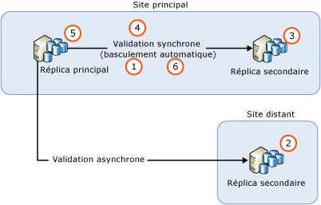
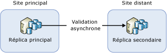
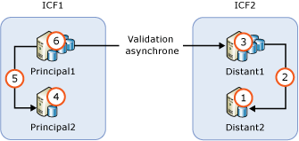

# <a name="upgrading-always-on-availability-group-replica-instances"></a>Mise à niveau d’instances de réplica d’un groupe de disponibilité Always On
[!INCLUDE[appliesto-ss-xxxx-xxxx-xxx-md](../../../includes/appliesto-ss-xxxx-xxxx-xxx-md.md)]

Pendant la mise à niveau d’une instance [!INCLUDE[ssNoVersion](../../../includes/ssnoversion-md.md)] hébergeant un groupe de disponibilité Always On vers une nouvelle version [!INCLUDE[ssCurrent](../../../includes/sscurrent-md.md)], un nouveau Service Pack [!INCLUDE[ssNoVersion](../../../includes/ssnoversion-md.md)] ou une mise à jour cumulative, ou pendant l’installation d’un nouveau Service Pack ou d’une nouvelle mise à jour cumulative Windows, vous pouvez réduire le temps d’arrêt du réplica principal à un seul basculement manuel en effectuant une mise à niveau propagée (ou deux basculements manuels en cas de restauration automatique vers l’instance principale d’origine). Pendant le processus de mise à niveau, un réplica secondaire n’est pas disponible pour le basculement ou pour des opérations en lecture seule et, après la mise à niveau, le réplica secondaire peut prendre un certain temps pour rattraper son retard par rapport au nœud de réplica principal en fonction du volume d’activité sur ce dernier (attendez-vous à un trafic réseau important). Sachez également qu’après le basculement initial vers un réplica secondaire exécutant une version plus récente de SQL Server, les bases de données de ce groupe de disponibilité s’exécuteront via un processus de mise à niveau vers la version la plus récente. Pendant ce temps, aucun réplica lisible ne sera présent pour aucune de ces bases de données. Le temps d’arrêt après le basculement initial dépend du nombre de bases de données dans le groupe de disponibilité. Si vous prévoyez une restauration automatique sur le réplica principal d’origine, cette étape ne sera pas répétée.
  
>[!NOTE]  
>Cet article ne concerne que la mise à niveau de SQL Server lui-même. Il ne couvre pas la mise à niveau du système d’exploitation contenant le cluster de basculement Windows Server (WSFC). La mise à niveau du système d’exploitation Windows qui héberge le cluster de basculement n’est pas prise en charge psr les systèmes d’exploitation antérieurs à Windows Server 2012 R2. Pour mettre à niveau un nœud de cluster s’exécutant sur Windows Server 2012 R2, consultez la rubrique [Cluster Operating System Rolling Upgrade](http://docs.microsoft.com/windows-server/failover-clustering/cluster-operating-system-rolling-upgrade) (Mise à niveau propagée du système d’exploitation de cluster).  
  
## <a name="prerequisites"></a>Conditions préalables requises  
Avant de commencer, passez en revue les informations importantes suivantes :  
  
- [Mises à niveau des éditions et versions prises en charge](../../../database-engine/install-windows/supported-version-and-edition-upgrades.md) : Vérifiez que votre version de SQL Server et votre version de système d’exploitation Windows sont compatibles avec la mise à niveau vers SQL Server 2016. Par exemple, vous ne pouvez pas mettre à niveau directement une instance SQL Server 2005 vers [!INCLUDE[ssCurrent](../../../includes/sscurrent-md.md)].  
  
- [Choisir une méthode de mise à niveau du moteur de base de données](../../../database-engine/install-windows/choose-a-database-engine-upgrade-method.md) : Pour effectuer la mise à niveau dans l’ordre, sélectionnez la méthode et les étapes de mise à niveau appropriées d’après l’article sur les mises à niveau des éditions et versions prises en charge, et en fonction des autres composants installés dans votre environnement.  
  
- [Planifier et tester le plan de mise à niveau du moteur de base de données](../../../database-engine/install-windows/plan-and-test-the-database-engine-upgrade-plan.md) : Consultez les notes de publication et les problèmes de mise à niveau connus, ainsi que la liste de contrôle préalable à la mise à niveau, puis développez et testez votre plan de mise à niveau.  
  
- [Configurations matérielle et logicielle requises pour l’installation de SQL Server](../../../sql-server/install/hardware-and-software-requirements-for-installing-sql-server.md) : Consultez la configuration logicielle requise pour installer [!INCLUDE[ssCurrent](../../../includes/sscurrent-md.md)]. Si des logiciels supplémentaires sont nécessaires, installez-les sur chaque nœud avant de commencer le processus de mise à niveau pour réduire les éventuels temps d’arrêt.  

- [Vérifier si la capture de données modifiées ou la réplication est utilisée pour une base de données de groupe de disponibilité](#special-steps-for-change-data-capture-or-replication) : Si une base de données dans le groupe de disponibilité est activée pour la capture de données modifiées (CDC), suivez ces [instructions](#special-steps-for-change-data-capture-or-replication).

>[!NOTE]  
>Le mélange de versions d’instances SQL Server dans le même groupe de disponibilité n’est pas pris en charge en dehors d’une mise à niveau propagée qui met à niveau les réplicas en place. Une version supérieure d’une instance SQL Server ne peut pas être ajoutée comme nouveau réplica à un groupe de disponibilité existant. Par exemple, un réplica SQL Server 2017 ne peut pas être ajouté à un groupe de disponibilité SQL Server 2016 existant. Pour migrer vers une nouvelle version d’une instance SQL Server à l’aide de groupes de disponibilité, la seule méthode prise en charge est d’utiliser un groupe de disponibilité distribué qui figure dans SQL Server 2016 Enterprise Edition ou version ultérieure.

## <a name="rolling-upgrade-basics-for-always-on-ags"></a>Concepts de base de la mise à niveau propagée pour les groupes de disponibilité Always On  
Consultez les instructions suivantes pour effectuer la mise à niveau/mise à jour du serveur afin de réduire le temps d’arrêt et la perte de données de vos groupes de disponibilité :  
  
- Avant de procéder à la mise à niveau propagée :  
  
    - Procédez à un essai de basculement manuel sur au moins l’une de vos instances de réplica avec validation synchrone.  
  
    - Protégez vos données en effectuant une sauvegarde complète de chaque base de données de disponibilité.  
  
    - Exécutez la commande DBCC CHECKDB sur chaque base de données de disponibilité.  
  
-   Procédez toujours d’abord à la mise à niveau des instances du réplica secondaire distant, puis des instances du réplica secondaire local et enfin de l’instance du réplica principal.  
  
-   Les sauvegardes ne peuvent pas être exécutées dans une base de données qui est en cours de mise à niveau.  Avant de mettre les réplicas secondaires à niveau, configurez la préférence de sauvegarde automatisée pour exécuter les sauvegardes uniquement sur le réplica principal.  Pendant une mise à niveau de version, aucun réplica n’est lisible ou disponible pour les sauvegardes. Pendant une mise à niveau sans version, vous pouvez configurer des sauvegardes automatisées s’exécutant sur des réplicas secondaires avant la mise à niveau du réplica principal.  
  
-   Pendant une mise à niveau de version, les instances de réplica secondaire accessibles en écriture ne peuvent pas être lues après une mise à niveau d’un réplica secondaire et avant que le réplica principal ne soit basculé vers un réplica secondaire mis à niveau ou que le réplica principal ne soit mis à niveau.  
  
-   Pour éviter les basculements involontaires des groupes de disponibilité pendant le processus de mise à niveau, supprimez le basculement des groupes de disponibilité dans tous les réplicas avec validation synchrone avant de commencer.  
  
-   Ne mettez à pas à niveau l’instance du réplica principal avant de basculer le groupe de disponibilité sur une instance mise à niveau qui a un réplica secondaire. Sinon, les applications clientes risquent de connaître des temps morts prolongés lors de la mise à niveau sur l’instance de réplica principal.  
  
-   Basculez toujours le groupe de disponibilité sur une instance de réplica secondaire avec validation synchrone. Si vous basculez le groupe de disponibilité sur une instance de réplica secondaire avec validation asynchrone, les bases de données sont exposées à une perte de données, et le déplacement des données est automatiquement suspendu jusqu’à ce que vous le repreniez manuellement.  
  
-   Ne procédez pas à la mise à niveau de l’instance de réplica principal avant la mise à niveau ou à jour des instances nœuds de réplica secondaire. Un réplica principal mis à niveau n'envoie plus les journaux à un réplica secondaire dont l’instance [!INCLUDE[ssCurrent](../../../includes/sscurrent-md.md)] n'a pas encore été mise à niveau à la même version. Lorsque le déplacement des données vers un réplica secondaire est suspendu, aucun basculement automatique ne se produit pour ce réplica, et vos bases de données de disponibilité sont vulnérables à une perte de données.  
  
-   Avant de basculer un groupe de disponibilité, vérifiez que l’état de synchronisation de la cible de basculement est SYNCHRONISÉ.  
  
## <a name="rolling-upgrade-process"></a>Processus de mise à niveau propagée  
 Dans la pratique, le processus exact dépend de facteurs comme la topologie de déploiement de vos groupes de disponibilité et du mode de validation de chaque réplica. Cependant, dans le scénario le plus simple, une mise à niveau propagée est un processus en plusieurs étapes impliquant les étapes suivantes :  
  
   
  
1.  Supprimer le basculement automatique sur tous les réplicas avec validation synchrone  
  
2.  Mettre à niveau toutes les instances de réplica secondaire distant exécutant les réplicas secondaires avec validation asynchrone  
  
3.  Mettre à niveau instances de réplica secondaire local qui n'exécutent pas le réplica principal  
  
4.  Basculer manuellement le groupe de disponibilité sur un réplica secondaire local avec validation synchrone  
  
5.  Mettre à niveau ou mettre à jour l'instance de réplica local qui hébergeait précédemment le réplica principal  
  
6.  Configurer le basculement automatique des partenaires de basculement selon les besoins  
  
 Si nécessaire, effectuez un basculement manuel supplémentaire pour rétablir la configuration d’origine du groupe de disponibilité.  
  
## <a name="ag-with-one-remote-secondary-replica"></a>Groupe de disponibilité avec un réplica secondaire distant  
 Si vous avez déployé un groupe de disponibilité uniquement pour la récupération d’urgence, vous devez peut-être le basculer sur un réplica secondaire avec validation asynchrone. Cette configuration est illustrée dans la figure ci-dessous :  
  
   
  
 Dans ce cas, vous devez basculer le groupe de disponibilité sur le réplica secondaire avec validation asynchrone pendant la mise à niveau propagée. Pour éviter la perte de données, changez le mode de validation en validation synchrone et attendez que le réplica secondaire soit synchronisé avant de basculer le groupe de disponibilité. Par conséquent, le processus de mise à niveau à jour peut ressembler à ce qui suit :  
  
1.  Mise à niveau l’instance de réplica secondaire sur le site distant  
  
2.  Changer le mode de validation en validation synchrone  
  
3.  Patienter jusqu'à ce que l'état de synchronisation soit SYNCHRONIZED  
  
4.  Basculer le groupe de disponibilité sur le réplica secondaire du site distant  
  
5.  Mettre à niveau ou mettre à jour l’instance de réplica local (site principal)  
  
6.  Rebasculer le groupe de disponibilité sur le site principal  
  
7.  Changer le mode de validation en validation asynchrone  
  
 Le mode de validation synchrone n'étant pas recommandé pour la synchronisation des données sur un site distant, les applications clientes peuvent remarquer une augmentation immédiate de la latence de la base de données après modification du paramètre. Par ailleurs, avec le basculement, tous les messages du journal sans accusé de réception sont ignorés. Le nombre de messages de journal ignorés peut être important en raison de la latence réseau élevée entre les deux sites, à l’origine d’un grand nombre d’échecs de transactions des clients. Pour réduire l’impact sur les applications clientes, effectuez les actions suivantes :  
  
-   Sélectionnez avec précaution une fenêtre de maintenance lorsque le trafic est faible sur le client  
  
-   Lors de la mise à niveau ou mise à jour sur le site principal [!INCLUDE[ssCurrent](../../../includes/sscurrent-md.md)] , revenez au mode de disponibilité validation asynchrone, puis rétablissez la validation synchrone lorsque vous êtes prêt à effectuer le basculement sur le site principal  
  
## <a name="ag-with-failover-cluster-instance-nodes"></a>Groupe de disponibilité avec des nœuds d’instance de cluster de basculement  
 Si un groupe de disponibilité contient des nœuds d’instance de cluster de basculement, mettez à niveau les nœuds inactifs avant de mettre à niveau les nœuds actifs. La figure suivante illustre un scénario courant de groupe de disponibilité avec des instances de cluster de basculement pour une haute disponibilité locale et avec une validation asynchrone entre instances de cluster de basculement pour la récupération d’urgence, ainsi que la séquence de mise à niveau.  
  
   
  
1.  Mettre à niveau ou à jour REMOTE2  
  
2.  Basculer FCI2 sur REMOTE2  
  
3.  Mettre à niveau ou à jour REMOTE1  
  
4.  Mettre à niveau ou à jour PRIMARY2  
  
5.  Basculer FCI1 sur PRIMARY2  
  
6.  Mettre à niveau ou à jour PRIMARY1  
  
## <a name="upgrade-update-sql-server-instances-with-multiple-ags"></a>Mettre à niveau/mettre à jour des instances SQL Server avec plusieurs groupes de disponibilité  
 Si vous exécutez plusieurs groupes de disponibilité avec des réplicas principaux sur des nœuds de serveur distincts (configuration active/active), le chemin de mise à niveau implique des étapes de basculement supplémentaires pour assurer la haute disponibilité dans le processus. Supposons que vous exécutez trois groupes de disponibilité sur trois nœuds de serveur et que tous les réplicas s’exécutent en mode de validation synchrone, comme l’illustre le tableau suivant :  
  
|Groupe de disponibilité|Nœud1|Nœud2|Node3|  
|------------------------|-----------|-----------|-----------|  
|AG1|Principal|||  
|AG2||Principal||  
|AG3|||Principal|  
  
 Il peut s'avérer nécessaire d'effectuer une mise à niveau/ propagée à charge équilibrée dans l'ordre suivant :  
  
1.  Basculer AG2 sur Nœud3 (pour libérer Nœud2)  
  
2.  Mettre à niveau ou à jour Nœud2  
  
3.  Basculer AG1 sur Nœud2 (pour libérer Nœud1)  
  
4.  Mettre à niveau ou à jour Nœud1  
  
5.  Basculer AG2 et AG3 sur Nœud1 (pour libérer Nœud3)  
  
6.  Mettre à niveau ou à jour Nœud3  
  
7.  Basculer AG3 sur Nœud3  
  
 Cette séquence de mise à niveau a un temps d’arrêt moyen de moins de deux basculements par groupe de disponibilité. La configuration obtenue est illustrée dans le tableau suivant.  
  
|Groupe de disponibilité|Nœud1|Nœud2|Node3|  
|------------------------|-----------|-----------|-----------|  
|AG1||Principal||  
|AG2|Principal|||  
|AG3|||Principal|  
  
 Le chemin d'accès de la mise à niveau varie selon votre implémentation. Le temps mort que les applications clientes peuvent rencontrer varie également.  
  
> [!NOTE]  
>  Dans de nombreux cas, une fois la mise à niveau propagée terminée, vous rebasculez sur le réplica principal d’origine. 

## <a name="special-steps-for-change-data-capture-or-replication"></a>Étapes spéciales pour la capture de données modifiées ou la réplication

En fonction de la mise à jour appliquée, des étapes supplémentaires peuvent être nécessaires pour les bases de données de réplica de groupe de disponibilité qui sont activées pour la réplication ou la capture de données modifiées. Consultez les notes de publication de la mise à jour pour déterminer si les étapes suivantes sont nécessaires :

1. Mettez à niveau chaque réplica secondaire.

1. Une fois tous les réplicas secondaires mis à niveau, basculez le groupe de disponibilité sur une instance mise à niveau. 

1. Exécutez l’instruction Transact-SQL suivante sur l’instance qui héberge le réplica principal :

   ```sql
   EXECUTE [master].[sys].[sp_vupgrade_replication];
   ```

   >[!NOTE]
   >L’exécution de cette commande peut durer plusieurs minutes. 

1. Mettez à niveau l’instance qui était le réplica principal à l’origine.

Pour plus d’informations, consultez [Les fonctionnalités de capture de données modifiées peuvent s’interrompre après la mise à niveau vers la dernière version CU](http://blogs.msdn.microsoft.com/sql_server_team/cdc-functionality-may-break-after-upgrading-to-the-latest-cu-for-sql-server-2012-2014-and-2016/).

  
## <a name="see-also"></a> Voir aussi  
 [Effectuer une mise à niveau vers SQL Server 2016 à l’aide de l’Assistant Installation &#40;programme d’installation&#41;](../../../database-engine/install-windows/upgrade-sql-server-using-the-installation-wizard-setup.md)   

 [Installer SQL Server 2016 à partir de l’invite de commandes](../../../database-engine/install-windows/install-sql-server-2016-from-the-command-prompt.md)  
  
  
