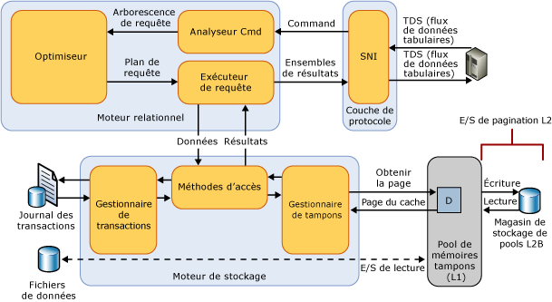

# Buffer Pool Extension
[!INCLUDE[appliesto-ss-xxxx-xxxx-xxx-md](../../includes/appliesto-ss-xxxx-xxxx-xxx-md.md)]
  Introduite dans [!INCLUDE[ssSQL14](../../includes/sssql14-md.md)], l'extension du pool de mémoires tampons permet l'intégration transparente d'une extension de mémoire vive non volatile (c'est-à-dire d'un disque SSD) dans le pool de mémoires tampons [!INCLUDE[ssDE](../../includes/ssde-md.md)] pour améliorer le débit d'E/S de façon significative. L'extension du pool de mémoires tampons n'est pas disponible dans toutes les éditions de [!INCLUDE[ssNoVersion](../../includes/ssnoversion-md.md)] . Pour plus d’informations, consultez [Fonctionnalités prises en charge par les éditions de SQL Server 2016](~/sql-server/editions-and-supported-features-for-sql-server-2016.md).  
  
## Avantages de l'extension du pool de mémoires tampons  
 L'objectif principal d'une base de données [!INCLUDE[ssNoVersion](../../includes/ssnoversion-md.md)] est de stocker et de récupérer les données, l'utilisation intensive d'E/S sur disque est donc une caractéristique centrale du moteur de base de données. Étant donné que les opérations d'E/S sur disque peuvent consommer beaucoup de ressources et durer relativement longtemps, [!INCLUDE[ssNoVersion](../../includes/ssnoversion-md.md)] s'attache à rendre ces opérations efficaces. Le pool de mémoires tampons fait office de source principale d'allocation mémoire de [!INCLUDE[ssNoVersion](../../includes/ssnoversion-md.md)]. La gestion des tampons joue un rôle essentiel pour parvenir à cette efficacité. Le composant de gestion des tampons comprend deux mécanismes : le gestionnaire de tampons qui permet d'accéder et mettre à jour les pages de la base de données, et le pool de mémoires tampons, qui permet de réduire les opérations d'E/S du fichier de la base de données.  
  
 Les pages de données et d'index sont lues sur le disque dans le pool de mémoires tampons et les pages modifiées (également appelées « pages de modifications ») sont écrites sur le disque. Lorsque la mémoire sur les points de contrôle du serveur et de la base de données est sollicitée, les pages de modifications actives dans le cache des tampons sont supprimées du cache et écrites sur des disques mécaniques, puis relues dans le cache. Ces opérations d'E/S sont généralement des lectures et des écritures aléatoires de petite taille, de l'ordre de 4 à 16 Ko de données. Les E/S de ce type entraînent des appels fréquents qui entrent en concurrence pour les contentions de disque mécanique, augmentent la latence des E/S et réduisent le débit global des E/S du système.  
  
 L'approche habituelle pour résoudre ces goulots d'étranglement des E/S est d'ajouter plus de DRAM, ou bien, des axes SAS hautes performances. Si ces options sont utiles, elles ont des inconvénients importants : la DRAM est plus coûteuse que les disques de stockage de données, et l'ajout d'axes augmente les dépenses d'investissement en matériel et les coûts d'exploitation en raison d'une consommation d'énergie accrue et de la plus forte probabilité de défaillance d'un composant.  
  
 La fonctionnalité d'extension du pool de mémoires tampons étend le cache du pool avec le stockage non volatile (généralement, les disques SSD). Grâce à cette extension, le pool de mémoires tampons peut gérer une plus vaste plage de travail de la base de données, ce qui force la pagination des E/S entre la mémoire RAM et les disques SSD. Cela décharge efficacement les E/S aléatoires de petite taille des disques mécaniques vers les disques SSD. En raison de la plus faible latence et des meilleures performances des E/S aléatoires fournies par les disques SSD, l'extension du pool de mémoires tampons améliore considérablement le débit des E/S.  
  
 La fonctionnalité d'extension du pool de mémoires tampons présente les avantages suivants :  
  
-   Débit des E/S aléatoires augmenté  
  
-   Latence des E/S réduite  
  
-   Débit de transaction augmenté  
  
-   Performances améliorées en lecture avec un plus grand pool hybride de mémoires tampons  
  
-   Architecture de mise en cache capable de tirer parti des disques mémoire à faible coût d'aujourd'hui et de demain  
  
### Concepts  
 Les termes suivants s'appliquent aux fonctionnalités de l'extension du pool de mémoires tampons.  
  
 Disques SSD  
 Les disques SSD stockent les données en mémoire vive (RAM) de manière persistante. Pour plus d'informations, consultez [cette définition](http://en.wikipedia.org/wiki/Solid-state_drive).  
  
 Buffer  
 Dans [!INCLUDE[ssNoVersion](../../includes/ssnoversion-md.md)], un tampon est une page de 8 Ko en mémoire dont la taille est similaire à une page d'index ou de données. Ainsi, le cache des tampons est divisé en pages de 8 Ko. Une page reste dans le cache des tampons jusqu'à ce que le gestionnaire de tampons ait besoin de la zone de mémoire tampon pour lire davantage de données. Les données ne sont réécrites sur le disque que si elles sont modifiées. Ces pages modifiées en mémoire sont appelées « pages de modifications ». Une page est nettoyée lorsqu'elle est équivalente à son image de base de données sur le disque. Les données dans le cache de tampons peuvent être modifiées plusieurs fois avant leur réécriture sur le disque.  
  
 Pool de mémoires tampons  
 Également appelé « cache des tampons ». Le pool de mémoires tampons est une ressource globale partagée par toutes les bases de données pour leurs pages de données mises en cache. La taille maximale et la taille minimale du cache du pool de mémoires tampons sont déterminées au démarrage ou lorsque l'instance de SQL Server est reconfigurée de façon dynamique à l'aide de sp_configure. Cette valeur détermine le nombre maximal de pages pouvant être mises en cache dans le pool de mémoires tampons à tout moment dans l'instance en cours d'exécution.  
  
 La mémoire maximale pouvant être validée par l’extension de pool de mémoires tampons peut être limitée par d’autres applications en cours d’exécution sur l’ordinateur si celles-ci exercent une pression importante sur la mémoire.  
  
 Point de contrôle  
 Un point de contrôle crée un point de référence connu et fiable à partir duquel le [!INCLUDE[ssDE](../../includes/ssde-md.md)] peut, lors d'une récupération sur incident ou arrêt inattendu, commencer à appliquer les modifications contenues dans le journal des transactions. Un point de contrôle écrit les pages de modifications et les informations du journal des transactions de la mémoire vers le disque et enregistre également les informations sur le journal des transactions. Pour plus d’informations, consultez [Points de contrôle de base de données &#40;SQL Server&#41;](../../relational-databases/logs/database-checkpoints-sql-server.md).  
  
## Détails de l'extension du pool de mémoires tampons  
 Le stockage sur disque SSD est utilisé comme une extension du sous-système de mémoire au lieu du sous-système de stockage sur disque. Autrement dit, le fichier d'extension du pool de mémoires tampons permet au gestionnaire du pool d'utiliser une mémoire DRAM et NAND-Flash pour maintenir un plus grand pool de pages faiblement sollicitées dans la mémoire vive non volatile soutenue par les disques SSD. Cela crée une hiérarchie de mise en cache à plusieurs niveaux : avec le niveau 1 (L1) correspondant à la DRAM, et le niveau 2 (L2) correspondant au fichier d'extension du pool de mémoires tampons sur le disque SSD. Seules les pages nettoyées sont écrites dans le cache L2, ce qui vous permet d'assurer la sécurité de données. Le gestionnaire de tampons gère le déplacement des pages nettoyées entre les caches L1 et L2.  
  
 L'illustration suivante présente une vue d'ensemble de l'architecture du pool de mémoires tampons par rapport aux autres composants de [!INCLUDE[ssNoVersion](../../includes/ssnoversion-md.md)] .  
  
   
  
 Une fois activée, l'extension du pool de mémoires tampons spécifie la taille et le chemin d'accès du fichier de mise en cache du pool de mémoires tampons sur le disque SSD. Ce fichier est une extension contiguë du stockage sur le disque SSD, et est configuré statiquement au démarrage de l'instance de [!INCLUDE[ssNoVersion](../../includes/ssnoversion-md.md)]. La modification des paramètres de configuration des fichiers est uniquement possible lorsque la fonctionnalité d'extension du pool de mémoires tampons est désactivée. Dans ce cas, tous les paramètres de configuration associés sont supprimés du Registre. Le fichier d'extension du pool de mémoires tampons est supprimé en cas d'arrêt de l'instance de SQL Server.  
  
## Meilleures pratiques  
 Nous vous recommandons d'appliquer ces bonnes pratiques.  
  
-   Après avoir activé l’extension du pool de mémoires tampons pour la première fois, il est recommandé de redémarrer l’instance SQL Server pour obtenir des performances optimales.  
  
-   La taille maximale d'extension du pool de mémoires tampons peut atteindre 32 la valeur de max_server_memory.  Le rapport entre la taille de la mémoire physique (max_server_memory) et la taille des fichiers d'extension du pool de mémoires tampons ne doit pas dépasser 1:16. Un rapport inférieur compris entre 1:4 et 1:8 peut être optimal. Pour plus d’informations sur l’option max_server_memory, consultez [server memory (options de configuration de serveur)](../../database-engine/configure-windows/server-memory-server-configuration-options.md).  
  
-   Testez l'extension du pool de mémoires tampons entièrement avant d'implémenter votre solution dans un environnement de production. Dans un environnement de production, évitez de modifier la configuration dans le fichier ou de désactiver la fonctionnalité. Ces activités peuvent avoir un impact négatif sur les performances du serveur, car le pool de mémoires tampons a une taille sensiblement réduite lorsque la fonctionnalité est désactivée. Lorsqu'elle est désactivée, la mémoire utilisée pour prendre en charge la fonctionnalité n'est pas récupérée tant que l'instance de SQL Server n'a pas redémarré. Toutefois, si la fonctionnalité est réactivée, la mémoire est réutilisée sans redémarrer l'instance.  
  
## Retour des informations concernant l'extension du pool de mémoires tampons  
 Utilisez les vues de gestion dynamique suivantes pour afficher la configuration de l'extension du pool de mémoires tampons et obtenir des informations sur les pages de données dans l'extension.  
  
-   [sys.dm_os_buffer_pool_extension_configuration &#40;Transact-SQL&#41;](../../relational-databases/system-dynamic-management-views/sys-dm-os-buffer-pool-extension-configuration-transact-sql.md)  
  
-   [sys.dm_os_buffer_descriptors &#40;Transact-SQL&#41;](../../relational-databases/system-dynamic-management-views/sys-dm-os-buffer-descriptors-transact-sql.md)  
  
 Les compteurs de performances sont disponibles dans l'objet Gestionnaire de tampons de SQL Server pour assurer le suivi des pages de données dans le fichier d'extension du pool de mémoires tampons. Pour plus d'informations, consultez la rubrique sur les [compteurs de performances de l'extension du pool de mémoires tampons](../../relational-databases/performance-monitor/sql-server-buffer-manager-object.md).  
  
 Les événements XEvent suivants sont disponibles.  
  
|XEvent|Description|Paramètres|  
|------------|-----------------|----------------|  
|sqlserver.buffer_pool_extension_pages_written|Se déclenche lorsqu'une page ou un groupe de pages est supprimé du pool de mémoires tampons et est écrit dans le fichier d'extension du pool de mémoires tampons.|*number_page*   *first_page_id*   *first_page_offset*   *initiator_numa_node_id*|  
|sqlserver.buffer_pool_extension_pages_read|Se déclenche lorsqu'une page est lue à partir du fichier d'extension du pool de mémoires tampons vers le pool de mémoires tampon.|*number_page*   *first_page_id*   *first_page_offset*   *initiator_numa_node_id*|  
|sqlserver.buffer_pool_extension_pages_evicted|Se déclenche lorsqu'une page est supprimée du fichier d'extension du pool de mémoires tampons.|*number_page*   *first_page_id*   *first_page_offset*   *initiator_numa_node_id*|  
|sqlserver.buffer_pool_eviction_thresholds_recalculated|Se déclenche lorsque le seuil d'éviction est calculé.|*warm_threshold*   *cold_threshold*   *pages_bypassed_eviction*   *eviction_bypass_reason*   *eviction_bypass_reason_description*|  
  
## Related Tasks  
  
|||  
|-|-|  
|**Description de la tâche**|**Rubrique**|  
|Activer et configurer l'extension du pool de mémoires tampons|[ALTER SERVER CONFIGURATION &#40;Transact-SQL&#41;](../../t-sql/statements/alter-server-configuration-transact-sql.md)|  
|Modifier la configuration de l'extension du pool de mémoires tampons|[ALTER SERVER CONFIGURATION &#40;Transact-SQL&#41;](../../t-sql/statements/alter-server-configuration-transact-sql.md)|  
|Afficher la configuration de l'extension du pool de mémoires tampons|[sys.dm_os_buffer_pool_extension_configuration &#40;Transact-SQL&#41;](../../relational-databases/system-dynamic-management-views/sys-dm-os-buffer-pool-extension-configuration-transact-sql.md)|  
|Surveiller l'extension du pool de mémoires tampons|[sys.dm_os_buffer_descriptors &#40;Transact-SQL&#41;](../../relational-databases/system-dynamic-management-views/sys-dm-os-buffer-descriptors-transact-sql.md)   [Compteurs de performance](../../relational-databases/performance-monitor/sql-server-buffer-manager-object.md)|  
  
  
