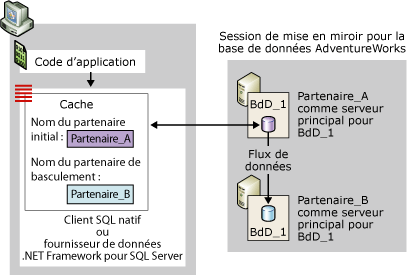
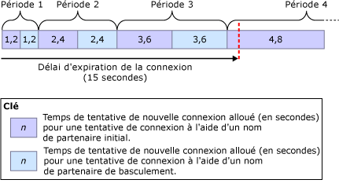
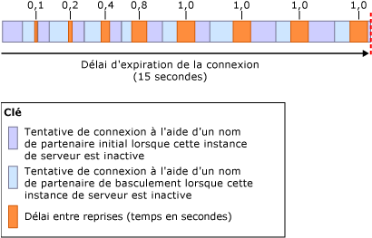

# <a name="connect-clients-to-a-database-mirroring-session-sql-server"></a>Connecter des clients à une session de mise en miroir de bases de données (SQL Server)
[!INCLUDE[appliesto-ss-xxxx-xxxx-xxx-md](../../includes/appliesto-ss-xxxx-xxxx-xxx-md.md)]
  Pour établir une connexion avec une session de mise en miroir de bases de données, un client peut soit utiliser [!INCLUDE[ssNoVersion](../../includes/ssnoversion-md.md)] Native Client, soit le fournisseur de données .NET Framework pour [!INCLUDE[ssNoVersion](../../includes/ssnoversion-md.md)]. S'ils sont configurés pour une base de données [!INCLUDE[ssCurrent](../../includes/sscurrent-md.md)] , ces deux fournisseurs d'accès aux données prennent pleinement en charge la mise en miroir de bases de données. Pour plus d'informations sur les éléments de programmation à prendre en compte pour l'utilisation d'une base de données mise en miroir, consultez [Using Database Mirroring](../../relational-databases/native-client/features/using-database-mirroring.md). Qui plus est, l'instance de serveur principal actuelle doit être disponible et la connexion du client doit avoir été créée dans l'instance de serveur. Pour plus d’informations, consultez [Dépanner des utilisateurs orphelins &#40;SQL Server&#41;](../../sql-server/failover-clusters/troubleshoot-orphaned-users-sql-server.md). Les connexions clientes à une session de mise en miroir de base de données n'exigent pas l'intervention de l'instance de serveur témoin (le cas échéant).  
  
  
##  <a name="InitialConnection"></a> Établissement de la connexion initiale à une session de mise en miroir de bases de données  
 Pour établir la connexion initiale avec une base de données mise en miroir, un client doit fournir une chaîne de connexion contenant au minimum le nom d'une instance de serveur. Ce nom de serveur obligatoire doit identifier l'instance du serveur principal actuel et est appelé *nom du serveur partenaire initial*.  
  
 Éventuellement, la chaîne de connexion peut également fournir le nom d'une autre instance de serveur, qui doit alors identifier l'instance du serveur miroir actuel, à utiliser si le serveur partenaire initial n'est pas disponible lors de la première tentative de connexion. Ce deuxième nom est appelé *nom du partenaire de basculement*.  
  
 La chaîne de connexion doit également contenir un nom de base de données. Cette information est requise pour permettre au fournisseur d'accès aux données d'effectuer des tentatives de basculement.  
  
 À la réception d'une chaîne de connexion, le fournisseur d'accès aux données stocke le nom du serveur partenaire initial et, le cas échéant, le nom du partenaire de basculement dans un cache de la mémoire volatile du client (pour le code managé, le cache se limite au domaine d'application). Une fois mis en cache, le nom du serveur partenaire initial n'est jamais mis à jour par le fournisseur d'accès aux données. Lorsque le client fournit le nom du partenaire de basculement, le fournisseur d'accès aux données stocke aussi ce nom temporairement pour pouvoir se connecter s'il ne peut pas le faire en utilisant le nom du serveur partenaire initial.  
  
 Une session de mise en miroir de bases de données ne fournit aucune protection contre les problèmes d'accès au serveur qui sont spécifiques aux clients, comme lorsqu'un ordinateur client n'arrive pas à communiquer avec le réseau. Une tentative de connexion à une base de données mise en miroir peut également échouer pour diverses raisons qui n'ont aucun rapport avec le fournisseur d'accès aux données ; par exemple, une tentative de connexion peut échouer parce que l'instance du serveur principal est inactive, comme c'est le cas pendant le basculement de la base de données, ou à cause d'une erreur réseau.  
  
 Lorsque le fournisseur d'accès aux données tente de se connecter, il commence par utiliser le nom du serveur partenaire initial. En règle générale, si l'instance de serveur spécifiée est disponible et qu'il s'agit bien de l'instance du serveur principal actuel, la tentative de connexion aboutit.  
  
> [!NOTE]  
>  Si la session de mise en miroir est suspendue, le client se connecte généralement au serveur principal et télécharge le nom du serveur partenaire. Cependant, le client ne peut pas accéder à la base de données tant que la mise en miroir n'a pas redémarré.  
  
 Si cette tentative échoue, le fournisseur d'accès aux données essaie de se connecter à l'aide du nom du partenaire de basculement (s'il est disponible). Si l'un des noms de serveur partenaire identifie correctement le serveur principal actuel, le fournisseur d'accès aux données réussit généralement à ouvrir la connexion initiale. Une fois cette connexion établie, le fournisseur d'accès aux données télécharge le nom d'instance de serveur du serveur miroir actuel. Ce nom est stocké dans le cache en tant que nom du partenaire de basculement et remplace, le cas échéant, le nom du partenaire de basculement fourni par le client. Par la suite, le fournisseur de données .NET Framework pour [!INCLUDE[ssNoVersion](../../includes/ssnoversion-md.md)] ne met pas à jour le nom du partenaire de basculement. En revanche, [!INCLUDE[ssNoVersion](../../includes/ssnoversion-md.md)] Native Client met le cache à jour à chaque fois qu'une connexion ou réinitialisation de connexion ultérieure retourne un nom de serveur partenaire différent.  
  
 La figure suivante représente une connexion cliente au serveur partenaire initial, **Partner_A**, pour une base de données en miroir appelée **Db_1**. Cette figure illustre le cas où le nom du serveur partenaire initial fourni par le client identifie correctement le serveur principal actuel, **Partner_A**. La tentative de connexion initiale aboutit et le fournisseur d’accès aux données stocke le nom du serveur miroir (actuellement **Partner_B**) en tant que nom du partenaire de basculement dans le cache local. Pour terminer, le client se connecte à la copie principale de la base de données **Db_1** .  
  
   
  
 La tentative de connexion initiale peut échouer, entre autres, à cause d'une erreur réseau ou d'une instance de serveur inactive. Étant donné que le serveur partenaire initial est alors indisponible, pour que le fournisseur d'accès aux données puisse essayer de se connecter au partenaire de basculement, le client doit avoir fourni le nom de ce dernier dans la chaîne de connexion.  
  
 Si ce n'est pas le cas et que le nom du partenaire de basculement n'est pas disponible, la tentative de connexion initiale se poursuit jusqu'à l'expiration de la connexion réseau ou jusqu'à ce qu'une erreur soit retournée (exactement comme pour une base de données qui n'est pas mise en miroir).  
  
 Lorsque le nom du partenaire de basculement est fourni dans la chaîne de connexion, le comportement du fournisseur d'accès aux données dépend du protocole réseau et du système d'exploitation du client, comme indiqué ci-après :  
  
-   Pour TCP/IP, les tentatives de connexion sont régies par un algorithme de délai entre deux tentatives de connexion spécifique à la mise en miroir de bases de données. L’ *algorithme de délai entre deux tentatives de connexion* détermine la durée maximale (le *délai entre deux tentatives*) allouée à l’ouverture d’une connexion lors d’une tentative de connexion donnée.  
  
-   Pour les autres protocoles réseau  
  
     Si une erreur se produit ou si le serveur partenaire initial est indisponible, la tentative de connexion initiale attend l'expiration du délai d'attente de la connexion réseau ou du délai d'attente de la connexion du fournisseur d'accès aux données. En général, ce délai est de l'ordre de 20 à 30 secondes. Ensuite, si la connexion du fournisseur d'accès aux données n'a pas expiré, le fournisseur tente de se connecter au partenaire de basculement. Si le délai d'attente de la connexion expire avant l'établissement de la connexion ou si le partenaire de basculement est indisponible, la tentative de connexion échoue. Par contre, si le partenaire de basculement est disponible avant l'expiration du délai d'attente de la connexion et qu'il s'agit désormais du serveur principal, la tentative de connexion aboutit généralement.  
  
  
### <a name="connection-strings-for-a-mirrored-database"></a>Chaînes de connexion pour une base de données en miroir  
 La chaîne de connexion fournie par le client contient des informations que le fournisseur d'accès aux données utilise pour se connecter à la base de données. Cette section présente les mots clés qui sont tout particulièrement appropriés pour se connecter à une base de données mise en miroir à l'aide d'une connexion au pilote ODBC de [!INCLUDE[ssNoVersion](../../includes/ssnoversion-md.md)] Native Client.  
  
#### <a name="network-attribute"></a>Attribut Network  
 La chaîne de connexion doit contenir l’attribut **Network** pour spécifier le protocole réseau. Cela permet d'assurer la persistance du protocole réseau spécifié entre les connexions avec différents serveurs partenaires. TCP/IP est le meilleur protocole pour se connecter à une base de données mise en miroir. Pour garantir que le client exige TCP/IP à chaque fois qu'il se connecte aux serveurs partenaires, la chaîne de connexion doit fournir l'attribut suivant :  
  
```  
Network=dbmssocn;   
```  
  
> [!IMPORTANT]  
>  Nous vous recommandons de laisser TCP/IP en haut de la liste de protocoles d'un client. Toutefois, si la chaîne de connexion spécifie l’attribut **Network** , l’ordre de cette liste est ignoré.  
  
 Sinon, pour garantir que le client exige des canaux nommés chaque fois qu'il se connecte aux serveurs partenaires, la chaîne de connexion doit fournir l'attribut suivant :  
  
```  
Network=dbnmpntw;   
```  
  
> [!IMPORTANT]  
>  Étant donné que le protocole des canaux nommés n'utilise pas l'algorithme de tentative de connexion TCP/IP, une tentative de connexion utilisant des canaux nommés risque, dans de nombreux cas, d'expirer avant de se connecter à une base de données mise en miroir.  
  
#### <a name="server-attribute"></a>Attribut Server  
 La chaîne de connexion doit contenir un attribut **Server** indiquant le nom du serveur partenaire initial, lequel doit identifier l'instance du serveur principal actuel.  
  
 La façon la plus simple d’identifier l’instance de serveur est de spécifier son nom : *<nom_serveur>*[**\\***<nom_instance_SQL_Server>*]. Exemple :  
  
 `Server=Partner_A;`  
  
 ou Gestionnaire de configuration  
  
 `Server=Partner_A\Instance_2;`  
  
 Cependant, lorsque le nom système est utilisé, le client doit effectuer une recherche DNS pour obtenir l'adresse IP du serveur et une requête SQL Server Browser pour obtenir le numéro de port du serveur sur lequel le serveur partenaire réside. Vous pouvez éviter ces recherches et requêtes en spécifiant l’adresse IP et le numéro de port du partenaire dans l’attribut **Server** , au lieu de spécifier le nom du serveur. Cette méthode est recommandée afin de minimiser la possibilité de délais externes pendant la connexion à ce serveur partenaire.  
  
> [!NOTE]  
>  Il est nécessaire d'effectuer une requête SQL Server Browser si la chaîne de connexion spécifie le nom de l'instance nommée et pas le port.  
  
 Pour spécifier l’adresse IP et le port, l’attribut **Server** doit se présenter sous la forme suivante : `Server=`*<adresse_ip>*`,`*\<port>*. Par exemple :  
  
```  
Server=123.34.45.56,4724;   
```  
  
> [!NOTE]  
>  L'adresse IP peut être une adresse IP Version 4 (IPv4) ou IP Version 6 (IPv6).  
  
#### <a name="database-attribute"></a>Attribut Database  
 En outre, la chaîne de connexion doit spécifier l'attribut **Database** pour fournir le nom de la base de données mise en miroir. Si la base de données est indisponible lors de la tentative de connexion du client, une exception est générée.  
  
 Par exemple, pour se connecter explicitement à la base de données **AdventureWorks** sur le serveur principal Partner_A, un client doit utiliser la chaîne de connexion suivante :  
  
 `" Server=Partner_A; Database=AdventureWorks "`  
  
> [!NOTE]  
>  Cette chaîne omet les informations d'authentification.  
  
> [!IMPORTANT]  
>  L’intégration du préfixe du protocole avec l’attribut **Server** (`Server=tcp:`*\<nom_serveur>*) est incompatible avec l’attribut **Network**. Si vous spécifiez le protocole aux deux emplacements, vous obtiendrez probablement une erreur. Nous vous recommandons de faire en sorte qu’une chaîne de connexion spécifie le protocole à l’aide de l’attribut **Network** et spécifie uniquement le nom du serveur dans l’attribut **Server** (`"Network=dbmssocn; Server=`*\<nom_serveur>*`"`).  
  
#### <a name="failover-partner-attribute"></a>Attribut partenaire de basculement  
 Outre le nom du serveur partenaire initial, le client peut aussi spécifier le nom du partenaire de basculement, lequel doit identifier l'instance du serveur miroir actuel. Le partenaire de basculement est spécifié par l'un des mots clés pour l'attribut de partenaire de basculement. Le mot clé de cet attribut dépend de l'API que vous utilisez. La table suivante répertorie ces mots clés :  
  
|API|Mot clé pour l'attribut de partenaire de basculement|  
|---------|--------------------------------------------|  
|Fournisseur OLE DB|**FailoverPartner**|  
|Pilote ODBC|**Failover_Partner**|  
|ActiveX Data Objects (ADO)|**Failover Partner**|  
  
 La façon la plus simple d’identifier l’instance de serveur consiste à utiliser son nom système : *<nom_serveur>*[**\\***<nom_instance_SQL_Server>*].  
  
 Il est également possible de fournir l’adresse IP et le numéro de port dans l’attribut **Failover Partner** . Si la tentative de connexion initiale échoue au cours de la première connexion à la base de données, la tentative de connexion au partenaire de basculement ne sera pas tributaire de DNS et de SQL Server Browser. Une fois qu'une connexion est établie, le nom du partenaire de basculement sera remplacé par le nom du partenaire de basculement, si bien qu'en cas de basculement, les connexions redirigées feront appel à DNS et à SQL Server Browser.  
  
> [!NOTE]  
>  Lorsque seul le nom du serveur partenaire initial est fourni, les développeurs d'applications n'ont rien à faire, ni aucun code à écrire, mis à part le code relatif à la reconnexion.  
  
> [!NOTE]  
>  Les développeurs d'applications en code managé fournissent le nom du partenaire de basculement dans la propriété **ConnectionString** de l'objet **SqlConnection** . Pour plus d'informations sur l'utilisation de cette chaîne de connexion, consultez « Database Mirroring Support in the .NET Framework Data Provider for SQL Server » (en anglais) dans la documentation ADO.NET qui fait partie du kit de développement logiciel (SDK) [!INCLUDE[msCoName](../../includes/msconame-md.md)] .NET Framework.  
  
#### <a name="example-connection-string"></a>Exemple de chaîne de connexion  
 Par exemple, pour se connecter explicitement à l’aide de TCP/IP à la base de données **AdventureWorks** sur Partner_A ou sur Partner_B, une application cliente qui utilise le pilote ODBC peut fournir la chaîne de connexion suivante :  
  
```  
"Server=Partner_A; Failover_Partner=Partner_B; Database=AdventureWorks; Network=dbmssocn"  
```  
  
 Sinon, le client peut utiliser l'adresse IP et le numéro de port pour identifier le serveur partenaire initial, Partner_A ; par exemple, si l'adresse IP est 250.65.43.21 et le numéro de port est 4734, la chaîne de connexion est la suivante :  
  
```  
"Server=250.65.43.21,4734; Failover_Partner=Partner_B; Database=AdventureWorks; Network=dbmssocn"  
```  
  
##  <a name="RetryAlgorithm"></a> Algorithme de délai entre deux tentatives de connexion (pour les connexions TCP/IP)  
 Pour une connexion TCP/IP, lorsque les noms des deux partenaires sont dans le cache, le fournisseur d'accès aux données se conforme à un algorithme de délai entre deux tentatives de connexion. Ceci s'applique lors de l'établissement de la connexion initiale à la session et lors de la reconnexion lorsqu'une connexion établie a été perdue. Une fois qu'une connexion a été ouverte, la réalisation des opérations de préouverture et d'ouverture de session prend du temps.  
  
> [!NOTE]  
>  Le temps consacré à l'établissement d'une connexion peut être supérieur au délai alloué entre deux tentatives en raison de facteurs externes, tels que les recherches DNS, un centre de distribution de clés de contrôleur de domaine/Kerberos lent, le temps consacré à contacter le service SQL Server Browser, un encombrement sur le réseau, etc. Ces facteurs externes peuvent empêcher un client de se connecter à une base de données mise en miroir. L'ouverture d'une connexion peut également être plus longue que le délai prévu entre deux tentatives en raison de facteurs externes. Pour plus d'informations sur le contournement de DNS et du service SQL Server Browser afin de tenter d'établir une connexion au partenaire initial, consultez [Établissement de la connexion initiale à une session de mise en miroir de bases de données](#InitialConnection), plus haut dans cette rubrique.  
  
 Si une tentative de connexion échoue ou si le délai entre deux tentatives expire avant que la connexion n'ait été établie, le fournisseur d'accès aux données se tourne vers l'autre partenaire. Si une connexion n'est pas ouverte à ce stade, le fournisseur tente alors d'utiliser le nom du partenaire initial et celui du partenaire de basculement, jusqu'à ce qu'une connexion ait été ouverte ou que le délai de connexion ait expiré. Par défaut, le délai d'expiration de connexion est de 15 secondes. Nous vous conseillons d'utiliser un délai d'expiration de connexion d'au moins 5 secondes. Si vous spécifiez un délai d'expiration plus court, il est possible que toutes les tentatives de connexion échouent.  
  
 Le délai entre deux tentatives correspond à un pourcentage du délai de connexion. Le délai entre deux tentatives de connexion augmente lors de chaque essai successif. Lors du premier essai, le délai entre deux tentatives correspond à 8 % du délai de connexion total. Lors de chaque essai qui suit, l'algorithme de délai entre deux tentatives augmente la durée maximale accordée en fonction de cette même valeur. Par conséquent, les valeurs de délai entre les huit premières tentatives de connexion sont les suivantes :  
  
 8%, 8%, 16%, 16%, 24%, 24%, 32%, 32%  
  
 Le délai entre deux tentatives est calculé au moyen de la formule suivante :  
  
 *RetryTime* **=** *PreviousRetryTime* **+(** 0.08 **\****LoginTimeout***)**  
  
 Où *PreviousRetryTime* a la valeur 0 au départ.  
  
 Par exemple, si vous utilisez le délai d’expiration de connexion par défaut de 15 secondes, *LoginTimeout* *= 15*. Dans ce cas, les délais entre deux tentatives alloués lors des trois premiers essais sont les suivants :  
  
|Arrondi|Calcul de*RetryTime* |Délai entre chaque tentative|  
|-----------|-----------------------------|----------------------------|  
| 1|0 **+(** 0,08 **\*** 15 **)**|1,2 secondes|  
|2|1,2 **+(** 0,08 **\*** 15 **)**|2,4 secondes|  
|3|2,4 **+(** 0,08 **\*** 15 **)**|3,6 secondes|  
|4|3,6 **+(** 0,08 **\*** 15 **)**|4,8 secondes|  
  
 Le tableau suivant illustre ces délais pour les tentatives de connexion successives, lesquelles excèdent toutes le délai d'expiration.  
  
   
  
 Pour le délai d'expiration de connexion par défaut, la durée maximale allouée aux trois premières tentatives de connexion est de 14,4 secondes. Si chaque tentative venait à utiliser la totalité du temps qui lui est alloué, il ne resterait alors que 0,6 secondes avant l'expiration du délai de connexion. Dans ce cas, la quatrième tentative serait écourtée et permettrait uniquement une dernière tentative de connexion rapide à l'aide du nom du partenaire initial. Cependant, une tentative de connexion peut échouer avant le délai autorisé, surtout lors des tentatives ultérieures. Par exemple, la réception d'une erreur réseau peut entraîner l'arrêt d'une tentative avant l'expiration du délai entre deux tentatives. Si les premières tentatives échouent en raison d'une erreur réseau, un délai supplémentaire est alors disponible pour la quatrième tentative, et éventuellement, pour des tentatives supplémentaires.  
  
 L'échec d'une tentative de connexion peut également être lié à une instance de serveur inactive, comme dans les cas de figure où une instance de serveur procède au basculement de sa base de données. Dans ce cas, un délai entre deux tentatives est imposé pour empêcher que les clients surchargent les partenaires de tentatives de connexion à répétition.  
  
> [!NOTE]  
>  Lorsque les noms des deux partenaires sont disponibles, si le délai d'expiration de connexion est illimité, le client tente de se reconnecter indéfiniment aux serveurs, en alternant entre le nom du partenaire initial et le nom du partenaire de basculement.  
  
  
### <a name="retry-delays-during-failover"></a>Délais entre deux tentatives lors d'un basculement  
 Si un client tente de se connecter à un partenaire qui fait l'objet d'un basculement, le partenaire répond immédiatement qu'il est inactif. Dans ce cas, chaque nouvelle tentative de connexion est beaucoup plus brève que le délai imparti entre deux tentatives. Ceci signifie que de nombreux essais de connexion peuvent survenir avant l'expiration du délai de connexion. Pour éviter que les partenaires ne soient surchargés par une série rapide de tentatives de connexion lors d'un basculement, le fournisseur d'accès aux données ajoute un délai court entre deux tentatives après chaque cycle. La durée d'un délai entre deux tentatives est déterminée par l'algorithme de délai entre deux tentatives. Après le premier essai, le délai est de 100 millisecondes. Après chacun des trois essais suivants, le délai entre deux tentatives est multiplié par deux : 200, 400 et 800. Pour tous les essais ultérieurs, le délai entre deux tentatives est de 1 seconde tant que la tentative de connexion n'a pas réussi ou que le délai n'a pas expiré.  
  
> [!NOTE]  
>  Si l'instance de serveur n'est pas arrêtée, la demande de connexion échoue immédiatement.  
  
 Le tableau suivant illustre l'incidence du délai entre deux tentatives de connexion lors d'un basculement manuel dans lequel les partenaires intervertissent leur rôle. Le délai d'expiration de connexion est de 15 secondes.  
  
   
  
##  <a name="Reconnecting"></a> Reconnexion à une session de mise en miroir de bases de données  
 Si une connexion établie à une session de mise en miroir de bases de données échoue pour une raison quelconque, par exemple suite au basculement de mise en miroir de bases de données, et que l'application tente de se reconnecter au serveur initial, le fournisseur d'accès aux données peut essayer de se reconnecter à l'aide du nom du partenaire de basculement stocké dans le cache du client. La reconnexion n'est cependant pas automatique. L'application doit avoir connaissance de l'erreur. Ensuite, elle doit fermer la connexion qui a échoué et en ouvrir une nouvelle à l'aide des mêmes attributs de chaîne de connexion. À ce stade, le fournisseur d'accès aux données redirige la connexion vers le partenaire de basculement. Si l'instance de serveur identifiée par ce nom est actuellement le serveur principal, la tentative de connexion réussit en général. S'il est incertain si une transaction a été validée ou restaurée, l'application doit vérifier son état, de la même façon que lors de la reconnexion à une instance de serveur autonome.  
  
 La reconnexion s'apparente à une connexion initiale pour laquelle la chaîne de connexion a fourni un nom de partenaire de basculement. Si la première tentative de connexion échoue, les tentatives de connexion alternent entre le nom du partenaire initial et le nom du partenaire de basculement jusqu'à ce que le client se connecte au serveur principal ou que le délai d'attente du fournisseur d'accès aux données soit atteint.  
  
> [!NOTE]  
>  [!INCLUDE[ssNoVersion](../../includes/ssnoversion-md.md)] Native Client vérifie qu’il se connecte à une instance de serveur principal, mais ne vérifie pas si cette instance est le serveur partenaire de l’instance de serveur spécifiée dans le nom de serveur partenaire initial de la chaîne de connexion.  
  
 Si les connexions utilisent TCP/IP, l'algorithme de délai entre deux tentatives de connexion détermine la durée allouée aux tentatives de connexion à chaque cycle.  
  
> [!IMPORTANT]  
>  Si le client se retrouve déconnecté de la base de données, le fournisseur d'accès aux données n'essaie pas de se reconnecter. Le client doit faire une nouvelle demande de connexion. De plus, si une application s'arrête suite à la perte de la connexion, elle perd les noms de partenaire mis en cache. Si la perte de la connexion est due à l'indisponibilité soudaine du serveur principal, la seule solution pour l'application de se reconnecter au serveur miroir consiste à fournir le nom du partenaire de basculement dans sa chaîne de connexion.  
  
  
### <a name="impact-of-redirection-on-a-client-application"></a>Impact de la redirection sur une application cliente  
 Après un basculement, le fournisseur d'accès aux données redirige la connexion vers l'instance de serveur principal actuelle. La redirection est cependant transparente pour les clients. Pour un client, une connexion redirigée semble être une connexion à l'instance de serveur identifiée par le nom de partenaire initial. Lorsque le partenaire initial est actuellement le serveur miroir, le client peut sembler être connecté au serveur miroir et mettre à jour la base de données miroir. En réalité, le client a été redirigé vers le partenaire de basculement (qui est la base de données principale actuelle) et il met à jour la nouvelle base de données principale.  
  
 Après avoir été redirigé vers le partenaire de basculement, un client peut rencontrer des résultats inattendus lors de l'utilisation d'une instruction [!INCLUDE[tsql](../../includes/tsql-md.md)] USE pour utiliser une base de données différente. Cela peut se produire si l'instance de serveur principal actuelle (le partenaire de basculement) possède un ensemble de bases de données différent du serveur principal d'origine (le partenaire initial).  
  
##  <a name="Benefits"></a>   
  
##  <a name="StalePartnerName"></a> Impact d'un nom de partenaire de basculement obsolète  
 L'administrateur de base de données peut modifier le partenaire de basculement à tout moment. C’est pourquoi un nom de partenaire de basculement fourni par le client peut être périmé ou *obsolète*. Prenons par exemple un partenaire de basculement nommé Partner_B qui est remplacé par une autre instance de serveur nommée Partner_C. Si un client fournit Partner_B comme nom de partenaire de basculement, ce nom est obsolète. Quand le nom du partenaire de basculement fourni par le client est obsolète, le comportement du fournisseur d'accès aux données est identique à celui adopté lorsque le nom du partenaire de basculement n'est pas fourni par le client.  
  
 Par exemple, imaginons une situation dans laquelle un client utilise une chaîne de connexion unique pour une série de quatre tentatives de connexion. Dans la chaîne de connexion, le nom du serveur partenaire initial est Partner_A et le nom du partenaire de basculement est Partner_B :  
  
```  
"Server=Partner_A; Failover Partner=Partner_B; Database=AdventureWorks"  
```  
  
 Le tableau suivant représente quatre configurations de partenaire et indique pour chacune d'entre elles si la chaîne de connexion permet ou non de connecter le client la première fois.  
  
> [!NOTE]  
>  Une application peut assurer le suivi des modifications de configuration et modifier sa chaîne de connexion en conséquence. Cela demande d'ajouter du code supplémentaire mais réduit la charge administrative.  
  
|Configuration|Serveur principal|Serveur miroir|Comportement lors de la tentative de connexion en spécifiant Partner_A et Partner_B|  
|-------------------|----------------------|-------------------|------------------------------------------------------------------------------|  
|Configuration de la mise en miroir de départ.|Partner_A|Partner_B|Partner_A est mis en cache en tant que nom du partenaire initial. Le client réussit à se connecter à Partner_A. Le client télécharge le nom du serveur miroir, Partner_B, et le met en cache en ignorant le nom du partenaire de basculement fourni par le client.|  
|Partner_A subit une défaillance matérielle et un basculement a lieu (suivi d'une déconnexion des clients).|Partner_B|none|Partner_A est toujours mis en cache comme nom de partenaire initial, mais le nom de partenaire de basculement fourni par le client, Partner_B, permet au client de se connecter au serveur principal actuel.|  
|L'administrateur de base de données arrête la mise en miroir (et déconnecte les clients), remplace Partner_A par Partner_C et redémarre la mise en miroir.|Partner_B|Partner_C|Le client essaie de se connecter à Partner_A sans succès. Ensuite, il essaie avec Partner_B (le serveur principal actuel) et sa tentative aboutit. Le fournisseur d'accès aux données télécharge le nom du serveur miroir actuel, Partner_C, et le met en cache comme nom de partenaire de basculement.|  
|Le service est manuellement basculé vers Partner_C (déconnexion des clients).|Partner_C|Partner_B|Le client tente tout d'abord de se connecter à Partner_A, puis à Partner_B. Ces deux noms échouent et la demande de connexion finit par expirer et par échouer.|  
  
  
## <a name="see-also"></a> Voir aussi  
 [Mise en miroir de bases de données &#40;SQL Server&#41;](../../database-engine/database-mirroring/database-mirroring-sql-server.md)   
 [Défaillances possibles pendant la mise en miroir d’une base de données](../../database-engine/database-mirroring/possible-failures-during-database-mirroring.md)  
  
  
