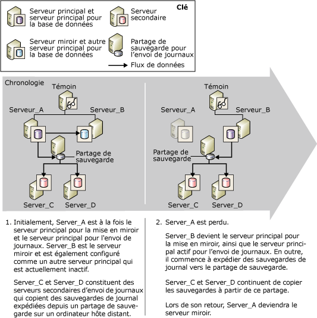

# Mise en miroir de bases de données et copie des journaux de transaction (SQL Server)
[!INCLUDE[appliesto-ss-xxxx-xxxx-xxx-md](../../includes/appliesto-ss-xxxx-xxxx-xxx-md.md)]
  Une base de données déterminée peut être simultanément mise en miroir et/ou faire l'objet d'une copie des journaux de transaction. Pour choisir l'approche à utiliser, tenez compte des éléments suivants :  
  
-   De combien de serveurs de destination avez-vous besoin ?  
  
     Si vous n'avez besoin que d'une base de données de destination, la mise en miroir de bases de données est la solution recommandée.  
  
     Si plusieurs bases de données de destination sont nécessaires, vous devez utiliser la copie des journaux de transaction, seul ou avec la mise en miroir de bases de données. La combinaison de ces approches offre les avantages de la mise en miroir de bases de données ainsi que la prise en charge de plusieurs destinations, permise par la copie des journaux de transaction.  
  
-   Si vous devez différer la restauration du journal sur la base de données de destination (généralement pour la protéger contre les erreurs logiques), utilisez la copie des journaux de transaction, seul ou avec la mise en miroir de bases de données.  
  
 Cette rubrique présente les observations relatives à la combinaison de la copie des journaux de transaction et de la mise en miroir de bases de données.  
  
> [!NOTE]  
>  Pour obtenir une présentation de ces technologies, consultez [Mise en miroir de bases de données &#40;SQL Server&#41;](../../database-engine/database-mirroring/database-mirroring-sql-server.md) et [À propos de la copie des journaux de transaction &#40;SQL Server&#41;](../../database-engine/log-shipping/about-log-shipping-sql-server.md).  
  
## Combinaison de la copie des journaux de transaction et de la mise en miroir de bases de données  
 La base de données principale dans une session de mise en miroir peut également jouer le rôle de la base de données primaire dans une configuration de copie des journaux de transaction, ou inversement, car le partage de la sauvegarde de copie des journaux de transaction est intact. La session de mise en miroir de bases de données s'exécute dans n'importe quel mode d'exécution : synchrone (la sécurité des transactions ayant la valeur FULL) ou asynchrone (la sécurité des transactions ayant la valeur OFF).  
  
> [!NOTE]  
>  Pour utiliser la mise en miroir de base de données sur une base de données, le mode de restauration complète est toujours requis.  
  
 Généralement, lors de la combinaison de la copie des journaux de transaction et de la mise en miroir de bases de données, la session de mise en miroir de bases de données est établie avant la copie des journaux de transaction, même si cela n'est pas obligatoire. Ensuite, la base de données principale actuelle est configurée comme base de données primaire de copie des journaux de transaction ( *base de données principale/primaire*), associée à une ou plusieurs bases de données secondaires distantes. En outre, la base de données miroir doit être configurée comme base de données primaire de copie des journaux de transaction ( *base de données miroir/primaire*). Les bases de données secondaires de copie des journaux de transaction doivent se situer sur des instances du serveur différentes du serveur principal ou du serveur miroir/principal.  
  
> [!NOTE]  
>  Les paramètres de respect de la casse des serveurs impliqués dans la copie des journaux de transaction doivent correspondre.  
  
 Pendant une session de copie des journaux de transaction, les travaux de sauvegarde situés dans la base de données primaire entraînent la création de sauvegardes des journaux dans un dossier de sauvegarde. À partir de cet endroit, les sauvegardes sont copiées par les travaux de copie des serveurs secondaires. Pour que les travaux de sauvegarde et de copie réussissent, ils doivent avoir accès au dossier de sauvegarde de la copie des journaux de transaction. Pour optimiser la disponibilité du serveur principal, il est recommandé d'installer le dossier de sauvegarde à un emplacement de sauvegarde partagé sur un ordinateur hôte distinct. Vérifiez que tous les serveurs de copie des journaux de transaction, notamment le serveur miroir/principal, peuvent accéder à l’emplacement de sauvegarde partagé (connu sous le nom de *partage de sauvegarde*).  
  
 Pour permettre la poursuite de la copie des journaux de transaction après le basculement de la mise en miroir de base de données, vous devez également configurer le serveur miroir en tant que serveur principal, à l'aide de la même configuration que celle utilisée pour la base de données primaire ou la base de données principale. La base de données miroir est en état de restauration, ce qui empêche les travaux de sauvegarde de sauvegarder le journal dans celle-ci. De cette manière, la base de données miroir/primaire n'interfère pas avec la base de données principale/primaire dont les sauvegardes des journaux sont actuellement copiées par les serveurs secondaires. Pour empêcher les fausses alertes, quand un travail de sauvegarde s’exécute sur la base de données miroir/primaire, le travail de sauvegarde enregistre un message dans la table**log_shipping_monitor_history_detail** et le travail de l’Agent retourne un état de réussite.  
  
 La base de données miroir/primaire est inactive dans la session de copie des journaux de transaction. Cependant, si la mise en miroir bascule, la base de données miroir précédente se met en ligne en tant que base de données principale. À ce stade, cette base de données joue également le rôle de base de données primaire de copie des journaux de transaction. Les travaux de sauvegarde de la copie des journaux de transaction qui ne pouvaient pas précédemment copier de journaux sur cette base de données, commencent la copie des journaux de transaction. À l'inverse, un basculement entraîne la transformation de l'ancienne base de données principale/primaire en une nouvelle base de données miroir/primaire ainsi que son passage à l'état de restauration, tandis que les travaux de sauvegarde de cette base de données cessent de sauvegarder le journal.  
  
> [!NOTE]  
>  En cas de basculement automatique, le passage au rôle miroir se produit lorsque la base de données principale/primaire précédente rejoint la session de mise en miroir.  
  
 Pour s’exécuter en mode haute sécurité avec basculement automatique, la session de mise en miroir est configurée avec une instance de serveur supplémentaire appelée *témoin*. Si la base de données principale est perdue pour une quelconque raison après la synchronisation de la base de données et si le serveur miroir ainsi que son témoin peuvent toujours communiquer entre eux, un basculement automatique se produit. Lors d'un basculement automatique, le serveur miroir assume le rôle du principal et met sa base de données en ligne en tant que base de données principale. Si l'emplacement de la sauvegarde de la copie des journaux de transaction est accessible au nouveau serveur principal, ses travaux de sauvegarde commencent à envoyer les sauvegardes des journaux à cet endroit. Le mode synchrone de mise en miroir de bases de données garantit que la séquence de journaux de transactions consécutifs n'est pas affectée par un basculement de mise en miroir et que seul le journal valide est restauré. Les serveurs secondaires continuent de copier les sauvegardes des journaux sans savoir qu'une autre instance du serveur est devenue le serveur principal.  
  
 Si vous utilisez un moniteur de copie des journaux de transaction local, aucune observation particulière n'est nécessaire pour la prise en charge de ce scénario. Pour plus d'informations sur l'utilisation d'une instance de surveillance à distance avec ce scénario, consultez la section « Impact de la mise en miroir de bases de données sur une instance de surveillance à distance », plus loin dans cette rubrique.  
  
## Basculement d'une base de données principale vers une base de données miroir  
 La figure suivante illustre la manière dont la copie des journaux de transaction et la mise en miroir de bases de données interagissent lorsque la mise en miroir s'exécute en mode haute sécurité avec basculement automatique. Initialement, **Server_A** est à la fois le serveur du principal pour la mise en miroir et le serveur principal pour la copie des journaux de transaction. **Server_B** est le serveur miroir et est également configuré comme serveur principal actuellement inactif. **Server_C** et **Server_D** sont des serveurs secondaires de copie des journaux de transaction. Pour optimiser la disponibilité de la session de copie des journaux de transaction, l'emplacement de sauvegarde se trouve dans un répertoire de partage situé sur un ordinateur hôte distinct.  
  
   
  
 Après un basculement de mise en miroir, le nom du serveur principal défini sur le serveur secondaire reste inchangé. .  
  
## Impact de la mise en miroir de bases de données sur une instance de surveillance à distance  
 Lorsque la copie des journaux de transaction utilise une instance de surveillance à distance, la combinaison de la session de copie des journaux de transaction et de la mise en miroir de bases de données affecte les informations contenues dans les tables de surveillance. Les informations relatives au serveur principal sont une combinaison de celles configurées au niveau du serveur principal et du moniteur configuré sur chaque serveur secondaire.  
  
 Pour que la surveillance soit la plus transparente possible, lorsque vous utilisez un moniteur distant, il est recommandé de spécifier le nom du serveur principal d'origine lors de la configuration du serveur principal au niveau du serveur secondaire. Cette approche facilite également la modification de la configuration de la copie des journaux de transaction à partir de l'Agent Microsoft [!INCLUDE[ssNoVersion](../../includes/ssnoversion-md.md)]. Pour plus d’informations sur la surveillance, consultez [Surveiller la copie des journaux de transaction &#40;Transact-SQL&#41;](../../database-engine/log-shipping/monitor-log-shipping-transact-sql.md).  
  
## Configuration simultanée de la mise en miroir et de la copie des journaux de transaction  
 Pour configurer simultanément la mise en miroir de bases de données et la copie des journaux de transaction, les étapes suivantes sont requises :  
  
1.  Restaurer les sauvegardes de la base de données principale/primaire à l'aide de NORECOVERY sur une autre instance du serveur afin de les utiliser ultérieurement comme base de données miroir de la mise en miroir de base de données pour la base de données principale/primaire. Pour plus d’informations, consultez [Préparer une base de données miroir pour la mise en miroir &#40;Transact-SQL&#41;](../../database-engine/database-mirroring/prepare-a-mirror-database-for-mirroring-sql-server.md).  
  
2.  Configurer la mise en miroir de bases de données. Pour plus d’informations, consultez [Établir une session de mise en miroir de bases de données au moyen de l’authentification Windows &#40;SQL Server Management Studio&#41;](../../database-engine/database-mirroring/establish-database-mirroring-session-windows-authentication.md) ou [Configuration de la mise en miroir d’une base de données &#40;SQL Server&#41;](../../database-engine/database-mirroring/setting-up-database-mirroring-sql-server.md).  
  
3.  Restaurer les sauvegardes de la base de données principale/primaire sur d'autres instances du serveur afin de les utiliser ultérieurement comme bases de données secondaires de copie des journaux de transaction pour la base de données primaire.  
  
4.  Configurer la copie des journaux de transaction sur la base de données principale comme base de données primaire pour une ou plusieurs bases de données secondaires.  
  
     Il est conseillé de configurer un partage unique comme répertoire de sauvegarde (partage de sauvegarde). Cela permet de garantir qu'après le changement de rôle entre le principal et le serveur miroir, les travaux de sauvegarde seront toujours écrits dans le même répertoire qu'auparavant. Il est recommandé de vérifier que ce partage se situe sur un serveur physique différent des serveurs hébergeant les bases de données impliquées dans la mise en miroir et la copie des journaux de transaction.  
  
     Pour plus d’informations, consultez [Configurer la copie des journaux de transaction &#40;Transact-SQL&#41;](../../database-engine/log-shipping/configure-log-shipping-sql-server.md).  
  
5.  Basculement manuel du principal au miroir.  
  
     Pour effectuer un basculement manuel :  
  
    -   [Basculer manuellement une session de mise en miroir de bases de données &#40;SQL Server Management Studio&#41;](../../database-engine/database-mirroring/manually-fail-over-a-database-mirroring-session-sql-server-management-studio.md)  
  
    -   [Basculer manuellement une session de mise en miroir de bases de données &#40;Transact-SQL&#41;](../../database-engine/database-mirroring/manually-fail-over-a-database-mirroring-session-transact-sql.md)  
  
6.  Configurez la copie des journaux de transaction sur le nouveau principal (auparavant le miroir) comme la base de données primaire.  
  
    > [!IMPORTANT]  
    >  N'effectuez pas de configuration à partir d'un serveur secondaire.  
  
     Vous devez utiliser le même partage de sauvegarde que celui utilisé à l'étape 4.  
  
     L’interface **Envoi des journaux de transactions** de [!INCLUDE[ssManStudioFull](../../includes/ssmanstudiofull-md.md)] ne prend en charge qu’une base de données primaire par configuration de la copie des journaux de transaction. Par conséquent, vous devez utiliser des procédures stockées pour configurer le nouveau principal comme base de données primaire.  
  
7.  Effectuez un autre basculement manuel pour revenir au principal d'origine.  
  
  
