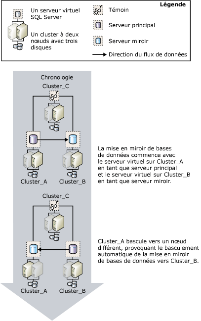

# Mise en miroir de base de données et instances de cluster de basculement SQL Server
[!INCLUDE[appliesto-ss-xxxx-xxxx-xxx-md](../../includes/appliesto-ss-xxxx-xxxx-xxx-md.md)]
  Un cluster de basculement est composé d'un ou de plusieurs disques physiques placés dans un groupe de clusters géré par le service de cluster [!INCLUDE[msCoName](../../includes/msconame-md.md)] (MSCS), appelé groupe de ressources, et constituant ainsi des nœuds membres du cluster. Le groupe de ressources est configuré comme une instance cluster de basculement qui héberge une instance de [!INCLUDE[ssNoVersion](../../includes/ssnoversion-md.md)]. Une instance cluster de basculement [!INCLUDE[ssNoVersion](../../includes/ssnoversion-md.md)] apparaît sur le réseau comme s’il s’agissait d’un ordinateur unique, mais elle est dotée d’une fonctionnalité qui assure le basculement d’un nœud vers un autre si le premier devient indisponible. Pour plus d’informations, consultez [Instances de cluster de basculement Always On &#40;SQL Server&#41;](../../sql-server/failover-clusters/windows/always-on-failover-cluster-instances-sql-server.md).  
  
 Les clusters de basculement garantissent une prise en charge de la haute disponibilité pour l’intégralité d’une instance de [!INCLUDE[msCoName](../../includes/msconame-md.md)] [!INCLUDE[ssNoVersion](../../includes/ssnoversion-md.md)] . En cela, ils se distinguent de la fonctionnalité de mise en miroir de bases de données qui offre cette même prise en charge pour une seule base de données. La mise en miroir de base de données est mise en œuvre entre des clusters de basculement et également entre un cluster de basculement et un hôte non-cluster.  
  
> [!NOTE]  
>  Pour une présentation de la mise en miroir de bases de données, consultez [Mise en miroir de bases de données &#40;SQL Server&#41;](../../database-engine/database-mirroring/database-mirroring-sql-server.md).  
  
## Mise en miroir et clustering  
 En règle générale, lorsque la mise en miroir est associée au clustering, le serveur principal et le serveur miroir résident tous les deux sur des clusters ; le serveur principal est hébergé sur l'instance cluster de basculement d'un cluster et le serveur miroir opère sur le serveur virtuel d'un autre cluster. Néanmoins, vous pouvez établir une session de mise en miroir dans laquelle un partenaire réside sur l'instance cluster de basculement d'un cluster et l'autre partenaire sur un ordinateur distinct non-cluster.  
  
 Si le basculement d'un cluster rend un serveur principal provisoirement indisponible, les connexions client à la base de données sont fermées. À l’issue du basculement d’un cluster, les clients peuvent se reconnecter au serveur principal du même cluster ou d’un autre cluster (ou un ordinateur non-cluster) selon le [mode d’opération](../../database-engine/database-mirroring/database-mirroring-operating-modes.md). Par conséquent, pour déterminer la façon dont vous allez configurer la mise en miroir de bases de données dans un environnement en clusters, le mode d'opération adopté pour la mise en miroir est primordial.  
  
### Session en mode haute sécurité de basculement automatique  
 Si vous envisagez de mettre en miroir une base de données en mode haute sécurité de basculement automatique, une configuration à deux clusters est recommandée pour les partenaires. Cette configuration assure une disponibilité optimale. Le témoin peut résider soit sur un troisième cluster, soit sur un ordinateur non-cluster.  
  
 Si le nœud hébergeant le serveur principal actif connaît une défaillance, le basculement automatique de la base de données débute après quelques secondes seulement, alors que le basculement vers un autre nœud de cluster est toujours en cours. La session de mise en miroir de bases de données bascule vers le serveur miroir de l'autre cluster (ou de l'ordinateur non-cluster) et le serveur miroir initial devient le serveur principal. Le nouveau serveur principal restaure par progression sa copie de la base de données aussi rapidement que possible et la remet en ligne en tant que base de données principale. Au terme du basculement de cluster, qui dure généralement plusieurs minutes, l'instance cluster de basculement qui était le serveur principal devient le serveur miroir.  
  
 La figure suivante illustre les effets d'un basculement automatique entre des clusters dans une session de mise en miroir en mode haute sécurité avec un témoin (prise en charge du basculement automatique).  
  
   
  
 Les trois instances de serveur dans la session de mise en miroir résident sur trois clusters distincts : **Cluster_A**, **Cluster_B**et **Cluster_C**. Sur chaque cluster, une instance par défaut de [!INCLUDE[ssNoVersion](../../includes/ssnoversion-md.md)] s’exécute comme instance cluster de basculement [!INCLUDE[ssNoVersion](../../includes/ssnoversion-md.md)] . Au début de la session de mise en miroir, l’instance cluster de basculement **Cluster_A** est le serveur principal, celle de **Cluster_B** est le serveur miroir et celle de **Cluster_C** est le témoin de la session. À un moment donné, le nœud actif de **Cluster_A** subit une défaillance, à la suite de quoi le serveur principal devient indisponible.  
  
 Avant que le basculement du cluster ne puisse avoir lieu, la perte du serveur principal est détectée par le serveur miroir avec l'aide du témoin. Le serveur miroir restaure par progression sa base de données et la remet en ligne en tant que nouvelle base de données principale aussi rapidement que possible. Une fois le basculement du **Cluster_A** terminé, le serveur principal initial devient le serveur miroir et synchronise sa base de données avec la base de données principale actuelle sur le **Cluster_B**.  
  
### Session en mode haute sécurité sans basculement automatique  
 Si vous procédez à la mise en miroir d'une base de données en mode haute sécurité sans basculement automatique, un autre nœud du cluster intervient en tant que serveur principal en cas d'échec du nœud chargé de l'exécution du serveur principal actuel. Notez que lorsque le cluster est indisponible, la base de données l'est également.  
  
### Session en mode hautes performances  
 Si vous envisagez de mettre en miroir une base de données en mode hautes performances, placez le serveur principal sur l'instance cluster de basculement d'un cluster et le serveur miroir sur un serveur non-cluster situé sur un site distant. En cas de basculement du cluster vers un autre nœud, l'instance cluster de basculement continue de fonctionner en tant que serveur principal au cours de la session de mise en miroir. Si le cluster tout entier est confronté à des problèmes, vous pouvez forcer le service sur le serveur miroir.  
  
 **Pour configurer un nouveau cluster de basculement SQL Server**  
  
-   [Créer un cluster de basculement SQL Server &#40;programme d’installation&#41;](../../sql-server/failover-clusters/install/create-a-new-sql-server-failover-cluster-setup.md)  
  
 **Pour configurer la mise en miroir des bases de données**  
  
-   [Configuration de la mise en miroir d’une base de données &#40;SQL Server&#41;](../../database-engine/database-mirroring/setting-up-database-mirroring-sql-server.md)  
  
-   [Établir une session de mise en miroir de bases de données au moyen de l’authentification Windows &#40;SQL Server Management Studio&#41;](../../database-engine/database-mirroring/establish-database-mirroring-session-windows-authentication.md)  
  
##  Voir aussi  
 [Mise en miroir de bases de données &#40;SQL Server&#41;](../../database-engine/database-mirroring/database-mirroring-sql-server.md)   
 [Modes de fonctionnement de la mise en miroir de bases de données](../../database-engine/database-mirroring/database-mirroring-operating-modes.md)   
 [Instances de cluster de basculement Always On &#40;SQL Server&#41;](../../sql-server/failover-clusters/windows/always-on-failover-cluster-instances-sql-server.md)  
  
  
