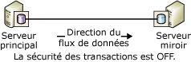
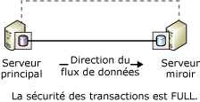
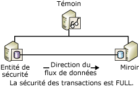

# <a name="database-mirroring-operating-modes"></a>Modes de fonctionnement de la mise en miroir de bases de données
[!INCLUDE[appliesto-ss-xxxx-xxxx-xxx-md](../../includes/appliesto-ss-xxxx-xxxx-xxx-md.md)]
  Cette rubrique décrit les modes d'opération synchrones et asynchrones des sessions de mise en miroir de bases de données.  
  
> [!NOTE]  
>  Pour une présentation de la mise en miroir de bases de données, consultez [Mise en miroir de bases de données &#40;SQL Server&#41;](../../database-engine/database-mirroring/database-mirroring-sql-server.md).  
  
  
##  <a name="TermsAndDefinitions"></a> Termes et définitions  
 Cette section présente des termes qui sont essentiels dans cette rubrique.  
  
 Mode hautes performances  
 La session de mise en miroir de bases de données s'exécute de façon asynchrone et utilise uniquement le serveur principal et le serveur miroir. La seule forme de basculement de rôle est le service forcé (avec perte de données possible).  
  
 Mode haute sécurité  
 La session de mise en miroir de bases de données s'exécute de façon synchrone et, éventuellement, utilise un témoin, ainsi que le serveur principal et le serveur miroir.  
  
 Sécurité des transactions  
 Propriété de base de données spécifique de la mise en miroir qui permet de déterminer si une session de mise en miroir de bases de données opère de manière synchrone ou asynchrone. Il existe deux niveaux de sécurité : FULL (complète) et OFF (désactivée).  
  
 Témoin  
 À utiliser uniquement avec le mode haute sécurité. Il s'agit d'une instance facultative de SQL Server qui active le serveur miroir pour déterminer s'il est nécessaire d'initier un basculement automatique. Contrairement aux deux autres partenaires de basculement, le témoin ne dessert pas la base de données. La prise en charge du basculement automatique est le seul rôle rempli par le témoin.  
  
## <a name="asynchronous-database-mirroring-high-performance-mode"></a>Mise en miroir asynchrone de bases de données (mode hautes performances)  
 Cette section décrit le fonctionnement asynchrone de la mise en miroir de bases de données, lorsqu'il convient d'utiliser le mode hautes performances, et explique comment réagir en cas de défaillance du serveur principal.  
  
> [!NOTE]  
>  La plupart des éditions de [!INCLUDE[ssCurrent](../../includes/sscurrent-md.md)] prennent uniquement en charge la mise en miroir de bases de données synchrone (« niveau complet sécurité uniquement »). Pour plus d’informations sur les éditions qui prennent en charge la mise en miroir de bases de données, consultez « Haute disponibilité (Always On) » dans [Éditions et fonctionnalités prises en charge de SQL Server 2016](../../sql-server/editions-and-supported-features-for-sql-server-2016.md).
  
 Si la sécurité des transactions est désactivée (OFF), la session de mise en miroir de bases de données fonctionne de manière asynchrone. Le fonctionnement asynchrone ne prend en charge qu'un mode d'opération : le mode hautes performances. Ce mode améliore les performances au détriment de la haute disponibilité. Le mode hautes performances utilise uniquement le serveur principal et le serveur miroir. Les problèmes survenant sur le serveur miroir n'ont jamais d'impact sur le serveur principal. En cas de perte du serveur principal, la base de données miroir est marquée comme DISCONNECTED, mais est disponible en état de secours semi-automatique.  
  
 Le mode hautes performances prend en charge une seule forme de basculement de rôle : le service forcé (avec perte de données possible), qui utilise le serveur miroir comme un serveur de secours semi-automatique. Le service forcé est l'une des réponses possibles à la défaillance du serveur principal. Comme une perte de données est possible, vous devez envisager d'autres alternatives avant de forcer le service sur le miroir. Pour plus d'informations, consultez [Réponse à la défaillance du principal](#WhenPrincipalFails), plus loin dans cette rubrique.  
  
 La figure suivante illustre la configuration d'une session à l'aide du mode hautes performances.  
  
   
  
 En mode hautes performances, dès que le serveur principal envoie le journal d'une transaction au serveur miroir, le serveur principal envoie une confirmation au client, sans attendre d'accusé de réception du serveur miroir. Les transactions sont validées sans attendre que le serveur miroir enregistre le journal sur le disque. Le fonctionnement asynchrone permet au serveur principal de s'exécuter avec une latence de transaction minimale.  
  
 Le serveur miroir tente de rester à jour par rapport aux enregistrements de journal envoyés par le serveur principal. En revanche, la base de données miroir peut rester quelque peu en arrière de la base de données principale, bien que l'écart entre les bases de données soit faible en général. Cependant, il peut devenir important si le serveur principal est soumis à une charge de travail considérable ou si le système du serveur miroir est surchargé.  
  
 **Dans cette section :**  
  
-   [Quand le mode hautes performances est-il conseillé ?](#WhenUseHighPerf)  
  
-   [Impact d'un témoin sur le mode hautes performances](#WitnessImpactOnHighPerf)  
  
-   [Réponse à la défaillance du principal](#WhenPrincipalFails)  
  
###  <a name="WhenUseHighPerf"></a> Quand le mode hautes performances est-il conseillé ?  
 Le mode hautes performances peut être utile dans un scénario de récupération après sinistre dans lequel le principal et le serveur miroir sont considérablement éloignés et où vous ne souhaitez pas que de petites erreurs affectent le serveur principal.  
  
> [!NOTE]  
>  La copie des journaux de transaction peut être un supplément à la mise en miroir de base de données et constitue une alternative favorable à la mise en miroir de base de données asynchrone. Pour plus d’informations sur les avantages de la copie des journaux de transaction, consultez [Solutions haute disponibilité &#40;SQL Server&#41;](../../sql-server/failover-clusters/high-availability-solutions-sql-server.md). Pour plus d’informations sur l’utilisation de l’envoi de journaux avec la mise en miroir de bases de données, consultez [Mise en miroir de bases de données et copie des journaux de transaction &#40;SQL Server&#41;](../../database-engine/database-mirroring/database-mirroring-and-log-shipping-sql-server.md).  
  
###  <a name="WitnessImpactOnHighPerf"></a> Impact d'un témoin sur le mode hautes performances  
 Si vous utilisez Transact-SQL pour configurer le mode hautes performances, chaque fois que la propriété SAFETY est désactivée (OFF), nous vous conseillons vivement d'affecter également la valeur OFF à la propriété WITNESS. Un témoin peut coexister avec le mode hautes performances, mais le témoin ne fournit aucun avantage et introduit un risque.  
  
 Si le témoin est déconnecté de la session lorsqu'un des partenaires s'arrête, la base de données n'est plus disponible. Cela s'explique par le fait que même si le mode hautes performance s ne requiert pas de témoin, si un témoin est défini, la session requiert un quorum composé d'au moins deux instances de serveur. Si la session perd le quorum, elle ne peut pas servir la base de données.  
  
 Lorsqu'un témoin est défini dans une session en mode hautes performances, l'application du quorum signifie que :  
  
-   Si le serveur miroir est perdu, le serveur principal doit être connecté au témoin. Sinon, le serveur principal met sa base de données hors connexion jusqu'à ce que le témoin ou le serveur miroir réintègre la session.  
  
-   Si le serveur principal est perdu, forcer le service sur le serveur miroir exige que le serveur miroir soit connecté au témoin.  
  
> [!NOTE]  
>  Pour plus d’informations sur les types de quorums, consultez [Quorum : effets d’un témoin sur la disponibilité de la base de données &#40;Mise en miroir de bases de données&#41;](../../database-engine/database-mirroring/quorum-how-a-witness-affects-database-availability-database-mirroring.md).  
  
###  <a name="WhenPrincipalFails"></a> Réponse à la défaillance du principal  
 Si le principal se bloque, le propriétaire de la base de données dispose des options suivantes :  
  
-   Laisser la base de données indisponible jusqu'à ce que le principal soit à nouveau disponible.  
  
     Si la base de données principale et son journal des transactions interagissent, cette option conserve l'ensemble des transactions validées aux dépens de la disponibilité.  
  
-   Arrêter la session de mise en miroir de bases de données, mettre à jour manuellement la base de données, puis lancer une nouvelle session de mise en miroir de bases de données.  
  
     Si vous perdez la base de données principale alors que le serveur principal est toujours en cours d'exécution, tentez immédiatement de sauvegarder la fin du journal dans la base de données principale. Si cette opération de sauvegarde réussit, la suppression de la mise en miroir peut constituer la meilleure solution. Une fois la mise en miroir supprimée, vous pouvez restaurer le journal dans la base de données miroir précédente, ce qui vous permet de préserver l'ensemble des données.  
  
    > [!NOTE]  
    >  Si l'opération de sauvegarde de la fin du journal a échoué et vous ne pouvez pas attendre le rétablissement du serveur principal, envisagez de forcer le service, ce qui offre l'avantage de conserver l'état de la session.  
  
-   Service forcé (avec perte de données potentielle) sur le serveur miroir.  
  
     Le service forcé est exclusivement une méthode de récupération en cas d'urgence qui doit être utilisée de manière limitée. Il n'est possible de forcer le service que si le serveur principal est hors service, si la session est asynchrone (sécurité des transactions désactivée) et si la session ne possède pas de témoin (la propriété WITNESS a la valeur OFF) ou si le témoin est connecté au serveur miroir (c'est-à-dire, qu'ils ont un quorum).  
  
     Si vous forcez le service, le serveur miroir est contraint de jouer le rôle de principal et de servir sa propre copie de la base de données aux clients. En cas de service forcé, les journaux des transactions que le principal n'a pas encore envoyés au serveur miroir sont perdus. Par conséquent, il est conseillé de limiter le service forcé aux situations où un risque de perte de données est acceptable et où la disponibilité immédiate des bases de données est essentielle. Pour plus d’informations sur le mode de fonctionnement du service forcé et sur les méthodes conseillées pour son utilisation, consultez [Basculement de rôle durant une session de mise en miroir de bases de données &#40;SQL Server&#41;](../../database-engine/database-mirroring/role-switching-during-a-database-mirroring-session-sql-server.md).  
  
##  <a name="Sync"></a> Mise en miroir synchrone de bases de données (mode Haute sécurité)  
 Cette section décrit le fonctionnement synchrone de la mise en miroir de bases de données, ainsi que des autres modes haute sécurité (avec basculement automatique et sans basculement automatique), et fournit des informations sur le rôle de témoin dans le basculement automatique.  
  
 Lorsque la sécurité des transactions est définie à FULL, la session de mise en miroir de la base de données s'exécute en mode haute sécurité et fonctionne de manière synchrone après une phase initiale de synchronisation. Cette section décrit en détail les sessions de mise en miroir de bases de données qui sont configurées pour fonctionner de manière synchrone.  
  
 Pour passer en mode synchrone pour une session, le serveur miroir doit synchroniser la base de données miroir avec la base de données principale. Lorsque la session commence, le serveur principal commence à envoyer son journal actif au serveur miroir. Le serveur miroir écrit aussi vite que possible tous les enregistrements de journal entrants sur le disque. Une fois cette opération effectuée, les bases de données sont synchronisées. Tant que les partenaires restent en communication, les bases de données sont synchronisées.  
  
> [!NOTE]  
>  Pour surveiller les modifications d'état dans une session de mise en miroir de base de données, utilisez la classe d'événements **Database Mirroring State Change** . Pour plus d'informations, voir [Database Mirroring State Change Event Class](../../relational-databases/event-classes/database-mirroring-state-change-event-class.md).  
  
 Après que la synchronisation a pris fin, chaque transaction validée dans la base de données principale l'est également sur le serveur miroir, ce qui garantit la protection des données. En effet, la transaction n'est validée dans la base de données principale qu'une fois que le serveur principal a reçu un message du serveur miroir lui indiquant que le journal des transactions est bien renforcé sur le disque. Notez que le fait d'attendre ce message augmente la latence de la transaction.  
  
 Le temps nécessaire à la synchronisation dépend essentiellement du décalage de la base de données miroir par rapport à la base de données principale au début de la session (ce qui se mesure par le nombre de d'enregistrements du journal initialement reçus du serveur principal), de la charge de travail sur la base de données principale et de la vitesse du système de mise en miroir. Après la synchronisation d'une session, le journal renforcé qui doit être réutilisé sur la base de données miroir reste dans la file d'attente de restauration par progression.  
  
 Dès que la base de données miroir est synchronisée, l'état des deux copies de la base de données devient SYNCHRONIZED.  
  
 L'opération se déroule de la manière suivante :  
  
1.  Lors de la réception d'une transaction d'un client, le serveur principal l'écrit dans le journal des transactions.  
  
2.  Le serveur principal écrit la transaction dans la base de données, et simultanément, il envoie l'enregistrement du journal au serveur miroir. Le serveur principal attend un accusé de réception du serveur miroir avant de confirmer un de ces éléments au client : une validation de transaction ou une restauration.  
  
3.  Le serveur miroir renforce le journal sur le disque et retourne un accusé de réception au serveur principal.  
  
4.  Dès qu'il reçoit l'accusé de réception du serveur miroir, le serveur principal envoie un message de confirmation au client.  
  
 Le mode haute sécurité protège vos données en exigeant leur synchronisation entre deux emplacements. Toutes les transactions validées seront écrites sur le disque du serveur miroir.  
  
 **Dans cette section :**  
  
-   [Mode Haute sécurité sans basculement automatique](#HighSafetyWithOutAutoFailover)  
  
-   [Mode Haute sécurité avec basculement automatique](#HighSafetyWithAutoFailover)  
  
###  <a name="HighSafetyWithOutAutoFailover"></a> Mode Haute sécurité sans basculement automatique  
 La figure suivante illustre la configuration du mode haute sécurité sans basculement automatique. La configuration implique uniquement les deux partenaires.  
  
   
  
 Lorsque les partenaires sont connectés et que la base de données est déjà synchronisée, un basculement manuel est possible. Si l'instance du serveur miroir s'arrête, l'instance du serveur principal n'est pas affectée par cet arrêt et s'exécute de manière exposée (à savoir, sans mise en miroir des données). En cas de perte du serveur principal, le miroir est suspendu mais le service peut être forcé sur le serveur miroir (perte de données possible). Pour plus d’informations, consultez [Basculement de rôle durant une session de mise en miroir de bases de données &#40;SQL Server&#41;](../../database-engine/database-mirroring/role-switching-during-a-database-mirroring-session-sql-server.md).  
  
###  <a name="HighSafetyWithAutoFailover"></a> Mode Haute sécurité avec basculement automatique  
 Pour garantir une disponibilité optimale, le basculement automatique s'assure que la base de données est toujours desservie après la perte d'un serveur. Le basculement automatique exige que la session dispose d'une troisième instance de serveur (le *témoin*) résidant de préférence sur un troisième ordinateur. La figure suivante illustre la configuration d'une session en mode haute sécurité avec basculement automatique.  
  
   
  
 Contrairement aux deux autres, le témoin ne dessert pas la base de données. Le témoin prend simplement en charge le basculement automatique en vérifiant que le serveur principal est activé et qu'il fonctionne. Le serveur miroir lance le basculement automatique uniquement si le miroir et le témoin restent connectés l'un à l'autre après que tous les deux aient été déconnectés du serveur principal.  
  
 Lorsque vous définissez un témoin, la session nécessite un *quorum*, c'est-à-dire une relation entre au moins deux instances de serveur qui permet de rendre disponible la base de données. Pour plus d’informations, consultez [Témoin de mise en miroir de base de données](../../database-engine/database-mirroring/database-mirroring-witness.md) et [Quorum : effets d’un témoin sur la disponibilité de la base de données &#40;Mise en miroir de bases de données&#41;](../../database-engine/database-mirroring/quorum-how-a-witness-affects-database-availability-database-mirroring.md).  
  
 Le basculement automatique nécessite les conditions suivantes :  
  
-   La base de données est déjà synchronisée.  
  
-   L'échec survient lorsque les trois instances de serveur sont connectées et le témoin et le serveur miroir sont toujours connectés.  
  
 La perte d'un partenaire a les effets suivants :  
  
-   Si le serveur principal devient indisponible dans les conditions énoncées ci-avant, il y a basculement automatique. Le serveur miroir devient le principal et il propose sa base de données comme base de données principale.  
  
-   Si le serveur principal devient indisponible lorsque ces conditions sont respectées, il est possible de forcer le service (avec perte de données possible). Pour plus d’informations, consultez [Basculement de rôle durant une session de mise en miroir de bases de données &#40;SQL Server&#41;](../../database-engine/database-mirroring/role-switching-during-a-database-mirroring-session-sql-server.md).  
  
-   Si le seul serveur miroir devient indisponible, le principal et le serveur témoin continuent de fonctionner.  
  
 Si la session perd son témoin, un quorum nécessite l'intervention des deux partenaires. Si l'un des partenaires perd le quorum, les deux partenaires perdent le quorum, et la base de données n'est plus disponible tant que le quorum n'a pas été rétabli. Cet impératif de quorum garantit que, en l'absence d'un témoin, la base de données ne s'exécute jamais de manière *exposée*, c'est-à-dire sans être mise en miroir.  
  
> [!NOTE]  
>  Si vous pensez que le témoin va rester déconnecté pendant un laps de temps important, nous vous recommandons de le supprimer de votre session jusqu'à ce qu'il devienne disponible.  
  
##  <a name="TsqlSettingsAndOpModes"></a> Paramètres Transact-SQL et modes d'opération de mise en miroir de bases de données  
 Cette section décrit une session de mise en miroir de bases de données du point de vue des paramètres inclus dans la clause ALTER DATABASE et des états de la base de données mise en miroir ainsi que du témoin, le cas échéant. Cette section est destinée aux utilisateurs chargés de mettre en miroir la base de données prioritairement ou exclusivement à l'aide de [!INCLUDE[tsql](../../includes/tsql-md.md)]plutôt que [!INCLUDE[ssManStudioFull](../../includes/ssmanstudiofull-md.md)].  
  
> [!TIP]  
>  Au lieu d'utiliser [!INCLUDE[tsql](../../includes/tsql-md.md)], vous pouvez aussi contrôler le mode d'opération d'une session dans l'Explorateur d'objets à travers la page **Mise en miroir** se trouvant dans la boîte de dialogue **Propriétés de la base de données** . Pour plus d'informations, consultez [Établir une session de mise en miroir de bases de données au moyen de l’authentification Windows &#40;SQL Server Management Studio&#41;](../../database-engine/database-mirroring/establish-database-mirroring-session-windows-authentication.md).  
  
 **Dans cette section :**  
  
-   [Comment la sécurité liée aux transactions et l'état du témoin affectent le mode d'opération](#TxnSafetyAndWitness)  
  
-   [Affichage du paramètre de sécurité et de l'état du témoin](#ViewWitness)  
  
-   [Facteurs influant sur le comportement provoqué par la perte du serveur principal](#FactorsOnLossOfPrincipal)  
  
###  <a name="TxnSafetyAndWitness"></a> Comment la sécurité liée aux transactions et l'état du témoin affectent le mode d'opération  
 Le mode d'opération d'une session est déterminé par la combinaison entre le paramètre relatif à la sécurité des transactions et l'état du témoin. Le propriétaire de la base de données peut à tout moment modifier le niveau de sécurité des transactions et ajouter ou supprimer le témoin.  
  
 **Dans cette section :**  
  
-   [Transaction Safety](#TxnSafety)  
  
-   [État du serveur](#WitnessState)  
  
####  <a name="TxnSafety"></a> Transaction Safety  
 La sécurité des transactions est une propriété de base de données spécifique de la mise en miroir qui permet de déterminer si une session de mise en miroir de bases de données opère de manière synchrone ou asynchrone. Il existe deux niveaux de sécurité : FULL (complète) et OFF (désactivée).  
  
-   SAFETY FULL  
  
     La sécurité de transactions complète entraîne le mode d'opération asynchrone de la session, en mode haute sécurité. En présence d'un témoin, une session prend en charge le basculement automatique.  
  
     Lorsque vous créez une session à l'aide des instructions ALTER DATABASE, la session démarre avec le paramètre SAFETY défini à FULL, ce qui signifie qu'elle débute en mode haute sécurité. Après démarrage de la session, vous pouvez ajouter un témoin.  
  
     Pour plus d’informations, consultez [Mise en miroir de bases de données synchrone (mode Haute sécurité)](#Sync), plus haut dans cette rubrique.  
  
-   SAFETY OFF  
  
     Désactiver la sécurité des transactions entraîne le mode d'opération asynchrone de la session, en mode hautes performances. Si la propriété SAFETY est définie à OFF, la propriété WITNESS doit également être définie sur cette valeur (valeur par défaut). Pour obtenir des informations sur l’impact du témoin en mode hautes performances, consultez la section [État du témoin](#WitnessState), plus loin dans cette rubrique. Pour plus d’informations sur le fonctionnement avec la sécurité des transactions désactivée, consultez [Mise en miroir de bases de données asynchrone (mode Hautes performances)](#asynchronous-database-mirroring-high-performance-mode), plus haut dans cette rubrique.  
  
 Le paramètre de sécurité des transactions de la base de données est enregistré pour chaque serveur partenaire dans la vue de catalogue **sys.database_mirroring** des colonnes **mirroring_safety_level** et **mirroring_safety_level_desc**. Pour plus d’informations, consultez [sys.database_mirroring &#40;Transact-SQL&#41;](../../relational-databases/system-catalog-views/sys-database-mirroring-transact-sql.md).  
  
 Le propriétaire de la base de données peut modifier le niveau de sécurité des transactions à tout moment.  
  
####  <a name="WitnessState"></a> État du témoin  
 Si un témoin a été défini, I'utilisation d'un quorum justifiant en permanence l'importance du témoin est nécessaire.  
  
 S'il existe, le témoin affiche l'un des deux états suivants :  
  
-   Lorsque le témoin est connecté à un partenaire, il apparaît à l'état CONNECTED (connecté) par rapport au partenaire et possède un quorum avec ce dernier. Dans ce cas, la base de données peut être mise à disposition même si l'un des partenaires n'est pas disponible.  
  
-   Lorsque le témoin existe mais n'est pas connecté à un partenaire, il apparaît à l'état UNKNOWN (inconnu) ou DISCONNECTED (déconnecté) par rapport au partenaire. Dans ce cas, le témoin ne dispose d'aucun quorum avec ce partenaire et la base de données devient indisponible si les partenaires ne sont pas connectés entre eux.  
  
 Pour plus d’informations sur les quorums, consultez [Quorum : effets d’un témoin sur la disponibilité de la base de données &#40;Mise en miroir de bases de données&#41;](../../database-engine/database-mirroring/quorum-how-a-witness-affects-database-availability-database-mirroring.md).  
  
 L’état de chaque témoin d’une instance de serveur est enregistré dans la vue de catalogue **sys.database_mirroring** au niveau des colonnes **mirroring_witness_state** et **mirroring_witness_state_desc**. Pour plus d’informations, consultez [sys.database_mirroring &#40;Transact-SQL&#41;](../../relational-databases/system-catalog-views/sys-database-mirroring-transact-sql.md).  
  
 Le tableau suivant répertorie le mode d'opération d'une session dépendant de son paramètre relatif à la sécurité des transactions et de l'état du témoin.  
  
|Mode d'opération|Sécurité des transactions|État du serveur|  
|--------------------|------------------------|-------------------|  
|Mode hautes performances|OFF|NULL (pas de témoin)**|  
|Mode Haute sécurité sans basculement automatique|FULL|NULL (pas de témoin)|  
|Mode haute sécurité avec basculement automatique*|FULL|CONNECTED|  
  
 *Si le témoin est déconnecté, nous vous recommandons de définir la propriété WITNESS à OFF jusqu’à ce que l’instance de serveur témoin devienne disponible.  
  
 **Si un témoin est présent en mode hautes performances, il ne participe pas à la session. Cependant, pour rendre la base de données disponible, deux au moins des instances du serveur doivent rester connectées. Par conséquent, nous vous recommandons de conserver la propriété WITNESS défini à OFF dans les sessions en mode hautes performances. Pour plus d’informations, consultez [Quorum : effets d’un témoin sur la disponibilité de la base de données &#40;mise en miroir de bases de données&#41;](../../database-engine/database-mirroring/quorum-how-a-witness-affects-database-availability-database-mirroring.md).  
  
###  <a name="ViewWitness"></a> Affichage du paramètre de sécurité et de l'état du témoin  
 Pour afficher le paramètre de sécurité et l’état du témoin d’une base de données, utilisez la vue de catalogue **sys.database_mirroring** . Les colonnes les plus pertinentes sont les suivantes :  
  
|Factor|Colonnes|Description|  
|------------|-------------|-----------------|  
|Sécurité des transactions|**mirroring_safety_level** ou **mirroring_safety_level_desc**|Paramètre de sécurité des transactions pour les mises à jour de la base de données en miroir pouvant être défini sur l'une des valeurs suivantes :<br /><br /> UNKNOWN<br /><br /> OFF<br /><br /> FULL<br /><br /> NULL : la base de données n'est pas en ligne.|  
|Un témoin existe-t-il ?|**mirroring_witness_name**|Nom de serveur du témoin mis en miroir de la base de données ou mention NULL, indiquant que le témoin n'existe pas.|  
|État du serveur|**mirroring_witness_state** ou **mirroring_witness_state_desc**|État du témoin dans la base de données d'un partenaire donné :<br /><br /> UNKNOWN<br /><br /> CONNECTED<br /><br /> DISCONNECTED<br /><br /> NULL : aucun témoin n'existe ou la base de données n'est pas en ligne.|  
  
 Par exemple, saisissez sur le principal ou sur le serveur miroir :  
  
```  
SELECT mirroring_safety_level_desc, mirroring_witness_name, mirroring_witness_state_desc FROM sys.database_mirroring  
```  
  
 Pour plus d’informations sur cette vue de catalogue, consultez [sys.database_mirroring &#40;Transact-SQL&#41;](../../relational-databases/system-catalog-views/sys-database-mirroring-transact-sql.md).  
  
###  <a name="FactorsOnLossOfPrincipal"></a> Facteurs influant sur le comportement provoqué par la perte du serveur principal  
 Le tableau suivant répertorie l'effet combiné du paramètre de sécurité propre aux transactions, de l'état de la base de données et de l'état du témoin sur le comportement adopté par une session de mise en miroir lors de la perte du serveur principal.  
  
|Sécurité des transactions|État de la mise en miroir d'une base de données miroir|État du serveur|Comportement lors de la perte de la connexion au principal|  
|------------------------|----------------------------------------|-------------------|-------------------------------------|  
|FULL|SYNCHRONIZED|CONNECTED|Basculement automatique.|  
|FULL|SYNCHRONIZED|DISCONNECTED|Le serveur miroir s'arrête, le basculement est alors impossible et la base de données n'est plus disponible.|  
|OFF|SUSPENDED ou DISCONNECTED|NULL (pas de témoin)|Le service peut être forcé sur le serveur miroir (perte de données possible).|  
|FULL|SYNCHRONIZING ou SUSPENDED|NULL (pas de témoin)|Le service peut être forcé sur le serveur miroir (perte de données possible).|  
  
##  <a name="RelatedTasks"></a> Tâches associées  
  
-   [Ajouter ou remplacer un témoin de mise en miroir de bases de données &#40;SQL Server Management Studio&#41;](../../database-engine/database-mirroring/add-or-replace-a-database-mirroring-witness-sql-server-management-studio.md)  
  
-   [Établir une session de mise en miroir de bases de données au moyen de l’authentification Windows &#40;SQL Server Management Studio&#41;](../../database-engine/database-mirroring/establish-database-mirroring-session-windows-authentication.md)  
  
-   [Ajouter un témoin de mise en miroir de bases de données à l’aide de l’authentification Windows &#40;Transact-SQL&#41;](../../database-engine/database-mirroring/add-a-database-mirroring-witness-using-windows-authentication-transact-sql.md)  
  
-   [Supprimer le témoin d’une session de mise en miroir de bases de données &#40;SQL Server&#41;](../../database-engine/database-mirroring/remove-the-witness-from-a-database-mirroring-session-sql-server.md)  
  
-   [Modifier la sécurité des transactions dans une session de mise en miroir de bases de données &#40;Transact-SQL&#41;](../../database-engine/database-mirroring/change-transaction-safety-in-a-database-mirroring-session-transact-sql.md)  
  
## <a name="see-also"></a> Voir aussi  
 [Surveillance de la mise en miroir de bases de données &#40;SQL Server&#41;](../../database-engine/database-mirroring/monitoring-database-mirroring-sql-server.md)   
 [Témoin de mise en miroir de base de données](../../database-engine/database-mirroring/database-mirroring-witness.md)  
  
  
