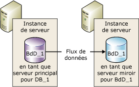
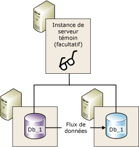
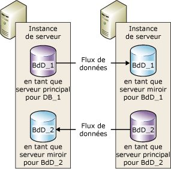

# Mise en miroir de bases de données (SQL Server)
[!INCLUDE[appliesto-ss-xxxx-xxxx-xxx-md](../../includes/appliesto-ss-xxxx-xxxx-xxx-md.md)]
    
> [!NOTE]  
>  [!INCLUDE[ssNoteDepFutureAvoid](../../includes/ssnotedepfutureavoid-md.md)] Utilisez plutôt [!INCLUDE[ssHADR](../../includes/sshadr-md.md)].  
  
 La*mise en miroir de bases de données* est une solution permettant d'accroître la disponibilité d'une base de données [!INCLUDE[ssNoVersion](../../includes/ssnoversion-md.md)] . La mise en miroir est implémentée individuellement pour chaque base de données et fonctionne uniquement avec les bases de données qui utilisent le mode de restauration complète.  
  
> [!IMPORTANT]  
>  Pour plus d’informations sur la prise en charge de la mise en miroir de bases de données, les restrictions, les conditions préalables, les recommandations relatives à la configuration des serveurs partenaires et les recommandations relatives au déploiement de la mise en miroir de bases de données, consultez [Conditions préalables, limitations et recommandations relatives à la mise en miroir de bases de données](../../database-engine/database-mirroring/prerequisites-restrictions-and-recommendations-for-database-mirroring.md).  
  
  
##   Avantages de la mise en miroir de bases de données  
 La mise en miroir de bases de données est une stratégie simple qui présente les avantages suivants :  
  
-   Elle augmente la disponibilité d'une base de données.  
  
     En cas de sinistre, en mode haute sécurité avec basculement automatique, le basculement met rapidement en ligne la copie de secours de la base de données (sans perte de données). Dans les autres modes de fonctionnement, l'administrateur de base de données peut opter pour le service forcé (avec perte de données possible) de la copie de secours de la base de données. Pour plus d'informations, consultez [Basculement de rôle](#RoleSwitching), plus loin dans cette rubrique.  
  
-   Elle augmente la protection des données.  
  
     La mise en miroir de bases de données procure une redondance des données complète ou presque complète, selon que le mode de fonctionnement est haute sécurité ou hautes performances. Pour plus d'informations, consultez [Modes de fonctionnement](#OperatingModes), plus loin dans cette rubrique.  
  
     Un serveur partenaire de mise en miroir de bases de données qui s'exécute sur [!INCLUDE[ssEnterpriseEd10](../../includes/ssenterpriseed10-md.md)] ou versions ultérieures tente de résoudre automatiquement certains types d'erreurs qui empêchent la lecture d'une page de données. Un partenaire qui ne peut pas lire une page demande une copie actualisée à un autre partenaire. Si cette demande aboutit, la page illisible est remplacée par la copie, ce qui permet généralement de résoudre l'erreur. Pour plus d'informations, consultez [Réparation de page automatique &#40;groupes de disponibilité : mise en miroir de bases de données&#41;](../../sql-server/failover-clusters/automatic-page-repair-availability-groups-database-mirroring.md).  
  
-   Elle augmente la disponibilité de la base de données de production au cours des mises à niveau.  
  
     Pour réduire le temps mort pour une base de données mise en miroir, vous pouvez mettre à niveau séquentiellement les instances de [!INCLUDE[ssNoVersion](../../includes/ssnoversion-md.md)] qui hébergent les partenaires de basculement. Elle n'implique le temps mort que d'un basculement unique. Cette forme de mise à niveau s'appelle une *mise à niveau propagée*. Pour plus d’informations, consultez [Mise à niveau des instances en miroir](../../database-engine/database-mirroring/upgrading-mirrored-instances.md).  
  
  
##   Termes et définitions de mise en miroir de bases de données  
 basculement automatique  
 Processus selon lequel, lorsque le serveur principal devient indisponible, le serveur miroir assure le rôle du serveur principal et met sa copie de la base de données en ligne en tant que base de données principale.  
  
 partenaires de basculement  
 Les deux instances de serveur (serveur principal ou serveur miroir) qui agissent comme partenaires de basculement de rôle pour une base de données mise en miroir.  
  
 service forcé  
 Basculement initialisé par le propriétaire de la base de données lors de la défaillance du serveur principal, qui transfère le service à la base de données miroir alors que son état est inconnu.  
  
 Mode hautes performances  
 La session de mise en miroir de bases de données s'exécute de façon asynchrone et utilise uniquement le serveur principal et le serveur miroir. La seule forme de basculement de rôle est le service forcé (avec perte de données possible).  
  
 Mode haute sécurité  
 La session de mise en miroir de bases de données s'exécute de façon synchrone et, éventuellement, utilise un témoin, ainsi que le serveur principal et le serveur miroir.  
  
 basculement manuel  
 Basculement initialisé par le propriétaire de la base de données, alors que le serveur principal est en cours d'exécution, qui transfère le service de la base de données principale à la base de données miroir pendant qu'elles sont dans un état synchronisé.  
  
 base de données miroir  
 Copie de la base de données qui est généralement entièrement synchronisée avec la base de données principale.  
  
 serveur miroir  
 Dans une configuration de mise en miroir de bases de données, instance de serveur sur laquelle réside la base de données miroir.  
  
 base de données principale  
 Dans la mise en miroir de bases de données, une base de données en lecture/écriture dont les enregistrements du journal des transactions sont appliqués à une copie en lecture seule de la base de données (base de données miroir).  
  
 serveur principal  
 Dans la mise en miroir de bases de données, serveur partenaire dont la base de données est actuellement la base de données principale.  
  
 file d'attente de restauration par progression  
 Enregistrements du journal des transactions reçus en attente sur le disque d'un serveur miroir.  
  
 rôle  
 Le serveur principal et le serveur miroir exécutent des rôles complémentaires de serveur principal et miroir. Le rôle de témoin est éventuellement exécuté par une troisième instance de serveur.  
  
 Basculement de rôle  
 Opération selon laquelle le miroir prend le rôle principal.  
  
 file d'attente d'envoi  
 Enregistrements du journal des transactions non envoyés qui se sont accumulés sur le disque du journal du serveur principal.  
  
 session  
 Relations qui se produisent pendant la mise en mémoire entre le serveur principal, le serveur miroir et le serveur témoin (s'il existe).  
  
 Après le démarrage ou la reprise d'une session de mise en miroir, il s'agit du processus consistant à envoyer au serveur miroir les enregistrements de journal de la base de données principale qui se sont accumulés sur le serveur principal. Le serveur miroir écrit alors ces enregistrements de journal sur le disque le plus rapidement possible pour rester à jour par rapport au serveur principal.  
  
 Sécurité des transactions  
 Propriété de base de données spécifique de la mise en miroir qui permet de déterminer si une session de mise en miroir de bases de données opère de manière synchrone ou asynchrone. Il existe deux niveaux de sécurité : FULL (complète) et OFF (désactivée).  
  
 Témoin  
 À utiliser uniquement avec le mode haute sécurité. Il s'agit d'une instance facultative de SQL Server qui active le serveur miroir pour déterminer s'il est nécessaire d'initier un basculement automatique. Contrairement aux deux autres partenaires de basculement, le témoin ne dessert pas la base de données. La prise en charge du basculement automatique est le seul rôle rempli par le témoin.  
  
  
##   Présentation de la mise en miroir de bases de données  
 La mise en miroir de bases de données conserve deux exemplaires d'une même base de données qui doivent résider sur des instances de serveur distinctes du [!INCLUDE[ssDEnoversion](../../includes/ssdenoversion-md.md)]. En règle générale, ces instances de serveur résident sur des ordinateurs dans des emplacements distincts. Le démarrage de la mise en miroir de bases de données sur une base de données initie une relation, appelée *session de mise en miroir de bases de données*, entre ces instances de serveur.  
  
 Une instance de serveur sert la base de données aux clients (le *serveur principal*). L’autre instance agit comme un serveur de secours (le *serveur miroir*), selon la configuration et l’état de la session de mise en miroir. Lorsqu'une session de mise en miroir de bases de données est synchronisée, la mise en miroir de bases de données procure un serveur de secours automatique qui prend en charge le basculement rapide sans perte de données des transactions validées. Lorsque la session n'est pas synchronisée, le serveur miroir est généralement disponible en tant que serveur de secours semi-automatique (avec une perte de données possible).  
  
 Le serveur principal et le serveur miroir communiquent et collaborent en tant que *serveurs partenaires* dans une *session de mise en miroir de bases de données*. Les deux serveurs partenaires jouent des rôles complémentaires dans la session : le *rôle principal* et le *rôle de miroir*. À tout moment, un partenaire détient le rôle principal, alors que l'autre partenaire détient le rôle miroir. Chaque serveur partenaire est décrit comme étant *propriétaire* de son rôle actif. Le serveur partenaire qui possède le rôle principal est appelé *serveur principal*, et sa copie de la base de données est la base de données principale active. Le serveur partenaire qui possède le rôle miroir est appelé *serveur miroir*, et sa copie de la base de données est la base de données miroir active. Lors du déploiement de la mise en miroir de bases de données dans un environnement de production, la base de données principale correspond à la *base de données de production*.  
  
 La mise en miroir de bases de données implique la *répétition* de chaque opération d'insertion, de mise à jour et de suppression effectuée sur la base de données principale aussi rapidement que possible sur la base de données miroir. Cette répétition est accomplie en envoyant un flux des enregistrements du journal de transactions actif vers le serveur miroir, ce qui applique les enregistrements du journal à la base de données miroir, en séquence, aussi rapidement que possible. Contrairement à la réplication, qui fonctionne au niveau logique, la mise en miroir de bases de données fonctionne au niveau de l'enregistrement du journal physique. À compter de [!INCLUDE[ssKatmai](../../includes/sskatmai-md.md)], le serveur principal compresse le flux des enregistrements du journal de transactions avant de l'envoyer vers le serveur miroir. Cette compression de journal se produit dans toutes les sessions de mise en miroir.  
  
> [!NOTE]  
>  Une instance de serveur peut participer à plusieurs sessions simultanées de mise en miroir de bases de données avec des partenaires identiques ou différents. Une instance de serveur peut être partenaire dans certaines sessions et témoin dans d'autres. L'instance de serveur miroir doit exécuter la même édition de [!INCLUDE[ssNoVersion](../../includes/ssnoversion-md.md)].  
  
 **Dans cette section :**  
  
-   [Modes de fonctionnement](#OperatingModes)  
  
-   [Basculement de rôle](#RoleSwitching)  
  
-   [Sessions simultanées](#ConcurrentSessions)  
  
-   [Connexions clientes](#ClientConnections)  
  
-   [Effets de la suspension d'une session sur le journal des transactions du principal](#ImpactOfPausing)  
  
  
###   Modes de fonctionnement  
 Une session de mise en miroir de bases de données s'exécute de manière synchrone ou asynchrone. En fonctionnement asynchrone, les transactions sont validées sans attendre que le serveur miroir enregistre le journal sur le disque, ce qui augmente au maximum les performances. En fonctionnement synchrone, une transaction est validée sur les deux serveurs partenaires, mais au prix d'une latence accrue des transactions.  
  
 Il existe deux modes de fonctionnement de la mise en miroir. L’un d’entre eux, le *mode haute sécurité* , prend en charge le fonctionnement synchrone. En mode haute sécurité, lorsqu'une session démarre, le serveur miroir synchronise la base de données miroir avec la base de données principale le plus rapidement possible. Dès que les bases de données sont synchronisées, une transaction est validée sur les deux serveurs partenaires, mais au prix d'une latence accrue des transactions.  
  
 Le deuxième mode de fonctionnement, le *mode hautes performances*, s’exécute de manière asynchrone. Le serveur miroir tente de rester à jour par rapport aux enregistrements de journal envoyés par le serveur principal. La base de données miroir peut rester quelque peu en arrière de la base de données principale. Toutefois, l'écart entre les bases de données est faible en général. Cependant, cet écart peut devenir important si le serveur principal est soumis à une charge de travail considérable ou si le système du serveur miroir est surchargé.  
  
 En mode hautes performances, dès que le serveur principal envoie un enregistrement du journal au serveur miroir, le serveur principal envoie une confirmation au client. Il n'attend pas d'accusé de réception du serveur miroir. Cela signifie que les transactions sont validées sans attendre que le serveur miroir enregistre le journal sur le disque. Ce fonctionnement asynchrone permet au serveur principal de s'exécuter avec une latence de transaction minimale, au risque de perdre des données.  
  
 Toutes les sessions de mise en miroir de bases de données prennent en charge un seul serveur principal et un seul serveur miroir. Cette configuration est illustrée dans la figure ci-dessous.  
  
   
  
 Le mode haute sécurité avec basculement automatique requiert une troisième instance de serveur, appelée *témoin*. Contrairement aux deux autres, le témoin ne dessert pas la base de données. Le témoin prend en charge le basculement automatique en vérifiant que le serveur principal est activé et qu'il fonctionne. Le serveur miroir lance le basculement automatique uniquement si le miroir et le témoin restent connectés l'un à l'autre après que tous les deux aient été déconnectés du serveur principal.  
  
 L'illustration ci-dessous montre une configuration incluant un témoin.  
  
   
  
 Pour plus d'informations, consultez [Basculement de rôle](#RoleSwitching), plus loin dans cette rubrique.  
  
> [!NOTE]  
>  L'établissement d'une nouvelle session de mise en miroir ou l'ajout d'un témoin à une configuration de mise en miroir existante requiert que toutes les instances de serveur concernées exécutent la même version de [!INCLUDE[ssNoVersion](../../includes/ssnoversion-md.md)]. Cependant, lorsque vous mettez à niveau vers [!INCLUDE[ssKatmai](../../includes/sskatmai-md.md)] ou une version ultérieure, les versions des instances concernées peuvent varier. Pour plus d’informations, consultez [Mise à niveau des instances en miroir](../../database-engine/database-mirroring/upgrading-mirrored-instances.md).  
  
  
####   Sécurité des transactions et modes de fonctionnement  
 Le fait qu'un mode de fonctionnement soit synchrone ou asynchrone dépend du paramétrage de la sécurité des transactions. Si vous utilisez exclusivement [!INCLUDE[ssManStudioFull](../../includes/ssmanstudiofull-md.md)] pour configurer la mise en miroir de bases de données, les paramètres de sécurité des transactions sont configurés automatiquement lorsque vous sélectionnez le mode de fonctionnement.  
  
 Si vous utilisez [!INCLUDE[tsql](../../includes/tsql-md.md)] pour configurer la mise en miroir de bases de données, vous devez comprendre comment définir la sécurité des transactions. La sécurité des transactions est contrôlée par la propriété SAFETY de l'instruction ALTER DATABASE. Sur une base de données dont la mise en miroir est en cours, SAFETY a la valeur FULL ou OFF.  
  
-   Si l'option SAFETY a la valeur FULL, l'opération de mise en miroir de bases de données est synchrone après la phase de synchronisation initiale. Si un témoin fonctionne en mode haute sécurité, la session prend en charge le basculement automatique.  
  
-   Si l'option SAFETY a la valeur OFF, l'opération de mise en miroir de bases de données est asynchrone. La session s'exécute en mode hautes performances et l'option WITNESS doit également avoir la valeur OFF.  
  
 Pour en savoir plus, voir [Database Mirroring Operating Modes](../../database-engine/database-mirroring/database-mirroring-operating-modes.md).  
  
  
###   Basculement de rôle  
 Dans le contexte d'une session de mise en miroir de bases de données, le rôle principal et le rôle miroir sont généralement interchangeables lors d'un processus appelé *basculement de rôle*. Le basculement de rôle implique le transfert du rôle principal au serveur miroir. Lors du basculement de rôle, le serveur miroir agit en tant que *partenaire de basculement* pour le serveur principal. Lorsqu'un basculement automatique se produit, le serveur miroir adopte le rôle principal et met en ligne sa copie de la base de données en tant que nouvelle base de données principale. L'ancien serveur principal, s'il est disponible, adopte le rôle de serveur miroir, et sa base de données devient la nouvelle base de données miroir. Il est possible de procéder à plusieurs basculements de rôles.  
  
 Il existe trois types de basculement de rôle.  
  
-   *Automatic failover*  
  
     Ce type requiert le mode haute sécurité et la présence du serveur miroir et d'un témoin. La base de données doit déjà être synchronisée et le témoin doit être connecté au serveur miroir.  
  
     Le rôle du témoin consiste à vérifier si un serveur partenaire donné fonctionne correctement. Si le serveur miroir perd sa connexion au serveur principal, mais que le témoin est toujours connecté au serveur principal, le serveur miroir ne lance pas de basculement. Pour plus d’informations, consultez [Témoin de mise en miroir de base de données](../../database-engine/database-mirroring/database-mirroring-witness.md).  
  
-   *Manual failover*  
  
     Ce type requiert le mode haute sécurité. Les serveurs partenaires doivent être connectés entre eux et la base de données doit déjà être synchronisée.  
  
-   *Service forcé* (avec perte de données possible)  
  
     En mode hautes performances et en mode haute sécurité avec basculement automatique, le service forcé est possible si le serveur principal connaît une défaillance et que le serveur miroir est disponible.  
  
    > [!IMPORTANT]  
    >  Le mode hautes performances a été conçu pour s'exécuter sans témoin. Toutefois, si un témoin existe, le service forcé exige que le témoin soit connecté au serveur miroir.  
  
 Dans tout scénario de basculement de rôle, dès que la nouvelle base de données principale est en ligne, les applications clientes peuvent être récupérées rapidement en se reconnectant à la base de données.  
  
  
###   Sessions simultanées  
 Une instance de serveur peut participer à plusieurs sessions simultanées de mise en miroir de bases de données (une par base de données en miroir) avec des instances de serveur identiques ou différentes. Souvent, une instance de serveur assume la fonction exclusive de partenaire ou de témoin dans toutes ses sessions de mise en miroir de bases de données. Toutefois, chaque session étant indépendante des autres sessions, une instance de serveur peut jouer le rôle de partenaire dans certaines sessions et celui de témoin dans d'autres sessions. Par exemple, considérez les quatre sessions suivantes parmi trois instances de serveur (`SSInstance_1`, `SSInstance_2`et `SSInstance_3`). Chaque instance de serveur assume le rôle de partenaire dans certaines sessions et de témoin dans d'autres :  
  
|Instance de serveur|Session pour la base de données A|Session pour la base de données B|Session pour la base de données C|Session pour la base de données D|  
|---------------------|----------------------------|----------------------------|----------------------------|----------------------------|  
|`SSInstance_1`|Témoin|Partenaire|Partenaire|Partenaire|  
|`SSInstance_2`|Partenaire|Témoin|Partenaire|Partenaire|  
|`SSInstance_3`|Partenaire|Partenaire|Témoin|Témoin|  
  
 L'illustration suivante présente deux instances de serveurs qui participent en tant que partenaires à deux sessions de mise en miroir. Une session concerne une base de données appelée **Db_1**et l’autre session concerne une base de données appelée **Db_2**.  
  
   
  
 Chaque base de données est indépendante des autres. Par exemple, une instance de serveur peut initialement être le serveur miroir de deux bases de données. Si l'une de ces bases de données bascule, l'instance de serveur devient le serveur principal de la base de données ayant basculé tout en restant le serveur miroir de l'autre base de données.  
  
 Imaginons maintenant une instance de serveur qui est le serveur principal de deux bases de données ou plus exécutées en mode haute sécurité avec basculement automatique. En cas de défaillance de l'instance de serveur, chaque base de données bascule automatiquement sur sa base de données miroir respective.  
  
 Quand vous configurez une instance de serveur afin qu’elle soit à la fois partenaire et témoin, assurez-vous que le point de terminaison de la mise en miroir de la base de données prend en charge les deux rôles (pour plus d’informations, consultez [Point de terminaison de mise en miroir de bases de données &#40;SQL Server&#41;](../../database-engine/database-mirroring/the-database-mirroring-endpoint-sql-server.md)). Qui plus est, vérifiez que le système dispose de ressources suffisantes pour réduire les contentions de ressources.  
  
> [!NOTE]  
>  Comme les bases de données mises en miroir sont indépendantes les unes des autres, elles ne peuvent pas basculer en tant que groupe.  
  
###   Connexions clientes  
 La prise en charge des connexions clientes pour les sessions de mise en miroir de bases de données est proposée par le fournisseur de données [!INCLUDE[msCoName](../../includes/msconame-md.md)] .NET pour [!INCLUDE[ssNoVersion](../../includes/ssnoversion-md.md)]. Pour plus d'informations, consultez [Connecter des clients à une session de mise en miroir de bases de données &#40;SQL Server&#41;](../../database-engine/database-mirroring/connect-clients-to-a-database-mirroring-session-sql-server.md).  
  
  
###   Effets de la suspension d'une session sur le journal des transactions du principal  
 À tout moment, le propriétaire d'une base de données peut suspendre une session. La suspension conserve l'état de la session tout en supprimant la mise en miroir. Lorsqu'une session est suspendue, le serveur principal n'envoie aucun nouvel enregistrement du journal au serveur miroir. Tous ces enregistrements restent actifs et s'accumulent dans le journal des transactions de la base de données principale. Tant qu'une session de mise en miroir de bases de données demeure suspendue, le journal des transactions ne peut pas être tronqué. Par conséquent, si la session de mise en miroir de bases de données est suspendue trop longtemps, le journal peut arriver à saturation.  
  
 Pour plus d'informations, consultez [Suspension et reprise de la mise en miroir de bases de données &#40;SQL Server&#41;](../../database-engine/database-mirroring/pausing-and-resuming-database-mirroring-sql-server.md).  
  
##   Configuration d'une session de mise en miroir de bases de données  
 Pour pouvoir lancer une session de mise en miroir, l'administrateur système ou le propriétaire de la base de données doit créer la base de données miroir, définir les points de terminaison et les connexions. Dans certains cas, il doit également créer et configurer des certificats. Pour plus d'informations, consultez [Configuration de la mise en miroir d’une base de données &#40;SQL Server&#41;](../../database-engine/database-mirroring/setting-up-database-mirroring-sql-server.md).  
  
##   Interopérabilité et coexistence avec d'autres fonctionnalités de moteur de base de données  
 Vous pouvez utiliser la mise en miroir de bases de données avec les fonctionnalités ou les composants suivants de [!INCLUDE[ssNoVersion](../../includes/ssnoversion-md.md)].  
  
-   [Copie des journaux de transaction](../../database-engine/database-mirroring/database-mirroring-and-log-shipping-sql-server.md)  
  
-   [Catalogues de texte intégral](../../database-engine/database-mirroring/database-mirroring-and-full-text-catalogs-sql-server.md)  
  
-   [Instantanés de base de données](../../database-engine/database-mirroring/database-mirroring-and-database-snapshots-sql-server.md)  
  
-   [Réplication](../../database-engine/database-mirroring/database-mirroring-and-replication-sql-server.md)  
  
##   Dans cette section  
 [Conditions préalables, limitations et recommandations relatives à la mise en miroir de bases de données](../../database-engine/database-mirroring/prerequisites-restrictions-and-recommendations-for-database-mirroring.md)  
 Décrit les conditions préalables et les recommandations relatives à la configuration de la mise en miroir de bases de données.  
  
 [Database Mirroring Operating Modes](../../database-engine/database-mirroring/database-mirroring-operating-modes.md)  
 Contient des informations sur les modes d'opération synchrones et asynchrones des sessions de mise en miroir de bases de données, ainsi que sur le basculement des rôles de serveurs partenaires pendant une session de mise en miroir de bases de données.  
  
 [Témoin de mise en miroir de base de données](../../database-engine/database-mirroring/database-mirroring-witness.md)  
 Décrit le rôle de témoin dans la mise en miroir de bases de données, comment utiliser un seul témoin dans plusieurs sessions de mise en miroir, les recommandations logicielles et matérielles pour les témoins et le rôle de témoin dans le basculement automatique. Elle contient également des informations sur l'ajout ou la suppression d'un témoin.  
  
 [Basculement de rôle durant une session de mise en miroir de bases de données &#40;SQL Server&#41;](../../database-engine/database-mirroring/role-switching-during-a-database-mirroring-session-sql-server.md)  
 Contient des informations sur le basculement des rôles de serveurs partenaires pendant une session de mise en miroir de bases de données, notamment le basculement automatique, le basculement manuel et le service forcé (avec perte de données possible). Contient également des informations sur l'estimation de l'interruption de service pendant le basculement de rôle.  
  
 [Défaillances possibles pendant la mise en miroir d'une base de données](../../database-engine/database-mirroring/possible-failures-during-database-mirroring.md)  
 Présente le système d'exploitation physique et les problèmes [!INCLUDE[ssNoVersion](../../includes/ssnoversion-md.md)] , y compris les problèmes de blocage et les erreurs logicielles, qui peuvent provoquer un échec dans une session de mise en miroir de bases de données. Explique comment le mécanisme de délai d'attente de la mise en miroir répond aux erreurs logicielles.  
  
 [Point de terminaison de mise en miroir de bases de données &#40;SQL Server&#41;](../../database-engine/database-mirroring/the-database-mirroring-endpoint-sql-server.md)  
 Explique le fonctionnement du point de terminaison de mise en miroir de bases de données.  
  
 [Configuration de la mise en miroir d’une base de données &#40;SQL Server&#41;](../../database-engine/database-mirroring/setting-up-database-mirroring-sql-server.md)  
 Contient des rubriques sur les conditions préalables, les recommandations et les étapes relatives à la configuration de la mise en miroir de bases de données.  
  
 [Connecter des clients à une session de mise en miroir de bases de données &#40;SQL Server&#41;](../../database-engine/database-mirroring/connect-clients-to-a-database-mirroring-session-sql-server.md)  
 Contient des rubriques décrivant les attributs de chaîne de connexion clients, ainsi que les algorithmes de connexion et de reconnexion d'un client à une base de données mise en miroir.  
  
 [Suspension et reprise de la mise en miroir de bases de données &#40;SQL Server&#41;](../../database-engine/database-mirroring/pausing-and-resuming-database-mirroring-sql-server.md)  
 Explique ce qui se produit lorsque la mise en miroir de bases de données est suspendue, y compris l'impact sur la troncation du journal des transactions, et contient des descriptions sur la manière de suspendre et reprendre la mise en miroir de bases de données.  
  
 [Suppression d’une mise en miroir des bases de données &#40;SQL Server&#41;](../../database-engine/database-mirroring/removing-database-mirroring-sql-server.md)  
 Décrit l'impact de la suppression d'une mise en miroir et contient des descriptions sur la manière de mettre fin à une session  
  
 [Surveillance de la mise en miroir de bases de données &#40;SQL Server&#41;](../../database-engine/database-mirroring/monitoring-database-mirroring-sql-server.md)  
 Contient des informations sur l’utilisation du moniteur de mise en miroir de bases de données ou des procédures stockées **dbmmonitor** pour surveiller les sessions ou la mise en miroir de bases de données.  
  
  
##   Tâches associées  
  
### Tâches de configuration  
 **Utilisation de SQL Server Management Studio**  
  
-   [Démarrer l’Assistant Configuration de la sécurité de mise en miroir de bases de données &#40;SQL Server Management Studio&#41;](../../database-engine/database-mirroring/start-the-configuring-database-mirroring-security-wizard.md)  
  
-   [Établir une session de mise en miroir de bases de données au moyen de l’authentification Windows &#40;SQL Server Management Studio&#41;](../../database-engine/database-mirroring/establish-database-mirroring-session-windows-authentication.md)  
  
 **Utilisation de Transact-SQL**  
  
-   [Autoriser l’accès sur le réseau à un point de terminaison de mise en miroir de bases de données au moyen de l’authentification Windows &#40;SQL Server&#41;](../../database-engine/database-mirroring/database-mirroring-allow-network-access-windows-authentication.md)  
  
-   [Autoriser un point de terminaison de mise en miroir de bases de données à utiliser des certificats pour les connexions sortantes &#40;Transact-SQL&#41;](../../database-engine/database-mirroring/database-mirroring-use-certificates-for-outbound-connections.md)  
  
-   [Autoriser un point de terminaison de mise en miroir de bases de données à utiliser des certificats pour les connexions entrantes &#40;Transact-SQL&#41;](../../database-engine/database-mirroring/database-mirroring-use-certificates-for-inbound-connections.md)  
  
-   [Créer un point de terminaison de mise en miroir de bases de données pour l’authentification Windows &#40;Transact-SQL&#41;](../../database-engine/database-mirroring/create-a-database-mirroring-endpoint-for-windows-authentication-transact-sql.md)  
  
-   [Établir une session de mise en miroir de bases de données au moyen de l’authentification Windows &#40;Transact-SQL&#41;](../../database-engine/database-mirroring/database-mirroring-establish-session-windows-authentication.md)  
  
-   [Ajouter un témoin de mise en miroir de bases de données à l’aide de l’authentification Windows &#40;Transact-SQL&#41;](../../database-engine/database-mirroring/add-a-database-mirroring-witness-using-windows-authentication-transact-sql.md)  
  
-   [Configurer une base de données miroir pour utiliser la propriété Trustworthy &#40;Transact-SQL&#41;](../../database-engine/database-mirroring/set-up-a-mirror-database-to-use-the-trustworthy-property-transact-sql.md)  
  
 **Utilisation de Transact-SQL ou SQL Server Management Studio**  
  
-   [Mise à niveau des instances en miroir](../../database-engine/database-mirroring/upgrading-mirrored-instances.md)  
  
-   [Préparer une base de données miroir pour la mise en miroir &#40;SQL Server&#41;](../../database-engine/database-mirroring/prepare-a-mirror-database-for-mirroring-sql-server.md)  
  
  
### Tâches d'administration  
 **Transact-SQL**  
  
-   [Modifier la sécurité des transactions dans une session de mise en miroir de bases de données &#40;Transact-SQL&#41;](../../database-engine/database-mirroring/change-transaction-safety-in-a-database-mirroring-session-transact-sql.md)  
  
-   [Basculer manuellement une session de mise en miroir de bases de données &#40;Transact-SQL&#41;](../../database-engine/database-mirroring/manually-fail-over-a-database-mirroring-session-transact-sql.md)  
  
-   [Forcer le service dans une session de mise en miroir de bases de données &#40;Transact-SQL&#41;](../../database-engine/database-mirroring/force-service-in-a-database-mirroring-session-transact-sql.md)  
  
-   [Suspendre ou reprendre une session de mise en miroir de bases de données &#40;SQL Server&#41;](../../database-engine/database-mirroring/pause-or-resume-a-database-mirroring-session-sql-server.md)  
  
-   [Supprimer le témoin d’une session de mise en miroir de bases de données &#40;SQL Server&#41;](../../database-engine/database-mirroring/remove-the-witness-from-a-database-mirroring-session-sql-server.md)  
  
-   [Supprimer une mise en miroir de bases de données &#40;SQL Server&#41;](../../database-engine/database-mirroring/remove-database-mirroring-sql-server.md)  
  
 **SQL Server Management Studio**  
  
-   [Ajouter ou remplacer un témoin de mise en miroir de bases de données &#40;SQL Server Management Studio&#41;](../../database-engine/database-mirroring/add-or-replace-a-database-mirroring-witness-sql-server-management-studio.md)  
  
-   [Basculer manuellement une session de mise en miroir de bases de données &#40;SQL Server Management Studio&#41;](../../database-engine/database-mirroring/manually-fail-over-a-database-mirroring-session-sql-server-management-studio.md)  
  
-   [Suspendre ou reprendre une session de mise en miroir de bases de données &#40;SQL Server&#41;](../../database-engine/database-mirroring/pause-or-resume-a-database-mirroring-session-sql-server.md)  
  
-   [Supprimer le témoin d’une session de mise en miroir de bases de données &#40;SQL Server&#41;](../../database-engine/database-mirroring/remove-the-witness-from-a-database-mirroring-session-sql-server.md)  
  
-   [Supprimer une mise en miroir de bases de données &#40;SQL Server&#41;](../../database-engine/database-mirroring/remove-database-mirroring-sql-server.md)  
  
  
##  Voir aussi  
 [Point de terminaison de mise en miroir de bases de données &#40;SQL Server&#41;](../../database-engine/database-mirroring/the-database-mirroring-endpoint-sql-server.md)   
 [Réparation de page automatique &#40;groupes de disponibilité : mise en miroir de bases de données&#41;](../../sql-server/failover-clusters/automatic-page-repair-availability-groups-database-mirroring.md)   
 [Résolution des problèmes de configuration de mise en miroir de bases de données &#40;SQL Server&#41;](../../database-engine/database-mirroring/troubleshoot-database-mirroring-configuration-sql-server.md)   
 [Mise en miroir de bases de données : interopérabilité et coexistence &#40;SQL Server&#41;](../../database-engine/database-mirroring/database-mirroring-interoperability-and-coexistence-sql-server.md)   
 [Prérequis, limitations et recommandations relatives à la mise en miroir de bases de données](../../database-engine/database-mirroring/prerequisites-restrictions-and-recommendations-for-database-mirroring.md)   
 [Vue d’ensemble des groupes de disponibilité Always On &#40;SQL Server&#41;](../../database-engine/availability-groups/windows/overview-of-always-on-availability-groups-sql-server.md)   
 [À propos de la copie des journaux de transaction &#40;SQL Server&#41;](../../database-engine/log-shipping/about-log-shipping-sql-server.md)  
  
  
