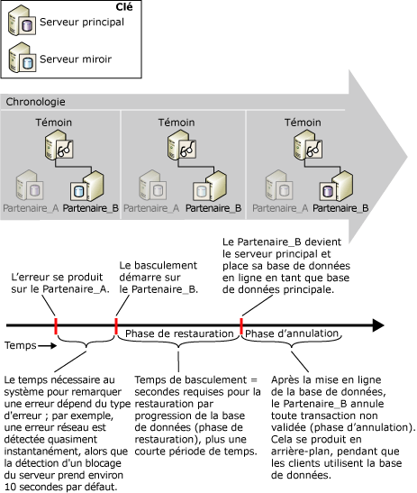

# Estimer l'interruption de service au cours d'un basculement de rôle (mise en miroir de bases de données)
[!INCLUDE[appliesto-ss-xxxx-xxxx-xxx-md](../../includes/appliesto-ss-xxxx-xxxx-xxx-md.md)]
  Au cours d'un basculement de rôle, la durée pendant laquelle la mise en miroir de base de données sera hors service dépend du type de basculement de rôle et de la raison du changement de rôle.  
  
-   Pour un basculement automatique, deux facteurs influent sur la durée d'interruption de service : le temps requis pour que le serveur miroir reconnaisse que l'instance du serveur principal est défaillante, c'est-à-dire la durée de détection d'erreur, ainsi que le temps requis pour le basculement de la base de données, c'est-à-dire la durée de basculement.  
  
-   Pour une opération de service forcé, bien qu'une défaillance ait lieu, la détection de la défaillance et la réaction à cette dernière dépendent de la réactivité humaine. Toutefois, l'estimation de l'interruption potentielle de service se limite à l'estimation du temps requis pour que le serveur miroir bascule les rôles après l'exécution de la commande de service forcé.  
  
    > [!NOTE]  
    >  Pour réduire le temps requis pour détecter des conditions spécifiques, telles que certains types d'erreurs, vous pouvez définir des alertes pour ces conditions.  
  
-   Pour un basculement manuel, seul le temps nécessaire au basculement de la base de données après la commande de basculement est pris en compte.  
  
## Détection d'erreurs  
 Le temps nécessaire au système pour remarquer une erreur dépend du type d'erreur ; par exemple, une erreur réseau est détectée quasiment instantanément, alors que la détection d'un blocage du serveur prend par défaut environ 10 secondes, ce qui représente le délai d'attente par défaut.  
  
 Pour plus d’informations sur les erreurs susceptibles d’entraîner une défaillance lors d’une session de mise en miroir de bases de données et sur la détection du dépassement d’un délai d’attente en mode haute sécurité avec basculement automatique, consultez [Défaillances possibles pendant la mise en miroir d’une base de données](../../database-engine/database-mirroring/possible-failures-during-database-mirroring.md).  
  
## Temps de basculement  
 Le temps de basculement est principalement constitué du temps nécessaire au serveur miroir précédent pour restaurer par progression tout journal restant dans sa file d’attente de restauration par progression, plus un court temps supplémentaire. Pour plus d’informations sur la manière dont le serveur miroir traite les enregistrements de journal, consultez [Mise en miroir de base de données &#40;SQL Server&#41;](../../database-engine/database-mirroring/database-mirroring-sql-server.md)). Pour plus d'informations sur l'estimation du temps de basculement, consultez la section Estimation du taux de restauration par progression du basculement, plus loin dans cette rubrique.  
  
> [!IMPORTANT]  
>  Si le basculement se produit au cours d'une transaction dans laquelle un index ou une table sont créés puis modifiés, le basculement peut prendre plus de temps qu'habituellement.  Par exemple, un basculement effectué au cours des opérations ci-dessous peut prendre plus de temps : BEGIN TRANSACTION, CREATE INDEX sur une table et SELECT INTO dans la table. La possibilité d'augmentation de la durée de basculement au cours d'une telle transaction demeure jusqu'à ce que la transaction soit terminée par une instruction COMMIT TRANSACTION ou ROLLBACK TRANSACTION.  
  
### File d'attente de restauration par progression  
 La restauration par progression de la base de données implique l'application de tous les enregistrements de journal figurant actuellement dans la file d'attente de restauration par progression sur le serveur miroir. La *file d’attente de restauration par progression* est constituée des enregistrements de journal écrits sur le disque du serveur miroir, mais qui ne sont pas encore restaurés par progression dans la base de données miroir.  
  
 Le temps de basculement de la base de données dépend de la rapidité avec laquelle le serveur miroir peut restaurer par progression le journal dans la file d'attente de restauration par progression qui est ensuite déterminé principalement par la configuration matérielle du système et par la charge de travail en cours. Il peut arriver qu'une base de données principale soit si occupée que le serveur principal envoie le journal au serveur miroir beaucoup plus rapidement que s'il restaurait le journal par progression. Dans ce cas, le basculement peut durer un temps significatif pendant que le serveur miroir restaure par progression le journal dans la file d'attente de restauration par progression. Pour connaître la taille actuelle de la file d’attente de restauration par progression, utilisez le compteur **File d’attente de restauration par progression** de l’objet de performance de mise en miroir de bases de données. Pour plus d’informations, consultez [SQL Server, objet Database Mirroring](../../relational-databases/performance-monitor/sql-server-database-mirroring-object.md).  
  
### Estimation du taux de restauration par progression du basculement  
 Vous pouvez mesurer le temps nécessaire à la restauration par progression des enregistrements de journal ( *taux de restauration par progression*) à l’aide d’une copie de test de la base de données de production.  
  
 La méthode permettant d'estimer la durée de la restauration par progression pendant le basculement dépend du nombre de threads utilisés par le serveur miroir pendant la phase de restauration par progression. Le nombre de threads dépend des éléments suivants :  
  
-   Dans [!INCLUDE[ssStandard](../../includes/ssstandard-md.md)], le serveur miroir utilise toujours un thread unique pour restaurer la base de données par progression.  
  
-   Dans [!INCLUDE[ssEnterprise](../../includes/ssenterprise-md.md)], les serveurs miroirs des ordinateurs disposant de moins de cinq processeurs utilisent également un thread unique. S’il dispose de cinq unités centrales ou davantage, un serveur miroir distribue ses opérations de restauration par progression entre les différents threads pendant un basculement (ceci porte le nom de *restauration par progression parallèle*). La restauration par progression parallèle est optimisée pour utiliser un thread par groupe de quatre unités centrales.  
  
#### Estimation du taux de restauration par progression monothread  
 Pour une restauration par progression monothread, la restauration par progression de la base de données miroir pendant le basculement prend environ le même temps que la restauration d'une sauvegarde du journal pour restaurer le même volume du journal. Pour estimer le temps de basculement, créez une base de données de test dans l'environnement dans lequel vous avez l'intention d'exécuter la mise en miroir. Ensuite, extrayez une sauvegarde de journal de la base de données de production. Pour mesurer le taux de restauration par progression de cette sauvegarde de journal, chronométrez le temps nécessaire à sa restauration avec l'instruction WITH NORECOVERY dans la base de données de test.  
  
 Quand vous connaissez le taux de restauration par progression de votre serveur miroir, vous pouvez estimer le temps de basculement de la base de données à un moment donné en divisant le volume du journal en cours à restaurer par progression sur le serveur miroir (tel qu’il est mesuré par le compteur de performance **File d’attente de restauration par progression** ) par le taux de restauration par progression. Dans des conditions normales, si le serveur miroir peut suivre la charge du principal, **File d’attente de restauration par progression** a une valeur petite ou proche de zéro, et le basculement ne dure que quelques secondes.  
  
#### Estimation du taux de restauration par progression parallèle  
 Dans [!INCLUDE[ssEnterprise](../../includes/ssenterprise-md.md)], la restauration par progression parallèle est optimisée pour utiliser un thread par groupe de quatre unités centrales. Pour estimer plus précisément la durée de la restauration par progression parallèle, il est conseillé d'accéder à un système de test en cours d'exécution plutôt qu'à une base de données de test. Tout en surveillant la file d'attente de restauration par progression sur le serveur miroir, augmentez la charge sur le serveur principal. Lors d'un fonctionnement normal, la file d'attente de restauration par progression est proche de zéro. Augmentez la charge sur le serveur principal jusqu’à ce que la file d’attente de restauration par progression commence à s’agrandir en continu ; le système est alors à son taux de restauration par progression maximal et le compteur de performance **Octets restaurés par progression/s** représente à ce stade le taux de restauration par progression maximal. Pour plus d’informations, consultez [SQL Server, objet Database Mirroring](../../relational-databases/performance-monitor/sql-server-database-mirroring-object.md).  
  
## Estimation de l'interruption de service au cours d'un basculement automatique  
 La figure suivante illustre la manière dont le temps de détection des erreurs et le temps de basculement contribuent à la durée totale nécessaire à l’exécution d’un basculement automatique sur **Partner_B**. Le basculement doit disposer d'un certain temps pour restaurer par progression la base de données (phase de restauration par progression) ainsi que d'un peu de temps pour mettre la base de données en ligne. La phase de restauration par progression, qui implique la restauration de toute transaction non validée, se produit après la mise en ligne de la nouvelle base de données principale et se poursuit après le basculement. La base de données est disponible pendant la phase de restauration.  
  
   
  
##  Voir aussi  
 [Modes de fonctionnement de la mise en miroir de bases de données](../../database-engine/database-mirroring/database-mirroring-operating-modes.md)   
 [Basculement de rôle durant une session de mise en miroir de bases de données &#40;SQL Server&#41;](../../database-engine/database-mirroring/role-switching-during-a-database-mirroring-session-sql-server.md)   
 [Surveillance de la mise en miroir de bases de données &#40;SQL Server&#41;](../../database-engine/database-mirroring/monitoring-database-mirroring-sql-server.md)  
  
  
