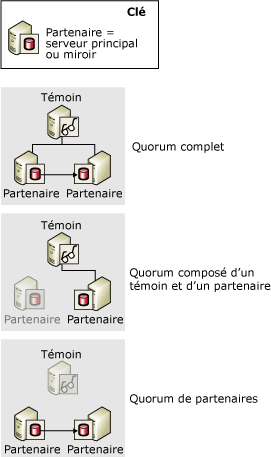
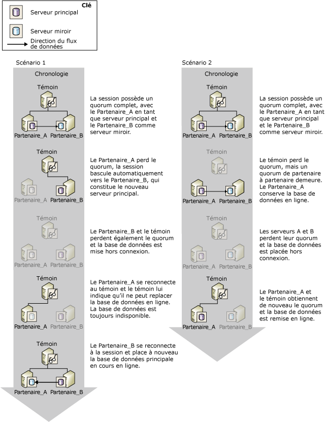

# Quorum : effets d'un témoin sur la disponibilité de la base de données (mise en miroir de bases de données)
[!INCLUDE[appliesto-ss-xxxx-xxxx-xxx-md](../../includes/appliesto-ss-xxxx-xxxx-xxx-md.md)]
  Chaque fois qu’un témoin est défini pour une session de mise en miroir de base de données, un *quorum* est nécessaire. Le quorum désigne une relation où deux ou plusieurs instances de serveur dans une session de mise en miroir de base de données sont connectées. En règle générale, le quorum implique trois instances de serveurs interconnectées. Lorsqu'un témoin est défini, un quorum est requis pour rendre la base de données disponible. Conçu pour les sessions en mode haute sécurité avec basculement automatique, un quorum garantit qu'une base de données appartient à un seul partenaire à la fois.  
  
 Si une instance de serveur spécifique est déconnectée d'une session de mise en miroir, l'instance perd le quorum. Si aucune instance de serveur n'est connectée, la session perd le quorum et la base de données n'est plus disponible. Trois types de quorum sont possibles :  
  
-   Un *quorum complet* inclut les deux partenaires et le témoin.  
  
-   Un *quorum de témoin à partenaire* est composé du témoin et de l’un des partenaires.  
  
-   Un *quorum de partenaire à partenaire* est composé des deux partenaires.  
  
 La figure suivante illustre ces types de quorum.  
  
   
  
 Tant que le serveur principal actuel possède un quorum, ce serveur détient le rôle principal et continue de servir la base de données, sauf si le propriétaire de la base de données effectue un basculement manuel. Si le serveur principal perd le quorum, il ne sert plus la base de données. Un basculement automatique peut se produire seulement si la base de données principale a perdu le quorum, ce qui garantit qu'elle ne sert plus la base de données.  
  
 Une instance de serveur déconnectée enregistre son rôle le plus récent dans la session. En principe, une instance de serveur déconnectée se reconnecte à la session lors de son redémarrage et obtient de nouveau le quorum.  
  
> [!IMPORTANT]  
>  Le témoin ne doit être défini que si vous avez l'intention d'utiliser le mode haute sécurité avec basculement automatique. En mode hautes performances, qui ne requiert jamais de témoin, nous vous conseillons vivement d'attribuer la valeur OFF à la propriété WITNESS. Pour plus d’informations sur l’impact d’un témoin sur le mode hautes performances, consultez [Modes de fonctionnement de la mise en miroir de bases de données](../../database-engine/database-mirroring/database-mirroring-operating-modes.md).  
  
## Quorum dans les sessions en mode haute sécurité  
 En mode haute sécurité, un quorum permet le basculement automatique en fournissant un contexte dans lequel les instances de serveur avec quorum décident quel partenaire détient le rôle de principal. Le serveur principal sert la base de données s'il dispose d'un quorum. Si le serveur principal perd le quorum lorsque le serveur miroir synchronisé et le témoin conservent le quorum, le basculement automatique se produit.  
  
 Les scénarios de quorum en mode haute sécurité sont les suivants :  
  
-   Un *quorum complet* composé des deux partenaires et du témoin.  
  
     Normalement, les trois instances de serveur participent à un quorum à trois voies, appelé *quorum complet*. Avec un quorum complet, le serveur principal et le serveur miroir continuent d'assumer leur rôle respectif (sauf si un basculement manuel intervient).  
  
-   Un *quorum de témoin à partenaire* composé du témoin et de l’un des partenaires.  
  
     Si la connexion réseau entre les partenaires est perdue car l'un des partenaires a été perdu, les cas suivants sont possibles :  
  
    -   Le serveur miroir est perdu et le serveur principal et le témoin conservent le quorum.  
  
         Dans ce cas, le principal définit sa base de données sur DISCONNECTED, et la mise en miroir est en état SUSPENDED. (Cette opération est appelée *exécution exposée*, car la base de données ne fait pas l’objet d’une mise en miroir). Lorsque le serveur miroir réintègre la session, il acquiert de nouveau le quorum en tant que miroir et commence à resynchroniser sa copie de la base de données.  
  
    -   Le serveur principal est perdu et le serveur témoin et le serveur miroir conservent le quorum.  
  
         Dans ce cas, le basculement automatique intervient. Pour plus d'informations, voir [Database Mirroring Operating Modes](../../database-engine/database-mirroring/database-mirroring-operating-modes.md).  
  
    -   Toutes les instances de serveur perdent le quorum, mais le miroir et le témoin se reconnectent par la suite. La base de données ne sera pas utilisée dans ce cas.  
  
     À de rares occasions, la connexion réseau entre les partenaires de basculement est perdue alors que les deux partenaires restent connectés au témoin. Dans ce cas, deux quorums distincts de témoin à partenaire existent, avec le témoin comme liaison. Le témoin informe le serveur miroir que le serveur principal est toujours connecté. De ce fait, le basculement automatique n'intervient pas. À la place, le serveur miroir conserve le rôle de miroir et attend de se reconnecter au principal. Si la file d'attente de restauration par progression contient des enregistrements de journaux à ce stade, le serveur miroir continue de restaurer par progression la base de données miroir. Lors de la reconnexion, le serveur miroir resynchronisera la base de données miroir.  
  
-   Un *quorum de partenaire à partenaire* composé des deux partenaires.  
  
     Dans la mesure où les partenaires conservent le quorum, la base de données continue dans un état SYNCHRONIZED et un basculement manuel reste possible. Sans le témoin, le basculement automatique n'est pas possible, mais si le témoins acquiert de nouveau le quorum, la session reprend les opérations normales et le basculement automatique est à nouveau pris en charge.  
  
-   La session perd le quorum.  
  
     Si toutes les instances de serveur se déconnectent les unes des autres, on dit que la session a *perdu le quorum*. Lorsque les instances de serveur se reconnectent entre elles, elles acquièrent de nouveau le quorum.  
  
    -   Si le serveur principal se reconnecte à l'une ou l'autre des instances du serveur, la base de données est disponible.  
  
    -   Si le serveur principal reste déconnecté, mais que le miroir et le témoin se reconnectent, le basculement automatique ne peut pas se produire en raison du risque de perte des données. C'est pourquoi la base de données reste indisponible tant que le serveur principal n'a pas réintégré la session.  
  
    -   Lorsque les trois instances du serveur se sont reconnectées, le quorum complet est de nouveau acquis et la session reprend ses opérations normales.  
  
> [!IMPORTANT]  
>  Lorsqu'une session possède un quorum partenaire à partenaire, si l'un des partenaires perd le quorum, la session perd le quorum. Cependant, si vous pensez que le témoin va rester longtemps déconnecté, nous vous recommandons de supprimer temporairement le témoin de la session. La suppression du témoin supprime la nécessité d'avoir un quorum. Enfin, si le serveur miroir perd la connexion, le serveur principal peut continuer de servir la base de données. Pour plus d’informations sur l’ajout ou la suppression d’un témoin, consultez [Témoin de mise en miroir de base de données](../../database-engine/database-mirroring/database-mirroring-witness.md).  
  
### Effets du quorum sur la disponibilité de la base de données  
 L'illustration suivante montre la façon dont le témoin et les partenaires coopèrent pour garantir que, à un moment donné, un seul partenaire possède le rôle principal, et que seul le serveur principal actif peut mettre sa base de données en ligne. Les deux scénarios commencent avec un quorum complet, avec **Partner_A** dans le rôle de principal et **Partner_B** dans le rôle de miroir.  
  
   
  
 Le scénario 1 montre comment, après que le serveur principal d’origine (**Partner_A**) a subi une défaillance, le témoin et le miroir s’accordent à considérer le principal, **Partner_A**, comme n’étant plus disponible et forment un quorum. Le miroir, **Partner_B** , assume alors le rôle de principal. Le basculement automatique intervient et **Partner_B**met sa copie de la base de données en ligne. Ensuite, **Partner_B** tombe en panne et la base de données bascule hors connexion. Plus tard, l’ancien serveur principal, **Partner_A**, se reconnecte au témoin regagnant le quorum, mais, en communiquant avec le témoin, **Partner_A** apprend qu’il ne peut pas mettre sa copie de la base de données en ligne étant donné que **Partner_B** possède maintenant le rôle de principal. Quand **Partner_B** réintègre la session, il remet la base de données en ligne.  
  
 Dans le scénario 2, le témoin perd le quorum, tandis que les partenaires, **Partner_A** et **Partner_B**, le conservent, et la base de données reste en ligne. Puis, les partenaires perdent également leur quorum et la base de données bascule hors connexion. Plus tard, le serveur principal, **Partner_A**, se reconnecte au témoin regagnant le quorum. Le témoin confirme que **Partner_A** possède encore le rôle de principal et **Partner_A** remet la base de données en ligne.  
  
##  Voir aussi  
 [Modes de fonctionnement de la mise en miroir de bases de données](../../database-engine/database-mirroring/database-mirroring-operating-modes.md)   
 [Basculement de rôle durant une session de mise en miroir de bases de données &#40;SQL Server&#41;](../../database-engine/database-mirroring/role-switching-during-a-database-mirroring-session-sql-server.md)   
 [Témoin de mise en miroir de base de données](../../database-engine/database-mirroring/database-mirroring-witness.md)   
 [Défaillances possibles pendant la mise en miroir de bases de données](../../database-engine/database-mirroring/possible-failures-during-database-mirroring.md)   
 [États de la mise en miroir &#40;SQL Server&#41;](../../database-engine/database-mirroring/mirroring-states-sql-server.md)  
  
  
