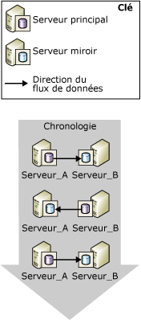
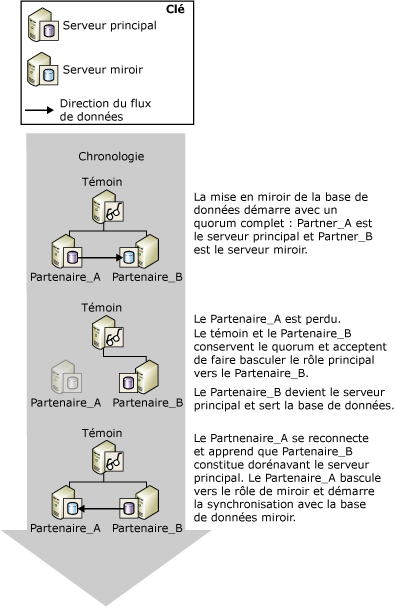
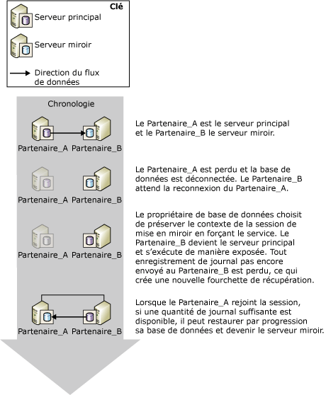

# Basculement de rôle durant une session de mise en miroir de bases de données (SQL Server)
[!INCLUDE[appliesto-ss-xxxx-xxxx-xxx-md](../../includes/appliesto-ss-xxxx-xxxx-xxx-md.md)]
  Dans le contexte d'une session de mise en miroir de bases de données, le rôle principal et le rôle miroir sont généralement interchangeables lors d'un processus appelé *basculement de rôle*. Dans une situation de basculement de rôle, le serveur miroir est le *partenaire de basculement* du serveur principal ; il adopte le rôle principal, en récupérant sa copie de la base de données et en la mettant en ligne en tant que nouvelle base de données principale. L'ancien serveur principal (s'il est disponible) joue le rôle de serveur miroir, et sa base de données devient la nouvelle base de données miroir. Les rôles peuvent éventuellement basculer plusieurs fois, soit en réponse à plusieurs défaillances, soit pour des raisons administratives.  
  
> [!NOTE]  
>  Cette rubrique suppose que vous connaissez bien les modes de fonctionnement de la mise en miroir de base de données. Pour plus d'informations, voir [Database Mirroring Operating Modes](../../database-engine/database-mirroring/database-mirroring-operating-modes.md).  
  
 L’illustration suivante représente des serveurs partenaires de mise en miroir, **Partner_A** et **Partner_B**, qui s’échangent les rôles de serveur principal et serveur miroir lors d’une série de basculements automatiques ou manuels.  
  
   
  
> [!IMPORTANT]  
>  Après un basculement de rôle, les travaux qui s'exécutaient sur l'ancienne base de données principale doivent être recréés sur le nouveau serveur principal pour y être exécutés. Pour plus d’informations, consultez [Gestion des connexions et des travaux après un basculement de rôle &#40;SQL Server&#41;](../../sql-server/failover-clusters/management-of-logins-and-jobs-after-role-switching-sql-server.md).  
  
 Il existe trois types de basculement de rôle : le basculement automatique, le basculement manuel et le service forcé (avec perte de données possible). La prise en charge de chaque type de basculement dépend du mode de fonctionnement d'une session.  
  
> [!NOTE]  
>  Si vous ne connaissez pas bien ces modes de fonctionnement, consultez [Modes de fonctionnement de la mise en miroir de bases de données](../../database-engine/database-mirroring/database-mirroring-operating-modes.md).  
  
-   **Basculement manuel**  
  
     Le mode haute sécurité prend en charge le basculement manuel. Chaque fois que la base de données est synchronisée, le propriétaire de la base de données peut entreprendre un basculement manuel.  
  
     Le basculement manuel est adopté pour des raisons administratives. Pour plus d’informations, consultez [Basculement manuel](#ManualFailover), plus loin dans cette rubrique.  
  
-   **Basculement automatique**  
  
     En présence d'un témoin, le mode haute sécurité prend en charge le basculement automatique. Celui-ci intervient suite à la perte du serveur principal, si les serveurs témoin et miroir sont toujours connectés entre eux et que la base de données est déjà synchronisée. Pour plus d’informations, consultez [Basculement automatique](#AutomaticFailover), plus loin dans cette rubrique.  
  
-   **Service forcé (avec perte de données possible)**  
  
     Un service forcé est pris en charge en mode haute sécurité lorsqu'aucun témoin n'est défini en mode haute performance. Suite à la perte du serveur principal, le propriétaire de la base de données peut rendre la base de données disponible en forçant le service sur le serveur miroir (avec possibilité de perte de données).  
  
    > [!NOTE]  
    >  Nous vous recommandons de définir la propriété WITNESS sur OFF en mode haute performance. Sinon, pour mettre la base de données en ligne, le serveur miroir doit être connecté au témoin.  
  
     Pour plus d’informations, consultez [Service forcé (avec possible perte de données)](#ForcedService), plus loin dans cette rubrique.  
  
 Le tableau ci-dessous résume les types de basculement pris en charge dans chaque mode de fonctionnement.  
  
||Hautes performances|Mode haute performance sans témoin|Mode haute performance avec témoin|  
|-|----------------------|-----------------------------------------|--------------------------------------|  
|Basculement automatique|non|non|Oui|  
|basculement manuel|non|Oui|Oui|  
|Service forcé|Oui|Oui|non|  
  
 Après un basculement de rôle, certaines métadonnées doivent exister sur les deux partenaires pour garantir que tous les utilisateurs de base de données peuvent accéder à la nouvelle base de données principale. De plus, des travaux de sauvegarde doivent être créés sur le nouveau serveur principal pour garantir que la base de données continue d'être sauvegardée régulièrement. Pour plus d’informations, consultez [Gestion des connexions et des travaux après un basculement de rôle &#40;SQL Server&#41;](../../sql-server/failover-clusters/management-of-logins-and-jobs-after-role-switching-sql-server.md).  
  
 Au cours d'un basculement de rôle, la durée pendant laquelle la mise en miroir de base de données sera hors service dépend du type de basculement de rôle et de sa raison. Pour en savoir plus, voir [Estimer l’interruption de service au cours d’un basculement de rôle &#40;mise en miroir de bases de données&#41;](../../database-engine/database-mirroring/estimate-the-interruption-of-service-during-role-switching-database-mirroring.md).  
  
##   Manual Failover  
 Le basculement manuel déconnecte les clients de la base de données et inverse les rôles des partenaires. Seul le mode haute sécurité prend en charge le basculement manuel.  
  
 **Dans cette section :**  
  
-   [Maintien de la disponibilité lors des mises à niveau](#AvailabilityDuringUpgrades)  
  
-   [Conditions requises pour un basculement manuel](#ConditionsForManualFo)  
  
-   [Fonctionnement du basculement manuel](#HowManualFoWorks)  
  
###   Maintien de la disponibilité lors des mises à niveau  
 L'administrateur de base de données peut recourir au basculement manuel pour mettre du matériel ou des logiciels à niveau sans sacrifier la disponibilité. Pour utiliser la mise en miroir de base de données dans le cadre de mises à niveau logicielles, le serveur miroir et/ou le système doivent déjà avoir été mis à niveau.  
  
> [!NOTE]  
>  La fonction de mise en miroir de bases de données doit être en mesure d'effectuer une mise à niveau propagée mais sans le garantir puisque les modifications à apporter ultérieurement ne sont pas connues. Pour plus d’informations, consultez [Mise à niveau des instances en miroir](../../database-engine/database-mirroring/upgrading-mirrored-instances.md).  
  
 L'illustration suivante montre une instance qui utilise le basculement manuel pour maintenir la disponibilité d'une base de données pendant la mise à niveau d'une instance serveur de base de données. Lorsque la mise à niveau est terminée, un administrateur peut éventuellement basculer à nouveau vers l'instance serveur d'origine. Ceci est utile lorsque l'administrateur veut arrêter la session de mise en miroir et utiliser le serveur de miroir ailleurs. De cette façon, une instance serveur donnée peut être utilisée à plusieurs reprises lors de la mise à jour d'une série d'instances serveur de base de données.  
  
   
  
###   Conditions requises pour un basculement manuel  
 Le basculement manuel nécessite que la sécurité de transaction soit définie sur FULL (c'est-à-dire, mode haute sécurité). Lorsque les partenaires sont connectés et que la base de données est déjà synchronisée, un basculement manuel est possible.  
  
###   Fonctionnement du basculement manuel  
 Le basculement manuel initialise la série d'actions suivante :  
  
1.  Le serveur principal déconnecte les clients de la base de données principale, envoie la fin du journal au serveur miroir, puis définit l'état de la mise en miroir à SYNCHRONIZING pour se préparer à prendre le rôle miroir.  
  
2.  Le serveur miroir enregistre le numéro séquentiel dans le journal du dernier enregistrement journal reçu du principal en tant que numéro séquentiel de basculement.  
  
    > [!NOTE]  
    >  Pour afficher ce numéro séquentiel dans le journal, sélectionnez la colonne **mirroring_failover_lsn** de [sys.database_mirroring &#40;Transact-SQL&#41;](../../relational-databases/system-catalog-views/sys-database-mirroring-transact-sql.md).  
  
3.  Si un journal est en attente dans la file d'attente de restauration par progression, le serveur miroir termine la restauration par progression de la base de données miroir. Le temps requis pour cette opération dépend de la vitesse du système, de la charge de travail récente et de la quantité de journal au sein de la file d'attente de restauration par progression. Dans le cadre d'un mode de fonctionnement synchrone, le temps de basculement peut être régulé en limitant la taille de la file d'attente de restauration par progression. Cependant, cela peut entraîner le serveur principal à ralentir pour permettre au serveur miroir de suivre.  
  
    > [!NOTE]  
    >  Pour connaître la taille actuelle de la file d’attente de restauration par progression, utilisez le compteur de performance **File d’attente de restauration par progression** de l’objet de performance de mise en miroir de bases de données (pour plus d’informations, consultez [Surveillance de la mise en miroir de bases de données &#40;SQL Server&#41;](../../database-engine/database-mirroring/monitoring-database-mirroring-sql-server.md)).  
  
4.  Le serveur miroir devient le nouveau serveur principal, et l'ancien serveur principal devient le nouveau serveur miroir.  
  
5.  Le nouveau serveur principal restaure toute transaction non validée et met la copie de sa base de données en ligne, en tant que base de données principale.  
  
6.  L'ancien principal prend le rôle de miroir et l'ancienne base de données principale devient la base de données miroir. Le nouveau serveur miroir resynchronise rapidement la nouvelle base de données miroir avec la nouvelle base de données principale.  
  
    > [!NOTE]  
    >  Dès que le nouveau serveur miroir a resynchronisé les bases de données, le basculement est de nouveau possible, mais dans le sens inverse.  
  
 Après le basculement, les clients doivent se reconnecter à la base de données principale actuelle. Pour en savoir plus, voir [Connecter des clients à une session de mise en miroir de bases de données &#40;SQL Server&#41;](../../database-engine/database-mirroring/connect-clients-to-a-database-mirroring-session-sql-server.md).  
  
 **Pour initialiser un basculement manuel**  
  
-   [Basculer manuellement une session de mise en miroir de bases de données &#40;SQL Server Management Studio&#41;](../../database-engine/database-mirroring/manually-fail-over-a-database-mirroring-session-sql-server-management-studio.md)  
  
-   [Basculer manuellement une session de mise en miroir de bases de données &#40;Transact-SQL&#41;](../../database-engine/database-mirroring/manually-fail-over-a-database-mirroring-session-transact-sql.md).  
  
##   Automatic Failover  
 Le basculement automatique est pris en charge uniquement dans les sessions de mise en miroir de bases de données s’exécutant avec un témoin et en mode haute sécurité (*mode haute sécurité avec basculement automatique*). En mode haute sécurité avec basculement automatique, une fois la base de données synchronisée, si la base de données principale devient non disponible, le basculement automatique se produit. Lors d'un basculement automatique, le serveur miroir assume le rôle de serveur principal et met en ligne sa copie de la base de données en tant que base de données principale. Exiger la synchronisation de la base de données empêche toute perte de données lors du basculement, car chaque transaction validée sur la base de données principale est également validée sur la base de données miroir.  
  
> [!IMPORTANT]  
>  Pour que le basculement automatique améliore la fiabilité, les bases de données miroir et principale doivent résider sur des ordinateurs distincts.  
  
 **Dans cette section :**  
  
-   [Conditions requises pour un basculement automatique](#ConditionsForAutoFo)  
  
-   [Fonctionnement du basculement automatique](#HowAutoFoWorks)  
  
-   [Pour désactiver le basculement automatique (SQL Server Management Studio)](#DisableAutoSSMS)  
  
-   [Pour désactiver le basculement automatique (à l'aide de Transact-SQL)](#DisableAutoTsql)  
  
###   Conditions requises pour un basculement automatique  
 Le basculement automatique nécessite les conditions suivantes :  
  
-   La session de mise en miroir de bases de données doit s'exécuter en mode haute sécurité et doit posséder un témoin. Pour plus d'informations, voir [Database Mirroring Operating Modes](../../database-engine/database-mirroring/database-mirroring-operating-modes.md).  
  
-   La base de données miroir doit déjà être synchronisée. Ceci garantit que la totalité du journal envoyé au serveur miroir a été écrit sur le disque.  
  
-   Le serveur principal a perdu la communication avec le reste de la configuration de mise en miroir de base de données, tandis que le serveur miroir et le serveur témoin conservent le quorum. Toutefois, si toutes les instances de serveur perdent la communication et si le serveur témoin et le serveur miroir rétablissent ultérieurement la communication, le basculement automatique n'a pas lieu.  
  
    > [!NOTE]  
    >  Pour plus d’informations, consultez [Quorum : effets d’un témoin sur la disponibilité de la base de données &#40;mise en miroir de bases de données&#41;](../../database-engine/database-mirroring/quorum-how-a-witness-affects-database-availability-database-mirroring.md).  
  
-   Le serveur miroir a détecté la perte du serveur principal.  
  
     La manière dont le serveur miroir détecte une défaillance du serveur principal est variable, selon qu'il s'agisse d'une défaillance matérielle ou logicielle. Pour plus d’informations, consultez [Défaillances possibles pendant la mise en miroir d’une base de données](../../database-engine/database-mirroring/possible-failures-during-database-mirroring.md).  
  
###   Fonctionnement du basculement automatique  
 Sous les conditions précédentes, le basculement automatique initialise la séquence d'actions suivante :  
  
1.  Si le serveur principal fonctionne toujours, il change l'état de la base de données principale en DISCONNECTED et déconnecte tous les clients de la base de données principale.  
  
2.  Les serveurs témoin et miroir détectent que le serveur principal n'est pas disponible.  
  
3.  Si un journal est en attente dans la file d'attente de restauration par progression, le serveur miroir termine la restauration par progression de la base de données miroir.  
  
    > [!NOTE]  
    >  Le temps nécessaire pour appliquer le journal dépend de la vitesse du système, de la charge de travail récente et de la quantité de journal au sein de la file d'attente de restauration par progression.  
  
4.  L'ancienne base de données miroir passe en ligne en tant que nouvelle base de données principale, et la récupération nettoie toutes les transactions non validées en les restaurant le plus rapidement possible. Des verrous isolent ces transactions.  
  
5.  Lorsque l'ancien serveur principal rejoint la session, il détecte que son partenaire de basculement possède maintenant le rôle principal. L'ancien serveur principal prend le rôle de miroir, faisant de sa base de données la base de données en miroir. Le nouveau serveur miroir synchronise la nouvelle base de données miroir avec la base de données principale le plus rapidement possible. Dès que le nouveau serveur miroir a resynchronisé les bases de données, le basculement est de nouveau possible, mais dans le sens inverse.  
  
 La figure suivante illustre une instance unique de basculement automatique.  
  
   
  
 Au départ, les trois serveurs sont connectés (la session bénéficie d'un quorum complet). **Partner_A** est le serveur principal, **Partner_B** le serveur miroir. **Partner_A** (ou la base de données principale sur **Partner_A**) devient non disponible. Le témoin et **Partner_B** détectent tous les deux que le principal n’est plus disponible et la session conserve le quorum. **Partner_B** devient le serveur principal et rend sa copie de la base de données disponible en tant que nouvelle base de données principale. Finalement, **Partner_A** se reconnecte à la session et découvre que **Partner_B** possède maintenant le rôle principal. **Partner_A** prend alors le rôle miroir.  
  
 Après le basculement, les clients doivent se reconnecter à la base de données principale actuelle. Pour en savoir plus, voir [Connecter des clients à une session de mise en miroir de bases de données &#40;SQL Server&#41;](../../database-engine/database-mirroring/connect-clients-to-a-database-mirroring-session-sql-server.md).  
  
> [!NOTE]  
>  Les transactions qui ont été préparées à l'aide du service MSDTC ( [!INCLUDE[msCoName](../../includes/msconame-md.md)] Distributed Transaction Coordinator) mais qui ne sont toujours pas validées au moment du basculement, sont considérées comme abandonnées après le basculement de la base de données.  
  
###   Pour désactiver le basculement automatique (SQL Server Management Studio)  
 Ouvrez la page **Mise en miroir** de la boîte de dialogue Propriétés de la base de données, puis changez de mode de fonctionnement en sélectionnant l’une des options suivantes :  
  
-   **Haute sécurité sans basculement automatique (synchrone)**  
  
     Dans ce mode, la base de données continue d'être synchronisée et le basculement manuel reste possible.  
  
-   **Haute performance (asynchrone)**  
  
     Dans ce mode, la base de données miroir peut rester quelque peu en arrière de la base de données principale, de sorte que le basculement manuel ne sera plus possible.  
  
###   Pour désactiver le basculement automatique (à l'aide de Transact-SQL)  
 À n'importe quel moment d'une session de mise en miroir de bases de données, le propriétaire de la base de données peut désactiver le basculement automatique en désactivant le témoin.  
  
 **Pour désactiver le témoin**  
  
-   [Supprimer le témoin d’une session de mise en miroir de bases de données &#40;SQL Server&#41;](../../database-engine/database-mirroring/remove-the-witness-from-a-database-mirroring-session-sql-server.md)  
  
    > [!NOTE]  
    >  La désactivation du témoin avec maintien de la sécurité complète des transactions place la session en mode haute sécurité sans basculement automatique.  
  
##   Forced Service (with Possible Data Loss)  
 La mise en miroir de bases de données fournit un service forcé (avec possibilité de perte de données) en guise de méthode de récupération d'urgence afin de vous permettre d'utiliser un serveur miroir en tant que serveur de secours actif. Le service forcé est possible uniquement si le serveur principal est déconnecté du serveur miroir lors d'une session de mise en miroir. Le service forcé entraînant un risque de perte de données, il convient de l'utiliser avec prudence et parcimonie.  
  
 La prise en charge du service forcé dépend du mode de fonctionnement et de l'état de la session, comme suit :  
  
-   En général, le mode hautes performances prend en charge le service forcé lorsque le serveur principal est déconnecté. Cependant, et bien que cela ne soit pas obligatoire, un témoin peut exister pour une session en mode hautes performances. Dans ce cas, le service forcé exige que le serveur miroir et le témoin soient interconnectés.  
  
-   Le mode haute sécurité avec basculement automatique prend en charge le service forcé lorsque le serveur principal est déconnecté.  
  
-   Le mode haute sécurité avec basculement automatique prend en charge le service forcé lorsque le serveur miroir et le témoin sont interconnectés et que ni l'un ni l'autre n'est connecté au serveur principal (tant que le serveur miroir n'était pas en train de restaurer la base de données miroir lorsqu'il était encore connecté au principal).  
  
 Nous recommandons de forcer le service uniquement si vous devez restaurer immédiatement le service sur la base de données et que vous êtes prêt à courir le risque de perdre des données. Le service forcé a un effet semblable à la suppression de la mise en miroir, hormis le fait qu'il facilite la resynchronisation des bases de données lors du rétablissement de la mise en miroir, au risque de perdre des données. Le service forcé effectue une transition régulière du rôle principal vers la base de données miroir. Le serveur miroir joue le rôle de serveur principal et met immédiatement à la disposition des clients sa copie de la base de données. La nouvelle base de données principale s'exécute sans miroir (autrement dit, elle est exposée).  
  
> [!IMPORTANT]  
>  Si le serveur principal a simplement été déconnecté de la session de mise en miroir de bases de données et qu'il est encore en cours d'exécution, certains clients peuvent continuer d'accéder à la base de données principale d'origine. Avant de forcer le service, il est important d'empêcher les clients d'accéder au serveur principal d'origine. Autrement, une fois le service forcé, la base de données principale d'origine et la base de données principale actuelle risquent d'être mises à jour indépendamment l'une de l'autre.  
  
 **Dans cette section :**  
  
-   [Cas ordinaire de service forcé](#TypicalCaseFS)  
  
-   [Risques posés par le service forcé](#FSrisks)  
  
-   [Gestion de la perte de données potentielle](#ManageDataLoss)  
  
-   [Tâches associées à la gestion d'un basculement forcé](#RelatedTasksForFS)  
  
###   Cas ordinaire de service forcé  
 L'illustration suivante présente un cas ordinaire de service forcé (avec possibilité de perte de données).  
  
   
  
 Comme l’indique l’illustration, le serveur principal d’origine, **Partner_A**, devient indisponible pour le serveur miroir, **Partner_B**, ce qui entraîne la déconnexion de la base de données miroir. Après avoir vérifié que **Partner_A** était inaccessible aux clients, l’administrateur de la base de données force le service, avec possibilité de perte de données, sur **Partner_B**. **Partner_B** devient le serveur principal et s’exécute avec la base de données *exposée* (c’est-à-dire, non mise en miroir). À ce stade, les clients peuvent se reconnecter à **Partner_B**.  
  
 Quand **Partner_A** devient disponible, il se reconnecte au nouveau serveur principal, rejoint la session et assume le rôle de miroir. La session de mise en miroir est suspendue immédiatement, sans que la nouvelle base de données miroir ait été synchronisée. La suspension de la session permet à l'administrateur de base de données de décider s'il faut reprendre la session ou, dans des cas extrêmes, supprimer la mise en miroir et tenter de récupérer des données de l'ancienne base de données principale. Dans ce cas, l'administrateur de base de données choisit de reprendre la mise en miroir. À ce stade, **Partner_A** assume le rôle de serveur miroir et restaure l’ancienne base de données principale au point dans le temps correspondant à la dernière transaction synchronisée avec succès ; si des transactions validées n’ont pas été écrites sur disque sur le serveur miroir avant que le service ne soit forcé, elles sont perdues. **Partner_A** restaure ensuite par progression la nouvelle base de données miroir en appliquant les modifications apportées à la nouvelle base de données principale depuis que l’ancien serveur miroir est devenu le nouveau serveur principal.  
  
> [!NOTE]  
>  Bien que le mode hautes performances n'ait pas besoin de témoin, si un témoin est configuré, il est possible de forcer le service seulement si le témoin est connecté au serveur miroir.  
  
###   Risques posés par le service forcé  
 Il est essentiel de comprendre que le service forcé peut entraîner une perte de données. La perte de données est possible car le serveur miroir ne peut pas communiquer avec le serveur principal et, par conséquent, ne peut pas garantir la synchronisation des deux bases de données. Le service forcé démarre un nouveau point de branchement de récupération. Étant donné que la base de données principale et la base de données miroir d'origine sont situées sur différents branchements de récupération, chaque base de données contient maintenant des données qui ne figurent pas dans l'autre base de données : la base de données principale d'origine contient toutes les modifications qui n'avaient pas encore été envoyées de sa file d'attente d'envoi à l'ancienne base de données miroir (le journal non envoyé) ; l'ancienne base de données miroir contient toutes les modifications qui surviennent une fois le service forcé.  
  
 Si le service est forcé suite à une défaillance du serveur principal, le risque de perte de données dépend du fait que les journaux de transactions ont été envoyés ou non au serveur miroir avant la défaillance. En mode haute sécurité, cela est possible uniquement jusqu'à ce que la base de données miroir soit synchronisée. En mode hautes performances, une accumulation du journal non envoyé est toujours une possibilité.  
  
 Les implications du service forcé dépendent en partie de la présence d'un témoin dans la session :  
  
-   En l'absence de témoin, le service peut être forcé si les partenaires sont déconnectés, par exemple en raison d'une rupture de leur connexion réseau. Si le serveur principal d'origine est encore en cours d'exécution, les deux partenaires détiennent le rôle principal. Les clients qui se connectent au nouveau serveur principal accèderont à la version actuelle de la base de données, alors que les clients qui se connectent au serveur principal d'origine accèderont à la base de données principale d'origine. Cette situation accroît le risque de perte de données. Si les partenaires sont autorisés à se reconnecter, le serveur principal d'origine assume le rôle de miroir et modifie l'état de sa base de données en « récupération » avant que la mise en miroir soit suspendue. Si la session reprend, les transactions de la base de données principale d'origine dont le journal se trouvait dans la file d'attente d'envoi lors de la déconnexion la plus récente sont perdues. En outre, toutes les transactions qui ont eu lieu après le forçage du service sont également perdues.  
  
-   En présence d'un témoin, si le serveur miroir est déconnecté du serveur principal et du témoin, le principal demeure exposé tant qu'il est connecté au témoin. Si le serveur principal est ensuite déconnecté du témoin, il ne sert plus la base de données. Par la suite, si le serveur miroir se reconnecte au témoin, le service forcé devient possible. Si le service est forcé, toutes les modifications apportées pendant que le serveur principal d'origine s'exécutait en situation exposée seront perdues si le serveur principal d'origine se reconnecte.  
  
 Pour plus d’informations, consultez [Gestion de la perte de données potentielle](#ManageDataLoss), plus loin dans cette rubrique.  
  
###   Gestion de la perte de données potentielle  
 Après le forçage du service, une fois l'ancien serveur principal disponible, en supposant que sa base de données ne soit pas endommagée, vous pouvez tenter de gérer la perte de données potentielle. La méthode disponible pour gérer la perte de données potentielle dépend selon que le serveur principal d'origine s'est reconnecté à son partenaire et a rejoint la session de mise en miroir. En supposant que le serveur principal d'origine puisse accéder à la nouvelle instance principale, la reconnexion se produit automatiquement et de manière transparente.  
  
#### Le serveur principal d'origine s'est reconnecté  
 En général, après une défaillance, lorsque le serveur principal d'origine redémarre, il se reconnecte rapidement à son partenaire. Lors de la reconnexion, le serveur principal d'origine devient le serveur miroir. Sa base de données devient la base de données miroir et passe à l'état de récupération avant que la session soit suspendue. La base de données miroir ne sera restaurée que si vous rétablissez la mise en miroir.  
  
 Toutefois, la base de données de récupération est inaccessible ; par conséquent, vous ne pouvez pas l'inspecter afin d'évaluer les données qui seraient perdues si vous rétablissiez la mise en miroir. La décision relative à la reprise ou à la suppression de la mise en miroir dépend donc selon que vous souhaitez accepter ou non le risque de perte de données.  
  
-   Si la perte de données est inacceptable, vous devez supprimer la mise en miroir afin de récupérer les données.  
  
     La suppression de la mise en miroir permettrait à l'administrateur de base de données de récupérer la base de données principale d'origine et de tenter de récupérer les données qui auraient été perdues. Toutefois, lorsque l'ancienne base de données miroir passera en ligne, les anciens partenaires serviront des bases de données divergentes portant le même nom. L'administrateur de base de données doit rendre l'une des bases de données inaccessible aux clients afin d'éviter toute divergence supplémentaire de la base de données et tout problème de basculement de client.  
  
-   Si la perte de données est acceptable, vous pouvez reprendre la mise en miroir.  
  
     La reprise de la mise en miroir entraîne la restauration de la nouvelle base de données miroir en guise de première étape vers la synchronisation de la base de données. Si des enregistrements de journal se trouvaient dans la file d'attente d'envoi au moment de la défaillance, les transactions correspondantes sont perdues, même si elles ont été validées.  
  
#### Le serveur principal d'origine ne s'est pas reconnecté  
 Si vous pouvez empêcher momentanément le serveur principal d'origine de se reconnecter par le biais du réseau au nouveau serveur principal, vous pouvez inspecter la base de données principale d'origine afin d'évaluer les données qui seraient perdues si vous rétablissiez la mise en miroir.  
  
-   Si la perte de données potentielle est acceptable  
  
     Laissez le serveur principal d'origine se reconnecter à son partenaire. La reconnexion provoque la suspension de la mise en miroir. Pour rétablir la mise en miroir, il vous suffit de reprendre la session. L'ancien serveur principal assume le rôle de miroir. Le nouveau serveur miroir supprime le branchement de récupération d'origine, ce qui entraîne la perte des transactions qui n'ont été ni reçues ni envoyées par l'ancien serveur miroir.  
  
-   Si la perte de données est inacceptable  
  
     Si la base de données principale d'origine contient des données essentielles qui seront perdues si vous reprenez la session, vous pouvez préserver les données sur le serveur principal d'origine en supprimant la mise en miroir. Nous vous recommandons d'essayer de sauvegarder la fin du journal du principal à ce stade. Ensuite, vous pouvez mettre à jour la base de données principale actuelle (l'ancienne base de données miroir) en exportant les données que vous souhaitez sauvegarder à partir de la base de données principale d'origine et en les important dans la base de données principale actuelle. Nous vous recommandons d'effectuer aussi rapidement que possible une sauvegarde complète de base de données de la base de données mise à jour.  
  
     Pour rétablir la mise en miroir avec la base de données mise à jour en tant que base de données principale initiale, utilisez cette sauvegarde (et au moins une sauvegarde du journal ultérieure) pour créer une nouvelle base de données miroir. Chaque sauvegarde de journal effectuée après la suppression de la mise en miroir doit être appliquée. Par conséquent, nous recommandons de différer les sauvegardes de fichier journal supplémentaires de la base de données principale jusqu'à ce que la nouvelle session de mise en miroir démarre.  
  
###   Tâches associées à la gestion d'un basculement forcé  
 **Pour forcer le service**  
  
-   [Forcer le service dans une session de mise en miroir de bases de données &#40;Transact-SQL&#41;](../../database-engine/database-mirroring/force-service-in-a-database-mirroring-session-transact-sql.md).  
  
 **Pour reprendre la mise en miroir de bases de données**  
  
-   [Suspendre ou reprendre une session de mise en miroir de bases de données &#40;SQL Server&#41;](../../database-engine/database-mirroring/pause-or-resume-a-database-mirroring-session-sql-server.md)  
  
 **Pour créer une nouvelle base de données miroir**  
  
 [Préparer une base de données miroir pour la mise en miroir &#40;SQL Server&#41;](../../database-engine/database-mirroring/prepare-a-mirror-database-for-mirroring-sql-server.md)  
  
 **Pour démarrer la mise en miroir de bases de données**  
  
-   [Configuration de la mise en miroir d’une base de données &#40;SQL Server&#41;](../../database-engine/database-mirroring/setting-up-database-mirroring-sql-server.md)  
  
-   [Établir une session de mise en miroir de bases de données au moyen de l’authentification Windows &#40;SQL Server Management Studio&#41;](../../database-engine/database-mirroring/establish-database-mirroring-session-windows-authentication.md)  
  
##  Voir aussi  
 [Estimer l’interruption de service au cours d’un basculement de rôle &#40;mise en miroir de bases de données&#41;](../../database-engine/database-mirroring/estimate-the-interruption-of-service-during-role-switching-database-mirroring.md)   
 [Défaillances possibles pendant la mise en miroir de bases de données](../../database-engine/database-mirroring/possible-failures-during-database-mirroring.md)   
 [Connecter des clients à une session de mise en miroir de bases de données &#40;SQL Server&#41;](../../database-engine/database-mirroring/connect-clients-to-a-database-mirroring-session-sql-server.md)   
 [Témoin de mise en miroir de base de données](../../database-engine/database-mirroring/database-mirroring-witness.md)   
 [Restaurations complètes de bases de données &#40;mode de récupération complète&#41;](../../relational-databases/backup-restore/complete-database-restores-full-recovery-model.md)   
 [Modes de fonctionnement de la mise en miroir de bases de données](../../database-engine/database-mirroring/database-mirroring-operating-modes.md)   
 [États de la mise en miroir &#40;SQL Server&#41;](../../database-engine/database-mirroring/mirroring-states-sql-server.md)  
  
  
