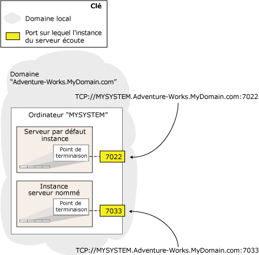

# Point de terminaison de mise en miroir de bases de données (SQL Server)

[!INCLUDE[appliesto-ss-xxxx-xxxx-xxx-md-winonly](../../includes/appliesto-ss-xxxx-xxxx-xxx-md-winonly.md)]

  Pour faire partie de [!INCLUDE[ssHADR](../../includes/sshadr-md.md)] ou de la mise en miroir de bases de données, chaque instance de serveur requiert son propre *point de terminaison de mise en miroir de bases de données*dédié. Ce point de terminaison a un objectif spécifique qui permet exclusivement de recevoir des connexions provenant d'autres instances de serveur. Sur une instance de serveur donnée, chaque connexion de [!INCLUDE[ssHADR](../../includes/sshadr-md.md)] ou de mise en miroir de bases de données à une autre instance de serveur utilise un point de terminaison de mise en miroir de bases de données unique.  
  
 Les points de terminaison de mise en miroir de bases de données utilisent le protocole TCP (Transmission Control Protocol) pour l'envoi et la réception de messages entre les instances de serveur participant à des sessions de mise en miroir de bases de donnée ou hébergeant des réplicas de disponibilité. Le point de terminaison de mise en miroir de bases de données écoute sur un numéro de port TCP unique.  
  
> [!NOTE]  
>  Les connexions clientes à un serveur principal ou à un réplica principal ne font pas appel au point de terminaison de mise en miroir de bases de données.  
  
> [!NOTE]  
>  La fonctionnalité de mise en miroir de bases de données sera supprimée dans une prochaine version de Microsoft SQL Server. Évitez d'utiliser cette fonctionnalité dans de nouveaux travaux de développement et prévoyez de modifier les applications qui utilisent actuellement la mise en miroir de bases de données afin qu'elles utilisent [!INCLUDE[ssHADR](../../includes/sshadr-md.md)] à la place.  
  
  
##   Adresse réseau du serveur  
 L’adresse réseau d’une instance de serveur (son *adresse réseau de serveur* ou *URL de point de terminaison*) contient le numéro de port de son point de terminaison, ainsi que le nom du système et le nom de domaine de l’ordinateur hôte. Le numéro de port identifie de manière unique une instance de serveur spécifique.  
  
 L'illustration suivante montre comment deux instances de serveur sur un même serveur sont identifiées de manière univoque. Les adresses réseau du serveur des deux instances de serveur contiennent le même nom de système ( `MYSYSTEM`) et le même nom de domaine ( `Adventure-Works.MyDomain.com`). Afin de permettre au système de diriger les connexions vers une instance de serveur, l'adresse réseau de serveur comprend le numéro de port associé au point de terminaison de mise en miroir d'une instance de serveur spécifique.  
  
   
  
 Par défaut, une instance de [!INCLUDE[ssNoVersion](../../includes/ssnoversion-md.md)] ne contient pas de point de terminaison de mise en miroir de bases de données. Les points de terminaison doivent être créés manuellement lors de la configuration d'une session de mise en miroir de bases de données. L'administrateur système doit créer un point de terminaison distinct dans chaque instance de serveur participant à la mise en miroir de bases de données. Notez que si plusieurs instances de serveur sur un ordinateur donné requièrent un point de terminaison de mise en miroir de bases de données, vous devez spécifier un numéro de port différent pour chaque point de terminaison.  
  
> [!IMPORTANT]  
>  Si l'ordinateur exécute [!INCLUDE[ssNoVersion](../../includes/ssnoversion-md.md)] comme pare-feu, la configuration de celui-ci doit autoriser les connexions entrantes et sortantes pour le port spécifié dans le point de terminaison.  
  
 Pour la mise en miroir de bases de données et [!INCLUDE[ssHADR](../../includes/sshadr-md.md)], l'authentification et le chiffrement sont configurés sur le point de terminaison. Pour plus d’informations, consultez [Sécurité du transport de la mise en miroir de bases de données et des groupes de disponibilité Always On (SQL Server)](../../database-engine/database-mirroring/transport-security-database-mirroring-always-on-availability.md).  
  
> [!IMPORTANT]  
>  Ne reconfigurez pas un point de terminaison de mise en miroir de base de données en cours d'utilisation. Les instances de serveurs utilisent les points de terminaison des autres instances pour connaître l'état des autres systèmes. Si le point de terminaison est reconfiguré, il est possible qu'il redémarre, ce qui peut être perçu comme une erreur par les autres instances de serveurs. Cela est particulièrement important pour le mode de basculement automatique, où la reconfiguration du point de terminaison sur un partenaire peut déclencher un basculement.  
  
  
##   Détermination du type d'authentification pour un point de terminaison de mise en miroir de bases de données  
 Il est important de comprendre que les comptes de service [!INCLUDE[ssNoVersion](../../includes/ssnoversion-md.md)] de vos instances de serveur déterminent quel type d'authentification vous pouvez utiliser pour vos points de terminaison de mise en miroir de bases de données, comme suit :  
  
-   Si chaque instance de serveur s'exécute sous un compte de service de domaine, vous pouvez utiliser l'authentification Windows pour vos points de terminaison de mise en miroir de bases de données. Si toutes les instances de serveur s’exécutent sous le même compte d’utilisateur de domaine, les noms de connexion d’utilisateur corrects existent automatiquement dans les deux bases de données **master** . Cela simplifie la configuration de sécurité des bases de données de disponibilité et est recommandé.  
  
     Si les instances de serveur qui hébergent les réplicas de disponibilité pour un groupe de disponibilité s’exécutent en tant que comptes différents, la connexion de chaque compte doit être créée dans **master** sur l’autre instance de serveur. Ensuite, cette connexion doit se voir accorder des autorisations CONNECT pour pouvoir se connecter au point de terminaison de mise en miroir de bases de données de cette instance de serveur. Pour plus d’informations, consultez [Configurer des comptes de connexion pour la mise en miroir de bases de données ou les groupes de disponibilité Always On (SQL Server)](../../database-engine/database-mirroring/set-up-login-accounts-database-mirroring-always-on-availability.md).  
  
     Si vos instances de serveur utilisent l'authentification Windows, vous pouvez créer des points de terminaison de mise en miroir de bases de données à l'aide de [!INCLUDE[tsql](../../includes/tsql-md.md)], PowerShell ou de l'Assistant Nouveau groupe de disponibilité.  
  
    > [!NOTE]  
    >  Si une instance de serveur devant héberger un réplica de disponibilité ne dispose pas de point de terminaison de mise en miroir de bases de données, l'Assistant Nouveau groupe de disponibilité peut automatiquement créer un point de terminaison de mise en miroir de bases de données qui utilise l'authentification Windows. Pour plus d’informations, consultez [Utiliser l’Assistant Groupe de disponibilité (SQL Server Management Studio)](../../database-engine/availability-groups/windows/use-the-availability-group-wizard-sql-server-management-studio.md).  
  
-   Si une instance de serveur s'exécute sous un compte intégré, tel que Système local, Service local ou Service réseau, ou un compte qui n'appartient pas au domaine, vous devez utiliser des certificats pour l'authentification de point de terminaison. Si vous utilisez des certificats pour vos points de terminaison de mise en miroir de bases de données, votre administrateur système doit configurer chaque instance de serveur pour utiliser des certificats sur les connexions sortantes et entrantes.  
  
     Il n'existe aucune méthode automatisée permettant de configurer la sécurité de la mise en miroir de bases de données à l'aide de certificats. Vous devez utiliser l’instruction [!INCLUDE[tsql](../../includes/tsql-md.md)] CREATE ENDPOINT ou l’applet de commande **New-SqlHadrEndpoint** PowerShell. Pour plus d’informations, consultez [CREATE ENDPOINT (Transact-SQL)](../../t-sql/statements/create-endpoint-transact-sql.md). Pour plus d’informations sur l’activation de l’authentification du certificat sur une instance de serveur, consultez [Utiliser des certificats pour un point de terminaison de mise en miroir de bases de données (Transact-SQL)](../../database-engine/database-mirroring/use-certificates-for-a-database-mirroring-endpoint-transact-sql.md).  
  
  
##   Tâches associées  
 **Pour configurer un point de terminaison de mise en miroir de bases de données**  
  
-   [Créer un point de terminaison de mise en miroir de bases de données pour l'authentification Windows (Transact-SQL)](../../database-engine/database-mirroring/create-a-database-mirroring-endpoint-for-windows-authentication-transact-sql.md)  
  
-   [Utiliser des certificats pour un point de terminaison de mise en miroir de bases de données (Transact-SQL)](../../database-engine/database-mirroring/use-certificates-for-a-database-mirroring-endpoint-transact-sql.md)  
  
    -   [Autoriser un point de terminaison de mise en miroir de bases de données à utiliser des certificats pour les connexions sortantes (Transact-SQL)](../../database-engine/database-mirroring/database-mirroring-use-certificates-for-outbound-connections.md)  
  
    -   [Autoriser un point de terminaison de mise en miroir de bases de données à utiliser des certificats pour les connexions entrantes (Transact-SQL)](../../database-engine/database-mirroring/database-mirroring-use-certificates-for-inbound-connections.md)  
  
-   [Spécifier une adresse réseau de serveur (mise en miroir de bases de données)](../../database-engine/database-mirroring/specify-a-server-network-address-database-mirroring.md)  
  
-   [Spécifier l'URL de point de terminaison lors de l'ajout ou lors de la modification d'un réplica de disponibilité (SQL Server)](../../database-engine/availability-groups/windows/specify-endpoint-url-adding-or-modifying-availability-replica.md)  
  
-   [Utiliser l’Assistant Groupe de disponibilité (SQL Server Management Studio)](../../database-engine/availability-groups/windows/use-the-availability-group-wizard-sql-server-management-studio.md)  
  
 **Pour afficher des informations sur le point de terminaison de mise en miroir de bases de données**  
  
-   [sys.database_mirroring_endpoints (Transact-SQL)](../../relational-databases/system-catalog-views/sys-database-mirroring-endpoints-transact-sql.md)  
  
  
##  Voir aussi  
 [Sécurité du transport de la mise en miroir de bases de données et des groupes de disponibilité Always On (SQL Server)](../../database-engine/database-mirroring/transport-security-database-mirroring-always-on-availability.md)   
 [Résolution des problèmes de configuration de mise en miroir de bases de données (SQL Server)](../../database-engine/database-mirroring/troubleshoot-database-mirroring-configuration-sql-server.md)   
 [sys.dm_hadr_availability_replica_states (Transact-SQL)](../../relational-databases/system-dynamic-management-views/sys-dm-hadr-availability-replica-states-transact-sql.md)   
 [sys.dm_db_mirroring_connections (Transact-SQL)](../../relational-databases/system-dynamic-management-views/database-mirroring-sys-dm-db-mirroring-connections.md)  
  
  
