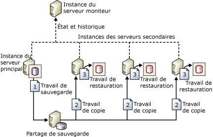

# À propos de la copie des journaux de transaction (SQL Server)

[!INCLUDE[appliesto-ss-xxxx-xxxx-xxx-md-winonly](../../includes/appliesto-ss-xxxx-xxxx-xxx-md-winonly.md)]

  [!INCLUDE[ssNoVersion](../../includes/ssnoversion-md.md)] permet d'envoyer automatiquement les sauvegardes du journal des transactions à partir d'une *base de données primaire* sur une instance du *serveur principal* vers une ou plusieurs *bases de données secondaires* sur des instances distinctes du *serveur secondaire* . Les sauvegardes du journal des transactions sont appliquées individuellement à chacune des bases de données secondaires. Une troisième instance de serveur facultatif, appelée *serveur moniteur*, enregistre l'historique et l'état des opérations de sauvegarde ainsi que de restauration, puis déclenche éventuellement des alertes si ces opérations ne sont pas effectuées selon la planification établie.  
  
 **Dans cette rubrique :**  
  
-   [Avantages](#Benefits)  
  
-   [Termes et définitions](#TermsAndDefinitions)  
  
-   [Vue d'ensemble de la copie des journaux de transaction](#ComponentsAndConcepts)  
  
-   [Interopérabilité](#Interoperability)  
  
-   [Tâches associées](#RelatedTasks)  
  
##   Avantages  
  
-   Fournit une solution de récupération d'urgence pour une base de données primaire unique et une ou plusieurs bases de données secondaires, chacune sur une instance distincte de [!INCLUDE[ssNoVersion](../../includes/ssnoversion-md.md)].  
  
-   Prend en charge un accès limité en lecture seule aux bases de données secondaires (pendant l'intervalle entre des travaux de restauration).  
  
-   Possibilité de spécifier un délai défini par l'utilisateur entre la sauvegarde du fichier journal de la base de données primaire par le serveur principal et la restauration (application) de la sauvegarde du fichier journal par les serveurs secondaires. Un délai plus long peut s'avérer utile en cas, par exemple, de modification accidentelle des données sur la base de données primaire. Si la modification accidentelle est remarquée rapidement, un délai peut vous permettre de récupérer à partir de la base de données secondaire les données n'ayant pas encore été modifiées, avant que la modification n'y soit reflétée.  
  
##   Termes et définitions  
 serveur principal  
 Instance de [!INCLUDE[ssNoVersion](../../includes/ssnoversion-md.md)] qui est votre serveur de production.  
  
 base de données primaire  
 Base de données sur le serveur principal que vous souhaitez sauvegarder sur un autre serveur. Toute l'administration de la configuration de la copie des journaux de transaction à l'aide de [!INCLUDE[ssManStudioFull](../../includes/ssmanstudiofull-md.md)] s'exécute à partir de la base de données primaire.  
  
 serveur secondaire  
 Instance de [!INCLUDE[ssNoVersion](../../includes/ssnoversion-md.md)] où vous souhaitez conserver une copie de secours semi-automatique de la base de données primaire.  
  
 base de données secondaire  
 Copie de secours semi-automatique de la base de données primaire. La base de données secondaire peut être dans l'état RECOVERING ou STANDBY, dans lequel elle est disponible pour un accès limité en lecture seule.  
  
 serveur moniteur  
 Instance facultative de [!INCLUDE[ssNoVersion](../../includes/ssnoversion-md.md)] qui assure le suivi de tous les détails de la copie des journaux de transaction, tels que :  
  
-   le jour et l'heure de la dernière sauvegarde du journal des transactions de la base de données primaire ;  
  
-   le jour et l'heure de la dernière copie ou restauration des fichiers de sauvegarde par les serveurs secondaires ;  
  
-   les informations concernant les alertes éventuelles d'échec de la sauvegarde.  
  
> [!IMPORTANT]  
>  Une fois que le serveur moniteur a été configuré, il ne peut pas être modifié sans suppression préalable de la copie des journaux de transaction.  
  
 travail de sauvegarde  
 Travail de l'Agent [!INCLUDE[ssNoVersion](../../includes/ssnoversion-md.md)] qui exécute l'opération de sauvegarde, enregistre l'historique sur le serveur local et sur le serveur moniteur, puis supprime les fichiers de sauvegarde et informations d'historiques obsolètes. Si la copie des journaux de transaction est activée, la catégorie de travaux « Sauvegarde de l'envoi de journaux » est créée sur l'instance du serveur principal.  
  
 travail de copie  
 Travail de l'Agent [!INCLUDE[ssNoVersion](../../includes/ssnoversion-md.md)] qui copie les fichiers de sauvegarde à partir du serveur principal vers une destination configurable sur le serveur secondaire, puis enregistre l'historique sur le serveur secondaire ainsi que sur le serveur moniteur. Si la copie des journaux de transaction est activée sur une base de données, la catégorie de travaux « Copie des journaux de transaction » est créée sur chaque serveur secondaire dans une configuration de la copie des journaux de transaction.  
  
 travail de restauration  
 Travail de l'Agent [!INCLUDE[ssNoVersion](../../includes/ssnoversion-md.md)] qui restaure les fichiers de sauvegarde copiés dans les bases de données secondaires. Il enregistre l'historique sur le serveur local et sur le serveur moniteur, puis supprime les fichiers et informations d'historiques obsolètes. Lorsque la copie des journaux de transaction est activée sur une base de données, la catégorie de travaux « Restauration de la copie des journaux de transaction » est créée sur l'instance du serveur secondaire.  
  
 travail d'alerte  
 Travail de l'Agent [!INCLUDE[ssNoVersion](../../includes/ssnoversion-md.md)] qui déclenche des alertes pour les bases de données primaire et secondaire lorsqu'une opération de sauvegarde ou de restauration ne se termine pas correctement dans un seuil spécifié. Lorsque la copie des journaux de transaction est activée sur une base de données, la catégorie de travaux « Alerte de la copie des journaux de transaction » est créée sur l'instance du serveur moniteur.  
  
> [!TIP]  
>  Pour chaque alerte, vous devez spécifier un numéro d'alerte. En outre, veillez à configurer l'alerte de manière à avertir un opérateur lorsqu'une alerte est générée.  
  
##   Vue d'ensemble de la copie des journaux de transaction  
 La copie des journaux de transaction comprend trois opérations :  
  
1.  sauvegarde du journal des transactions au niveau de l'instance du serveur principal ;  
  
2.  copie du fichier du journal des transactions sur l'instance du serveur secondaire ;  
  
3.  restauration de la sauvegarde du journal sur l'instance du serveur secondaire.  
  
 Le journal peut être envoyé à plusieurs instances de serveur secondaire. Dans ce cas, les opérations 2 et 3 sont répétées pour chaque instance de serveur secondaire.  
  
 Une configuration de la copie des journaux de transaction ne bascule pas automatiquement du serveur principal au serveur secondaire. Si la base de données primaire devient indisponible, toute base de données secondaire peut être mise en ligne manuellement.  
  
 Vous pouvez utiliser une base de données secondaire pour générer des rapports.  
  
 En outre, vous pouvez configurer des alertes pour votre configuration de copie des journaux de transaction.  
  
### Configuration standard de la copie des journaux de transaction  
 La figure ci-dessous illustre une configuration de la copie des journaux de transaction avec une instance du serveur principal, trois instances du serveur secondaire et une instance de serveur moniteur. La figure illustre les étapes des travaux de sauvegarde, copie et restauration :  
  
1.  L'instance du serveur principal effectue le travail de sauvegarde pour sauvegarder le journal des transactions sur la base de données primaire. Cette instance de serveur place ensuite la sauvegarde du journal dans un fichier journal primaire de sauvegarde, qu'il envoie vers le dossier de sauvegarde.  Dans cette figure, le dossier de sauvegarde se trouve dans un répertoire partagé — le *partage de sauvegarde*.  
  
2.  Chacune des trois instances du serveur secondaire effectue son propre travail de copie pour copier le fichier journal primaire de sauvegarde dans son dossier local de destination propre.  
  
3.  Chaque instance du serveur secondaire effectue son propre travail de restauration pour restaurer la sauvegarde du journal à partir du dossier local de destination vers la base de données secondaire locale.  
  
 Les instances des serveurs principal et secondaire envoient leur propre historique et leur propre état vers l'instance du serveur moniteur.  
  
   
  
##   Interopérabilité  
 La copie des journaux de transaction peut être utilisée avec les fonctionnalités ou les composants de [!INCLUDE[ssNoVersion](../../includes/ssnoversion-md.md)]suivants :  
  
-   [Conditions préalables requises pour la migration de la copie des journaux de transaction vers les groupes de disponibilité Always On &#40;SQL Server&#41;](../../database-engine/availability-groups/windows/prereqs-migrating-log-shipping-to-always-on-availability-groups.md)  
  
-   [Mise en miroir de bases de données et copie des journaux de transaction &#40;SQL Server&#41;](../../database-engine/database-mirroring/database-mirroring-and-log-shipping-sql-server.md)  
  
-   [Copie des journaux de transaction et réplication &#40;SQL Server&#41;](../../database-engine/log-shipping/log-shipping-and-replication-sql-server.md)  
  
> [!NOTE]  
>  [!INCLUDE[ssHADR](../../includes/sshadr-md.md)] et la mise en miroir de bases de données s’excluent mutuellement. Une base de données configurée pour une de ces fonctionnalités ne peut pas être configurée pour l'autre.  
  
##   Tâches associées  
  
-   [Mise à niveau de la copie des journaux de transaction vers SQL Server 2016 &#40;Transact-SQL&#41;](../../database-engine/log-shipping/upgrading-log-shipping-to-sql-server-2016-transact-sql.md)  
  
-   [Configurer la copie des journaux de transaction &#40;Transact-SQL&#41;](../../database-engine/log-shipping/configure-log-shipping-sql-server.md)  
  
-   [Ajouter une base de données secondaire dans une configuration de copie des journaux de transaction &#40;SQL Server&#41;](../../database-engine/log-shipping/add-a-secondary-database-to-a-log-shipping-configuration-sql-server.md)  
  
-   [Supprimer une base de données secondaire dans une configuration de copie des journaux de transaction &#40;SQL Server&#41;](../../database-engine/log-shipping/remove-a-secondary-database-from-a-log-shipping-configuration-sql-server.md)  
  
-   [Supprimer la copie des journaux de transaction &#40;SQL Server&#41;](../../database-engine/log-shipping/remove-log-shipping-sql-server.md)  
  
-   [Afficher le rapport de la copie des journaux de transaction &#40;SQL Server Management Studio&#41;](../../database-engine/log-shipping/view-the-log-shipping-report-sql-server-management-studio.md)  
  
-   [Surveiller la copie des journaux de transaction &#40;Transact-SQL&#41;](../../database-engine/log-shipping/monitor-log-shipping-transact-sql.md)  
  
-   [Basculer vers un serveur secondaire d’envoi de journaux &#40;SQL Server&#41;](../../database-engine/log-shipping/fail-over-to-a-log-shipping-secondary-sql-server.md)  
  
-   [Basculer vers un serveur secondaire d’envoi de journaux &#40;SQL Server&#41;](../../database-engine/log-shipping/fail-over-to-a-log-shipping-secondary-sql-server.md)  
  
-   [Gestion des connexions et des travaux après un basculement de rôle &#40;SQL Server&#41;](../../sql-server/failover-clusters/management-of-logins-and-jobs-after-role-switching-sql-server.md)  
  
##  Voir aussi  
 [Vue d’ensemble des groupes de disponibilité Always On &#40;SQL Server&#41;](../../database-engine/availability-groups/windows/overview-of-always-on-availability-groups-sql-server.md)  
  
  
