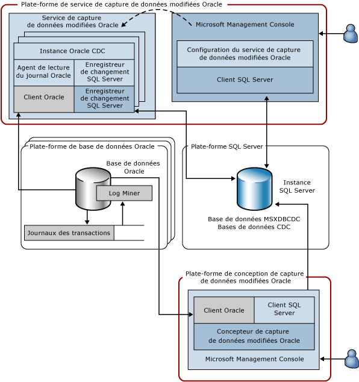

# Architecture système du service de capture de données modifiées pour Oracle par Attunity
  Le service de capture de données modifiées pour Oracle capture les modifications apportées aux tables sélectionnées dans une ou plusieurs bases de données Oracle sources dans les bases de données CDC [!INCLUDE[ssNoVersion](../../includes/ssnoversion-md.md)] situées sur une instance [!INCLUDE[ssNoVersion](../../includes/ssnoversion-md.md)] . Le diagramme suivant montre les composants qui composent le service de capture de données modifiées pour Oracle.  
  
   
  
 Cette illustration montre quatre plateformes utilisées. Dans de nombreux cas, ces plateformes peuvent se chevaucher, mais ce schéma représente un cas de figure standard. Par exemple, il est logique que les bases de données Oracle et [!INCLUDE[ssNoVersion](../../includes/ssnoversion-md.md)] s'exécutent chacune sur un ordinateur différent et ne soient pas partagées avec la plateforme de service de capture de données modifiées Oracle ou la plateforme à partir de laquelle le service de capture de données modifiées est conçu. Les plateformes illustrées sont les suivantes :  
  
-   Service de capture de données modifiées Oracle : cela peut être n'importe quel ordinateur Windows pris en charge lorsque le service de capture de données modifiées Oracle est installé et exécuté. Cette plateforme peut également représenter un nœud de cluster dans un cluster de basculement Microsoft (les configurations de haute disponibilité sont présentées plus loin dans ce document).  
  
-   Base de données Oracle : cela peut être n'importe quel ordinateur où une version prise en charge de la base de données Oracle s'exécute. Cela inclut tous les ordinateurs Windows, Linux ou exécutant tout autre système d'exploitation pris en charge par la version de la base de données Oracle installée. Notez que le diagramme affiche cette plateforme au pluriel parce qu'un seul service de capture de données modifiées Oracle peut capturer des modifications de plusieurs bases de données Oracle sources.  
  
-   Serveur [!INCLUDE[ssNoVersion](../../includes/ssnoversion-md.md)]: cela peut être n’importe quel ordinateur sur lequel la base de données [!INCLUDE[ssNoVersion](../../includes/ssnoversion-md.md)] cible (une référence SKU prise en charge de [!INCLUDE[ssCurrent](../../includes/sscurrent-md.md)]) s’exécute. Un service de capture de données modifiées Oracle prend en charge une cible [!INCLUDE[ssNoVersion](../../includes/ssnoversion-md.md)] où il stocke les tables de modifications et la configuration du service. La plateforme [!INCLUDE[ssNoVersion](../../includes/ssnoversion-md.md)] peut également représenter une instance en cluster de [!INCLUDE[ssCurrent](../../includes/sscurrent-md.md)] ou une instance en miroir de [!INCLUDE[ssCurrent](../../includes/sscurrent-md.md)] à l’aide de la fonctionnalité **Always On** .  
  
-   Concepteur de capture de données modifiées Oracle : cela peut être n'importe quel ordinateur Windows pris en charge qui a accès à la base de données Oracle source et à la base de données [!INCLUDE[ssNoVersion](../../includes/ssnoversion-md.md)] cible.  
  
 Le tableau suivant décrit les composants qui s'exécutent sur l'une des quatre plateformes décrites ci-dessus.  
  
|Composant/Description|Le composant comprend :|  
|----------------------------|----------------------------|  
|Service de capture de données modifiées Oracle : il s'agit d'un service Windows où l'activité de capture de données modifiées a lieu.|Instance Oracle CDC : sous-processus du service de capture de données modifiées Oracle qui gère l'activité de capture de données modifiées pour une seule base de données Oracle source (il y a une instance Oracle CDC par base de données Oracle source).|  
||Agent de lecture du journal Oracle : lit les journaux des transactions Oracle à l'aide du client Oracle.|  
||Client Oracle : client instantané Oracle utilisé pour la communication avec Oracle. Il s'agit d'un composant requis qui doit être obtenu auprès d'Oracle et installé avant d'installer le service de capture de données modifiées Oracle.|  
||[!INCLUDE[ssNoVersion](../../includes/ssnoversion-md.md)] Enregistreur de changement : écrit les modifications validées apportées à la table Oracle capturée dans les tables de modifications [!INCLUDE[ssNoVersion](../../includes/ssnoversion-md.md)]. Ce composant conserve également cet état de capture dans la base de données [!INCLUDE[ssNoVersion](../../includes/ssnoversion-md.md)] cible.|  
||[!INCLUDE[ssNoVersion](../../includes/ssnoversion-md.md)]Client ODBC : Microsoft Native Client pour [!INCLUDE[ssCurrent](../../includes/sscurrent-md.md)]. Il s'agit d'un composant requis qui doit être obtenu auprès de Microsoft et installé avant d'installer le service de capture de données modifiées Oracle.|  
|Configuration du service de capture de données modifiées Oracle : il s'agit d'un composant logiciel enfichable MMC (Microsoft Management Console) qui crée le service Windows et installe sa configuration.|[!INCLUDE[ssNoVersion](../../includes/ssnoversion-md.md)] : client SQL ADO.NET fourni avec la version 4 du .NET Framework.|  
|Base de données Oracle : base de données Oracle source à partir de laquelle les modifications apportées aux tables sélectionnées sont capturées.|Log Miner : composant Oracle par l'intermédiaire duquel les journaux des transactions Oracle sont lus.|  
||Journaux des transactions : journaux de restauration par progression Oracle en ligne et archivés utilisés par Oracle pour garantir que la base de données peut restaurer des transactions et effectuer une récupération suite à des défaillances (dans ce cas, la base de données Oracle doit s'exécuter en mode ARCHIVELOG).|  
|[!INCLUDE[ssNoVersion](../../includes/ssnoversion-md.md)] : instance [!INCLUDE[ssNoVersion](../../includes/ssnoversion-md.md)] où les bases de données CDC sont hébergées. Il peut s’agir d’une instance en cluster de [!INCLUDE[ssNoVersion](../../includes/ssnoversion-md.md)] (cluster de basculement) ou d’une base de données mise en miroir (Always On).|Base de données MSXDBCDC : base de données où les informations sur les services de capture de données modifiées utilisant cette instance [!INCLUDE[ssNoVersion](../../includes/ssnoversion-md.md)] sont conservées. Elle conserve également des informations sur les instances Oracle CDC gérées par chaque service de capture de données modifiées. Cette base de données est créée dans le cadre du processus de création du service de capture de données modifiées.|  
||Bases de données CDC : bases de données [!INCLUDE[ssNoVersion](../../includes/ssnoversion-md.md)] qui stockent les modifications apportées à l'une des bases de données Oracle sources. Les bases de données CDC étant activées pour la capture de données modifiées [!INCLUDE[ssNoVersion](../../includes/ssnoversion-md.md)] , elles possèdent des tables et des fonctions de capture de données modifiées [!INCLUDE[ssNoVersion](../../includes/ssnoversion-md.md)] , ce qui facilite la consommation de modifications provenant d'Oracle.|  
|Concepteur de capture de données modifiées Oracle : composant logiciel enfichable MMC (Microsoft Management Console) permettant de créer des instances Oracle CDC. Utilisez ce composant pour sélectionner les tables et les colonnes à capturer, fournir les informations de connexion Oracle et gérer le cycle de vie des instances de capture de données modifiées.|[!INCLUDE[ssNoVersion](../../includes/ssnoversion-md.md)] : client SQL ADO.NET fourni avec la version 4 du .NET Framework.|  
||Client Oracle : client instantané Oracle utilisé pour la communication avec Oracle. Il s'agit d'un composant requis qui doit être obtenu auprès d'Oracle et installé avant d'installer le service de capture de données modifiées Oracle.|  
  
 Le service de capture de données modifiées Oracle et ses instances Oracle CDC enfants ne peuvent communiquer qu'avec la ou les bases de données Oracle sources et l'instance [!INCLUDE[ssNoVersion](../../includes/ssnoversion-md.md)] cible comme clients. Ils n'écoutent pas activement le réseau et d'autres protocoles. Le service de capture de données modifiées Oracle surveille les modifications de configuration apportées aux bases de données CDC et met à jour son exécution selon la configuration mise à jour.  
  
  
