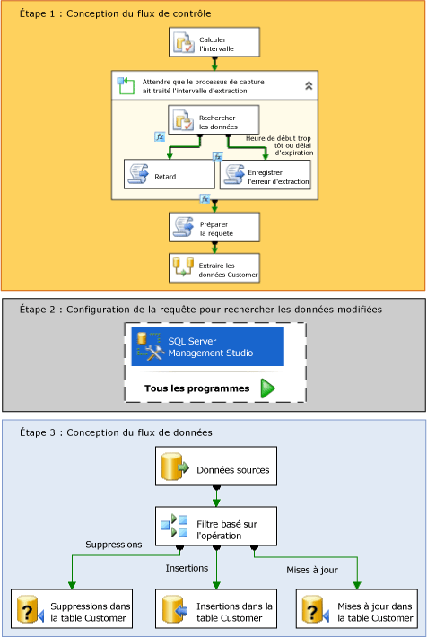

# Capture de données modifiées (SSIS)
  Dans [!INCLUDE[ssNoVersion](../../includes/ssnoversion-md.md)], la capture de données modifiées constitue une solution efficace au défi de l'optimisation des chargements incrémentiels de tables sources vers des mini-Data Warehouses et des entrepôts de données.  
  
## Qu'est-ce que la capture de données modifiées ?  
 Les tables sources changent au fil du temps. Un mini-Data Warehouse ou un entrepôt de données qui est basé sur ces tables doit refléter ces modifications. Toutefois, un processus qui copie périodiquement un instantané de la source entière consomme trop de temps et de ressources. D'autres approches, notamment des colonnes timestamp, des déclencheurs ou des requêtes complexes, nuisent souvent aux performances et accroissent la complexité. Un flux de données modifiées fiable est donc nécessaire, structuré de sorte que les consommateurs puissent facilement l'appliquer aux représentations cibles des données. La capture de données modifiées dans [!INCLUDE[ssNoVersion](../../includes/ssnoversion-md.md)] offre cette solution.  
  
 La fonction de capture des modifications de données de [!INCLUDE[ssDE](../../includes/ssde-md.md)] capture les activités d’insertion, de mise à jour et de suppression appliquées aux tables [!INCLUDE[ssNoVersion](../../includes/ssnoversion-md.md)] , et rend les détails des modifications disponibles dans un format relationnel simple à utiliser. Les tables de modifications utilisées par la capture de données modifiées contiennent des colonnes qui reflètent la structure de colonne des tables sources suivies, ainsi que les métadonnées nécessaires à la compréhension des modifications effectuées ligne par ligne.  
  
> [!NOTE]  
>  La capture des modifications de données n’est pas disponible dans toutes les éditions de [!INCLUDE[msCoName](../../includes/msconame-md.md)][!INCLUDE[ssNoVersion](../../includes/ssnoversion-md.md)]. Pour obtenir la liste des fonctionnalités prises en charge par les éditions de [!INCLUDE[ssNoVersion](../../includes/ssnoversion-md.md)], consultez [Fonctionnalités prise en charge par les éditions de SQL Server 2016](~/sql-server/editions-and-supported-features-for-sql-server-2016.md).  
  
## Fonctionnement de la capture de données modifiées dans Integration Services  
 Un package [!INCLUDE[ssISnoversion](../../includes/ssisnoversion-md.md)] peut facilement collecter les données modifiées dans les bases de données [!INCLUDE[ssNoVersion](../../includes/ssnoversion-md.md)] pour effectuer des chargements incrémentiels efficaces dans un entrepôt de données. Toutefois, avant de pouvoir utiliser [!INCLUDE[ssISnoversion](../../includes/ssisnoversion-md.md)] pour charger des données modifiées, un administrateur doit activer la capture de données modifiées sur la base de données et les tables à partir desquelles vous souhaitez capturer les modifications. Pour plus d’informations sur la configuration de la capture des données modifiées sur une base de données, consultez [Activer et désactiver la capture de données modifiées &#40;SQL Server&#41;](../../relational-databases/track-changes/enable-and-disable-change-data-capture-sql-server.md).  
  
 Une fois qu'un administrateur a activé la capture de données modifiées sur la base de données, vous pouvez créer un package qui effectue un chargement incrémentiel des données modifiées. Le diagramme suivant montre les étapes à suivre pour créer un tel package qui effectue un chargement incrémentiel à partir d'une table individuelle :  
  
   
  
 Comme indiqué dans le diagramme précédent, la création d'un package qui effectue un chargement incrémentiel des données modifiées implique les étapes suivantes :  
  
 **Étape 1 : Conception du flux de contrôle**  
 Dans le flux de contrôle du package, les tâches suivantes doivent être définies :  
  
-   Calculer les valeurs **datetime** de début et de fin pour l’intervalle des modifications apportées aux données sources à récupérer.  
  
     Pour calculer ces valeurs, utilisez une tâche d’exécution de requêtes SQL ou des expressions [!INCLUDE[ssISnoversion](../../includes/ssisnoversion-md.md)] avec des fonctions **datetime** . Vous stockez ensuite ces points de terminaison dans des variables de package pour une utilisation ultérieure dans le package.  
  
     **Pour plus d’informations, consultez** [Spécifier un intervalle de données modifiées](../../integration-services/change-data-capture/specify-an-interval-of-change-data.md)  
  
-   Déterminer si les données modifiées pour l'intervalle sélectionné sont prêtes. Cette étape est nécessaire car le processus de capture asynchrone n'a peut-être pas encore atteint le point de terminaison sélectionné.  
  
     Pour déterminer si les données sont prêtes, commencez si nécessaire par un conteneur de boucles For pour différer l'exécution, jusqu'à ce que les données modifiées pour l'intervalle sélectionné soient prêtes. Dans le conteneur de boucles, utilisez une tâche d'exécution SQL pour interroger les tables de mappage du temps gérées par la capture de données modifiées. Utilisez ensuite une tâche de script qui appelle la méthode **Thread.Sleep** ou une autre tâche d’exécution SQL avec une instruction **WAITFOR** pour différer temporairement l’exécution du package si nécessaire. Utilisez éventuellement une autre tâche de script pour enregistrer une condition d'erreur ou un délai d'attente.  
  
     **Pour plus d’informations, consultez** [Déterminer si les données modifiées sont prêtes](../../integration-services/change-data-capture/determine-whether-the-change-data-is-ready.md)  
  
-   Préparer la chaîne de requête qui sera utilisée pour rechercher les données modifiées.  
  
     Utilisez une tâche de script ou une tâche d'exécution SQL pour assembler l'instruction SQL qui sera utilisée pour rechercher les modifications.  
  
     **Pour plus d’informations, consultez** [Préparer la recherche des données modifiées](../../integration-services/change-data-capture/prepare-to-query-for-the-change-data.md)  
  
 **Étape 2 : Configuration de la requête pour rechercher les données modifiées**  
 Créez la fonction table qui recherchera les données.  
  
 Utilisez [!INCLUDE[ssManStudioFull](../../includes/ssmanstudiofull-md.md)] pour développer et enregistrer la requête.  
  
 **Pour plus d’informations, consultez** [Récupérer et comprendre les données modifiées](../../integration-services/change-data-capture/retrieve-and-understand-the-change-data.md)  
  
 **Étape 3 : Conception du flux de données**  
 Dans le flux de données du package, les tâches suivantes doivent être définies :  
  
-   Récupérer les données modifiées des tables de modifications.  
  
     Pour récupérer les données, utilisez un composant source pour interroger les tables de modifications à propos des modifications qui se situent dans l'intervalle sélectionné. La source appelle une fonction table Transact-SQL que vous aurez créée précédemment.  
  
     **Pour plus d’informations, consultez** [Récupérer et comprendre les données modifiées](../../integration-services/change-data-capture/retrieve-and-understand-the-change-data.md)  
  
-   Fractionner les modifications en insertions, mises à jour et suppressions à des fins de traitement.  
  
     Pour fractionner les modifications, utilisez une transformation de fractionnement conditionnel pour diriger les insertions, les mises à jour et les suppressions vers les différentes sorties pour un traitement approprié.  
  
     **Pour plus d’informations, consultez** [Traiter les insertions, les mises à jour et les suppressions](../../integration-services/change-data-capture/process-inserts-updates-and-deletes.md)  
  
-   Appliquer les insertions, les suppressions et les mises à jour à la destination.  
  
     Pour appliquer les modifications à la destination, utilisez un composant de destination pour appliquer les insertions à la destination. Ensuite, utilisez des transformations de commande OLE DB avec des instructions UPDATE et DELETE paramétrables pour appliquer les mises à jour et les suppressions à la destination. Vous pouvez également appliquer les mises à jour et les suppressions en utilisant des composants de destination pour enregistrer les lignes dan des tables temporaires. Ensuite, utilisez des tâches d'exécution SQL pour effectuer les opérations de mise à jour en bloc et de suppression en bloc sur la destination à partir des tables temporaires.  
  
     **Pour plus d’informations, consultez** [Appliquer des modifications à la destination](../../integration-services/change-data-capture/apply-the-changes-to-the-destination.md)  
  
### Données modifiées en provenance de plusieurs tables  
 Le processus exposé précédemment fait référence à un chargement incrémentiel à partir d'une table unique. Pour effectuer un chargement incrémentiel à partir de plusieurs tables, le processus d'ensemble est le même. Toutefois, la conception du package doit être modifié pour prendre en charge le traitement de plusieurs tables. Pour plus d’informations sur la création d’un package qui effectue un chargement incrémentiel à partir de plusieurs tables, consultez [Exécuter un chargement incrémentiel de plusieurs table](../../integration-services/change-data-capture/perform-an-incremental-load-of-multiple-tables.md).  
  
## Exemples de packages de capture de données modifiées  
 [!INCLUDE[ssISnoversion](../../includes/ssisnoversion-md.md)] fournit deux exemples qui montrent comment utiliser la capture de données modifiées dans des packages. Pour plus d'informations, consultez les rubriques suivantes :  
  
-   [Fichier Lisezmoi de l'exemple de package de capture de données modifiées pour l'intervalle spécifié](http://go.microsoft.com/fwlink/?LinkId=133507)  
  
-   [Fichier Lisez-moi de l'exemple de package Change Data Capture since Last Request](http://go.microsoft.com/fwlink/?LinkId=133508)  
  
## Related Tasks  
  
-   [Spécifier un intervalle de données modifiées](../../integration-services/change-data-capture/specify-an-interval-of-change-data.md)  
  
-   [Déterminer si les données modifiées sont prêtes](../../integration-services/change-data-capture/determine-whether-the-change-data-is-ready.md)  
  
-   [Préparer la recherche des données modifiées](../../integration-services/change-data-capture/prepare-to-query-for-the-change-data.md)  
  
-   [Créer la fonction de récupération des données modifiées](../../integration-services/change-data-capture/create-the-function-to-retrieve-the-change-data.md)  
  
-   [Récupérer et comprendre les données modifiées](../../integration-services/change-data-capture/retrieve-and-understand-the-change-data.md)  
  
-   [Traiter les insertions, les mises à jour et les suppressions](../../integration-services/change-data-capture/process-inserts-updates-and-deletes.md)  
  
-   [Appliquer les modifications à la destination](../../integration-services/change-data-capture/apply-the-changes-to-the-destination.md)  
  
-   [Exécuter un chargement incrémentiel de plusieurs table](../../integration-services/change-data-capture/perform-an-incremental-load-of-multiple-tables.md)  
  
## Contenu associé  
 Entrée de blog, [SSIS Design Pattern – Incremental Load](http://go.microsoft.com/fwlink/?LinkId=217679), sur sqlblog.com  
  
  
