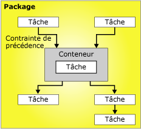

# Flux de contrôle
  Un package est constitué d'un flux de contrôle et, éventuellement, d'un ou de plusieurs flux de données. [!INCLUDE[ssNoVersion](../../includes/ssnoversion-md.md)] [!INCLUDE[ssISnoversion](../../includes/ssisnoversion-md.md)] fournit trois types différents d’éléments de flux de contrôle : des conteneurs qui structurent les packages, des tâches qui fournissent des fonctionnalités et des contraintes de précédence qui connectent les exécutables, les conteneurs et les tâches pour former un flux de contrôle ordonné.  
  
 Pour plus d’informations, consultez [Contraintes de précédence](../../integration-services/control-flow/precedence-constraints.md), [Conteneurs Integration Services](../../integration-services/control-flow/integration-services-containers.md)et [Tâches Integration Services](../../integration-services/control-flow/integration-services-tasks.md).  
  
 Le diagramme qui suit montre un flux de contrôle composé d'un conteneur et de six tâches. Cinq de ces tâches sont définies au niveau du package et une est définie au niveau du conteneur. La tâche se trouve à l'intérieur d'un conteneur.  
  
   
  
 L’architecture [!INCLUDE[ssISnoversion](../../includes/ssisnoversion-md.md)] prend en charge l’imbrication de conteneurs et un flux de contrôle peut contenir plusieurs niveaux de conteneurs imbriqués. Par exemple, un package peut être formé d'un conteneur de boucles Foreach, qui lui-même peut contenir un autre conteneur de boucles Foreach, etc.  
  
 Les gestionnaires d'événements contiennent également des flux de contrôle qui sont créés à l'aide des mêmes types d'éléments de flux de contrôle.  
  
## Implémentation des flux de contrôle  
 Vous créez le flux de contrôle d’un package via l’onglet **Flux de contrôle** dans le concepteur [!INCLUDE[ssIS](../../includes/ssis-md.md)] . Lorsque l’onglet **Flux de contrôle** est actif, la boîte à outils énumère les tâches et conteneurs que vous pouvez ajouter au flux de contrôle.  
  
 Le diagramme qui suit montre le flux de contrôle d'un package simple dans le concepteur de flux de contrôle. Le flux de contrôle représenté dans le diagramme est constitué de trois tâches de niveau package et d'un conteneur de niveau package contenant trois tâches. Les tâches et le conteneur sont connectés à l'aide de contraintes de précédence.  
  
   
  
 La création d'un flux de contrôle comprend les tâches suivantes :  
  
-   ajout des conteneurs qui implémentent les flux de travail répétitifs dans un package ou divisent un flux de contrôle en sous-ensembles ;  
  
-   ajout des tâches qui prennent en charge les flux de données, préparent les données, réalisent les fonctions de flux de travail et de Business Intelligence et implémentent le script ;  
  
     [!INCLUDE[ssISnoversion](../../includes/ssisnoversion-md.md)] propose différentes tâches que vous pouvez utiliser pour créer un flux de contrôle répondant aux besoins du package. Si le package doit utiliser des données, le flux de contrôle doit contenir au moins une tâche de flux de données. Par exemple, un package devra peut-être extraire des données, agréger des valeurs de données, puis écrire les résultats dans une source de données.  Pour plus d’informations, consultez [Tâches Integration Services](../../integration-services/control-flow/integration-services-tasks.md) et [Ajouter ou supprimer une tâche ou un conteneur dans un flux de contrôle](../../integration-services/control-flow/add-or-delete-a-task-or-a-container-in-a-control-flow.md).  
  
-   connexion des conteneurs et des tâches à l'aide de contraintes de précédence pour former un flux de contrôle ordonné.  
  
     Après avoir ajouté une tâche ou un conteneur à l’aire de conception de l’onglet **Flux de contrôle** , le concepteur [!INCLUDE[ssIS](../../includes/ssis-md.md)] ajoute automatiquement un connecteur à l’élément. Si un package contient deux éléments, tâches ou conteneurs ou davantage, vous pouvez les relier en un flux de contrôle en faisant glisser leurs connecteurs vers un autre élément.  
  
     Le connecteur entre deux éléments représente une contrainte de précédence. Une contrainte de précédence définit les relations entre deux éléments connectés. Elle spécifie l'ordre d'exécution des tâches et des conteneurs et leurs conditions d'exécution. Par exemple, une contrainte de précédence peut spécifier qu'une tâche doit réussir pour pouvoir exécuter la tâche suivante. Pour plus d’informations, consultez [Contraintes de précédence](../../integration-services/control-flow/precedence-constraints.md).  
  
-   Ajout de gestionnaires de connexions.  
  
     De nombreuses tâches ont besoin d'une connexion à une source de données. Vous devez ajouter au package les gestionnaires de connexions requis par la tâche. En fonction du type d'énumérateur qu'il utilise, le conteneur de boucles Foreach peut également exiger un gestionnaire de connexions. Vous pouvez ajouter les gestionnaires de connexions au moment de la création de l'élément de flux de contrôle ou avant de commencer à construire le flux de contrôle. Pour plus d’informations, consultez [Connexions Integration Services &#40;SSIS&#41;](../../integration-services/connection-manager/integration-services-ssis-connections.md) et [Créer des gestionnaires de connexions](http://msdn.microsoft.com/library/6ca317b8-0061-4d9d-b830-ee8c21268345).  
  
 Le concepteur [!INCLUDE[ssIS](../../includes/ssis-md.md)] propose également de nombreuses fonctionnalités disponibles au moment de la conception permettant de gérer l’aire de conception et de faire en sorte que le flux de contrôle s’auto-documente.  
  
## Related Tasks  
  
-   [Ajouter ou supprimer une tâche ou un conteneur dans un flux de contrôle](../../integration-services/control-flow/add-or-delete-a-task-or-a-container-in-a-control-flow.md)  
  
-   [Définir les propriétés d'une tâche ou d'un conteneur](http://msdn.microsoft.com/library/52d47ca4-fb8c-493d-8b2b-48bb269f859b)  
  
-   [Grouper ou dissocier des composants](../../integration-services/group-or-ungroup-components.md)  
  
  
