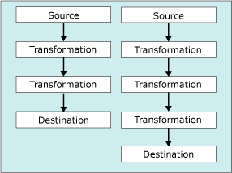

# tâche de flux de données
  La tâche de flux de données encapsule le moteur de flux de données chargé de déplacer des données entre les sources et les destinations et permet à l'utilisateur de transformer, nettoyer et modifier les données au cours de leur déplacement. L'ajout d'une tâche de flux de données à un flux de contrôle de package permet au package d'extraire, de transformer et de charger des données.  
  
 Un flux de données est constitué d'au moins un composant de flux de données, mais il s'agit en général d'un ensemble de composants de flux de données connectés : des sources qui extraient des données, des transformations qui modifient, acheminent ou résument des données, et des destinations qui chargent des données.  
  
 Au moment de l'exécution, la tâche de flux de données crée un plan d'exécution à partir du flux de données et le moteur de flux de données exécute le plan. Vous pouvez créer une tâche de flux de données qui n'a aucun flux de données, mais la tâche s'exécute uniquement si elle inclut au moins un flux de données.  
  
 Pour insérer des données en bloc dans une base de données [!INCLUDE[ssNoVersion](../../includes/ssnoversion-md.md)] à partir de fichiers texte, vous pouvez utiliser la tâche d'insertion en bloc plutôt qu'une tâche de flux de données et un flux de données. Cependant, la tâche d'insertion en bloc ne peut pas transformer des données. Pour plus d’informations, consultez [Tâche d’insertion en bloc](../../integration-services/control-flow/bulk-insert-task.md).  
  
## Flux multiples  
 Une tâche de flux de données peut contenir plusieurs flux de données. Si une tâche copie plusieurs ensembles de données et si l'ordre dans lequel les données sont copiées n'est pas significatif, il peut être plus commode d'inclure plusieurs flux de données dans la tâche de flux de données. Par exemple, vous pourriez créer cinq flux de données, chacun copiant des données à partir d'un fichier plat vers une table de dimension différente dans un schéma d'entrepôt de données en étoile.  
  
 Toutefois, le moteur de flux de données détermine l'ordre d'exécution lorsqu'une tâche de flux de données contient plusieurs flux de données. Par conséquent, lorsque l'ordre est important, le package doit utiliser plusieurs tâches de flux de données, chacune contenant un flux de données. Vous pouvez ensuite appliquer des contraintes de précédence afin de contrôler l'ordre d'exécution des tâches.  
  
 Le schéma suivant illustre une tâche de flux de données contenant plusieurs flux de données.  
  
   
  
## Entrées du journal  
 [!INCLUDE[ssISnoversion](../../includes/ssisnoversion-md.md)] fournit un ensemble de journaux d’événements disponibles pour toutes les tâches. [!INCLUDE[ssISnoversion](../../includes/ssisnoversion-md.md)] fournit également des entrées de journal personnalisées pour de nombreuses tâches. Pour plus d’informations, consultez [Journalisation Integration Services &#40;SSIS&#41;](../../integration-services/performance/integration-services-ssis-logging.md). La tâche de flux de données comprend les entrées de journal personnalisées suivantes :  
  
|Entrée du journal|Description|  
|---------------|-----------------|  
|**BufferSizeTuning**|Indique que la tâche de flux de données a modifié la taille du tampon. L'entrée de journal décrit les raisons de cette modification de taille et indique la nouvelle taille temporaire du tampon.|  
|**OnPipelinePostEndOfRowset**|Indique qu’un composant a reçu son signal de fin d’ensemble de lignes, qui est défini par le dernier appel de la méthode **ProcessInput** . Une entrée est écrite pour chaque composant du flux de données qui traite l'entrée. L'entrée inclut le nom du composant.|  
|**OnPipelinePostPrimeOutput**|Indique que le composant a terminé son dernier appel de la méthode **PrimeOutput** . Selon le flux de données, plusieurs entrées de journal peuvent être écrites. Si le composant est une source, cette entrée du journal signifie que le composant a terminé le traitement des lignes.|  
|**OnPipelinePreEndOfRowset**|Indique qu’un composant est sur le point de recevoir son signal de fin d’ensemble de lignes, qui est défini par le dernier appel de la méthode **ProcessInput** . Une entrée est écrite pour chaque composant du flux de données qui traite l'entrée. L'entrée inclut le nom du composant.|  
|**OnPipelinePrePrimeOutput**|Indique que le composant est sur le point de recevoir son appel de la méthode **PrimeOutput** . Selon le flux de données, plusieurs entrées de journal peuvent être écrites.|  
|**OnPipelineRowsSent**|Indique le nombre de lignes fournies à une entrée de composant par un appel de la méthode **ProcessInput** . L'entrée du journal inclut le nom du composant.|  
|**PipelineBufferLeak**|Donne des informations sur tout composant qui maintient l'activité des tampons après la fermeture du gestionnaire de tampons. Si un tampon est toujours actif, cela signifie que des ressources des tampons n'ont pas été libérées et qu'elles peuvent provoquer des fuites de mémoire. L'entrée du journal fournit le nom du composant et l'ID du tampon.|  
|**PipelineComponentTime**|Signale le temps (en millisecondes) que le composant a passé dans chacune de ses cinq étapes de traitement majeures : Validate, PreExecute, PostExecute, ProcessInput et ProcessOutput.|  
|**PipelineExecutionPlan**|Indique le plan d'exécution du flux de données. Le plan d'exécution fournit des informations sur la manière dont les tampons sont envoyés aux composants. Ces informations, conjuguées à l'entrée PipelineExecutionTrees du journal, décrivent ce qui se passe dans la tâche de flux de données.|  
|**PipelineExecutionTrees**|Indique les arborescences d'exécution de la disposition du flux de données. Le planificateur du moteur du flux de données utilise les arborescences pour construire le plan d'exécution du flux de données.|  
|**PipelineInitialization**|Donne des informations d'initialisation relatives à la tâche. Ces informations incluent les répertoires à utiliser pour le stockage temporaire des données blob, la taille par défaut de la mémoire tampon, ainsi que le nombre de lignes contenues dans une mémoire tampon. Selon la configuration de la tâche de flux de données, plusieurs entrées de journal peuvent être écrites.|  
  
 Ces entrées de journal fournissent de nombreuses informations sur l'exécution de la tâche de flux de données chaque fois que vous exécutez un package. D'une exécution à l'autre des packages, vous pouvez capturer des informations qui, au fil du temps, fournissent des éléments historiques importants sur le traitement effectué par la tâche, sur les problèmes pouvant affecter les performances et sur le volume de données géré par la tâche.  
  
 Pour plus d'informations sur la façon d'utiliser ces entrées de journal pour analyser et améliorer les performances du flux de données, consultez l'une des rubriques suivantes :  
  
-   [Compteurs de performances](../../integration-services/performance/performance-counters.md)  
  
-   [Fonctionnalités de performances de flux de données](../../integration-services/data-flow/data-flow-performance-features.md)  
  
### Exemples de messages d'une tâche de flux de données  
 Le tableau suivant répertorie des exemples de messages pour les entrées de journal d'un package très simple. Le package utilise une source OLE DB pour extraire les données d'une table, une transformation de tri pour trier les données et une destination OLE DB pour écrire les données dans une autre table.  
  
|Entrée du journal|Messages|  
|---------------|--------------|  
|**BufferSizeTuning**|`Rows in buffer type 0 would cause a buffer size greater than the configured maximum. There will be only 9637 rows in buffers of this type.`   `Rows in buffer type 2 would cause a buffer size greater than the configured maximum. There will be only 9497 rows in buffers of this type.`   `Rows in buffer type 3 would cause a buffer size greater than the configured maximum. There will be only 9497 rows in buffers of this type.`|  
|**OnPipelinePostEndOfRowset**|`A component will be given the end of rowset signal. : 1180 : Sort : 1181 : Sort Input`   `A component will be given the end of rowset signal. : 1291 : OLE DB Destination : 1304 : OLE DB Destination Input`|  
|**OnPipelinePostPrimeOutput**|`A component has returned from its PrimeOutput call. : 1180 : Sort`   `A component has returned from its PrimeOutput call. : 1 : OLE DB Source`|  
|**OnPipelinePreEndOfRowset**|`A component has finished processing all of its rows. : 1180 : Sort : 1181 : Sort Input`   `A component has finished processing all of its rows. : 1291 : OLE DB Destination : 1304 : OLE DB Destination Input`|  
|**OnPipelinePrePrimeOutput**|`PrimeOutput will be called on a component. : 1180 : Sort`   `PrimeOutput will be called on a component. : 1 : OLE DB Source`|  
|**OnPipelineRowsSent**|`Rows were provided to a data flow component as input. :  : 1185 : OLE DB Source Output : 1180 : Sort : 1181 : Sort Input : 76`   `Rows were provided to a data flow component as input. :  : 1308 : Sort Output : 1291 : OLE DB Destination : 1304 : OLE DB Destination Input : 76`|  
|**PipelineComponentTime**|`The component "Calculate LineItemTotalCost" (3522) spent 356 milliseconds in ProcessInput.`   `The component "Sum Quantity and LineItemTotalCost" (3619) spent 79 milliseconds in ProcessInput.`   `The component "Calculate Average Cost" (3662) spent 16 milliseconds in ProcessInput.`   `The component "Sort by ProductID" (3717) spent 125 milliseconds in ProcessInput.`   `The component "Load Data" (3773) spent 0 milliseconds in ProcessInput.`   `The component "Extract Data" (3869) spent 688 milliseconds in PrimeOutput filling buffers on output "OLE DB Source Output" (3879).`   `The component "Sum Quantity and LineItemTotalCost" (3619) spent 141 milliseconds in PrimeOutput filling buffers on output "Aggregate Output 1" (3621).`   `The component "Sort by ProductID" (3717) spent 16 milliseconds in PrimeOutput filling buffers on output "Sort Output" (3719).`|  
|**PipelineExecutionPlan**|`SourceThread0`   `Drives: 1`   `Influences: 1180 1291`   `Output Work List`   `CreatePrimeBuffer of type 1 for output ID 11.`   `SetBufferListener: "WorkThread0" for input ID 1181`   `CreatePrimeBuffer of type 3 for output ID 12.`   `CallPrimeOutput on component "OLE DB Source" (1)`   `End Output Work List`   `End SourceThread0`   `WorkThread0`   `Drives: 1180`   `Influences: 1180 1291`   `Input Work list, input ID 1181 (1 EORs Expected)`   `CallProcessInput on input ID 1181 on component "Sort" (1180) for view type 2`   `End Input Work list for input 1181`   `Output Work List`   `CreatePrimeBuffer of type 4 for output ID 1182.`   `SetBufferListener: "WorkThread1" for input ID 1304`   `CallPrimeOutput on component "Sort" (1180)`   `End Output Work List`   `End WorkThread0`   `WorkThread1`   `Drives: 1291`   `Influences: 1291`   `Input Work list, input ID 1304 (1 EORs Expected)`   `CallProcessInput on input ID 1304 on component "OLE DB Destination" (1291) for view type 5`   `End Input Work list for input 1304`   `Output Work List`   `End Output Work List`   `End WorkThread1`|  
|**PipelineExecutionTrees**|`begin execution tree 0`   `output "OLE DB Source Output" (11)`   `input "Sort Input" (1181)`   `end execution tree 0`   `begin execution tree 1`   `output "OLE DB Source Error Output" (12)`   `end execution tree 1`   `begin execution tree 2`   `output "Sort Output" (1182)`   `input "OLE DB Destination Input" (1304)`   `output "OLE DB Destination Error Output" (1305)`   `end execution tree 2`|  
|**PipelineInitialization**|`No temporary BLOB data storage locations were provided. The buffer manager will consider the directories in the TEMP and TMP environment variables.`   `The default buffer size is 10485760 bytes.`   `Buffers will have 10000 rows by default`   `The data flow will not remove unused components because its RunInOptimizedMode property is set to false.`|  
  
 De nombreux événements de journal écrivent plusieurs entrées et les messages liés à de nombreuses entrées de journal contiennent des données complexes. Pour faciliter la compréhension et la communication du contenu des messages complexes, vous pouvez analyser leur texte. En fonction de l'emplacement des journaux, vous pouvez utiliser des instructions Transact-SQL ou un composant Script pour répartir le texte complexe sur plusieurs colonnes ou sous d'autres formats que vous jugez plus utiles.  
  
 Par exemple, le tableau suivant affiche le message « Des lignes ont été fournies comme entrée à un composant de flux de données. :  : 1185 : Sortie de source OLE DB : 1180 : Tri : 1181 : Entrée de tri : 76 », analysé sur plusieurs colonnes. Le message a été écrit par l’événement **OnPipelineRowsSent** au moment où les lignes ont été envoyées de la source OLE DB à la transformation de tri.  
  
|colonne|Description|Valeur|  
|------------|-----------------|-----------|  
|**PathID**|Valeur de la propriété **ID** du chemin entre la source OLE DB et la transformation de tri.|1185|  
|**PathName**|Valeur de la propriété **Nom** du chemin.|Sortie de source OLE DB|  
|**ComponentID**|Valeur de la propriété **ID** de la transformation de tri.|1180|  
|**ComponentName**|Valeur de la propriété **Nom** de la transformation de tri.|Trier|  
|**InputID**|Valeur de la propriété **ID** de l’entrée de la transformation de tri.|1181|  
|**InputName**|Valeur de la propriété **Nom** de l’entrée de la transformation de tri.|Entrée de tri|  
|**RowsSent**|Nombre de lignes envoyées à l'entrée de la transformation de tri.|76|  
  
## Configuration de la tâche de flux de données  
 Vous pouvez définir des propriétés dans la fenêtre **Propriétés** ou par programmation.  
  
 Pour plus d’informations sur la façon de définir ces propriétés dans la fenêtre **Propriétés** , cliquez sur la rubrique suivante :  
  
-   [Définir les propriétés d'une tâche ou d'un conteneur](http://msdn.microsoft.com/library/52d47ca4-fb8c-493d-8b2b-48bb269f859b)  
  
## Configuration par programmation de la tâche de flux de données  
 Pour plus d'informations sur l'ajout par programmation d'une tâche de flux de données à un package et sur la définition des propriétés de flux de données, cliquez sur la rubrique suivante :  
  
-   [Ajout de la tâche de flux de données par programmation](../../integration-services/building-packages-programmatically/adding-the-data-flow-task-programmatically.md)  
  
## Related Tasks  
 [Définir les propriétés d'une tâche ou d'un conteneur](http://msdn.microsoft.com/library/52d47ca4-fb8c-493d-8b2b-48bb269f859b)  
  
## Contenu associé  
 Vidéo, [Distributeur de données équilibrées](http://go.microsoft.com/fwlink/?LinkID=226278&clcid=0x409), sur technet.microsoft.com.  
  
  
