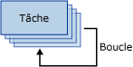

# Conteneur de boucles For
  Le conteneur de boucles For définit un flux de contrôle répétitif dans un package. La mise en œuvre de la boucle est similaire à la structure de bouclage **For** des langages de programmation. Dans chaque répétition de la boucle, le conteneur de boucles For évalue une expression et répète son flux de travail jusqu'à ce que l'expression retourne la valeur **False**.  
  
 Le conteneur de boucles For utilise les éléments suivants pour définir la boucle :  
  
-   Une expression d'initialisation facultative qui attribue des valeurs aux compteurs de la boucle  
  
-   Une expression d'évaluation qui permet de déterminer si la boucle doit s'arrêter ou continuer  
  
-   Une expression d'itération facultative qui incrémente ou décrémente le compteur de la boucle  
  
 Le schéma suivant illustre un conteneur de boucles For avec une tâche Envoyer un message. Si l'expression d'initialisation est `@Counter = 0`, que l'expression d'évaluation est `@Counter < 4`et que l'expression d'itération est `@Counter = @Counter + 1`, la boucle se répète quatre fois et envoie quatre messages électroniques.  
  
   
  
 Les expressions doivent être des expressions [!INCLUDE[ssNoVersion](../../includes/ssnoversion-md.md)] [!INCLUDE[ssISnoversion](../../includes/ssisnoversion-md.md)] valides.  
  
 Pour créer les expressions d'initialisation et d'assignation, vous pouvez utiliser l'opérateur d'affectation (=). Cet opérateur n'est pas pris en charge par la grammaire d'expression Integration Services et ne peut être utilisé que par les types d'expression d'initialisation et d'assignation du conteneur de boucles For. Toute expression qui utilise l’opérateur d’affectation doit contenir la syntaxe `@Var = <expression>`, où **Var** représente une variable d’exécution et \<expression> indique une expression qui suit les règles de la syntaxe d’expression [!INCLUDE[ssIS](../../includes/ssis-md.md)]. L'expression peut comprendre les variables, les littéraux et l'ensemble des opérateurs et des fonctions pris en charge par la grammaire d'expression SSIS. L'expression doit correspondre à une valeur dont le type de données peut être converti vers le type de données de la variable.  
  
 Un conteneur de boucles For ne peut avoir qu'une seule expression d'évaluation. Par conséquent, le conteneur de boucles For exécute tous ses éléments de flux de contrôle le même nombre de fois. Étant donné que le conteneur de boucles For peut comprendre d'autres conteneurs de boucles For, vous pouvez créer des boucles imbriquées et mettre en œuvre un bouclage complexe dans les packages.  
  
 Vous pouvez configurer une propriété de transaction sur le conteneur de boucles For afin de définir une transaction pour un sous-ensemble du flux de contrôle du package. Ainsi, vous pouvez gérer les transactions de façon plus précise. Par exemple, si un conteneur de boucles For répète un flux de contrôle qui met à jour plusieurs fois les données d'une table, vous pouvez configurer la boucle For et son flux de contrôle de manière à utiliser une transaction empêchant toute mise à jour si toutes les données ne sont pas mises à jour correctement. Pour plus d’informations, consultez [Transactions Integration Services](../../integration-services/integration-services-transactions.md).  
  
## Ajouter une itération à un flux de contrôle avec le conteneur de boucles For
  [!INCLUDE[ssISnoversion](../../includes/ssisnoversion-md.md)] inclut le conteneur de boucles For, élément de flux de contrôle qui permet de facilement inclure un bouclage assurant la répétition conditionnelle d’un flux de contrôle dans un package. Pour plus d’informations, consultez [Conteneur de boucles For](../../integration-services/control-flow/for-loop-container.md).  
  
 Le conteneur de boucles For évalue une condition à chaque itération de la boucle et s'arrête lorsque la condition est fausse. Il inclut des expressions pour l'initialisation de la boucle, la spécification de la condition d'évaluation qui arrête l'exécution du flux de contrôle répété et l'assignation d'une valeur à une expression qui met à jour la valeur par rapport à laquelle la condition d'évaluation est comparée. Vous devez fournir une condition d'évaluation, mais les expressions d'initialisation et d'assignation sont facultatives.  
  
 Le conteneur de boucles For n'offre aucune fonctionnalité ; il ne fournit que la structure dans laquelle vous créez le flux de contrôle répété. Pour fournir une fonctionnalité de conteneur, vous devez inclure au moins une tâche dans le conteneur de boucles For. Pour plus d’informations, consultez [Tâches Integration Services](../../integration-services/control-flow/integration-services-tasks.md).  
  
 Le conteneur de boucles For peut inclure un flux de contrôle avec plusieurs tâches, ainsi que d'autres conteneurs. Que vous ajoutiez des tâches et des conteneurs à un conteneur de boucles For ou à un package, l'opération est la même, sauf que vous faites glisser les tâches et les conteneurs vers le conteneur de boucles For plutôt que vers le package. Si le conteneur de boucles For contient plusieurs tâches ou conteneurs, vous pouvez les connecter à l'aide de contraintes de précédence, tout comme dans un package. Pour plus d’informations, consultez [Contraintes de précédence](../../integration-services/control-flow/precedence-constraints.md).  
  
## Ajouter un conteneur de boucles For dans un flux de contrôle  
  
1.  Ajoutez le conteneur de boucles For au package. Pour plus d’informations, consultez [Ajouter ou supprimer une tâche ou un conteneur dans un flux de contrôle](../../integration-services/control-flow/add-or-delete-a-task-or-a-container-in-a-control-flow.md).  
  
2.  Ajoutez des tâches et des conteneurs au conteneur de boucles For. Pour plus d’informations, consultez [Ajouter ou supprimer une tâche ou un conteneur dans un flux de contrôle](../../integration-services/control-flow/add-or-delete-a-task-or-a-container-in-a-control-flow.md).  
  
3.  Connectez les tâches et les conteneurs du conteneur de boucles For à l'aide de contraintes de précédence. Pour plus d’informations, consultez [Connecter des tâches et des conteneurs à l’aide d’une contrainte de précédence par défaut](http://msdn.microsoft.com/library/8f31f15f-98ff-4c35-b41f-8b8cfd148d75).  
  
4.  Configurez le conteneur de boucles For. Pour plus d’informations, consultez [Configurer un conteneur de boucles For](http://msdn.microsoft.com/library/b9cd7ea7-b198-4a35-8b16-6acf09611ca5).  

##  Configurer le conteneur de boucles For
Cette procédure décrit comment configurer un conteneur de boucles For à l’aide de la boîte de dialogue **Éditeur de boucle For** .  
  
 Pour obtenir un exemple de conteneur de boucles For, consultez [SSIS Loops that do not fail](http://go.microsoft.com/fwlink/?LinkId=240295) sur le site bimonkey.com.  
  
1.  Dans [!INCLUDE[ssBIDevStudioFull](../../includes/ssbidevstudiofull-md.md)], double-cliquez sur le conteneur de boucles For pour ouvrir l’ **Éditeur de boucle For**.  
  
2.  Si vous le souhaitez, modifiez le nom et la description du conteneur de boucles For.  
  
3.  Si vous le souhaitez, tapez une expression d’initialisation dans la zone de texte **InitExpression** .  
  
4.  Tapez une expression d’évaluation dans la zone de texte **EvalExpression** .  
  
    > [!NOTE]  
    >  L'expression doit prendre une valeur de type Boolean. Quand l’expression donne la valeur **false**, la boucle cesse de s’exécuter.  
  
5.  Si vous le souhaitez, tapez une expression d’assignation dans la zone de texte **AssignExpression** .  
  
6.  Si vous le souhaitez, cliquez sur **Expressions** et, dans la page **Expressions** , créez des expressions de propriété pour les propriétés du conteneur de boucles For. Pour plus d’informations, consultez [Ajouter ou modifier une Expression de propriété](../../integration-services/expressions/add-or-change-a-property-expression.md).  
  
7.  Cliquez sur **OK** pour fermer la boîte de dialogue **Éditeur de boucle For**.  

## Boîte de dialogue Éditeur de boucle For
Utilisez la page **Éditeur de boucle For** de la boîte de dialogue **Éditeur de boucle For** pour configurer une boucle qui répète un flux de travail jusqu'à ce qu'une condition spécifiée soit fausse.  
  
 Pour en savoir plus sur le conteneur de boucles For et sur son utilisation dans les packages, consultez [For Loop Container](../../integration-services/control-flow/for-loop-container.md).  
  
### Options  
 **InitExpression**  
 Indiquez éventuellement une expression qui initialise les valeurs des variables utilisées dans la boucle.  
  
 **EvalExpression**  
 Indiquez une expression qui évalue si la boucle doit s'interrompre ou se poursuivre.  
  
 **AssignExpression**  
 Indiquez éventuellement une expression qui modifie une expression à chaque répétition de la boucle.  
  
 **Nom**  
 Indiquez un nom unique pour le conteneur de la boucle For. Ce nom sert d'étiquette à l'icône de la tâche.  
  
> [!NOTE]  
>  Les noms des objets doivent être uniques dans un package.  
  
 **Description**  
 Indiquez une description unique pour le conteneur de la boucle For.  
 
## Utiliser des expressions avec le conteneur de boucles For  
 Lorsque vous configurez le conteneur de boucles For en spécifiant une condition d'évaluation, une valeur d'initialisation ou une valeur d'assignation, vous pouvez utiliser des littéraux ou des expressions.  
  
 Les expressions peuvent inclure des variables. Les variables présentent l'avantage de pouvoir être mises à jour au moment de l'exécution, ce qui rend les packages plus flexibles et plus faciles à gérer. La longueur maximale d'une expression est limitée à 4 000 caractères.  
  
 Lorsque vous spécifiez une variable dans une expression, vous devez préfixer le nom de la variable avec le signe arobase (@). Par exemple, pour une variable nommée **Counter**, entrez @Counter dans l’expression utilisée par le conteneur de boucles For. Si vous incluez la propriété d'espace de noms dans la variable, vous devez placer la variable et l'espace de noms entre crochets. Par exemple, pour une variable **Counter** dans l’espace de noms **MyNamespace**, tapez [@MyNamespace::Counter].  
  
 Les variables utilisées par le conteneur de boucles For doivent être définies dans la portée du conteneur de boucles For ou dans la portée d'un conteneur situé plus haut dans la hiérarchie de conteneurs de package. Par exemple, un conteneur de boucles For peut utiliser des variables définies dans sa portée et également des variables définies dans la portée du package. Pour plus d’informations, consultez [Variables Integration Services &#40;SSIS&#41;](../../integration-services/integration-services-ssis-variables.md) et [Utiliser des variables dans des packages](http://msdn.microsoft.com/library/7742e92d-46c5-4cc4-b9a3-45b688ddb787).  
  
 La grammaire d'expression [!INCLUDE[ssIS](../../includes/ssis-md.md)] fournit un ensemble complet d'opérateurs et de fonctions pour l'implémentation d'expressions complexes utilisées pour l'évaluation, l'initialisation ou l'assignation. Pour plus d’informations, consultez [Expressions Integration Services &#40;SSIS&#41;](../../integration-services/expressions/integration-services-ssis-expressions.md).  
  
  
##  Voir aussi  
 [Flux de contrôle](../../integration-services/control-flow/control-flow.md)   
 [Expressions Integration Services &#40;SSIS&#41;](../../integration-services/expressions/integration-services-ssis-expressions.md)  
  
  
