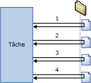

# Conteneur de boucles Foreach
  Le conteneur de boucles Foreach définit un flux de contrôle répétitif dans un package. La mise en œuvre de la boucle est similaire à la structure de bouclage **Foreach** des langages de programmation. Dans un package, le bouclage repose sur l'utilisation d'un énumérateur Foreach.  Le conteneur de boucles Foreach répète le flux de contrôle pour chaque membre d'un énumérateur spécifié.  
  
 [!INCLUDE[ssNoVersion](../../includes/ssnoversion-md.md)] [!INCLUDE[ssISnoversion](../../includes/ssisnoversion-md.md)] fournit les types d'énumérateur suivants :  
  
-   Foreach ADO Enumerator, pour l'énumération des lignes des tables. Par exemple, vous pouvez obtenir les lignes d'un ensemble d'enregistrements ADO.  
  
     La destination de l'ensemble d'enregistrements enregistre les données en mémoire dans un ensemble d'enregistrements stocké dans une variable de package de type **Object** . Vous devez en général utiliser un conteneur de boucles Foreach avec l'énumérateur ADO Foreach pour traiter une par une les lignes de l'ensemble d'enregistrements. La variable spécifiée pour l'énumérateur ADO Foreach doit être de type Object. Pour plus d’informations sur la destination d’un recordset, consultez [Utiliser une destination de recordset](../../integration-services/data-flow/use-a-recordset-destination.md).  
  
-   Énumérateur de l'ensemble de lignes du schéma Foreach ADO.NET, pour l'énumération des informations de schéma relatives à une source de données. Par exemple, vous pouvez énumérer les tables de la base de données [!INCLUDE[ssSampleDBnormal](../../includes/sssampledbnormal-md.md)] [!INCLUDE[ssNoVersion](../../includes/ssnoversion-md.md)] et en obtenir la liste.  
  
-   Énumérateur de fichier Foreach, pour l'énumération des fichiers d'un dossier. L'énumérateur peut parcourir les sous-dossiers. Par exemple, vous pouvez lire tous les fichiers portant l'extension de nom de fichier *.log stockés dans le dossier Windows et ses sous-dossiers.  
  
-   Foreach From Variable Enumerator, pour l'énumération de l'objet énumérable contenu dans une variable spécifiée. L’objet énumérable peut être un tableau, un **DataTable**ADO.NET, un énumérateur [!INCLUDE[ssISnoversion](../../includes/ssisnoversion-md.md)] , etc. Par exemple, vous pouvez énumérer les valeurs d'un tableau qui contient des noms de serveurs.  
  
-   Énumérateur d'élément Foreach, pour l'énumération des éléments qui sont des collections. Par exemple, vous pouvez énumérer les noms d'exécutables et de répertoires de travail qu'une tâche d'exécution de processus utilise.  
  
-   Foreach NodeList Enumerator, pour l'énumération de l'ensemble de résultats d'une expression XPath (XML Path Language). Par exemple, l'expression suivante énumère tous les auteurs de la période classique et en obtient la liste : `/authors/author[@period='classical']`.  
  
-   Foreach SMO Enumerator, pour l'énumération des objets SMO ( [!INCLUDE[ssNoVersion](../../includes/ssnoversion-md.md)] Management Object). Par exemple, vous pouvez énumérer les vues d'une base de données [!INCLUDE[ssNoVersion](../../includes/ssnoversion-md.md)] et en obtenir la liste.  
  
-   Énumérateur Foreach File HDFS pour énumérer les fichiers HDFS à l’emplacement HDFS spécifié.  
  
-   Énumérateur d’objets blob Azure Foreach pour énumérer les objets blob dans un conteneur d’objets blob dans Azure Storage.  

-   Énumérateur ForEach ADLS File pour énumérer les fichiers d’un répertoire dans Azure Data Lake Store.
  
 Le schéma suivant montre un conteneur de boucles Foreach ayant une tâche de système de fichiers. La boucle Foreach utilise l'énumérateur de fichier Foreach, tandis que la tâche de système de fichiers est configurée pour copier un fichier. Si le dossier spécifié par l'énumérateur contient quatre fichiers, la boucle se répète quatre fois et copie quatre fichiers.  
  
   
  
 Vous pouvez utiliser une combinaison de variables et d'expressions de propriété pour mettre à jour la propriété de l'objet de package avec la valeur de la collection de l'énumérateur. Vous mappez la valeur de la collection avec une variable définie par l'utilisateur, puis vous mettez en œuvre une expression de propriété sur la propriété qui utilise la variable. Par exemple, la valeur de la collection de l’énumérateur de fichier Foreach est mappée avec une variable appelée **MyFile** . Cette variable est ensuite utilisée dans l’expression de la propriété Subject d’une tâche Envoyer un message. À l’exécution du package, la propriété Subject est mise à jour avec le nom d’un fichier à chaque répétition de la boucle. Pour plus d’informations, consultez [Expressions de propriété dans des packages](../../integration-services/expressions/use-property-expressions-in-packages.md).  
  
 Vous pouvez également utiliser dans des expressions et des scripts les variables mappées à la valeur de la collection de l'énumérateur.  
  
 Un conteneur de boucles Foreach peut comprendre plusieurs tâches et conteneurs, mais il ne peut utiliser qu'un type d'énumérateur. Si le conteneur de boucles Foreach comprend plusieurs tâches, vous pouvez mapper la valeur de la collection de l'énumérateur avec plusieurs propriétés de chaque tâche.  
  
 Vous pouvez configurer un attribut de transaction sur le conteneur de boucles Foreach afin de définir une transaction pour un sous-ensemble du flux de contrôle du package. Cela vous permet de gérer les transactions au niveau de la boucle Foreach plutôt qu'au niveau du package. Par exemple, si un conteneur de boucles Foreach répète un flux de contrôle qui met à jour des dimensions et des tables de faits dans un schéma en étoile, vous pouvez configurer une transaction de manière à ce que toutes les tables de faits soient correctement mises à jour ou à ce qu'aucune des tables ne soit actualisée. Pour plus d’informations, consultez [Transactions Integration Services](../../integration-services/integration-services-transactions.md).  
  
## Types d'énumérateur  
 Vous pouvez configurer les énumérateurs en indiquant différentes informations pour chacun d'eux.  
  
 Le tableau suivant récapitule les informations requises pour chaque type d'énumérateur.  
  
|Énumérateur|Configuration requise|  
|----------------|--------------------------------|  
|Foreach ADO|Spécifiez la variable source de l'objet ADO et le mode de l'énumérateur. La variable doit être du type Object.|  
|Foreach ADO.NET Schema Rowset|Spécifiez la connexion à une base de données et le schéma à énumérer.|  
|Fichier Foreach|Spécifiez un dossier et les fichiers à énumérer, le format du nom des fichiers extraits, et indiquez si l'opération doit parcourir les sous-dossiers.|  
|Foreach From Variable|Spécifiez la variable qui contient les objets à énumérer.|  
|Élément Foreach|Définissez les éléments de la collection d'éléments Foreach, notamment les colonnes et leur type de données.|  
|Foreach NodeList|Spécifiez la source du document XML et configurez l'opération XPath.|  
|Foreach SMO|Spécifiez la connexion à une base de données et les objets SMO à énumérer.|  
|Énumérateur Foreach File HDFS|Spécifiez un dossier et les fichiers à énumérer, le format du nom des fichiers extraits, et indiquez si l'opération doit parcourir les sous-dossiers.|  
|Objet blob Azure foreach|Spécifiez le conteneur d'objets blob Azure qui contient les objets blob à énumérer.|  
|Foreach ADLS File|Spécifiez le répertoire Azure Data Lake Store qui contient les fichiers à énumérer.|

## Ajouter une énumération à un flux de contrôle avec un conteneur de boucles Foreach
 [!INCLUDE[ssISnoversion](../../includes/ssisnoversion-md.md)] inclut le conteneur de boucles Foreach, un élément de flux de contrôle qui permet de facilement inclure une construction de boucle énumérant les fichiers et objets du flux de contrôle d’un package. Pour plus d’informations, consultez [Conteneur de boucles Foreach](../../integration-services/control-flow/foreach-loop-container.md).  
  
 Le conteneur de boucles Foreach n'offre aucune fonctionnalité ; il ne fournit que la structure dans laquelle vous créez le flux de contrôle répété, spécifiez un type d'énumérateur et configurez l'énumérateur. Pour fournir une fonctionnalité de conteneur, vous devez inclure au moins une tâche dans le conteneur de boucles Foreach. Pour plus d’informations, consultez [Tâches Integration Services](../../integration-services/control-flow/integration-services-tasks.md).  
  
 Le conteneur de boucles Foreach peut inclure un flux de contrôle avec plusieurs tâches, ainsi que d'autres conteneurs. Que vous ajoutiez des tâches et des conteneurs à un conteneur de boucles Foreach ou à un package, l'opération est la même, sauf que vous faites glisser les tâches et les conteneurs vers le conteneur de boucles Foreach plutôt que vers le package. Si le conteneur de boucles Foreach contient plusieurs tâches ou conteneurs, vous pouvez les connecter à l'aide de contraintes de précédence, tout comme dans un package. Pour plus d’informations, consultez [Contraintes de précédence](../../integration-services/control-flow/precedence-constraints.md).  
  
### Ajouter et configurer un conteneur de boucles Foreach
  
1.  Ajoutez le conteneur de boucles Foreach au package. Pour plus d’informations, consultez [Ajouter ou supprimer une tâche ou un conteneur dans un flux de contrôle](../../integration-services/control-flow/add-or-delete-a-task-or-a-container-in-a-control-flow.md).  
  
2.  Ajoutez des tâches et des conteneurs au conteneur de boucles Foreach. Pour plus d’informations, consultez [Ajouter ou supprimer une tâche ou un conteneur dans un flux de contrôle](../../integration-services/control-flow/add-or-delete-a-task-or-a-container-in-a-control-flow.md).  
  
3.  Connectez les tâches et les conteneurs du conteneur de boucles Foreach à l'aide de contraintes de précédence. Pour plus d’informations, consultez [Connecter des tâches et des conteneurs à l’aide d’une contrainte de précédence par défaut](http://msdn.microsoft.com/library/8f31f15f-98ff-4c35-b41f-8b8cfd148d75).  
  
4.  Configurez le conteneur de boucles Foreach. Pour plus d’informations, consultez [Configurer un conteneur de boucles Foreach](http://msdn.microsoft.com/library/519c6f96-5e1f-47d2-b96a-d49946948c25).  

## Configurer un conteneur de boucles Foreach
Cette procédure décrit comment configurer un conteneur de boucles Foreach, notamment les expressions de la propriété au niveau de l'énumérateur et du conteneur.  
  
1.  Dans [!INCLUDE[ssBIDevStudioFull](../../includes/ssbidevstudiofull-md.md)], ouvrez le projet [!INCLUDE[ssISnoversion](../../includes/ssisnoversion-md.md)] contenant le package souhaité.  
  
2.  Cliquez sur l’onglet **Flux de contrôle** , puis double-cliquez sur la boucle Foreach.  
  
3.  Dans la boîte de dialogue **Éditeur de boucle Foreach** , cliquez sur **Général** et, si vous le souhaitez, modifiez le nom et la description de la boucle Foreach.  
  
4.  Cliquez sur **Collection** , puis sélectionnez un type d’énumérateur dans la liste **Énumérateur** .  
  
5.  Indiquez un énumérateur et définissez ses options de la manière suivante :  
  
    -   Pour utiliser l’énumérateur Foreach File, indiquez le dossier contenant les fichiers à énumérer, spécifiez un filtre pour le nom et le type de fichier et indiquez si le nom de fichier complet doit être renvoyé. Indiquez enfin si les fichiers des sous-dossiers doivent également être énumérés.  
  
    -   Pour utiliser l’énumérateur Foreach Item, cliquez sur **Colonnes**et, dans la boîte de dialogue **Colonnes For Each Item** , cliquez sur **Ajouter** pour ajouter des colonnes. Sélectionnez un type de données dans la liste **Type de données** pour chaque colonne, puis cliquez sur **OK**.  
  
         Tapez des valeurs dans les colonnes ou sélectionnez des valeurs dans les listes.  
  
        > [!NOTE]  
        >  Pour ajouter une nouvelle ligne, cliquez n'importe où en dehors de la cellule dans laquelle vous avez tapé une valeur.  
  
        > [!NOTE]  
        >  Si une valeur n'est pas compatible avec le type de données de la colonne, le texte est mis en surbrillance.  
  
    -   Pour utiliser l’énumérateur ADO Foreach, sélectionnez une variable existante ou cliquez sur **Nouvelle variable** dans la liste **Variable source de l’objet ADO** pour spécifier la variable contenant le nom de l’objet ADO à énumérer et sélectionnez une option de mode d’énumération.  
  
         Si vous créez une variable, définissez ses propriétés dans la boîte de dialogue **Ajouter une variable** .  
  
    -   Pour utiliser l’énumérateur d’ensemble de lignes du schéma ADO.NET Foreach, sélectionnez une connexion ADO.NET existante ou cliquez sur **Nouvelle connexion** dans la liste **Connexion** , puis sélectionnez un schéma.  
  
         Si vous le souhaitez, cliquez sur **Définir les restrictions** et sélectionnez des restrictions de schéma, sélectionnez la variable qui contient la valeur de restriction ou tapez cette valeur, puis cliquez sur **OK**.  
  
    -   Pour utiliser l’énumérateur Foreach à partir d’une variable, sélectionnez une variable dans la liste **Variable** .  
  
    -   Pour utiliser l’énumérateur Foreach NodeList, cliquez sur DocumentSourceType et sélectionnez le type de source dans la liste, puis cliquez sur DocumentSource. En fonction de la valeur sélectionnée pour DocumentSourceType, sélectionnez une variable ou une connexion de fichier dans la liste, créez une variable ou une connexion de fichier, ou tapez la source XML dans **l’Éditeur de source de document**.  
  
         Cliquez ensuite sur EnumerationType et sélectionnez un type d’énumération dans la liste. Si la valeur pour EnumerationType est **Navigator, Node ou NodeText**, cliquez sur OuterXPathStringSourceType et sélectionnez le type de source, puis cliquez sur OuterXPathStringSourceType. En fonction de la valeur définie pour OuterXPathStringSourceType, sélectionnez une variable ou une connexion de fichier dans la liste, créez une variable ou une connexion de fichier, ou tapez la chaîne de l’expression XPath (XML Path Language) externe.  
  
         Si la valeur d’EnumerationType est **ElementCollection**, définissez OuterXPathStringSourceType et OuterXPathString comme décrit ci-dessus. Cliquez ensuite sur InnerElementType, sélectionnez un type d’énumération pour les éléments internes, puis cliquez sur InnerXPathStringSourceType. En fonction de la valeur définie pour InnerXPathStringSourceType, sélectionnez une variable ou une connexion de fichier, créez une variable ou une connexion de fichier, ou tapez la chaîne de l’expression XPath interne.  
  
    -   Pour utiliser l’énumérateur SMO Foreach, sélectionnez une connexion ADO.NET existante ou cliquez sur **Nouvelle connexion** dans la liste **Connexion** , puis tapez la chaîne à utiliser ou cliquez sur **Parcourir**. Si vous cliquez sur **Parcourir**, dans la boîte de dialogue **Sélectionner l’énumération SMO** , sélectionnez le type d’objet à énumérer et le type d’énumération, puis cliquez sur **OK**.  
  
6.  Si vous le souhaitez, cliquez sur le bouton Parcourir **(…)** dans la zone de texte **Expressions** de la page **Collection** pour créer des expressions qui mettent à jour les valeurs des propriétés. Pour plus d’informations, consultez [Ajouter ou modifier une Expression de propriété](../../integration-services/expressions/add-or-change-a-property-expression.md).  
  
    > [!NOTE]  
    >  Les propriétés énumérées dans la liste **Propriété** varient en fonction de l’énumérateur.  
  
7.  Si vous le souhaitez, cliquez sur **Mappage de variables** pour mapper des propriétés d’objets à la valeur de la collection, puis effectuez les étapes suivantes :  
  
    1.  Sélectionnez une variable dans la liste **Variables** ou cliquez sur **\<Nouvelle variable>** pour en créer une.  
  
    2.  Si vous ajoutez une nouvelle variable, définissez ses propriétés dans la boîte de dialogue **Ajouter une variable** et cliquez sur **OK**.  
  
    3.  Si vous utilisez l’énumérateur Foreach Item, vous pouvez mettre à jour la valeur de l’index dans la liste **Index** .  
  
        > [!NOTE]  
        >  La valeur de l'index indique quelle colonne de l'élément mapper à la variable. Seul l'énumérateur For Each Item peut utiliser une valeur d'index autre que 0.  
  
8.  Si vous le souhaitez, cliquez sur **Expressions** et, dans la page **Expressions** , créez des expressions de propriété pour les propriétés du conteneur de boucles Foreach. Pour plus d’informations, consultez [Ajouter ou modifier une Expression de propriété](../../integration-services/expressions/add-or-change-a-property-expression.md).  
  
9. Cliquez sur **OK**.  

## Page Général - Éditeur de boucle Foreach
Utilisez la page **Général** de la boîte de dialogue **Éditeur de boucle Foreach** pour décrire et attribuer un nom à un conteneur de boucle Foreach qui utilise un énumérateur précis afin de répéter un flux de travail pour chaque membre d'une collection.  
  
 Pour en savoir plus sur le conteneur de boucles Foreach et sa configuration, consultez [Conteneur de boucles Foreach](../../integration-services/control-flow/foreach-loop-container.md) et [Configurer un conteneur de boucles Foreach](http://msdn.microsoft.com/library/519c6f96-5e1f-47d2-b96a-d49946948c25).  
  
### Options  
 **Nom**  
 Attribuez un nom unique au conteneur de boucle Foreach. Ce nom est utilisé en tant qu'étiquette dans l'icône de tâche et dans les journaux.  
  
> [!NOTE]  
>  Les noms des objets doivent être uniques dans un package.  
  
 **Description**  
 Tapez la description du conteneur de boucle Foreach.  

## Page Collection - Éditeur de boucle Foreach
 Utilisez la page **Collection** de la boîte de dialogue **Éditeur de boucle Foreach** pour spécifier le type d’énumérateur et le configurer.  
  
 Pour en savoir plus sur le conteneur de boucles Foreach et sa configuration, consultez [Conteneur de boucles Foreach](../../integration-services/control-flow/foreach-loop-container.md) et [Configurer un conteneur de boucles Foreach](http://msdn.microsoft.com/library/519c6f96-5e1f-47d2-b96a-d49946948c25).  
  
### Options statiques  
 **Énumérateur**  
 Sélectionnez le type d'énumérateur dans la liste. Cette propriété dispose des options répertoriées dans le tableau suivant :  
  
|Valeur|Description|  
|-----------|-----------------|  
|**Énumérateur ForEach File**|Permet d'énumérer les fichiers. Si cette valeur est sélectionnée, les options dynamiques s'affichent dans la section **Énumérateur Foreach File**.|  
|**Énumérateur ForEach Item**|Permet d'énumérer les valeurs issues d'un élément. Si cette valeur d'énumérateur est sélectionnée, les options dynamiques s'affichent dans la section **Énumérateur Foreach Item**.|  
|**Énumérateur ForEach ADO**|Permet d'énumérer les tables ou les lignes au sein de tables. Si cette valeur est sélectionnée, les options dynamiques s'affichent dans la section **Énumérateur Foreach ADO**.|  
|**Énumérateur Foreach ADO.NET Schema Rowset**|Permet d'énumérer un schéma. Si cette valeur est sélectionnée, les options dynamiques s'affichent dans la section **Énumérateur Foreach ADO.NET**.|  
|**Énumérateur Foreach À partir d’une variable**|Permet d'énumérer la valeur d'une variable. Si cette valeur est sélectionnée, les options dynamiques s'affichent dans la section **Énumérateur Foreach à partir d'une variable**.|  
|**Énumérateur Foreach Nodelist**|Permet d'énumérer les nœuds d'un document XML. Si cette valeur est sélectionnée, les options dynamiques s'affichent dans la section **Énumérateur Foreach NodeList**.|  
|**Énumérateur ForEach SMO**|Permet d'énumérer un objet SMO. Si cette valeur d'énumérateur est sélectionnée, les options dynamiques s'affichent dans la section **Énumérateur Foreach SMO**.|  
|**Énumérateur Foreach File HDFS**|Énumérez les fichiers HDFS dans l’emplacement HDFS spécifié. Si cette valeur est sélectionnée, les options dynamiques s’affichent dans la section **Énumérateur de fichiers HDFS Foreach**.|  
|**Énumérateur Foreach Azure Blob**|Énumérez les fichiers d’objets blob à l’emplacement spécifié des objets blob. Si cette valeur est sélectionnée, les options dynamiques s’affichent dans la section **Énumérateur d’objets blob Azure Foreach**.|  
|**Énumérateur Foreach ADLS File**|Permet d’énumérer les fichiers du répertoire Data Lake Store spécifié. Si cette valeur est sélectionnée, les options dynamiques s’affichent dans la section **Énumérateur Foreach ADLS File**.|
  
 **Expressions**  
 Cliquez sur **Expressions** ou développez ce groupe pour afficher la liste des expressions de propriété existantes. Cliquez sur le bouton représentant des points de suspension **(…)** pour ajouter une expression de propriété à une propriété d’énumérateur, ou modifiez et évaluez une expression de propriété existante.  
  
 **Rubriques connexes :**  [Expressions Integration Services &#40;SSIS&#41;](../../integration-services/expressions/integration-services-ssis-expressions.md), [Éditeur d’expressions de propriété](../../integration-services/expressions/property-expressions-editor.md) et [Générateur d’expressions](../../integration-services/expressions/expression-builder.md)  
  
### Options dynamiques portant sur les énumérateurs  
  
#### Enumerator = Foreach File Enumerator  
 Vous utilisez l'énumérateur Foreach File pour énumérer les fichiers d'un dossier. Par exemple, si la boucle Foreach inclut une tâche SQL, vous pouvez utiliser l'énumérateur Foreach File pour énumérer les fichiers qui contiennent les instructions SQL que la tâche SQL exécute. L'énumérateur peut être configuré pour inclure les sous-dossiers.  
  
 Le contenu des dossiers et des sous-dossiers que l'énumérateur Foreach File énumère peut changer pendant l'exécution de la boucle, car les processus externes ou les tâches de la boucle ajoutent, renomment ou suppriment les fichiers pendant l'exécution de la boucle. Ces modifications peuvent être à l’origine d’un certain nombre de situations inattendues :  
  
-   Si des fichiers sont supprimés, les actions d’une tâche de la boucle Foreach peuvent affecter un jeu de fichiers différent des fichiers utilisés par les tâches à venir.  
  
-   Si des fichiers sont renommés et qu’un processus externe ajoute automatiquement des fichiers pour remplacer les fichiers renommés, les actions des tâches de la boucle Foreach peuvent affecter deux fois les mêmes fichiers.  
  
-   Si des fichiers sont ajoutés, il peut être difficile de déterminer quels fichiers la boucle Foreach a affecté.  
  
 **Dossier**  
 Permet d'indiquer le chemin du dossier racine à énumérer.  
  
 **Parcourir**  
 Permet de rechercher et de spécifier le chemin d'accès du dossier racine.  
  
 **Fichiers**  
 Permet de spécifier les fichiers à énumérer.  
  
> [!NOTE]  
>  Utilisez le caractère étoile (*) pour indiquer les fichiers à inclure à la collection. Par exemple, pour inclure des fichiers dont le nom contient « abc », utilisez le filtre suivant : \*abc\*.  
>   
>  Lorsque vous spécifiez une extension de nom de fichier, l'énumérateur retourne également des fichiers qui ont la même extension avec des caractères supplémentaires ajoutés. (Ce comportement est identique à celui de la commande **dir** dans le système d’exploitation, qui compare aussi les noms de fichiers 8.3 à des fins de compatibilité descendante.) Ce comportement de l'énumérateur peut générer des résultats inattendus. Par exemple, vous souhaitez énumérer uniquement des fichiers Excel 2003 et vous spécifiez "*.xls". Toutefois, l’énumérateur retourne également des fichiers Excel 2007 car ces fichiers portent l’extension « .xlsx ».  
>   
>  Vous pouvez utiliser une expression pour spécifier les fichiers à inclure dans une collection. Pour cela, développez **Expressions** dans la page **Collection** , sélectionnez la propriété **FileSpec** , puis cliquez sur le bouton de sélection (…) pour ajouter l’expression de propriété.  
  
 **Complet**  
 Permet de récupérer les chemins d'accès complets des noms de fichiers indiqués. Si des caractères génériques sont utilisés dans l’option Fichiers, les chemins complets retournés correspondent au filtre spécifié.  
  
 **Nom uniquement**  
 Permet de ne récupérer que les noms de fichiers. Si des caractères étoile (*) sont mentionnés dans l'option Fichiers, les noms de fichiers retournés par la fonction sont ceux correspondant au filtre spécifié.  
  
 **Nom et extension**  
 Permet de retrouver le nom et l'extension des fichiers. Si des caractères étoile (*) sont mentionnés dans l'option Fichiers, les noms et extension de fichiers retournés par la fonction sont ceux correspondant au filtre spécifié.  
  
 **Parcourir les sous-dossiers**  
 Permet d'inclure les sous-dossiers dans l'énumération.  
  
#### Enumerator = Foreach Item Enumerator  
 Vous utilisez l'énumérateur Foreach Item pour énumérer les éléments d'un dossier. Vous définissez les éléments de la collection en spécifiant les colonnes et les valeurs de colonne. Les colonnes d'une ligne définissent un élément. Par exemple, un élément qui spécifie les exécutables qu'une tâche Exécuter le processus lance et le répertoire de travail que la tâche utilise a deux colonnes, une qui dresse la liste des noms d'exécutables et une qui indique le répertoire de travail. Le nombre de lignes détermine le nombre de répétitions de la boucle. Si la table a 10 lignes, la boucle se répète 10 fois.  
  
 Pour mettre à jour les propriétés de la tâche Exécuter le processus, vous associez des variables à des colonnes d'élément en utilisant l'index de la colonne. La première colonne définie dans l'élément de l'énumérateur a la valeur d'index 0, la deuxième colonne 1, etc. Les valeurs de variables sont mises à jour à chaque répétition de la boucle. Les propriétés **Executable** et **WorkingDirectory** de la tâche Exécuter le processus peuvent ensuite être mises à jour par les expressions de propriété qui utilisent ces variables.  
  
 **Définissez les éléments de la collection For Each Item**  
 Permet de fournir une valeur pour chaque colonne de la table.  
  
> [!NOTE]  
>  Une nouvelle ligne est automatiquement ajoutée à la table dès que vous saisissez des valeurs dans les colonnes composant les lignes.  
  
> [!NOTE]  
>  Si une valeur indiquée n'est pas compatible avec le type de données de la colonne dans laquelle vous insérez la valeur, le texte s'affiche alors en rouge.  
  
 **Type de données de la colonne**  
 Permet d'afficher le type de données de la colonne active.  
  
 **Supprimer**  
 Sélectionnez un élément, puis cliquez sur **Supprimer** pour le supprimer de la liste.  
  
 **Colonnes**  
 Cliquez pour configurer le type de données des colonnes constituant l'élément.  
  
 **Rubriques connexes :** [Référence de l’interface utilisateur de la boîte de dialogue Colonnes For Each Item](http://msdn.microsoft.com/library/ea76aae0-8798-4677-8ab8-4a579de4957c)  
  
#### Enumerator = Foreach ADO Enumerator  
 Vous utilisez l'énumérateur ADO Foreach pour énumérer les lignes ou les tables d'un objet ADO ou ADO.NET qui est stocké dans une variable. Par exemple, si la boucle Foreach inclut une tâche de script qui écrit un dataset dans une variable, vous pouvez utiliser l'énumérateur ADO Foreach pour énumérer les lignes du dataset. Si la variable contient un dataset ADO.NET, l'énumérateur peut être configuré pour énumérer les lignes de plusieurs tables ou pour énumérer des tables.  
  
 **Variable source de l’objet ADO**  
 Sélectionnez une variable définie par l’utilisateur dans la liste ou cliquez sur \<**Nouvelle variable...**> pour en créer une.  
  
> [!NOTE]  
>  La variable doit être de type Objet ; dans le cas contraire, une erreur se produit.  
  
 **Rubriques connexes :** [Variables Integration Services &#40;SSIS&#41;](../../integration-services/integration-services-ssis-variables.md), [Ajouter une variable](http://msdn.microsoft.com/library/d09b5d31-433f-4f7c-8c68-9df3a97785d5)  
  
 **Lignes dans la première table**  
 Permet de n'énumérer que les lignes de la première table.  
  
 **Lignes dans toutes les tables (dataset ADO.NET uniquement)**  
 Permet d'énumérer les lignes de toutes les tables. Cette option n'est disponible que si les objets à énumérer sont tous des membres du même dataset ADO.NET.  
  
 **Toutes les tables (dataset ADO.NET uniquement)**  
 Permet de n'énumérer que les tables.  
  
#### Enumerator = Foreach ADO.NET Schema Rowset Enumerator  
 Vous utilisez l'énumérateur d'ensemble de lignes du schéma ADO.NET Foreach pour énumérer un schéma pour une source de données spécifiée. Par exemple, si la boucle Foreach inclut une tâche d'exécution SQL, vous pouvez utiliser l'énumérateur d'ensemble de lignes du schéma ADO.NET Foreach pour énumérer des schémas tels que les colonnes de la base de données **AdventureWorks** , et la tâche d'exécution SQL pour obtenir les autorisations de schéma.  
  
 **Connexion**  
 Sélectionnez un gestionnaire de connexions ADO.NET dans la liste ou cliquez sur \<**Nouvelle connexion...**> pour en créer un.  
  
> [!IMPORTANT]  
>  Le gestionnaire de connexions ADO.NET doit utiliser un fournisseur .NET pour OLE DB. Lors de la connexion à SQL Server, il est recommandé d'utiliser le fournisseur [!INCLUDE[ssNoVersion](../../includes/ssnoversion-md.md)] Native Client, répertorié dans la section **Fournisseurs .Net pour OleDb** de la boîte de dialogue **Gestionnaire de connexions** .  
  
 **Rubriques connexes :** [ADO Connection Manager](../../integration-services/connection-manager/ado-connection-manager.md), [Configure ADO.NET Connection Manager](../../integration-services/connection-manager/configure-ado-net-connection-manager.md)  
  
 **Schéma**  
 Permet d'indiquer le schéma à énumérer.  
  
 **Définir les restrictions**  
 Permet de définir les restrictions s'appliquant au schéma indiqué.  
  
 **Rubriques connexes :** [Restrictions de schéma, boîte de dialogue](http://msdn.microsoft.com/library/92e5fd32-4944-4f7c-a448-b458df93d0d5)  
  
#### Enumerator = Foreach From Variable Enumerator  
 L'énumérateur Foreach à partir d'une variable permet d'énumérer les objets énumérables contenus dans la variable spécifiée. Par exemple, si la boucle Foreach inclut une tâche d'exécution SQL qui exécute une requête et enregistre le résultat dans une variable, vous pouvez utiliser l'énumérateur Foreach à partir d'une variable pour énumérer les résultats de la requête.  
  
 **Variable**  
 Sélectionnez une variable dans la liste ou cliquez sur \<**Nouvelle variable...**> pour en créer une.  
  
 **Rubriques connexes :** [Variables Integration Services &#40;SSIS&#41;](../../integration-services/integration-services-ssis-variables.md), [Ajouter une variable](http://msdn.microsoft.com/library/d09b5d31-433f-4f7c-8c68-9df3a97785d5)  
  
#### Enumerator = Foreach NodeList Enumerator  
 L'énumérateur Foreach Nodelist permet d'énumérer un ensemble de nœuds XML qui résulte de l'application d'une expression XPath à un fichier XML. Par exemple, si la boucle Foreach inclut une tâche de script, vous pouvez utiliser l'énumérateur Foreach NodeList pour transmettre une valeur qui correspond aux critères de l'expression XPath du fichier XML à la tâche de script.  
  
 L’expression XPath qui s’applique au fichier XML est l’opération XPath externe, stockée dans la propriété OuterXPathString. Si le type d’énumération XPath a la valeur **ElementCollection**, l’énumérateur Foreach NodeList peut appliquer une expression XPath interne, stockée dans la propriété InnerXPathString, à une collection d’éléments.  
  
 Pour en savoir plus sur l'utilisation de documents et de données XML, consultez «[Employing XML in the .NET Framework](http://go.microsoft.com/fwlink/?LinkId=56214)» (en anglais) dans MSDN Library.  
  
 **DocumentSourceType**  
 Permet de sélectionner le type de source correspondant au document XML. Cette propriété dispose des options répertoriées dans le tableau suivant :  
  
|Valeur|Description|  
|-----------|-----------------|  
|**Entrée directe**|Permet de définir la source sur un document XML.|  
|**Connexion de fichiers**|Permet de sélectionner un fichier contenant le document XML.|  
|**Variable**|Permet de définir la source sur une variable contenant le document XML.|  
  
 **DocumentSource**  
 Si **DocumentSourceType** est défini sur **Entrée directe**, indiquez le code XML ou cliquez sur le bouton représentant des points de suspension (…) pour fournir le code XML nécessaire via la boîte de dialogue **Éditeur de source de document**.  
  
 Si **DocumentSourceType** est défini sur **Connexion de fichiers**, sélectionnez un gestionnaire de connexions de fichiers ou cliquez sur \<**Nouvelle connexion...**> pour en créer un.  
  
 **Rubriques connexes :** [File Connection Manager](../../integration-services/connection-manager/file-connection-manager.md), [File Connection Manager Editor](../../integration-services/connection-manager/file-connection-manager-editor.md)  
  
 Si **DocumentSourceType** est défini sur **Variable**, sélectionnez une variable existante ou cliquez sur \<**Nouvelle variable...**> pour en créer une.  
  
 **Rubriques connexes :** [Variables Integration Services &#40;SSIS&#41;](../../integration-services/integration-services-ssis-variables.md), [Ajouter une variable](http://msdn.microsoft.com/library/d09b5d31-433f-4f7c-8c68-9df3a97785d5).  
  
 **EnumerationType**  
 Permet de sélectionner le type d'énumérateur dans la liste. Cette propriété dispose des options répertoriées dans le tableau suivant :  
  
|Valeur|Description|  
|-----------|-----------------|  
|**Navigateur**|Permet d'énumérer par le biais d'un XPathNavigator.|  
|**Nœud**|Permet d'énumérer les nœuds retournés par une opération XPath.|  
|**NodeText**|Permet d'énumérer les nœuds texte retournés par une opération XPath.|  
|**ElementCollection**|Permet d'énumérer les nœuds des éléments retournés par une opération XPath.|  
  
 **OuterXPathStringSourceType**  
 Permet de sélectionner le type source correspondant à une chaîne XPath. Cette propriété dispose des options répertoriées dans le tableau suivant : 
  
|Valeur|Description|  
|-----------|-----------------|  
|**Entrée directe**|Permet de définir la source sur un document XML.|  
|**Connexion de fichiers**|Permet de sélectionner un fichier contenant le document XML.|  
|**Variable**|Permet de définir la source sur une variable contenant le document XML.|  
  
 **OuterXPathString**  
 Si **OuterXPathStringSourceType** est défini sur **Entrée directe**, fournissez la chaîne XPath.  
  
 Si **OuterXPathStringSourceType** est défini sur **Connexion de fichiers**, sélectionnez un gestionnaire de connexions de fichiers ou cliquez sur \<**Nouvelle connexion...**> pour en créer un.  
  
 **Rubriques connexes :** [File Connection Manager](../../integration-services/connection-manager/file-connection-manager.md), [File Connection Manager Editor](../../integration-services/connection-manager/file-connection-manager-editor.md)  
  
 Si **OuterXPathStringSourceType** est défini sur **Variable**, sélectionnez une variable existante ou cliquez sur \<**Nouvelle variable...>** pour en créer une.  
  
 **Rubriques connexes :** [Variables Integration Services &#40;SSIS&#41;](../../integration-services/integration-services-ssis-variables.md), [Ajouter une variable](http://msdn.microsoft.com/library/d09b5d31-433f-4f7c-8c68-9df3a97785d5).  
  
 **InnerElementType**  
 Si **EnumerationType** est défini sur **ElementCollection**, sélectionnez le type d’élément interne dans la liste.  
  
 **InnerXPathStringSourceType**  
 Permet de sélectionner le type source correspondant à une chaîne XPath interne. Cette propriété dispose des options répertoriées dans le tableau suivant :  
  
|Valeur|Description|  
|-----------|-----------------|  
|**Entrée directe**|Permet de définir la source sur un document XML.|  
|**Connexion de fichiers**|Permet de sélectionner un fichier contenant le document XML.|  
|**Variable**|Permet de définir la source sur une variable contenant le document XML.|  
  
 **InnerXPathString**  
 Si **InnerXPathStringSourceType** est défini sur **Entrée directe**, fournissez la chaîne XPath.  
  
 Si **InnerXPathStringSourceType** est défini sur **Connexion de fichiers**, sélectionnez un gestionnaire de connexions de fichiers ou cliquez sur \<**Nouvelle connexion...**> pour en créer un.  
  
 **Rubriques connexes :** [File Connection Manager](../../integration-services/connection-manager/file-connection-manager.md), [File Connection Manager Editor](../../integration-services/connection-manager/file-connection-manager-editor.md)  
  
 Si **InnerXPathStringSourceType** est défini sur **Variable**, sélectionnez une variable existante ou cliquez sur \<**Nouvelle variable...**> pour en créer une.  
  
 **Rubriques connexes :** [Variables Integration Services &#40;SSIS&#41;](../../integration-services/integration-services-ssis-variables.md), [Ajouter une variable](http://msdn.microsoft.com/library/d09b5d31-433f-4f7c-8c68-9df3a97785d5).  
  
#### Enumerator = Foreach SMO Enumerator  
 L'énumérateur Foreach SMO permet d'énumérer des objets SQL-SMO (SQL Server Management Object). Par exemple, si la boucle Foreach inclut une tâche d’exécution SQL, vous pouvez utiliser l’énumérateur Foreach SMO pour énumérer les tables de la base de données **AdventureWorks** et exécuter des requêtes qui comptent le nombre de lignes dans chaque table.  
  
 **Connexion**  
 Sélectionnez un gestionnaire de connexions ADO.NET existant ou cliquez sur \<**Nouvelle connexion...**> pour en créer un.  
  
 Rubriques connexes : [ADO.NET Connection Manager](../../integration-services/connection-manager/ado-net-connection-manager.md), [Configure ADO.NET Connection Manager](../../integration-services/connection-manager/configure-ado-net-connection-manager.md)  
  
 **Énumérer**  
 Permet de spécifier l'objet SMO à énumérer.  
  
 **Parcourir**  
 Permet de sélectionner l'énumération SMO.  
  
 **Rubriques connexes :** [Sélectionner l’énumération SMO, boîte de dialogue](http://msdn.microsoft.com/library/64ada1fe-21a2-4675-98fc-d5c803aa32f0)  
  
####   Enumerator = Foreach HDFS File Enumerator  
 L’ **Énumérateur de fichiers HDFS Foreach** permet à un package SSIS d’énumérer les fichiers HDFS à l’emplacement HDFS spécifié. Le nom de chaque fichier HDFS peut être stocké dans une variable et utilisé dans des tâches du conteneur de boucle Foreach.  
  
 **Gestionnaire de connexions Hadoop**  
 Spécifiez ou créez un gestionnaire de connexions Hadoop pointant vers l’emplacement de stockage des fichiers HDFS. Pour plus d’informations, consultez [Hadoop Connection Manager](../../integration-services/connection-manager/hadoop-connection-manager.md).  
  
 **Chemin du répertoire**  
 Indiquez le nom du répertoire HDFS contenant les fichiers HDFS à énumérer.  
  
 **Filtre de nom de fichier**  
 Indiquez un filtre de nom pour sélectionner des fichiers dont le nom répond à certains critères. Par exemple, MySheet*.xls\* inclut les fichiers MySheet001.xls et MySheet001.xlsx.  
  
 **Récupérer le nom de fichier**  
 Indiquez le type de nom de fichier récupéré par SSIS.  
  
-   **Nom complet** signifie nom de fichier accompagné du chemin du répertoire.  
  
-   **Nom uniquement** signifie que le nom de fichier est récupéré sans chemin.  
  
 **Parcourir les sous-dossiers**  
 Indiquez si vous souhaitez parcourir les sous-dossiers de manière récursive.  
  
 Dans la page **Mappage de variables** de l’éditeur, sélectionnez ou créez une variable pour stocker le nom du fichier HDFS énuméré.  
  
####   Enumerator = Foreach Azure Blob Enumerator  
 L’  **Énumérateur d’objets blob Azure** permet à un package SSIS d’énumérer les fichiers d’objets blob à l’emplacement d’objets blob spécifié. Vous pouvez stocker le nom du fichier d’objets blob énuméré dans une variable et l’utiliser dans des tâches au sein du conteneur de boucles Foreach.  
  
 **L’Énumérateur d’objets Blob Azure** est un composant de SQL Server Integration Services (SSIS) Feature Pack pour Azure pour [!INCLUDE[ssSQL15](../../includes/sssql15-md.md)]. Le Feature Pack est disponible en téléchargement [ici](http://go.microsoft.com/fwlink/?LinkID=626967).  
  
 **Gestionnaire de connexions de stockage Azure**  
 Sélectionnez un gestionnaire de connexions Azure Storage existant ou créez-en un nouveau qui fait référence à un compte Azure Storage.  
  
 Rubriques connexes : [Azure Storage Connection Manager](../../integration-services/connection-manager/azure-storage-connection-manager.md).  
  
 **Nom du conteneur d’objets blob**  
 Spécifiez le nom du conteneur d’objets blob qui contient les fichiers d’objets blob à énumérer.
  
 **Répertoire d’objets blob**  
 Spécifiez le répertoire d’objets blob qui contient les fichiers d’objets blob à énumérer. Le répertoire d’objets blob est une structure hiérarchique virtuelle.  
  
 **Filtre de noms d’objets blob**  
 Spécifier un filtre de noms pour énumérer les fichiers avec un certain modèle de nom. Par exemple, `MySheet*.xls\*` inclut les fichiers MySheet001.xls et MySheetABC.xlsx.  
  
 **Filtre de plage de temps de/à des objets blob**  
 Spécifiez un filtre de plage de temps. Les fichiers modifiés après **TimeRangeFrom** et avant **TimeRangeTo** sont énumérés. 

####   Enumerator = Foreach ADLS File Enumerator 
L’**énumérateur ADLS File** permet à un package SSIS d’énumérer les fichiers dans Azure Data Lake Store. Vous pouvez stocker le chemin complet du fichier énuméré (précédé d’une barre oblique - `/`) dans une variable et l’utiliser dans des tâches au sein du conteneur de boucles Foreach.
  
**AzureDataLakeConnection**  
Spécifie un gestionnaire de connexions Azure Data Lake ou en crée un qui fait référence à un compte ADLS.   
  
**AzureDataLakeDirectory**  
Spécifie le répertoire ADLS qui contient les fichiers à énumérer.
  
**FileNamePattern**  
Spécifie un filtre de nom de fichier. Seuls les fichiers dont le nom correspond au modèle spécifié sont énumérés. Les caractères génériques`*` et `?` sont pris en charge. 
  
**SearchRecursively**  
Spécifie si la recherche doit être récursive au sein du répertoire spécifié.  

## Page Mappage de variables - Éditeur de boucle Foreach
 Utilisez la page **Mappage de variables** de la boîte de dialogue **Éditeur de boucle Foreach** pour mapper les variables à la valeur de la collection. La valeur de cette variable est mise à jour avec les valeurs de la collection à chaque itération de la boucle.  
  
 Pour en savoir plus sur l’utilisation du conteneur de boucles Foreach dans un package Integration Services, consultez [Conteneur de boucles Foreach](../../integration-services/control-flow/foreach-loop-container.md). Pour en savoir plus sur la façon de le configurer, consultez [Configurer un conteneur de boucles Foreach](http://msdn.microsoft.com/library/519c6f96-5e1f-47d2-b96a-d49946948c25).  
  
 Le didacticiel « Création d’un package ETL simple » de [!INCLUDE[msCoName](../../includes/msconame-md.md)] [!INCLUDE[ssNoVersion](../../includes/ssnoversion-md.md)] [!INCLUDE[ssISnoversion](../../includes/ssisnoversion-md.md)] inclut une leçon sur l’ajout et la configuration d’une boucle Foreach.  
  
### Options  
 **Variable**  
 Sélectionnez une variable existante ou cliquez sur **Nouvelle variable...** pour en créer une.  
  
> [!NOTE]  
>  Après avoir mappé une variable, une nouvelle ligne s’ajoute automatiquement à la liste **Variable**.  
  
 **Rubriques connexes :** [Integration Services &#40;SSIS&#41; Variables](../../integration-services/integration-services-ssis-variables.md), [Ajouter une variable](http://msdn.microsoft.com/library/d09b5d31-433f-4f7c-8c68-9df3a97785d5)  
  
 **Index**  
 Si vous utilisez l'énumérateur Foreach Item, indiquez l'index de la colonne de la valeur de la collection à mapper à la variable. Pour les autres types d'énumérateur, l'index est en lecture seule.  
  
> [!NOTE]  
>  L'index commence à 0.  
  
**Supprimer**  
 Sélectionnez une variable, puis cliquez sur **Supprimer**.  

## Restrictions de schéma, boîte de dialogue (ADO.NET)
Utilisez la boîte de dialogue **Restrictions de schéma** pour définir les restrictions de schéma à appliquer à l’énumérateur de l’ensemble de lignes du schéma Foreach ADO.NET.  
  
### Options  
 **Restrictions**  
 Sélectionnez les contraintes à appliquer au schéma.  
  
 **Variable**  
 Utilisez une variable pour définir les restrictions. Sélectionnez une variable dans la liste ou cliquez sur **Nouvelle variable...** pour en créer une.  
  
 **Rubriques connexes :** [Variables Integration Services &#40;SSIS&#41;](../../integration-services/integration-services-ssis-variables.md), [Ajouter une variable](http://msdn.microsoft.com/library/d09b5d31-433f-4f7c-8c68-9df3a97785d5)  
  
 **Texte**  
 Entrez le texte qui définit les restrictions.  
 
## Colonnes For Each Item (boîte de dialogue)
Utilisez la boîte de dialogue **Colonnes For Each Item** pour définir les colonnes des éléments énumérés par l'énumérateur Foreach Item.  
  
### Options  
 **Colonne**  
 Répertorie les colonnes.  
  
 **Type de données**  
 Sélectionnez le type de données.  
  
 **Ajouter**  
 Ajoutez une nouvelle colonne.  
  
 **Supprimer**  
 Sélectionnez une colonne, puis cliquez sur **Supprimer**.  
 
 ## Sélectionner l'énumération SMO, boîte de dialogue
Utilisez la boîte de dialogue **Sélectionner l’énumération SMO** pour spécifier l’objet SMO ( [!INCLUDE[ssNoVersion](../../includes/ssnoversion-md.md)] Management Object) sur l’instance spécifiée de [!INCLUDE[ssNoVersion](../../includes/ssnoversion-md.md)] à énumérer et pour sélectionner le type d’énumération.  
  
### Options  
 **Énumérer**  
 Développez le serveur et sélectionnez l'objet SMO.  
  
 **Objets**  
 Utilisez le type d'énumération Objets.  
  
 **Préremplir**  
 Utilisez l’option **Préremplir** avec le type d’énumération Objets.  
  
 **Noms**  
 Utilisez le type d'énumération Noms.  
  
 **URN**  
 Utilisez le type d'énumération URN.  
  
 **Emplacements**  
 Utilisez le type d'énumération Emplacements. Cette option est disponible uniquement pour les fichiers.  

## Utilisation d’expressions de propriété avec des conteneurs de boucles Foreach  
 Les packages peuvent être configurés pour exécuter simultanément plusieurs exécutables. Cette configuration doit être utilisée avec précaution lorsque le package inclut un conteneur de boucles Foreach qui implémente des expressions de propriété.  
  
 Il est souvent pratique d’implémenter une expression de propriété pour définir la valeur de la propriété ConnectionString des gestionnaires de connexions que les énumérateurs de boucles Foreach utilisent. L’expression de la propriété ConnectionString est définie par une variable qui est mappée à la valeur de la collection de l’énumérateur et mise à jour à chaque itération de la boucle.  
  
 Pour éviter les conséquences négatives d'une synchronisation non déterminante d'une exécution parallèle de tâches dans la boucle, le package doit être configuré pour exécuter un seul exécutable à la fois. Par exemple, si un package peut exécuter plusieurs tâches simultanément, un conteneur de boucles Foreach qui énumère les fichiers dans le dossier, récupère les noms de fichiers, puis utilise une tâche d'exécution SQL pour insérer les noms de fichiers dans une table peut provoquer des conflits d'écriture lorsque deux instances de la tâche d'exécution SQL tentent d'écrire simultanément. Pour plus d’informations, consultez [Expressions de propriété dans des packages](../../integration-services/expressions/use-property-expressions-in-packages.md).  

##  Voir aussi  
 [Flux de contrôle](../../integration-services/control-flow/control-flow.md)   
 [Conteneurs Integration Services](../../integration-services/control-flow/integration-services-containers.md)  
  
  
