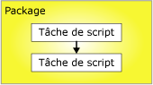
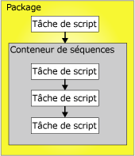

# Contraintes de précédence
  Les contraintes de précédence lient les exécutables, les conteneurs et les tâches des packages dans un flux de contrôle et spécifient les conditions qui déterminent si les exécutables s'exécutent. Un exécutable peut être une boucle For, une boucle Foreach, un conteneur de séquence, une tâche ou un gestionnaire d'événement. Les gestionnaires d'événements utilisent également les contraintes de précédence pour lier leurs exécutables dans un flux de contrôle.  
  
 Une contrainte de précédence lie deux exécutables : l'exécutable de précédence et l'exécutable contraint. L'exécutable de précédence s'exécute avant l'exécutable contraint et le résultat de l'exécution de l'exécutable de précédence peut déterminer si l'exécutable contraint s'exécute. Le schéma suivant illustre deux exécutables liés par une contrainte de précédence.  
  
   
  
 Dans un flux de contrôle linéaire, c'est-à-dire sans branchement, les contraintes de précédence déterminent à elles seules la séquence d'exécution des tâches. Dans un flux de contrôle avec branchements, le moteur d'exécution [!INCLUDE[ssISnoversion](../../includes/ssisnoversion-md.md)] détermine l'ordre d'exécution des tâches et des conteneurs qui suivent immédiatement le branchement. Le moteur d'exécution détermine également l'ordre d'exécution des flux de travail non connectés dans un flux de contrôle.  
  
 L'architecture à conteneurs imbriqués d' [!INCLUDE[ssISnoversion](../../includes/ssisnoversion-md.md)] permet à tous les conteneurs (à l'exception du conteneur d'hôte de tâche qui encapsule une seule tâche) d'inclure d'autres conteneurs, chacun avec son propre flux de contrôle. Les conteneurs de boucles For, de boucles Foreach et de séquence peuvent inclure plusieurs tâches et d'autres conteneurs, qui à leur tour peuvent inclure plusieurs tâches et conteneurs. Par exemple, un package avec une tâche de script et un conteneur de séquence possède une contrainte de précédence qui lie la tâche de script et le conteneur de séquence. Le conteneur de séquence contient trois tâches de script et ses contraintes de précédence lient les trois tâches de script dans un flux de contrôle. Le schéma suivant illustre les contraintes de précédence dans un package avec deux niveaux d'imbrication.  
  
   
  
 Le package étant situé au sommet de la hiérarchie de conteneurs [!INCLUDE[ssIS](../../includes/ssis-md.md)] , plusieurs packages ne peuvent pas être liés par des contraintes de précédence ; toutefois, vous pouvez ajouter une tâche d’exécution de package à un package et lier indirectement un autre package au flux de contrôle.  
  
 Vous pouvez configurer des contraintes de précédence de plusieurs manières :  
  
-   Spécifiez une opération d'évaluation. La contrainte d'évaluation utilise une valeur de contrainte, une expression ou les deux pour déterminer si l'exécutable contraint s'exécute.  
  
-   Si la contrainte de précédence utilise un résultat d'exécution, vous pouvez spécifier le résultat d'exécution comme étant un succès, un échec ou à l'achèvement.  
  
-   Si la contrainte de précédence utilise un résultat d'évaluation, vous pouvez fournir une expression qui correspond à une valeur booléenne.  
  
-   Spécifiez si la contrainte de précédence est évaluée seule ou avec d'autres contraintes qui s'appliquent à l'exécutable contraint.  
  
## Opérations d'évaluation  
 [!INCLUDE[ssISnoversion](../../includes/ssisnoversion-md.md)] offre les opérations d’évaluation suivantes :  
  
-   Une contrainte qui utilise uniquement le résultat d'exécution de l'exécutable de précédence pour déterminer si l'exécutable contraint s'exécute. Le résultat d'exécution de l'exécutable de précédence peut être achèvement, réussite ou échec. Il s'agit de l'opération par défaut.  
  
-   Une expression qui est évaluée pour déterminer si l'exécutable contraint s'exécute. Si le résultat de l'évaluation est true, l'exécutable contraint s'exécute.  
  
-   Une expression et une contrainte qui allient les exigences des résultats d'exécution de l'exécutable de précédence et les résultats de retour de l'évaluation de l'expression.  
  
-   Une expression ou une contrainte qui utilisent les résultats d'exécution de l'exécutable de précédence ou les résultats de retour de l'évaluation de l'expression.  
  
 [!INCLUDE[ssIS](../../includes/ssis-md.md)] Le Concepteur utilise une couleur pour identifier le type de contrainte de précédence. La contrainte Success (réussite) est verte, la contrainte Failure (échec) est rouge et la contrainte Completion (fin) est bleue. Pour afficher les étiquettes de texte indiquant le type de contrainte dans le concepteur [!INCLUDE[ssIS](../../includes/ssis-md.md)] , vous devez configurer les fonctionnalités d’accessibilité du Concepteur [!INCLUDE[ssIS](../../includes/ssis-md.md)] .  
  
 L’expression doit être une expression [!INCLUDE[ssIS](../../includes/ssis-md.md)] valide et elle peut inclure des fonctions, des opérateurs, et des variables système et personnalisées. Pour plus d’informations, consultez [Expressions Integration Services &#40;SSIS&#41; ](../../integration-services/expressions/integration-services-ssis-expressions.md) et [Variables Integration Services &#40;SSIS&#41;](../../integration-services/integration-services-ssis-variables.md).  
  
## Résultats d'exécution  
 La contrainte de précédence peut utiliser les résultats d'exécution suivants seuls ou avec une expression.  
  
-   L'achèvement requiert uniquement que l'exécutable de précédence soit terminé, quel que soit le résultat, pour que l'exécutable contraint s'exécute.  
  
-   Le succès requiert que l'exécutable de précédence se termine avec succès pour que l'exécutable contraint s'exécute.  
  
-   L'échec requiert que l'exécutable de précédence échoue pour que l'exécutable contraint s'exécute.  
  
> [!NOTE]  
>  Seules les contraintes de précédence membres de la même collection **Contrainte de précédence** peuvent être groupées dans une condition AND logique. Par exemple, vous ne pouvez pas combiner des contraintes de précédence à partir de deux conteneurs de boucles Foreach.  
  
## Définir les propriétés d’une contrainte de précédence à l’aide de l’Éditeur de contrainte de précédence  
  
1.  Dans [!INCLUDE[ssBIDevStudioFull](../../includes/ssbidevstudiofull-md.md)], ouvrez le projet [!INCLUDE[ssISnoversion](../../includes/ssisnoversion-md.md)] contenant le package souhaité.  
  
2.  Dans l'Explorateur de solutions, double-cliquez sur le package pour l'ouvrir.  
  
3.  Cliquez sur l'onglet **Flux de contrôle** .  
  
4.  Double-cliquez sur la contrainte de précédence.  
  
     **L’Éditeur de contrainte de précédence** s’ouvre.  
  
5.  Dans la liste déroulante **Opération d’évaluation** , sélectionnez une opération d’évaluation.  
  
6.  Dans la liste déroulante **Valeur** , sélectionnez le résultat d’exécution de l’exécutable de précédence.  
  
7.  Si l’opération d’évaluation utilise une expression, dans la zone **Expression** , tapez une expression, puis cliquez sur **Tester** pour évaluer l’expression.  
  
    > [!NOTE]  
    >  Les noms de variable respectent la casse.  
  
8.  Si plusieurs tâches ou conteneurs sont connectés à l’exécutable contraint, sélectionnez **Opérateur logique AND** pour spécifier que les résultats d’exécution de tous les exécutables précédents doivent avoir la valeur **true**. Sélectionnez **Opérateur logique OR** pour spécifier qu’un seul résultat d’exécution doit avoir la valeur **true**.  
  
9. Cliquez sur **OK** pour fermer la boîte de dialogue **Éditeur de contrainte de précédence**.  
  
10. Pour enregistrer le package mis à jour, cliquez sur **Enregistrer les éléments sélectionnés** dans le menu **Fichier** .  

## Éditeur de contrainte de précédence
Utilisez la boîte de dialogue **Éditeur de contrainte de précédence** pour configurer les contraintes de précédence.  
  
### Options  
 **Opération d’évaluation**  
 Spécifiez l'opération d'évaluation utilisée par la contrainte de précédence. Les opérations disponibles sont : **Contrainte**, **Expression**, **Expression et contrainte**et **Expression ou contrainte**.  
  
 **Value**  
 Spécifiez la valeur de contrainte : **Réussite**, **Échec**ou **À l’achèvement**.  
  
> [!NOTE]  
>  La ligne de contrainte de précédence est verte pour **Réussite**, mise en surbrillance pour **Échec**et bleue pour **À l’achèvement**.  
  
 **Expression**  
 Si vous utilisez les opérations **Expression**, **Expression et contrainte**ou **Expression ou contrainte**, tapez une expression ou lancez le Générateur d’expressions pour créer l’expression. L'expression doit prendre une valeur de type Boolean.  
  
 **Tester**  
 Validez l'expression.  
  
 **ET logique**  
 Sélectionnez cette option pour spécifier que plusieurs contraintes de précédence sur le même exécutable doivent être évaluées ensemble. Toutes les contraintes doivent prendre la valeur **True**.  
  
> [!NOTE]  
>  Ce type de contrainte de précédence s'affiche sous forme de ligne pleine verte, mise en surbrillance ou bleue.  
  
 **OU logique**  
 Sélectionnez cette option pour spécifier que plusieurs contraintes de précédence sur le même exécutable doivent être évaluées ensemble. Une contrainte au moins doit prendre la valeur **True**.  
  
> [!NOTE]  
>  Ce type de contrainte de précédence s'affiche sous forme de ligne pointillée verte, mise en surbrillance ou bleue.  
  
## Définir les propriétés d’une contrainte de précédence à l’aide de la fenêtre Propriétés  
  
1.  Dans [!INCLUDE[ssBIDevStudioFull](../../includes/ssbidevstudiofull-md.md)], ouvrez le projet [!INCLUDE[ssISnoversion](../../includes/ssisnoversion-md.md)] contenant le package à modifier.  
  
2.  Dans l'Explorateur de solutions, double-cliquez sur le package pour l'ouvrir.  
  
3.  Cliquez sur l'onglet **Flux de contrôle** . Sur l’aire de conception de l’onglet **Flux de contrôle** , cliquez avec le bouton droit sur la contrainte de précédence, puis cliquez sur **Propriétés**. Dans la fenêtre Propriétés, modifiez les valeurs des propriétés.  
  
4.  Dans la fenêtre **Propriétés** , configurez les propriétés de lecture/écriture suivantes pour les contraintes de précédence :  
  
    |Propriété Lecture/écriture|Action de configuration|  
    |--------------------------|--------------------------|  
    |Description|Fournissez une description.|  
    |EvalOp|Sélectionnez une opération d'évaluation. Si l’opération **Expression**, **ExpressionAndConstant**ou **ExpressionOrConstant** est sélectionnée, vous pouvez spécifier une expression.|  
    |Expression|Si l'opération d'évaluation inclut une expression, fournissez une expression. L'expression doit prendre une valeur de type Boolean. Pour plus d’informations sur le langage des expressions, consultez [Expressions Integration Services &#40;SSIS&#41;](../../integration-services/expressions/integration-services-ssis-expressions.md).|  
    |LogicalAnd|Définissez **LogicalAnd** pour spécifier si la contrainte de précédence est évaluée en accord avec d’autres contraintes de précédence quand plusieurs exécutables précèdent l’exécutable contraint et lui sont liés|  
    |Nom   |Mettez à jour le nom de la contrainte de précédence.|  
    |ShowAnnotation|Spécifiez le type d'annotation à utiliser. Sélectionnez **Never** pour désactiver les annotations, **AsNeeded** pour activer l’annotation à la demande, **ConstraintName** pour annoter automatiquement en utilisant la valeur de la propriété Name, **ConstraintDescription** pour annoter automatiquement en utilisant la valeur de la propriété Description et **ConstraintOptions** pour annoter automatiquement en utilisant les valeurs des propriétés Value et Expression.|  
    |Valeur|Si l’opération d’évaluation spécifiée dans la propriété EvalOP inclut une contrainte, sélectionnez le résultat d’exécution de l’exécutable de contrainte.|  
  
5.  Fermez la fenêtre Propriétés.  
  
6.  Pour enregistrer le package mis à jour, cliquez sur **Enregistrer les éléments sélectionnés** dans le menu **Fichier** .  

## Définir la valeur d’une contrainte de précédence à l’aide du menu contextuel  
  
1.  Dans [!INCLUDE[ssBIDevStudioFull](../../includes/ssbidevstudiofull-md.md)], ouvrez le projet [!INCLUDE[ssISnoversion](../../includes/ssisnoversion-md.md)] contenant le package souhaité.  
  
2.  Dans l'Explorateur de solutions, double-cliquez sur le package pour l'ouvrir.  
  
3.  Cliquez sur l'onglet **Flux de contrôle** .  
  
4.  Sur la surface de dessin de l’onglet **Flux de contrôle** , cliquez avec le bouton droit sur la contrainte de précédence, puis cliquez sur **Succès**, **Échec de l’opération**ou **Dernière étape**.  
  
5.  Pour enregistrer le package mis à jour, cliquez sur **Enregistrer l’élément sélectionné** dans le menu **Fichier** .  

## Ajouter des expressions aux contraintes de précédence
 Une contrainte de précédence peut utiliser une expression pour définir la contrainte entre deux exécutables : l'exécutable de précédence et l'exécutable contraint. Les exécutables peuvent être des tâches ou des conteneurs. L'expression peut être utilisée seule ou en combinaison avec le résultat d'exécution de l'exécutable de précédence. Le résultat d'exécution d'un exécutable est soit succès, soit échec. Quand vous configurez le résultat d’exécution d’une contrainte de précédence, vous pouvez lui affecter la valeur **Succès**, **Échec**ou **Achèvement**. **Succès** exige que l’exécutable de précédence réussisse, **Échec** exige que l’exécutable de précédence échoue et **Achèvement** indique que l’exécutable contraint doit s’exécuter, que la tâche de précédence réussisse ou échoue. Pour plus d’informations, consultez [Contraintes de précédence](../../integration-services/control-flow/precedence-constraints.md).  
  
 Le résultat d’évaluation de l’expression doit être **True** ou **False** et l’expression doit être une expression [!INCLUDE[ssISnoversion](../../includes/ssisnoversion-md.md)] valide. L'expression peut utiliser des littéraux, des variables système et personnalisées, ainsi que les fonctions et opérateurs fournis par la grammaire des expressions [!INCLUDE[ssIS](../../includes/ssis-md.md)]. Par exemple, l’expression `@Count == SQRT(144) + 10` utilise la variable **Count**, la fonction SQRT, ainsi que les opérateurs égal à (==) et ajouter (+). Pour plus d’informations, consultez [Expressions Integration Services &#40;SSIS&#41;](../../integration-services/expressions/integration-services-ssis-expressions.md).  
  
 Dans l'illustration qui suit, la tâche A et la tâche B sont liées par une contrainte de précédence qui utilise un résultat d'exécution et une expression. La valeur de la contrainte est définie sur **Succès** et l’expression est  `@X >== @Z`. La tâche B, la tâche contrainte, s’exécute uniquement si la tâche A se termine avec succès et si la valeur de la variable **X** est supérieure ou égale à la valeur de la variable **Z**.  
  
   
  
 Les exécutables peuvent également être liés par plusieurs contraintes de précédence contenant des expressions différentes. Par exemple, dans l'illustration qui suit, les tâches B et C sont liées à la tâche A par des contraintes de précédence qui utilisent des résultats d'exécution et des expressions. Les deux valeurs de contrainte sont définies sur **Succès**. Une contrainte de précédence inclut l’expression `@X >== @Z`, tandis que l’autre inclut l’expression `@X < @Z`. En fonction des valeurs de la variable **X** et de la variable **Z**, la tâche C ou la tâche B s’exécute.  
  
   
  
 Vous pouvez ajouter ou modifier une expression à l’aide de **l’Éditeur de contrainte de précédence** dans le concepteur [!INCLUDE[ssIS](../../includes/ssis-md.md)] et la fenêtre Propriétés fournie par [!INCLUDE[ssBIDevStudioFull](../../includes/ssbidevstudiofull-md.md)]. Cependant, la fenêtre Propriétés ne propose aucune vérification de la syntaxe de l'expression.  
  
 Si une contrainte de précédence inclut une expression, une icône s’affiche sur la surface de dessin de l’onglet **Flux de contrôle** , en regard de la contrainte de précédence et l’info-bulle de l’icône affiche l’expression.  

### Ajouter une expression à une contrainte de précédence  
  
1.  Dans [!INCLUDE[ssBIDevStudioFull](../../includes/ssbidevstudiofull-md.md)], ouvrez le projet [!INCLUDE[ssISnoversion](../../includes/ssisnoversion-md.md)] contenant le package souhaité.  
  
2.  Dans l'Explorateur de solutions, double-cliquez sur le package pour l'ouvrir.  
  
3.  Cliquez sur l'onglet **Flux de contrôle** .  
  
4.  Dans l’aire de conception de l’onglet **Flux de contrôle** , double-cliquez sur la contrainte de précédence. **L’Éditeur de contrainte de précédence** s’ouvre.  
  
5.  Sélectionnez **Expression**, **Expression et contrainte**ou **Expression ou contrainte** dans la liste **Opération d’évaluation** .  
  
6.  Tapez une expression dans la zone de texte **Expression** ou lancez le Générateur d’expressions pour créer une expression.  
  
7.  Pour valider la syntaxe de l’expression, cliquez sur **Tester**.  
  
8.  Pour enregistrer le package mis à jour, cliquez sur **Enregistrer les éléments sélectionnés** dans le menu **Fichier** .  
 
### Combinaison de valeurs d’exécution et d’expressions  
 Le tableau qui suit décrit les effets de la combinaison d'une contrainte de valeur d'exécution et d'une expression dans une contrainte de précédence.  
  
|Opération d'évaluation|Résultat d'évaluation de la contrainte|Résultat d'évaluation de l'expression|L'exécutable contraint s'exécute|  
|--------------------------|-----------------------------|-----------------------------|---------------------------------|  
|Contrainte|True|Néant|True|  
|Contrainte|False|Néant|False|  
|Expression|Néant|True|True|  
|Expression|Néant|False|False|  
|Contrainte et expression|True|True|True|  
|Contrainte et expression|True|False|False|  
|Contrainte et expression|False|True|False|  
|Contrainte et expression|False|False|False|  
|Contrainte ou expression|True|True|True|  
|Contrainte ou expression|True|False|True|  
|Contrainte ou expression|False|True|True|  
|Contrainte ou expression|False|False|False|  

## Scénarios de contraintes complexes avec plusieurs contraintes de précédence 
Une contrainte de précédence connecte deux exécutables : deux tâches, deux conteneurs, ou un de chaque. Ils sont connus sous le nom d'exécutable de précédence et d'exécutable contraint. Un exécutable contraint peut comprendre plusieurs contraintes de précédence. Pour plus d’informations, consultez [Contraintes de précédence](../../integration-services/control-flow/precedence-constraints.md).  
  
 Assembler des scénarios de contraintes complexes par regroupement de contraintes permet d'implémenter un flux de contrôle complexe dans les packages. Par exemple, dans l’illustration qui suit, la tâche D est liée à la tâche A par une contrainte **Success** , la tâche D est liée à la tâche B par une contrainte **Failure** , et la tâche D est liée à la tâche C par une contrainte **Success** . Les contraintes de précédence entre la tâche D et la tâche A, entre la tâche D et la tâche B, et entre la tâche D et la tâche C participent à une relation *et* logique. Par conséquent, pour que la tâche D s'exécute, la tâche A doit s'exécuter avec succès, la tâche B doit échouer et la tâche C doit s'exécuter avec succès.  
  
   
  
### Propriété LogicalAnd  
 Si une tâche ou un conteneur comporte plusieurs contraintes, la propriété **LogicalAnd** indique si une contrainte de précédence est évaluée seule ou de concert avec les autres contraintes.  
  
 Vous pouvez définir la propriété **LogicalAnd** à l’aide de **l’Éditeur de contrainte de précédence** dans le concepteur [!INCLUDE[ssIS](../../includes/ssis-md.md)] ou dans la fenêtre Propriétés fournie par [!INCLUDE[ssBIDevStudioFull](../../includes/ssbidevstudiofull-md.md)].  

## Définir la valeur par défaut des contraintes de précédence  
Pendant la première utilisation du concepteur [!INCLUDE[ssIS](../../includes/ssis-md.md)] , la valeur par défaut d’une contrainte de précédence est **Success**. Suivez les étapes ci-dessous pour configurer le concepteur [!INCLUDE[ssIS](../../includes/ssis-md.md)] de sorte qu'il utilise une valeur par défaut différente pour les contraintes de précédence.
  
1.  Ouvrez [!INCLUDE[ssBIDevStudioFull](../../includes/ssbidevstudiofull-md.md)].  
  
2.  Dans le menu **Outils** , cliquez sur **Options**.  
  
3.  Dans la boîte de dialogue **Options** , développez **Concepteurs Business Intelligence** , puis **Concepteurs de services d’intégration**.  
  
4.  Cliquez sur **Connexion automatique flux de contrôle** , puis sélectionnez **Connecter une nouvelle forme sur la forme sélectionnée par défaut**.  
  
5.  Dans la liste déroulante, choisissez **Utiliser une contrainte Failure (échec) pour la nouvelle forme** ou **Utiliser une contrainte Completion (fin) pour la nouvelle forme**.  
  
6.  Cliquez sur **OK**.  
  
## Créer une contrainte de précédence par défaut  
  
1.  Dans [!INCLUDE[ssBIDevStudioFull](../../includes/ssbidevstudiofull-md.md)], ouvrez le projet [!INCLUDE[ssISnoversion](../../includes/ssisnoversion-md.md)] contenant le package souhaité.  
  
2.  Dans l'Explorateur de solutions, double-cliquez sur le package pour l'ouvrir.  
  
3.  Cliquez sur l'onglet **Flux de contrôle** .  
  
4.  Sur la surface de dessin de l’onglet **Flux de contrôle** , cliquez sur la tâche ou le conteneur et faites glisser son connecteur vers l’exécutable auquel vous voulez que la contrainte de précédence s’applique.  
  
5.  Pour enregistrer le package mis à jour, cliquez sur **Enregistrer les éléments sélectionnés** dans le menu **Fichier** .  
