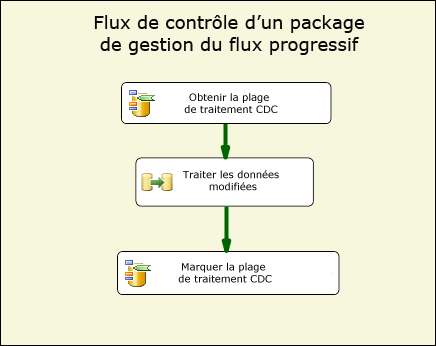
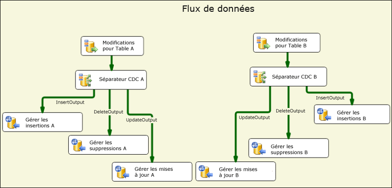
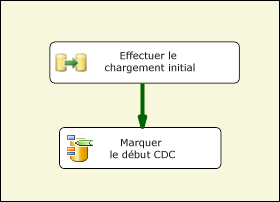
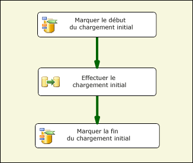
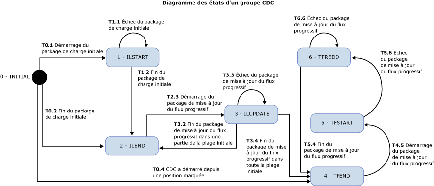

# Composants de flux CDC
  Les composants CDC par Attunity destinés aux développeurs SSIS d'aide Microsoft [!INCLUDE[ssISCurrent](../../includes/ssiscurrent-md.md)] fonctionnent avec la capture de données modifiées (CDC) et réduisent la complexité des packages CDC.  
  
 Les composants CDC SSIS sont conçus pour fonctionner avec la fonctionnalité CDC de [!INCLUDE[ssCurrent](../../includes/sscurrent-md.md)] où les tables sources sont soit la même base de données [!INCLUDE[ssCurrent](../../includes/sscurrent-md.md)] , soit une base de données Oracle (quand le service CDC d’Oracle pour [!INCLUDE[ssCurrent](../../includes/sscurrent-md.md)]est utilisé). Les tables partitionnées sont prises en charge.  
  
 Ils comprennent le contrôle et le flux de données qui rationalisent l'expérience de la lecture et du traitement des données modifiées dans les packages SSIS. Ils peuvent être ajoutés à la bibliothèque des composants dans Microsoft [!INCLUDE[ssCurrent](../../includes/sscurrent-md.md)], mais sont installés séparément.  
  
 Voici les composants de capture de données modifiées (CDC) par Attunity :  
  
 **Composant de flux de contrôle CDC**:  
  
 [Tâche de contrôle de capture de données modifiées](../../integration-services/control-flow/cdc-control-task.md)  
  
 **Composants de flux de données CDC**:  
  
 [Source CDC](../../integration-services/data-flow/cdc-source.md)  
  
 [Séparateur de capture de données modifiées](../../integration-services/data-flow/cdc-splitter.md)  
  
## Installation  
 Cette section décrit les procédures d'installation des composants CDC pour Microsoft [!INCLUDE[ssISCurrent](../../includes/ssiscurrent-md.md)].  
  
 Les composants CDC pour SSIS font partie du package Microsoft® Change Data Capture Designer and Service pour Oracle d’Attunity pour Microsoft SQL Server®. Ce téléchargement fait partie du Feature pack SQL Server 2016. Téléchargez les composants du Feature Pack à partir de la [page web SQL Server 2016 Feature Pack](http://go.microsoft.com/fwlink/?LinkId=746297).  
  
### Prise en charge de la version

#### Versions de SQL Server prises en charge

Les composants CDC pour SSIS sont pris en charge sur toutes les versions prises en charge de Microsoft SQL Server. Actuellement, les versions SQL Server 2012 à SQL Server 2017 sont prises en charge.

#### Versions du système d’exploitation prises en charge
  
Les composants CDC pour SSIS sont pris en charge sur les systèmes d’exploitation et plateformes suivants :  
  
-   Windows 8 et 8.1
-   Windows 10  
-   Windows Server 2012 et 2012 R2
-   Windows Server 2016
  
### Exécution du programme d'installation  
 Avant d’exécuter l’Assistant Installation, assurez-vous que [!INCLUDE[ssCurrent](../../includes/sscurrent-md.md)][!INCLUDE[ssBIDevStudio](../../includes/ssbidevstudio-md.md)] est fermé. Suivez les instructions dans l'assistant d'installation.  
  
### Redémarrer le service SSIS 
Après avoir installé les composants CDC, vous devez redémarrer le service SSIS pour être sûr que les composants fonctionnent correctement lors du développement des packages dans [!INCLUDE[ssBIDevStudio](../../includes/ssbidevstudio-md.md)].  
  
Un message s'affiche après avoir installé les composants. Cliquez sur **Oui** lorsque vous y êtes invité.  
  
### Désinstallation des composants CDC Microsoft  
 Vous désinstallez la source CDC, le séparateur CDC ou la tâche de contrôle CDC à l'aide de l'assistant de désinstallation. Si vous utilisez [!INCLUDE[ssCurrent](../../includes/sscurrent-md.md)][!INCLUDE[ssBIDevStudio](../../includes/ssbidevstudio-md.md)] pour le développement de packages, vérifiez que [!INCLUDE[ssBIDevStudio](../../includes/ssbidevstudio-md.md)] est fermé avant d’exécuter l’Assistant Désinstallation.  
  
## Avantages  
 Les composants CDC pour les composants de [!INCLUDE[ssCurrent](../../includes/sscurrent-md.md)][!INCLUDE[ssISnoversion](../../includes/ssisnoversion-md.md)] permettent aux développeurs SSIS de construire facilement des packages SSIS traitant les données modifiées. Ils aident les développeurs SSIS à traiter la capture des données modifiées (CDC) et à réduire la complexité des packages CDC.  
  
 Les composants CDC SSIS servent à fournir les données modifiées de façon à faciliter leur traitement ultérieur pour la réplication, la charge d'un entrepôt de données, la mise à jour des dimensions à variation lente pour OLAP, les modifications d'audit ou pour d'autres utilisations possibles. Le type de traitement ultérieur utilisé est déterminé par le développeur SSIS.  
  
 Les composants CDC SSIS sont conçus pour fonctionner avec la fonction CDC de [!INCLUDE[ssCurrent](../../includes/sscurrent-md.md)] avec des tables de modifications se trouvant dans la même base de données [!INCLUDE[ssCurrent](../../includes/sscurrent-md.md)] .  
  
## Mise en route avec les composants de capture de données modifiées (CDC)  
 Un package CDC classique traite des modifications sur un groupe de tables. La partie relative au flux de contrôle de base de ce type de package CDC est illustrée dans la figure ci-dessous. Ce package est appelé un package de traitement à flux progressif.  
  
   
  
 Ce flux de contrôle [!INCLUDE[ssCurrent](../../includes/sscurrent-md.md)][!INCLUDE[ssISnoversion](../../includes/ssisnoversion-md.md)] contient deux tâches de contrôle CDC et la tâche de flux de données. La première tâche appelée **Obtenir la plage de traitement CDC** définit la plage des numéros séquentiels dans le journal (LSN) pour les modifications traitées dans la tâche de flux de données appelée **Modifications des processus**. Cette plage est établie en fonction de ce qui a été traité pendant la dernière exécution de package et de ce qui a été enregistré dans un magasin persistant.  
  
 Pour plus d'informations sur l'utilisation de la tâche de contrôle CDC, consultez [CDC Control Task](../../integration-services/control-flow/cdc-control-task.md) et [CDC Control Task Editor](../../integration-services/control-flow/cdc-control-task-editor.md).  
  
 L'illustration suivante montre le flux de données **Modifications des processus** qui indique sur le plan conceptuel la façon dont les modifications sont traitées.  
  
   
  
 Les étapes illustrées sont les suivantes :  
  
-   **Modifications pour la table X** est une source CDC qui lit les modifications apportées à la table X dans la plage de traitement CDC déterminée dans le flux de contrôle parent.  
  
-   **Séparateur CDC X** est utilisé pour fractionner les modifications en insertions, suppressions et mises à jour. Dans ce scénario, on suppose que la source CDC est configurée pour produire des modifications nettes afin que des types de modifications différents puissent être traités en parallèle.  
  
-   Les modifications spécifiques sont traitées en aval par la suite. Dans cette illustration, les modifications sont insérées dans des tables utilisant plusieurs destinations ODBC mais dans des cas réels, le traitement peut être différent.  
  
 Pour plus d'informations sur la source CDC, consultez :  
  
 [Source CDC](../../integration-services/data-flow/cdc-source.md)  
  
 [Éditeur de source CDC &#40;page Gestionnaire de connexions&#41;](../../integration-services/data-flow/cdc-source-editor-connection-manager-page.md)  
  
 [Éditeur de source CDC &#40;page Colonnes&#41;](../../integration-services/data-flow/cdc-source-editor-columns-page.md)  
  
 [Éditeur de source CDC &#40;page Sortie d’erreur&#41;](../../integration-services/data-flow/cdc-source-editor-error-output-page.md)  
  
 Pour plus d'informations sur le séparateur CDC, consultez :  
  
 [Séparateur de capture de données modifiées](../../integration-services/data-flow/cdc-splitter.md)  
  
 L'un des problèmes de base qui requièrent une attention lors de la génération de packages CDC est la façon dont le traitement des modifications interagit avec la charge initiale (ou le traitement initial) des données.  
  
 Les composants CDC prennent en charge trois scénarios de charge et de traitement des modifications initiaux :  
  
-   Charge initiale effectuée avec un instantané de base de données. Dans ce cas, le traitement des modifications démarre avec le numéro séquentiel dans le journal (LSN) de l'événement instantané.  
  
-   Charge initiale d'une base de données inactive. Dans ce cas, aucune modification n'est apportée pendant la charge initiale de sorte que le numéro LSN est échantillonné occasionnellement lors de la charge initiale et le traitement des modifications démarre avec ce numéro LSN.  
  
-   Charge initiale d'une base de données active. Dans ce cas, puisque la charge initiale est en cours, les modifications sont apportées à la base de données et il n'y a aucun numéro LSN à partir duquel le traitement des modifications peut précisément commencer. Dans ce cas, le développeur du package de charge initiale peut échantillonner le numéro LSN actuel de la base de données source avant et après la charge initiale. Ensuite, lors du traitement des modifications, il convient d'être attentif si celui-ci concerne des modifications effectuées en parallèle à la charge initiale car certaines modifications traitées sont déjà visibles dans celle-ci (par exemple, une modification d'insertion peut échouer avec une erreur de clé double car la ligne insérée était déjà lue par le processus de charge initiale).  
  
 L'illustration suivante montre un package SSIS qui peut gérer les deux premiers scénarios :  
  
   
  
 L'illustration suivante montre un package SSIS qui peut gérer le troisième scénario :  
  
   
  
 Après le package de charge initiale, un package de mise à jour à flux progressif est exécuté à plusieurs reprises selon une planification donnée, de façon à traiter les modifications au fur et à mesure qu'elles sont disponibles pour la consommation.  
  
 Le passage de l'état du traitement CDC du package de charge initiale vers le package à flux progressif et entre les différentes tâches au sein de chaque package se produit au moyen d'une variable de chaîne de package SSIS spéciale. La valeur de cette variable est appelée « état CDC » et reflète l'état actuel du traitement CDC pour les groupes de tables gérés par les packages de charge initiale et à flux progressif.  
  
 La valeur de la variable d’état CDC doit être conservée dans un stockage persistant. Elle doit être lue avant de commencer le traitement CDC et doit être enregistrée avec l’état actuel une fois le traitement terminé. La tâche de charge et de stockage de l'état CDC peut être gérée par le développeur SSIS mais le composant de contrôle CDC peut l'automatiser en conservant la valeur de l'état CDC dans une table de base de données.  
  
## Considérations relatives à la sécurité  
 Cette section contient un certain nombre de considérations de sécurité pour l'utilisation des composants CDC dans SSIS.  
  
### Autorisation d'accès aux données modifiées  
 Les packages de mise à jour à flux progressif ont besoin d’accéder aux fonctions CDC de [!INCLUDE[ssCurrent](../../includes/sscurrent-md.md)] . Cet accès est accordé, par défaut, aux membres du rôle de base de données fixe **db_owner** . Sachant que le rôle **db_owner** jouit de prérogatives importantes, quand vous définissez des instances de capture dans [!INCLUDE[ssCurrent](../../includes/sscurrent-md.md)] , il est recommandé d’associer un rôle de régulation de sécurité à chaque instance de capture de sorte que le package CDC SSIS fasse appel à un utilisateur ayant des autorisations beaucoup plus restreintes pour traiter les modifications.  
  
### Access au numéro LSN actuel de la base de données CDC  
 Les opérations de la tâche de contrôle CDC qui permettent de marquer le numéro LSN de départ pour le traitement des modifications doivent être en mesure de trouver le numéro LSN actuel de la base de données CDC. Les composants trouvent le numéro LSN à l’aide de la procédure **sp_replincrementlsn** de la base de données MASTER. L'autorisation EXECUTE sur cette procédure doit être fournie à la connexion utilisée pour se connecter à la base de données CDC [!INCLUDE[ssCurrent](../../includes/sscurrent-md.md)] .  
  
### Accès à la table des états CDC  
 La table des états CDC est utilisée pour conserver automatiquement les états CDC qui ont besoin d'être mis à jour par la connexion utilisée pour se connecter à la base de données [!INCLUDE[ssCurrent](../../includes/sscurrent-md.md)] . Étant donné que cette table est créée par le développeur SSIS, définissez l'administrateur système de [!INCLUDE[ssCurrent](../../includes/sscurrent-md.md)] en tant qu'utilisateur autorisé à créer des bases de données [!INCLUDE[ssCurrent](../../includes/sscurrent-md.md)] et à effectuer des tâches d'administration et de maintenance. En outre, un administrateur système [!INCLUDE[ssCurrent](../../includes/sscurrent-md.md)] qui travaille avec des bases de données activées CDC doit être bien informé sur la technologie et l'implémentation CDC dans [!INCLUDE[ssCurrent](../../includes/sscurrent-md.md)] .  
  
## Regroupement de tables pour le traitement CDC  
 Les projets de base de données peuvent inclure un petit nombre ou plusieurs milliers de tables. Lorsque vous concevez la charge initiale et les packages CDC, il est préférable de regrouper les tables en petits groupes pour une gestion plus efficace et simple. Cette section décrit un certain nombre d'éléments qui ont un impact sur le tri des tables en petits groupes, lorsque les tables de chaque groupe sont initialement chargées puis mises à jour en tant que groupe.  
  
 Les modèles CDC pris en charge par les composants CDC supposent que ce regroupement est déjà déterminé. Chaque groupe définit un contexte CDC distinct qui est maintenu séparément des autres groupes. Pour chaque groupe, des packages de mise à jour de charge initiale et à flux progressif sont créés. Les mises à jour à flux progressif sont planifiées périodiquement en fonction des contraintes de traitement des modifications (par exemple, la consommation de l'UC et des E/S, l'impact sur d'autres systèmes) et de la latence désirée.  
  
 Les tables sont regroupées en fonction des considérations suivantes :  
  
1.  En fonction de la base de données cible. Toutes les tables écrites dans des bases de données cibles différentes ou entraînant un traitement différent doivent être affectées à des groupes CDC différents.  
  
2.  Les tables liées à des contraintes d'intégrité référentielle doivent être attribuées au même groupe pour éviter les problèmes d'intégrité référentielle au niveau de la cible.  
  
3.  Les tables pour lesquelles une latence plus élevée peut être tolérée peuvent être regroupées afin d'être traitées moins fréquemment et de réduire la charge système globale.  
  
4.  Les tables dont le taux de modification est élevé doivent être attribuées à des groupes plus petits et les tables avec un faible taux de modification peuvent être regroupées dans des groupes plus volumineux.  
  
 Les deux packages suivants sont créés pour chaque groupe CDC :  
  
-   Un package de charge initiale, qui lit la plage complète des données des tables sources et l'applique aux tables cibles.  
  
-   Une mise à jour à flux progressif qui lit les modifications apportées aux tables sources et les applique aux tables cibles. Ce package doit être exécuté de façon régulière.  
  
## État CDC  
 À chaque groupe CDC correspond un état associé qui est représenté par une chaîne avec un format spécifique. Pour plus d'informations, consultez [CDC Control Task](../../integration-services/control-flow/cdc-control-task.md). Le tableau suivant répertorie les valeurs d'état CDC possibles.  
  
|État|Description|  
|-----------|-----------------|  
|0-(INITIAL)|État qui existe avant que tous les packages soient exécutés sur le groupe CDC en cours. Il s'agit également de l'état correspondant à une capture de données modifiées vide.   Pour plus d'informations sur les opérations de la tâche de contrôle CDC, consultez [CDC Control Task](../../integration-services/control-flow/cdc-control-task.md).|  
|1-ILSTART (Initial-Load-Started)|Il s'agit de l'état qui existe lorsque le package de la charge initiale démarre. Il est constaté après l'appel de l'opération **MarkInitialLoadStart** à la tâche de contrôle CDC.   Pour plus d'informations sur les opérations de la tâche de contrôle CDC, consultez [CDC Control Task](../../integration-services/control-flow/cdc-control-task.md).|  
|2- ILEND (Initial-Load-Ended)|Il s'agit de l'état qui existe lorsque le package de la charge initiale se termine avec succès. Il est constaté après l'appel de l'opération MarkInitialLoadEnd à la tâche de contrôle CDC.   Pour plus d'informations sur les opérations de la tâche de contrôle CDC, consultez [CDC Control Task](../../integration-services/control-flow/cdc-control-task.md).|  
|3-ILUPDATE (Initial Load Update)|C'est l'état existant après la première exécution du package de mise à jour, après la charge initiale, alors que le traitement de la plage initiale est encore en cours. Il est constaté après l'appel de l'opération **GetProcessingRange** à la tâche de contrôle CDC.   Si vous utilisez la colonne **_$reprocessing** , elle contient la valeur 1 pour indiquer que le package peut retraiter des lignes qui se trouvent déjà au niveau de la cible.   Pour plus d'informations sur les opérations de la tâche de contrôle CDC, consultez [CDC Control Task](../../integration-services/control-flow/cdc-control-task.md).|  
|4-TFEND (Trickle-Feed-Update-Ended)|Il s'agit de l'état attendu pour une exécution CDC normale. Il indique que l'exécution précédente a réussi et qu'une nouvelle exécution avec une nouvelle plage de traitement peut démarrer.|  
|5-TFSTART (Trickle-Feed-Update-Started)|Il s'agit de l'état constaté pour les exécutions ultérieures du package de mise à jour après l'appel de l'opération **GetProcessingRange** à la tâche de contrôle CDC.   Il indique qu’une exécution CDC normale a démarré mais n’est pas terminée ou ne s’est pas encore terminée correctement (**MarkProcessedRange**).   Pour plus d'informations sur les opérations de la tâche de contrôle CDC, consultez [CDC Control Task](../../integration-services/control-flow/cdc-control-task.md).|  
|6-TFREDO (Reprocessing-Trickle-Feed-Updates)|Il s'agit de l'état d'un **GetProcessingRange** qui se produit après TFSTART. Il indique que l'exécution précédente ne s'est pas terminée avec succès.   Si vous utilisez la colonne _$reprocessing, elle contient la valeur 1 pour indiquer que le package peut retraiter des lignes qui sont déjà au niveau de la cible.|  
|7-ERROR|Le groupe CDC est dans un état ERROR.|  
  
 Voici le diagramme d’état des composants CDC. Un état ERROR est constaté lorsqu'un état qui n'est pas prévu est atteint. Les états attendus sont illustrés dans le diagramme ci-dessous. Toutefois, l’état ERROR ne figure pas dans ce diagramme.  
  
 Par exemple, à la fin d'un package de charge initiale, lorsque le système tente de définir l'état sur ILEND, si l'état est TFSTART, alors le groupe CDC est dans un état d'erreur et le package de mise à jour à flux progressif ne s'exécute pas (le package de charge initiale s'exécute).  
  
   
  
 Une fois le package de charge initiale exécuté avec succès, le package de mise à jour à flux progressif s'exécute de façon répétée selon une planification prédéterminée pour traiter les modifications apportées aux tables sources. Chaque exécution du package de mise à jour à flux progressif est une exécution CDC.  
  
## Dans cette section  
  
-   [Source CDC](../../integration-services/data-flow/cdc-source.md)  
  
-   [Séparateur de capture de données modifiées](../../integration-services/data-flow/cdc-splitter.md)  
  
## Related Tasks  
  
-   [Diriger le flux de capture de données modifiées en fonction du type de modification](../../integration-services/data-flow/direct-the-cdc-stream-according-to-the-type-of-change.md)  
  
-   [Définir une variable d'état](../../integration-services/data-flow/define-a-state-variable.md)  
  
## Contenu associé  
  
-   Entrée de blog, [CDC in SSIS for SQL Server 2012](https://www.mattmasson.com/2011/12/cdc-in-ssis-for-sql-server-2012-2/), sur mattmasson.com.  
  
-   Entrée de blog sur l'installation du service de capture de données modifiées [CDC pour Oracle dans SQL Server 2012](http://go.microsoft.com/fwlink/?LinkId=247827), sur blogs.msdn.com  
  
-   Article technique, [Installation du service de capture de données modifiées Microsoft SQL Server 2012 pour Oracle par Attunity](http://go.microsoft.com/fwlink/?LinkId=252958), sur social.technet.microsoft.com.  
  
-   Article technique, [Résolution des problèmes de configuration dans le service de capture de données modifiées Microsoft SQL Server pour Oracle par Attunity](http://go.microsoft.com/fwlink/?LinkId=252960), sur social.technet.microsoft.com.  
  
-   Article technique, [Dépannage des erreurs d'instance du service de capture de données modifiées Microsoft SQL Server pour Oracle par Attunity](http://go.microsoft.com/fwlink/?LinkId=252961), sur social.technet.microsoft.com.  
  
-   Video, [CDC for Oracle Databases using SQL Server Integration Services 2012 (SQL Server Video)](http://technet.microsoft.com/sqlserver/jj218898), on technet.microsoft.com.  
  
##  Voir aussi  
 [Tâche de contrôle de capture de données modifiées](../../integration-services/control-flow/cdc-control-task.md)  
  
  
