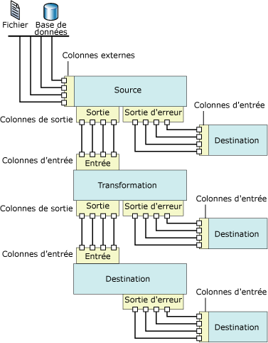

# Flux de données
  [!INCLUDE[ssNoVersion](../../includes/ssnoversion-md.md)] [!INCLUDE[ssISnoversion](../../includes/ssisnoversion-md.md)] fournit trois types différents de composants de flux de données : les sources, les transformations et les destinations. Les sources extraient les données des banques de données qui peuvent être des tables et des vues de bases de données relationnelles, des fichiers et des bases de données [!INCLUDE[ssASnoversion](../../includes/ssasnoversion-md.md)] . Les transformations modifient, synthétisent et nettoient les données. Les destinations chargent les données dans des banques de données ou créent des datasets en mémoire.  
  
> [!NOTE]  
>  Lorsque vous créez des fournisseurs personnalisés, vous devez mettre à jour le dossier ProviderDescriptors.xml avec les valeurs de la colonne de métadonnées.  
  
 Par ailleurs, [!INCLUDE[ssISnoversion](../../includes/ssisnoversion-md.md)] propose des chemins qui connectent la sortie d’un composant à l’entrée d’un autre. Les chemins d'accès définissent la séquence des composants et vous permettent d'ajouter des annotations au flux de données ou d'afficher la source de la colonne.  
  
 Les composants du flux de données sont connectés en connectant la sortie des sources et des destinations à l'entrée des transformations et des destinations. Lors de la construction d'un flux de données, vous connectez généralement le second composant et les suivants au moment où vous les ajoutez au flux de données. Après avoir connecté le composant, les colonnes d'entrée peuvent être utilisées pour configurer le composant. Lorsqu'aucune colonne d'entrée n'est disponible, vous devez configurer le composant une fois celui-ci connecté au flux de données. Pour plus d’informations, consultez [Chemins d’accès d’Integration Services](../../integration-services/data-flow/integration-services-paths.md) et [Connecter des composants avec des chemins d’accès](http://msdn.microsoft.com/library/05633e4c-1370-4b05-802b-f36b07dd71c8).  
  
 Le diagramme qui suit montre un flux de données composé d'une source, d'une transformation avec une entrée et une sortie et d'une destination. Ce diagramme indique les entrées, les sorties et les sorties d'erreurs, de même que les colonnes d'entrée, de sortie et externes.  
  
   
  
## Implémentation des flux de données  
 L'ajout d'une tâche de flux de données au flux de contrôle d'un package constitue la première étape de l'implémentation d'un flux de données dans un package. Un package peut inclure plusieurs tâches de flux de données, chacune possédant son propre flux de données. Par exemple, si un package requiert que des flux de données soient exécutés dans un ordre spécifique ou que d'autres tâches soient exécutées entre les flux de données, vous devez utiliser une tâche de flux de données distincte pour chaque flux de données.  
  
 Une fois que le flux de contrôle contient une tâche de flux de données, vous pouvez commencer à générer le flux de données utilisé par un package. Pour plus d’informations, consultez [Tâche de flux de données](../../integration-services/control-flow/data-flow-task.md).  
  
 La création d'un flux de données comprend les étapes suivantes :  
  
-   ajout d'une ou de plusieurs sources pour extraire les données des fichiers et des bases de données, et ajout de gestionnaires de connexions permettant de se connecter aux sources ;  
  
-   ajout des transformations qui répondent aux besoins métier du package. Un flux de données ne doit pas obligatoirement inclure des transformations.  
  
     Certaines transformations requièrent un gestionnaire de connexions. Par exemple, la transformation de recherche utilise un gestionnaire de connexions pour se connecter à la base de données contenant les données de recherche.  
  
-   connexion des composants du flux de données en connectant la sortie des sources et des transformations à l'entrée des transformations et des destinations ;  
  
-   ajout d'une ou de plusieurs destinations pour charger les données dans des magasins de données tels que des fichiers et des bases de données, et ajout de gestionnaires de connexions permettant de se connecter aux sources de données ;  
  
-   configuration des sorties d'erreurs sur les composants afin de résoudre les problèmes.  
  
     Au moment de l'exécution, des erreurs au niveau des lignes peuvent se produire lorsque des composants de flux de données convertissent des données, effectuent des recherches ou évaluent des expressions. Par exemple, une colonne de données avec une valeur de chaîne ne peut pas être convertie en entier ou une expression tente de diviser par zéro. Ces deux opérations provoquent des erreurs et les lignes contenant ces erreurs peuvent être traitées séparément à l'aide d'un flux d'erreur. Pour plus d’informations sur l’utilisation de flux d’erreurs dans un flux de données de package, consultez [Gestion des erreurs dans les données](../../integration-services/data-flow/error-handling-in-data.md).  
  
-   Incluez des annotations afin que le flux de données s'auto-documente. Pour plus d’informations, consultez [Utiliser des annotations dans les packages](../../integration-services/use-annotations-in-packages.md).  
  
> [!NOTE]  
>  Lorsque vous créez un nouveau package, vous pouvez également utiliser un Assistant pour vous aider à configurer correctement des gestionnaires de connexions, des sources et des destinations. Pour plus d'informations, consultez [Create Packages in SQL Server Data Tools](../../integration-services/create-packages-in-sql-server-data-tools.md).  
  
 Quand l’onglet **Flux de données** est actif, la boîte à outils contient les sources, les transformations et les destinations que vous pouvez ajouter au flux de données.  
  
## Expressions  
 Plusieurs composants de flux de données, notamment les sources, les transformations et les destinations, prennent en charge l'usage d'expressions de propriété dans certaines de leurs propriétés. Une expression de propriété est une expression qui remplace la valeur de la propriété lors du chargement du package. Au moment de l'exécution, le package utilise les valeurs de propriétés mises à jour. Les expressions sont construites avec la syntaxe d’expression [!INCLUDE[ssISnoversion](../../includes/ssisnoversion-md.md)] et peuvent inclure des fonctions, opérateurs, identificateurs et variables [!INCLUDE[ssISnoversion](../../includes/ssisnoversion-md.md)]. Pour plus d’informations, consultez [Expressions Integration Services &#40;SSIS&#41; ](../../integration-services/expressions/integration-services-ssis-expressions.md), [Expressions Integration Services &#40;SSIS&#41;](../../integration-services/expressions/integration-services-ssis-expressions.md) et [Expressions de propriété dans des packages](../../integration-services/expressions/use-property-expressions-in-packages.md).  
  
 Si vous construisez un package dans [!INCLUDE[ssBIDevStudioFull](../../includes/ssbidevstudiofull-md.md)], les propriétés de tous les composants de flux de données prenant en charge des expressions de propriété sont exposées dans la tâche de flux de données à laquelle elles appartiennent. Pour ajouter, modifier et supprimer les expressions de propriété des composants de flux de données, cliquez sur la tâche de flux de données, puis utilisez la fenêtre Propriétés ou l'éditeur de la tâche pour ajouter, modifier ou supprimer les expressions de propriété. Les expressions de propriété de la tâche de flux de données même sont gérées dans la fenêtre Propriétés.  
  
 Si le flux de données renferme des composants qui utilisent des expressions, celles-ci apparaissent également dans la fenêtre Propriétés. Pour visualiser les expressions, sélectionnez la tâche de flux de données à laquelle le composant appartient. Vous pouvez visualiser les propriétés par catégories ou par ordre alphabétique. Si vous optez pour l’affichage par catégories dans la fenêtre Propriétés, toutes les expressions non utilisées dans une propriété spécifique sont répertoriées dans la catégorie **Divers** . Si vous choisissez l'affichage par ordre alphabétique, les expressions s'affichent dans l'ordre du nom du composant de flux de données.  
  
## Sources  
 Dans [!INCLUDE[ssISnoversion](../../includes/ssisnoversion-md.md)], une source est le composant du flux de données qui met à disposition des autres composants du flux de données les données de différentes sources externes. Vous pouvez extraire des données de fichiers plats, de fichiers XML, de classeurs Microsoft Excel et de fichiers contenant des données brutes. Vous pouvez également extraire des données en accédant à des tables et des vues dans des bases de données et en exécutant des requêtes.  
  
 Un flux de données peut inclure une ou plusieurs sources.  
  
 La source d'un flux de données comporte généralement une sortie normale. La sortie normale contient des colonnes de sortie, qui sont les colonnes ajoutées par la source au flux de données.  
  
 La sortie normale référence des colonnes externes. Une colonne externe est une colonne de la source. Par exemple, la colonne **MadeFlag** de la table **Product** de la base de données **AdventureWorks** est une colonne externe qui peut être ajoutée à la sortie normale. Les métadonnées des colonnes externes incluent des informations comme le nom, le type de données et la longueur de la colonne source.  
  
 La sortie d'erreur d'une source contient les mêmes colonnes que la sortie normale plus deux colonnes supplémentaires contenant des informations sur les erreurs. Le modèle objet [!INCLUDE[ssISnoversion](../../includes/ssisnoversion-md.md)] ne limite pas le nombre de sorties normales et de sorties d'erreurs des sources. La plupart des sources incluses dans [!INCLUDE[ssISnoversion](../../includes/ssisnoversion-md.md)] , à l'exception du composant Script, comportent une sortie normale et de nombreuses sources comportent une sortie d'erreur. Des sources personnalisées peuvent être codées afin d'implémenter plusieurs sorties normales et sorties d'erreurs.  
  
 Toutes les colonnes de sortie sont disponibles comme colonnes d'entrée pour le composant suivant du flux de données.  
  
 Vous pouvez également écrire des sources personnalisées. Pour plus d’informations, consultez [Développement d’un composant de flux de données personnalisé](../../integration-services/extending-packages-custom-objects/data-flow/developing-a-custom-data-flow-component.md) et [Développement de types spécifiques de composants de flux de données](../../integration-services/extending-packages-custom-objects-data-flow-types/developing-specific-types-of-data-flow-components.md).  
  
 Les sources suivantes ont des propriétés pouvant être mises à jour par des expressions de propriété :  
  
-   [Source ADO NET](../../integration-services/data-flow/ado-net-source.md)  
  
-   [Source XML](../../integration-services/data-flow/xml-source.md)  
  
### Sources pouvant être téléchargées  
 Le tableau suivant répertorie d'autres sources que vous pouvez télécharger à partir du site Web de [!INCLUDE[msCoName](../../includes/msconame-md.md)] .  
  
|Source|Description|  
|------------|-----------------|  
|Source Oracle|La source Oracle est le composant source du Connecteur [!INCLUDE[msCoName](../../includes/msconame-md.md)] pour Oracle par Attunity. Le Connecteur [!INCLUDE[msCoName](../../includes/msconame-md.md)] pour Oracle par Attunity inclut aussi un gestionnaire de connexions et une destination. Pour plus d’informations, consultez la page de téléchargement [Microsoft Connectors for Oracle and Teradata by Attunity](http://go.microsoft.com/fwlink/?LinkId=789384)(en anglais).|  
|Source SAP BI|La source SAP BI est le composant source du Connecteur [!INCLUDE[msCoName](../../includes/msconame-md.md)] for SAP BI. Le Connecteur [!INCLUDE[msCoName](../../includes/msconame-md.md)] for SAP BI inclut aussi un gestionnaire de connexions et une destination. Pour plus d’informations, consultez la page de téléchargement [Feature Pack Microsoft SQL Server 2008](http://go.microsoft.com/fwlink/?LinkID=746297).|  
|Source Teradata|La source Teradata est le composant source du Connecteur [!INCLUDE[msCoName](../../includes/msconame-md.md)] pour Teradata par Attunity. Le Connecteur [!INCLUDE[msCoName](../../includes/msconame-md.md)] pour Teradata par Attunity inclut aussi un gestionnaire de connexions et une destination. Pour plus d’informations, consultez la page de téléchargement [Microsoft Connectors for Oracle and Teradata by Attunity](http://go.microsoft.com/fwlink/?LinkId=789384) (en anglais).|  
  
 Pour obtenir une démonstration de la manière d’exploiter les gains de performances du Connecteur [!INCLUDE[msCoName](../../includes/msconame-md.md)] pour Oracle par Attunity, consultez [Performance of Microsoft Connector for Oracle by Attunity (vidéo SQL Server)](http://go.microsoft.com/fwlink/?LinkID=210369).  
  
## Transformations  
 Les fonctionnalités des transformations peuvent être très différentes. Elles peuvent réaliser des tâches comme la mise à jour, la synthèse, le nettoyage, la fusion ou encore la distribution de données. Vous pouvez modifier les valeurs des colonnes, rechercher des valeurs dans des tables, nettoyer des données et agréger les valeurs de colonnes.  
  
 Les entrées et sorties d'une transformation définissent les colonnes des données entrantes et sortantes. En fonction de l'opération réalisée sur les données, certaines transformations comportent une seule entrée et plusieurs sorties, alors que d'autres auront plusieurs entrées et une seule sortie. Les transformations peuvent également inclure des sorties d'erreurs, qui fournissent des informations sur l'erreur qui s'est produite et indiquent les données ayant échoué, par exemple des données de type String qui n'ont pas pu être converties en données de type Integer. Le modèle objet [!INCLUDE[ssISnoversion](../../includes/ssisnoversion-md.md)] ne limite pas le nombre d'entrées, de sorties normales et de sorties d'erreurs des transformations. Vous pouvez créer des transformations personnalisées qui implémentent une combinaison de plusieurs entrées, sorties normales et sorties d'erreurs.  
  
 L'entrée d'une transformation est définie comme une ou plusieurs colonnes d'entrée. Certaines transformations [!INCLUDE[ssISnoversion](../../includes/ssisnoversion-md.md)] peuvent aussi avoir comme entrée des colonnes externes référencées. Par exemple, l'entrée de la transformation de commande OLE DB comprend des colonnes externes. Une colonne de sortie est une colonne que la transformation ajoute au flux de données. Les sorties normales et les sorties d'erreurs contiennent des colonnes de sortie. Ces colonnes de sortie sont à leur tour disponibles comme colonnes d'entrées par le composant suivant du flux de données qui peut être une autre transformation ou une destination.  
  
 Les transformations suivantes ont des propriétés pouvant être mises à jour par des expressions de propriété :  
  
-   [Transformation de fractionnement conditionnel](../../integration-services/data-flow/transformations/conditional-split-transformation.md)  
  
-   [Transformation de colonne dérivée](../../integration-services/data-flow/transformations/derived-column-transformation.md)  
  
-   [Transformation de regroupement probable](../../integration-services/data-flow/transformations/fuzzy-grouping-transformation.md)  
  
-   [Transformation de recherche floue](../../integration-services/data-flow/transformations/fuzzy-lookup-transformation.md)  
  
-   [Transformation de commande OLE DB](../../integration-services/data-flow/transformations/ole-db-command-transformation.md)  
  
-   [Transformation d’échantillonnage par pourcentage](../../integration-services/data-flow/transformations/percentage-sampling-transformation.md)  
  
-   [Transformation de tableau croisé dynamique](../../integration-services/data-flow/transformations/pivot-transformation.md)  
  
-   [Transformation d’échantillonnage de lignes](../../integration-services/data-flow/transformations/row-sampling-transformation.md)  
  
-   [Transformation de tri](../../integration-services/data-flow/transformations/sort-transformation.md)  
  
-   [Transformation UnPivot](../../integration-services/data-flow/transformations/unpivot-transformation.md)  
  
 Pour plus d’informations, consultez [Transformations Integration Services](../../integration-services/data-flow/transformations/integration-services-transformations.md).  
  
## Destinations  
 Une destination est le composant de flux de données qui écrit les données d'un flux de données dans une banque de données spécifique ou crée un dataset en mémoire. Vous pouvez charger des données dans des fichiers plats, traiter des objets analytiques et fournir des données à d'autres processus. Vous pouvez également charger des données en accédant à des tables et des vues dans des bases de données et en exécutant des requêtes.  
  
 Un flux de données peut inclure plusieurs destinations qui chargent les données dans différentes banques de données.  
  
 Une destination [!INCLUDE[ssISnoversion](../../includes/ssisnoversion-md.md)] doit comporter au moins une entrée. L'entrée contient des colonnes d'entrée provenant d'un autre composant du flux de données. Les colonnes d'entrée sont mappées aux colonnes de la destination.  
  
 De nombreuses destinations comportent également une sortie d'erreur. La sortie d'erreur d'une destination comporte des colonnes de sortie qui contiennent généralement des informations sur les erreurs qui se produisent lors de l'écriture de données dans la banque de données de destination. Ces erreurs peuvent se produire pour de nombreuses raisons différentes. Par exemple, une colonne peut contenir une valeur null, alors que la colonne de destination ne peut pas être définie sur null.  
  
 Le modèle objet [!INCLUDE[ssISnoversion](../../includes/ssisnoversion-md.md)] ne limite pas le nombre d'entrées normales et de sorties d'erreurs des destinations. Vous pouvez créer des destinations personnalisées qui implémentent plusieurs entrées et sorties d'erreurs.  
  
 Vous pouvez également écrire des destinations personnalisées. Pour plus d’informations, consultez [Développement d’un composant de flux de données personnalisé](../../integration-services/extending-packages-custom-objects/data-flow/developing-a-custom-data-flow-component.md) et [Développement de types spécifiques de composants de flux de données](../../integration-services/extending-packages-custom-objects-data-flow-types/developing-specific-types-of-data-flow-components.md).  
  
 Les destinations suivantes ont des propriétés pouvant être mises à jour par des expressions de la propriété :  
  
-   [Destination de fichier plat](../../integration-services/data-flow/flat-file-destination.md)  
  
-   [Destination SQL Server Compact Edition](../../integration-services/data-flow/sql-server-compact-edition-destination.md)  
  
### Destinations pouvant être téléchargées  
 Le tableau suivant répertorie d’autres destinations que vous pouvez télécharger à partir du site web [!INCLUDE[msCoName](../../includes/msconame-md.md)] .  
  
|Source|Description|  
|------------|-----------------|  
|Destination Oracle|La destination Oracle est le composant de destination du Connecteur [!INCLUDE[msCoName](../../includes/msconame-md.md)] pour Oracle par Attunity. Le Connecteur [!INCLUDE[msCoName](../../includes/msconame-md.md)] pour Oracle par Attunity inclut aussi un gestionnaire de connexions et une source. Pour plus d’informations, consultez la page de téléchargement [Microsoft Connectors for Oracle and Teradata by Attunity](http://go.microsoft.com/fwlink/?LinkId=789384) (en anglais).|  
|Destination SAP BI|La destination SAP BI est le composant de destination du Connecteur [!INCLUDE[msCoName](../../includes/msconame-md.md)] for SAP BI. Le Connecteur [!INCLUDE[msCoName](../../includes/msconame-md.md)] for SAP BI inclut aussi un gestionnaire de connexions et une source. Pour plus d’informations, consultez la page de téléchargement [Feature Pack Microsoft SQL Server 2008](http://go.microsoft.com/fwlink/?LinkID=746297).|  
|Destination Teradata|La destination Teradata est le composant de destination du Connecteur [!INCLUDE[msCoName](../../includes/msconame-md.md)] pour Teradata par Attunity. Le Connecteur [!INCLUDE[msCoName](../../includes/msconame-md.md)] pour Teradata par Attunity inclut aussi un gestionnaire de connexions et une source. Pour plus d’informations, consultez la page de téléchargement [Microsoft Connectors for Oracle and Teradata by Attunity](http://go.microsoft.com/fwlink/?LinkId=789384) (en anglais).|  
  
 Pour obtenir une démonstration de la manière d’exploiter les gains de performances du Connecteur [!INCLUDE[msCoName](../../includes/msconame-md.md)] pour Oracle par Attunity, consultez [Performance of Microsoft Connector for Oracle by Attunity (vidéo SQL Server)](http://go.microsoft.com/fwlink/?LinkID=210369).  
  
## Gestionnaires de connexions  
 De nombreux composants de flux de données se connectent à des sources de données. Vous devez ajouter au package les gestionnaires de connexions requis par les composants avant de pouvoir configurer correctement le composant. Vous pouvez ajouter les gestionnaires de connexions au moment de la construction du flux de données ou avant de commencer à le construire. Pour plus d’informations, consultez [Connexions Integration Services &#40;SSIS&#41;](../../integration-services/connection-manager/integration-services-ssis-connections.md) et [Créer des gestionnaires de connexions](http://msdn.microsoft.com/library/6ca317b8-0061-4d9d-b830-ee8c21268345).  
  
## Métadonnées externes  
 Lorsque vous créez un flux de données dans un package à l'aide du concepteur [!INCLUDE[ssIS](../../includes/ssis-md.md)] , les métadonnées des sources et des destinations sont copiées dans les colonnes externes des sources et des destinations et servent d'instantané du schéma. Quand [!INCLUDE[ssISnoversion](../../includes/ssisnoversion-md.md)] valide le package, le concepteur [!INCLUDE[ssIS](../../includes/ssis-md.md)] compare cet instantané au schéma de la source ou de la destination et publie des erreurs et des avertissements en fonction des disparités constatées.  
  
 Le projet [!INCLUDE[ssISnoversion](../../includes/ssisnoversion-md.md)] peut être utilisé en mode hors connexion. Aucune connexion aux sources et aux destinations utilisées par le package n'est alors établie et les métadonnées des colonnes externes ne sont pas mises à jour.  
  
## Entrées et sorties  
 Les sources comportent des sorties, les destinations des entrées et les transformations des entrées et des sorties. Par ailleurs, de nombreux composants de flux de données peuvent être configurés pour utiliser une sortie d'erreur.  
  
### Entrées  
 Les destinations et les transformations comportent des entrées. Une entrée contient une ou plusieurs colonnes d'entrée qui peuvent faire référence à des colonnes externes si le composant de flux de données a été configuré pour cela. Les entrées peuvent être configurées pour analyser et contrôler le flux de données. Vous pouvez ainsi spécifier si le composant doit échouer en réponse à une erreur, ignorer les erreurs ou rediriger les lignes d'erreur vers la sortie d'erreur. Vous pouvez également donner une description de l'entrée ou mettre à jour le nom de l'entrée. Dans le concepteur [!INCLUDE[ssIS](../../includes/ssis-md.md)] , les entrées sont configurées via la boîte de dialogue **Éditeur avancé** . Pour plus d’informations sur **l’Éditeur avancé** , consultez [Interface utilisateur d’Integration Services](../../integration-services/integration-services-user-interface.md).  
  
### Sorties  
 Les sources et les transformations comportent toujours des sorties. Une sortie contient une ou plusieurs colonnes de sortie qui peuvent faire référence à des colonnes externes si le composant de flux de données a été configuré pour cela. Les sorties peuvent être configurées de manière à fournir des informations utiles pour le traitement en aval des données. Par exemple, vous pouvez indiquer si la sortie est triée. Vous pouvez également donner une description de la sortie ou mettre à jour le nom de la sortie. Dans le concepteur [!INCLUDE[ssIS](../../includes/ssis-md.md)] , les sorties sont configurées via la boîte de dialogue **Éditeur avancé** .  
  
### Sorties d'erreurs  
 Les sources, les destinations et les transformations peuvent inclure des sorties d'erreurs. Vous pouvez indiquer de quelle manière le composant de flux de données répond aux erreurs dans chaque entrée ou colonne via la boîte de dialogue **Configurer la sortie d’erreur** . En cas d'erreur ou de troncation des données lors de l'exécution, si le composant du flux de données est configuré pour rediriger les lignes, les lignes de données contenant l'erreur sont envoyées vers la sortie d'erreur. Le sortie d'erreur peut être connectée à des transformations qui appliquent des transformations supplémentaires ou dirigent les données vers une destination différente. Par défaut, une sortie d’erreur contient les colonnes de sortie et deux colonnes d’erreur : **ErrorCode** et **ErrorColumn**. Les colonnes de sortie contiennent les données de la ligne contenant l’erreur, **ErrorCode** indique le code d’erreur et **ErrorColumn** identifie la colonne contenant l’erreur.  
  
 Pour plus d’informations, consultez [Gestion des erreurs dans les données](../../integration-services/data-flow/error-handling-in-data.md).  
  
### Colonnes  
 Les entrées, les sorties et les sorties d'erreurs sont des collections de colonnes. Chaque colonne peut être configurée, et les propriétés proposées par[!INCLUDE[ssISnoversion](../../includes/ssisnoversion-md.md)] varient en fonction du type de colonne (entrée, sortie ou externe). [!INCLUDE[ssISnoversion](../../includes/ssisnoversion-md.md)] permet de définir les propriétés des colonnes selon trois méthodes différentes : par programmation, en utilisant les boîtes de dialogue spécifiques aux composants ou via la boîte de dialogue **Éditeur avancé**.  
  
## Chemins d'accès  
 Les chemins d'accès connectent les composants des flux de données. Dans le concepteur [!INCLUDE[ssIS](../../includes/ssis-md.md)] , vous pouvez afficher et modifier les propriétés des chemins, afficher les métadonnées de sortie du point de départ du chemin et attacher des visionneuses de données à un chemin.  
  
 Pour plus d’informations, consultez [Chemins d’accès d’Integration Services](../../integration-services/data-flow/integration-services-paths.md) et [Débogage d’un flux de données](../../integration-services/troubleshooting/debugging-data-flow.md).  
  
## Configuration des composants de flux de données  
 Les composants de flux de données peuvent être configurés au niveau du composant, au niveau de l'entrée, de la sortie et de la sortie d'erreur et au niveau de la colonne.  
  
-   Au niveau du composant, vous définissez les propriétés qui sont communes à tous les composants, ainsi que les propriétés personnalisées du composant.  
  
-   Au niveau de l'entrée, de la sortie et de la sortie d'erreur, vous définissez les propriétés communes des entrées, des sorties et de la sortie d'erreur. Si le composant prend en charge plusieurs sorties, vous pouvez ajouter des sorties.  
  
-   Au niveau de la colonne, vous définissez les propriétés communes à toutes les colonnes, qui viennent s'ajouter aux propriétés personnalisées fournies par le composant pour les colonnes. Si le composant prend en charge l'ajout de colonnes de sortie, vous pouvez ajouter des colonnes aux sorties.  
  
 Vous pouvez définir les propriétés par le biais du concepteur [!INCLUDE[ssIS](../../includes/ssis-md.md)] ou par programmation. Dans le concepteur [!INCLUDE[ssIS](../../includes/ssis-md.md)] , vous pouvez définir les propriétés des éléments via les boîtes de dialogue personnalisées fournies pour chaque type d’élément ou encore au moyen de la fenêtre Propriétés ou de la boîte de dialogue **Éditeur avancé** .  
  
 Pour plus d’informations sur la définition des propriétés à l’aide du concepteur [!INCLUDE[ssIS](../../includes/ssis-md.md)] , consultez [Définir les propriétés d’un composant de flux de données](../../integration-services/data-flow/set-the-properties-of-a-data-flow-component.md).  
  
## Related Tasks  
 [Ajouter ou supprimer un composant dans un flux de données](../../integration-services/data-flow/add-or-delete-a-component-in-a-data-flow.md)  
  
 [Connecter des composants dans un flux de données](../../integration-services/data-flow/connect-components-in-a-data-flow.md)  
  
## Contenu associé  
 Vidéo, [Performance of Microsoft Connector for Oracle by Attunity (SQL Server Video)](http://go.microsoft.com/fwlink/?LinkID=210369)(Performances de Microsoft Connector pour Oracle par Attunity), sur le site web technet.microsoft.com.  
