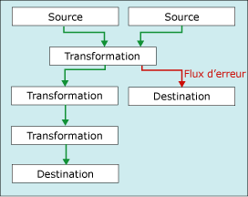

# Gestion des erreurs dans les donn&#233;es
  Lorsqu'un composant de flux de données applique une transformation à des données de colonne, extrait des données à partir de sources ou charge des données dans des destinations, des erreurs peuvent se produire. Les erreurs sont fréquemment dues à des valeurs de données inattendues. Par exemple, une conversion de données échoue car une colonne contient une chaîne au lieu d'un nombre, une insertion dans une colonne de base de données échoue car les données sont une date et que la colonne a un type de données numérique, ou l'évaluation d'une expression échoue car la valeur d'une colonne est nulle, ce qui engendre une opération mathématique non valide.  
  
 Les erreurs appartiennent en général à l'une des catégories suivantes :  
  
-   Erreurs de conversion de données, qui se produisent si une conversion provoque la perte de chiffres significatifs, la perte de chiffres non significatifs et la troncation de chaînes. Les erreurs de conversion de données se produisent également si la conversion demandée n'est pas prise en charge.  
  
-   Erreurs d'évaluation d'expression, qui se produisent si des expressions évaluées au moment de l'exécution effectuent des opérations non valides ou deviennent syntaxiquement incorrectes à cause de valeurs de données manquantes ou incorrectes.  
  
-   Erreurs de recherche, qui se produisent si une opération de recherche ne trouve pas de correspondance dans la table de recherche.  
  
 Pour obtenir une liste d'erreurs, d'avertissements et d'autres messages Integration Services, consultez [Integration Services Error and Message Reference](../../integration-services/integration-services-error-and-message-reference.md).  
  
## Utiliser les sorties d’erreur pour capturer les erreurs au niveau des lignes  
 De nombreux composants de flux de données prennent en charge les sorties d'erreur, qui vous permettent de contrôler la manière dont le composant gère les erreurs de lignes dans les données entrantes et sortantes. Vous pouvez spécifier le comportement du composant lorsqu'une troncation ou une erreur se produit en définissant des options sur des colonnes dans l'entrée ou la sortie. Par exemple, vous pouvez faire en sorte que le composant échoue si les données de noms des clients sont tronquées, mais qu'il ignore les erreurs sur une autre colonne qui contient des données moins importantes.  
  
 La sortie d'erreur peut être connectée à l'entrée d'une autre transformation ou chargée dans une destination différente de la sortie sans erreur. Par exemple, la sortie d'erreur peut être connectée à une transformation de colonne dérivée qui fournit une chaîne pour une colonne vide.  
  
 Le schéma suivant illustre un flux de données simple incluant une sortie d'erreur.  
  
   
  
 Pour plus d’informations, consultez [Flux de données](../../integration-services/data-flow/data-flow.md) et [Chemins d’accès d’Integration Services](../../integration-services/data-flow/integration-services-paths.md).  
  
## Erreurs de type échecs ou troncations  
 Les erreurs appartiennent à l'une des deux catégories suivantes : erreurs ou troncations.  
  
 **Erreurs**. Une erreur indique un échec non équivoque et génère un résultat NULL. Il peut s'agir par exemple d'erreurs de conversion de données ou d'évaluation d'expression, telles qu'une tentative de conversion d'une chaîne contenant des caractères alphabétiques en nombre. Les conversions de données, les évaluations d'expression et les affectations de résultats d'expression aux variables, propriétés et colonnes de données peuvent échouer en raison de casts non conformes et de types de données incompatibles. Pour plus d’informations, consultez [Cast &#40;expression SSIS&#41;](../../integration-services/expressions/cast-ssis-expression.md), [Types de données Integration Services dans les expressions](../../integration-services/expressions/integration-services-data-types-in-expressions.md) et [Types de données Integration Services](../../integration-services/data-flow/integration-services-data-types.md).  
  
 **Troncations**. Une troncation est une erreur moins grave. Elle génère des résultats qui peuvent être utilisables, voire même souhaitables. Vous pouvez faire en sorte de traiter les troncations comme des erreurs ou comme des conditions acceptables. Par exemple, si vous insérez une chaîne de 15 caractères dans une colonne qui ne fait qu'un seul caractère de large, vous pouvez choisir de tronquer la chaîne.  
  
## Sélectionner une option de gestion des erreurs  
 Vous pouvez configurer la manière dont les sources, les  transformations et les destinations gèrent les erreurs et les troncations. Le tableau ci-dessous décrit les options disponibles.  
  
|Option|Description|  
|------------|-----------------|  
|Composant défaillant|La tâche de flux de données échoue lorsqu'une erreur ou une troncation a lieu. L'échec est l'option par défaut pour une erreur et une troncation.|  
|Ignorer l'échec|L'erreur ou la troncation est ignorée et la ligne de données est dirigée vers la sortie de la transformation ou de la source.|  
|Réacheminer la ligne|La ligne de données d'erreur ou de troncation est dirigée vers la sortie d'erreur de la source, de la transformation ou de la destination.|  
  
## Obtenir des informations supplémentaires sur l’erreur  
 Outre les colonnes de données, la sortie d'erreur contient les colonnes **ErrorCode** et **ErrorColumn** . La colonne **ErrorCode** identifie l'erreur, tandis que la colonne **ErrorColumn** contient l'identificateur de lignage de la colonne d'erreur.  
  
 Dans certaines circonstances, la colonne **ErrorColumn** prend la valeur zéro. Cela se produit lorsque la condition d'erreur affecte toute la ligne et non une seule colonne. Par exemple, lorsqu'une recherche échoue dans la transformation de recherche.  
  
 Ces deux valeurs numériques peuvent se révéler d’une utilité limitée en l’absence de la description d’erreur et du nom de colonne correspondants. Voici quelques méthodes vous permettant d’obtenir la description de l’erreur et le nom de la colonne.  
  
-   Vous pouvez visualiser à la fois les descriptions d’erreur et les noms de colonne en attachant une Visionneuse de données à la sortie d’erreur. Dans le concepteur SSIS, cliquez avec le bouton droit sur la flèche rouge conduisant à une sortie d’erreur et sélectionnez **Activer la visionneuse de données**.  
  
-   Vous pouvez rechercher des noms de colonne en activant la journalisation et en sélectionnant l’événement **DiagnosticEx** . Cet événement consigne un mappage de colonnes de flux de données dans le journal. Vous pouvez ensuite rechercher le nom de colonne à partir de son identificateur dans ce mappage de colonnes. Notez que l’événement **DiagnosticEx** ne conserve pas l’espace blanc dans sa sortie XML afin réduire la taille du journal. Pour améliorer la lisibilité, copiez le journal dans un éditeur XML (dans Visual Studio, par exemple) prenant en charge la mise en forme XML et la mise en surbrillance de la syntaxe. Pour plus d’informations sur la journalisation, consultez [Journalisation Integration Services &#40;SSIS&#41;](../../integration-services/performance/integration-services-ssis-logging.md).  
  
     Voici un exemple de mappage de colonnes de flux de données.  
  
    ```xml  
  
    <DTS:PipelineColumnMap xmlns:DTS="www.microsoft.com/SqlServer/Dts">  
        <DTS:Pipeline DTS:Path="\Package\Data Flow Task">  
            <DTS:Column DTS:ID="11" DTS:IdentificationString="ADO NET Source.Outputs[ADO NET Source Output].Columns[Customer]"/>  
            <DTS:Column DTS:ID="12" DTS:IdentificationString="ADO NET Source.Outputs[ADO NET Source Output].Columns[Product]"/>  
            <DTS:Column DTS:ID="13" DTS:IdentificationString="ADO NET Source.Outputs[ADO NET Source Output].Columns[Price]"/>  
            <DTS:Column DTS:ID="14" DTS:IdentificationString="ADO NET Source.Outputs[ADO NET Source Output].Columns[Timestamp]"/>  
            <DTS:Column DTS:ID="20" DTS:IdentificationString="ADO NET Source.Outputs[ADO NET Source Error Output].Columns[Customer]"/>  
            <DTS:Column DTS:ID="21" DTS:IdentificationString="ADO NET Source.Outputs[ADO NET Source Error Output].Columns[Product]"/>  
            <DTS:Column DTS:ID="22" DTS:IdentificationString="ADO NET Source.Outputs[ADO NET Source Error Output].Columns[Price]"/>  
            <DTS:Column DTS:ID="23" DTS:IdentificationString="ADO NET Source.Outputs[ADO NET Source Error Output].Columns[Timestamp]"/>  
            <DTS:Column DTS:ID="24" DTS:IdentificationString="ADO NET Source.Outputs[ADO NET Source Error Output].Columns[ErrorCode]"/>  
            <DTS:Column DTS:ID="25" DTS:IdentificationString="ADO NET Source.Outputs[ADO NET Source Error Output].Columns[ErrorColumn]"/>  
            <DTS:Column DTS:ID="31" DTS:IdentificationString="Flat File Destination.Inputs[Flat File Destination Input].Columns[Customer]"/>  
            <DTS:Column DTS:ID="32" DTS:IdentificationString="Flat File Destination.Inputs[Flat File Destination Input].Columns[Product]"/>  
            <DTS:Column DTS:ID="33" DTS:IdentificationString="Flat File Destination.Inputs[Flat File Destination Input].Columns[Price]"/>  
            <DTS:Column DTS:ID="34" DTS:IdentificationString="Flat File Destination.Inputs[Flat File Destination Input].Columns[Timestamp]"/>  
        </DTS:Pipeline>  
    </DTS:PipelineColumnMap>  
  
    ```  
  
-   Vous pouvez également utiliser le composant Script pour inclure la description d’erreur et le nom de colonne dans des colonnes supplémentaires de la sortie d’erreur. Pour obtenir un exemple, consultez [Amélioration d’une sortie d’erreur à l’aide du composant Script](../../integration-services/extending-packages-scripting-data-flow-script-component-examples/enhancing-an-error-output-with-the-script-component.md).  
  
    -   Incluez la description d’erreur dans une colonne supplémentaire en utilisant une ligne unique de script pour appeler la méthode <xref:Microsoft.SqlServer.Dts.Pipeline.Wrapper.IDTSComponentMetaData100.GetErrorDescription%2A> de l’interface <xref:Microsoft.SqlServer.Dts.Pipeline.Wrapper.IDTSComponentMetaData100>.  
  
    -   Incluez le nom de colonne dans une colonne supplémentaire en utilisant une ligne unique de script pour appeler la méthode <xref:Microsoft.SqlServer.Dts.Pipeline.Wrapper.IDTSComponentMetaData100.GetIdentificationStringByID%2A> de l’interface <xref:Microsoft.SqlServer.Dts.Pipeline.Wrapper.IDTSComponentMetaData100>.  
  
     Vous pouvez ajouter le composant Script au segment d’erreur du flux de données n’importe où en aval des composants de flux de données dont vous souhaitez capturer les erreurs. En règle générale, vous placez le composant Script immédiatement avant l’écriture des lignes d’erreur dans une destination. De cette manière, le script recherche uniquement les descriptions des lignes d’erreur écrites. Le segment d’erreur du flux de données peut corriger certaines erreurs sans écrire ces lignes dans une destination d’erreur.  
  
### Pour configurer un affichage des erreurs  
  
-   [Configurer une sortie d'erreur dans un composant de flux de données](../../integration-services/troubleshooting/configure-an-error-output-in-a-data-flow-component.md)  
  
## Voir aussi  
 [Flux de données](../../integration-services/data-flow/data-flow.md)   
 [Transformer des données avec des transformations](../../integration-services/data-flow/transformations/transform-data-with-transformations.md)   
 [Connecter des composants avec des chemins d'accès](../Topic/Connect%20Components%20with%20Paths.md)   
 [tâche de flux de données](../../integration-services/control-flow/data-flow-task.md)   
 [Flux de données](../../integration-services/data-flow/data-flow.md)  
  
  