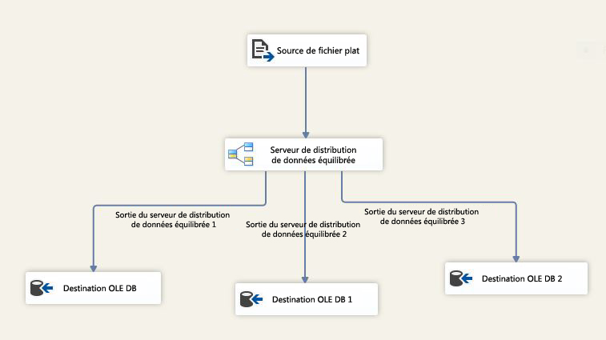

# Transformation du distributeur de données équilibrées (BDD)
  La transformation du distributeur de données équilibrées (BDD) bénéficie de la fonction de traitement simultané des unités centrales modernes. Elle distribue des tampons de lignes entrantes uniformément dans les sorties sur des threads distincts. En utilisant des threads distincts pour chaque chemin de sortie, le composant BDD améliore les performances d'un package SSIS sur des ordinateurs à plusieurs cœurs ou plusieurs processeurs.  
  
 Le schéma suivant montre un exemple simple d'utilisation de la transformation BDD. Dans cet exemple, la transformation BDD sélectionne un tampon de pipeline à la fois des données d'entrée d'une source de fichier plat et l'envoie à l'un des trois chemins de sortie selon le principe du tourniquet. Dans SQL Server Data Tools, vérifiez les valeurs d’une propriété <xref:Microsoft.SqlServer.Dts.Pipeline.Wrapper.MainPipeClass.DefaultBufferSize%2A>(taille par défaut du tampon de pipeline) et d’une propriété <xref:Microsoft.SqlServer.Dts.Pipeline.Wrapper.MainPipeClass.DefaultBufferMaxRows%2A>(nombre maximal par défaut de lignes dans un tampon de pipeline) dans la fenêtre **Propriétés** affichant les propriétés d’une tâche de flux de données.  
  
   
  
 La transformation du distributeur de données équilibrées améliore les performances d'un package dans un scénario qui remplit les conditions suivantes :  
  
1.  Il existe un nombre élevé de données entrantes dans la transformation BDD. Si la taille des données est petite et un seul tampon contient des données, il n'y a aucun raison d'utilise la transformation BDD. Si la taille des données est importante et plusieurs tampons sont nécessaires pour contenir les données, BDD traite efficacement les tampons de données en parallèle à l'aide de threads distincts.  
  
2.  Les données peuvent être lues plus rapidement que le reste du flux de données ne peut le traiter. Dans ce scénario, les transformations qui sont effectuées sur les données s'exécutent lentement par rapport à la fréquence à laquelle les données arrivent. Si le goulot d'étranglement est à la destination, la destination doit être parallélisable.  
  
3.  Il n'est pas nécessaire de trier les données. Par exemple, si les données doivent rester triées, vous ne devez pas les diviser à l'aide de la transformation BDD.  
  
 Notez que si le goulot d'étranglement d'un package SSIS est dû à la fréquence de lecture des données de la source, le composant BDD ne permet pas d'améliorer les performances. Si le goulot d'étranglement se trouve dans un package SSIS, car la destination ne prend pas en charge le parallélisme, BDD ne change rien. Toutefois, vous pouvez effectuer toutes les transformations en parallèle et utiliser la transformation Union All pour combiner les données de sortie de différents chemins de sortie de la transformation BDD avant d'envoyer les données à la destination.  
  
> [!IMPORTANT]  
>  Pour obtenir une présentation avec une démonstration de l’utilisation de la transformation, consultez la [vidéo Distributeur de données équilibrées](http://go.microsoft.com/fwlink/?LinkID=226278) dans la bibliothèque TechNet.  
  
  
