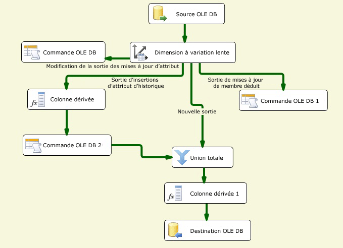

# Configurer les sorties à l'aide de l'Assistant Dimension à variation lente
  L'Assistant Dimension à variation lente fonctionne comme un éditeur pour la transformation de dimension à variation lente. La création et la configuration du flux de données pour des données de dimension à variation lente peuvent être des tâches complexes. L'Assistant Dimension à variation lente constitue le moyen le plus simple de créer le flux de données pour les sorties de transformation de dimension à variation lente ; il vous guide lors des étapes de mappage de colonnes, de sélection de colonnes clés d'entreprise, de définition des attributs de modification de colonnes et de configuration de la prise en charge des membres de dimension inférés.  
  
 Vous devez sélectionner au moins une colonne clé d'entreprise dans la table de dimension et la mapper à une colonne d'entrée. La valeur de la clé d'entreprise lie un enregistrement de la source à un enregistrement de la table de dimension. La transformation utilise ce mappage pour rechercher l'enregistrement dans la table de dimension et déterminer si un enregistrement est nouveau ou en cours d'évolution. En règle générale, la clé d'entreprise est la clé primaire dans la source, mais il peut s'agir d'une autre clé sous réserve qu'elle identifie de manière unique un enregistrement et que sa valeur ne change pas. La clé d'entreprise peut également être une clé composite, englobant plusieurs colonnes. La clé primaire de la table de dimension est généralement une clé de substitution, en l'occurrence une valeur numérique générée automatiquement par une colonne d'identité ou par une solution personnalisée telle qu'un script.  
  
 Avant de pouvoir exécuter l'Assistant Dimension à variation lente, vous devez ajouter une source et une transformation de dimension à variation lente au flux de données, puis connecter la sortie de la source à l'entrée de la transformation de dimension à variation lente. Le flux de données peut éventuellement inclure d'autres transformations entre la source de données et la transformation de dimension à variation lente.  
  
 Pour ouvrir l’Assistant Dimension à variation lente dans le Concepteur [!INCLUDE[ssIS](../../../includes/ssis-md.md)] , double-cliquez sur la transformation de dimension à variation lente.  
  
## Création de sorties de dimensions à variation lente  
  
#### Pour créer des sorties de transformations de dimensions à variation lente  
  
1.  Sélectionnez le gestionnaire de connexions pour accéder à la source de données qui contient la table de dimension à mettre à jour.  
  
     Vous pouvez effectuer une sélection dans une liste de gestionnaires de connexions inclus dans le package.  
  
2.  Sélectionnez la table ou vue de dimension à mettre à jour.  
  
     Après avoir sélectionné le gestionnaire de connexions, vous pouvez sélectionner la table ou la vue à partir de la source de données.  
  
3.  Sélectionnez les attributs clés sur les colonnes et mappez les colonnes d'entrée aux colonnes de la table de dimension.  
  
     Vous devez sélectionner au moins une colonne clé d'entreprise dans la table de dimension et la mapper à une colonne d'entrée. D'autres colonnes d'entrée peuvent être mappées à des colonnes de la table de dimension en tant que mappages non-clés.  
  
4.  Sélectionnez le type de modification pour chaque colonne.  
  
    -   **Modification d'attribut** remplace les valeurs existantes dans les enregistrements.  
  
    -   **Attribut d'historique** crée des enregistrements au lieu de mettre à jour des enregistrements existants.  
  
    -   **Attribut fixe** indique que la valeur de colonne ne doit pas changer.  
  
5.  Définissez les options d'attributs fixes et variables.  
  
     Si vous configurez des colonnes de façon à utiliser le type de modification **Attribut fixe** , vous pouvez spécifier si la transformation de dimension à variation lente échoue lorsque des modifications sont détectées dans ces colonnes. Si vous configurez des colonnes de façon à utiliser le type de modification **Modification d'attribut** , vous pouvez spécifier si tous les enregistrements correspondants (y compris les enregistrements obsolètes) sont mis à jour.  
  
6.  Définissez les options d'attributs d'historique.  
  
     Si vous configurez des colonnes de façon à utiliser le type de modification **Attribut d'historique** , vous devez choisir comment effectuer la distinction entre les enregistrements actifs et expirés. Vous pouvez utiliser une colonne d'indicateurs de lignes actives ou deux colonnes de date pour identifier les lignes actives et expirées. Si vous utilisez la colonne d'indicateurs de lignes actives, vous pouvez lui affecter les valeurs **Current**et **True** pour les lignes actives et **Expired** et **False** pour les lignes expirées. Vous pouvez également entrer des valeurs personnalisées. Si vous utilisez deux colonnes de date, une date de début et une date de fin, vous pouvez spécifier la date à utiliser lors de la définition des valeurs de colonnes de date en tapant une date ou en sélectionnant une variable système et en utilisant sa valeur.  
  
7.  Spécifiez la prise en charge des membres inférés et sélectionnez les colonnes que l'enregistrement de membre inféré contient.  
  
     Lors du chargement de mesures dans une table de faits, vous pouvez créer des enregistrements minimaux pour les membres inférés qui n'existent pas encore. Lorsque, par la suite, des données significatives seront disponibles, les enregistrements de dimension pourront être mis à jour. Il est possible de créer les types d'enregistrements minimaux suivants :  
  
    -   Un enregistrement dans lequel toutes les colonnes avec des types de modification sont nulles.  
  
    -   Un enregistrement dans lequel une colonne booléenne indique que l'enregistrement est un membre inféré.  
  
8.  Examinez les configurations créées par l'Assistant Dimension à variation lente. En fonction des types de modifications pris en charge, différents ensembles de composants de flux de données sont ajoutés au package.  
  
     Le schéma suivant illustre un exemple de flux de données qui prend en charge les modifications d'attributs fixes, d'attributs variables et d'attributs d'historique, les membres inférés et les modifications d'enregistrements correspondants.  
  
       
  
## Mise à jour de sorties de dimensions à variation lente  
 Le moyen le plus simple de mettre à jour la configuration des sorties de transformations de dimensions à variation lente consiste à réexécuter l'Assistant Dimension à variation lente et à modifier les propriétés à partir des pages de l'Assistant. Vous pouvez également mettre à jour la transformation de dimension à variation lente par le biais de la boîte de dialogue **Éditeur avancé** ou par programmation.  
  
##  Voir aussi  
 [Slowly Changing Dimension Transformation](../../../integration-services/data-flow/transformations/slowly-changing-dimension-transformation.md)  
  
  
