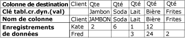
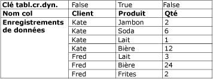

# Transformation Unpivot
  La transformation Unpivot convertit un dataset non normalisé en version plus normalisée en étendant les valeurs de plusieurs colonnes d'un enregistrement dans plusieurs enregistrements avec les mêmes valeurs dans une colonne unique. Par exemple, un dataset qui répertorie des noms de clients possède une ligne pour chaque client, avec les produits et la quantité achetée mentionnés dans les colonnes sur la ligne. Après que la transformation Unpivot a normalisé le dataset, celui-ci contient une ligne différente pour chaque produit que le client a acheté.  
  
 Le schéma suivant illustre un dataset avant que les données n'aient été transformées dans la colonne Product.  
  
   
  
 Le schéma suivant illustre un dataset après transformation de la colonne Product.  
  
   
  
 Dans certaines circonstances, les résultats de la suppression du tableau croisé dynamique peuvent contenir des lignes aux valeurs inattendues. Par exemple, si les exemples de données du diagramme qui doivent être supprimées du tableau croisé dynamique possèdent des valeurs Null dans toutes les colonnes Qty pour Fred, la sortie ne comprend qu'une ligne pour Fred, au lieu de cinq. La colonne Qty contient Null ou zéro, suivant le type de données de la colonne.  
  
## Configuration de la transformation Unpivot  
 La transformation Unpivot inclut la propriété personnalisée **PivotKeyValue** . La propriété peut être mise à jour par une expression de propriété lors du chargement du package. Pour plus d’informations, consultez [Expressions Integration Services &#40;SSIS&#41; ](../../../integration-services/expressions/integration-services-ssis-expressions.md), [Expressions de propriété dans des packages](../../../integration-services/expressions/use-property-expressions-in-packages.md) et [Propriétés personnalisées des transformations](../../../integration-services/data-flow/transformations/transformation-custom-properties.md).  
  
 Cette transformation a une entrée et une sortie. Elle ne possède aucune sortie d'erreur.  
  
 Vous pouvez définir les propriétés par le biais du concepteur [!INCLUDE[ssIS](../../../includes/ssis-md.md)] ou par programmation.  
  
 Pour plus d'informations sur les propriétés définissables dans la boîte de dialogue **Éditeur avancé** ou par programmation, cliquez sur l'une des rubriques suivantes :  
  
-   [Propriétés communes](http://msdn.microsoft.com/library/51973502-5cc6-4125-9fce-e60fa1b7b796)  
  
-   [Propriétés personnalisées des transformations](../../../integration-services/data-flow/transformations/transformation-custom-properties.md)  
  
 Pour plus d’informations sur la façon de définir des propriétés, consultez [Définir les propriétés d’un composant de flux de données](../../../integration-services/data-flow/set-the-properties-of-a-data-flow-component.md).  
  
## Éditeur de transformation UnPivot
  Utilisez la boîte de dialogue **Éditeur de transformation UnPivot** pour sélectionner les colonnes à convertir en ligne, et définir la colonne de données et la nouvelle colonne de sortie de valeur croisée.  
  
> [!NOTE]  
>  Cette rubrique s’appuie sur le scénario Unpivot décrit dans [Unpivot Transformation](../../../integration-services/data-flow/transformations/unpivot-transformation.md) pour illustrer l’utilisation des options.  
  
### Options  
 **Colonnes d'entrée disponibles**  
 Définissez les colonnes à convertir en lignes en utilisant les cases à cocher.  
  
 **Nom**  
 Affiche le nom de la colonne d'entrée disponible.  
  
 **Transfert direct**  
 Indique s'il faut inclure la colonne dans la sortie supprimée du tableau croisé dynamique.  
  
 **Colonne d'entrée**  
 Sélectionnez dans la liste le nom d'une colonne d'entrée pour chaque ligne. Vos sélections se reflètent dans les sélections des cases à cocher de la table **Colonnes d'entrée disponibles** .  
  
 Dans le scénario Unpivot décrit dans [Unpivot Transformation](../../../integration-services/data-flow/transformations/unpivot-transformation.md), les colonnes d'entrée sont **Ham**, **Soda**, **Milk**, **Beer**et **Chips** .  
  
 **Colonne de destination**  
 Définissez le nom de la colonne de données.  
  
 Dans le scénario Unpivot décrit dans [Unpivot Transformation](../../../integration-services/data-flow/transformations/unpivot-transformation.md), la colonne de destination est la colonne de quantité (**Qty**).  
  
 **Valeur de clé de tableau croisé dynamique**  
 Tapez le nom de la valeur croisée dynamique. Par défaut, il s'agit du nom de la colonne d'entrée ; vous pouvez néanmoins choisir un nom unique et descriptif.  
  
 Il est possible de spécifier la valeur de cette propriété en utilisant l'expression d'une propriété.  
  
 Dans le scénario Unpivot décrit dans [Unpivot Transformation](../../../integration-services/data-flow/transformations/unpivot-transformation.md), les valeurs croisées dynamiques apparaîtront dans la nouvelle colonne Produit définie par l'option **Nom de colonne de la valeur de clé de tableau croisé dynamique** comme les valeurs de texte **Ham**, **Soda**, **Milk**, **Beer**et **Chips**.  
  
 **Nom de colonne de la valeur de clé de tableau croisé dynamique**  
 Tapez le nom de la colonne de valeur croisée dynamique. La valeur par défaut est « Valeur de clé de tableau croisé dynamique ». Toutefois, vous pouvez choisir un nom descriptif unique.  
  
 Dans le scénario Unpivot décrit dans [Unpivot Transformation](../../../integration-services/data-flow/transformations/unpivot-transformation.md), le nom de la colonne de la valeur de clé de tableau croisé dynamique est **Product** et définit la nouvelle colonne **Product** dans laquelle les colonnes **Ham**, **Soda**, **Milk**, **Beer**et **Chips** ne sont pas croisées dynamiquement.  
  
##  Voir aussi  
 [Guide de référence des erreurs et des messages propres à Integration Services](../../../integration-services/integration-services-error-and-message-reference.md)   
 [Transformation de tableau croisé dynamique](../../../integration-services/data-flow/transformations/pivot-transformation.md)  
  
  
