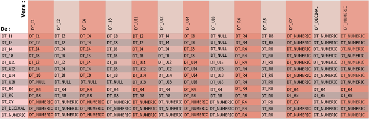

# Types de données Integration Services dans les expressions
  L'évaluateur d'expression utilise des types de données [!INCLUDE[ssISnoversion](../../includes/ssisnoversion-md.md)] . Lorsque des données entrent dans un flux de données d'un package [!INCLUDE[ssISnoversion](../../includes/ssisnoversion-md.md)] , le moteur de flux de données convertit toutes les données de colonne vers un type de données [!INCLUDE[ssISnoversion](../../includes/ssisnoversion-md.md)] et les données de colonne utilisées par une expression ont déjà un type de données [!INCLUDE[ssISnoversion](../../includes/ssisnoversion-md.md)] . Les expressions utilisées dans les transformations de fractionnement conditionnel et de colonne dérivée peuvent référencer des colonnes car elles font partie d'un flux de données qui comprend des données de colonne.  
  
## Variables  
 Les expressions peuvent également utiliser des variables. Les variables ont un type de données Variant et l'évaluateur d'expression convertit le type de données d'une variable d'un sous-type Variant vers un type de données [!INCLUDE[ssISnoversion](../../includes/ssisnoversion-md.md)] avant d'évaluer l'expression. Les variables ne peuvent utiliser qu'un sous-ensemble des types de données [!INCLUDE[ssISnoversion](../../includes/ssisnoversion-md.md)] . Par exemple, une variable ne peut pas utiliser un type de données BLOB (Binary Large Object Block).  
  
 Pour plus d’informations sur les types de données [!INCLUDE[ssISnoversion](../../includes/ssisnoversion-md.md)] et le mappage des types de données Variant à des types de données [!INCLUDE[ssISnoversion](../../includes/ssisnoversion-md.md)] , consultez [Types de données d’Integration Services](../../integration-services/data-flow/integration-services-data-types.md).  
  
## Littéraux  
 Les expressions peuvent aussi comprendre des littéraux de chaîne, booléens et numériques. Pour plus d’informations sur la conversion des littéraux numériques vers des types de données [!INCLUDE[ssISnoversion](../../includes/ssisnoversion-md.md)] numériques, consultez [Littéraux &#40;SSIS&#41;](../../integration-services/expressions/numeric-string-and-boolean-literals.md).  
  
## Chaînes  
 Vous pouvez utiliser DT_STR ou DT_WSTR comme type de retour d’une expression. Toutefois, à l’intérieur d’une expression, seule la chaîne DT_WSTR est prise en charge. Les valeurs DT_STR sont converties en valeurs DT_WSTR. Ce comportement a plusieurs conséquences lorsque vous écrivez une expression.  
  
-   Dans une expression, utilisez NULL(DT_WSTR, ...) au lieu de NULL(DT_STR, ...). Pour plus d’informations sur cette fonction, consultez [NULL &#40;SSIS Expression&#41;](../../integration-services/expressions/null-ssis-expression.md).  
  
-   Dans une expression, vous ne pouvez utiliser que la fonction CAST pour convertir une valeur en DT_STR à la racine de l’expression, c’est-à-dire lorsque vous renvoyez le résultat final de l’expression. Sinon, utilisez le type DT_WSTR dans l’expression.  
  
 Examinez les expressions dans la capture d’écran suivante.  
  
   
  
1.  La première s’exécute sans erreur, car la fonction NULL(DT_STR, ...) se trouve à la racine de l’expression.  
  
2.  La deuxième s’exécute sans erreur, car elle utilise NULL(DT_WSTR, ...).  
  
3.  La troisième génère une erreur, car elle utilise NULL(DT_STR, ...) dans l’expression.  
  
4.  La quatrième génère une erreur, car elle convertit le résultat de NULL(DT_STR, ...) dans l’expression.  
  
     l’évaluateur d’expression traite cette conversion intelligemment et convertit le résultat en DT_WSTR (et non en DT_STR), car il reconnaît que l’opération n’est pas à la racine de l’expression.  
  
 Les exemples suivants illustrent les impacts de la conversion.  
  
   
  
1.  Dans la première expression, la conversion n’est pas au niveau racine de l’expression. l’évaluateur d’expression gère cette conversion intelligemment et convertit le résultat en DT_WSTR (et non en DT_STR). L’expression renvoie DT_WSTR.  
  
2.  Dans la deuxième expression, la conversion est au niveau racine de l’expression. L’expression renvoie DT_STR.  
  
## Conversion de données implicite  
 Une conversion implicite d'un type de données se produit lorsque l'évaluateur d'expression convertit automatiquement les données d'un type de données vers un autre. Par exemple, si un **smallint** est comparé à un **int**, le **smallint** est implicitement converti en **int** avant que la comparaison soit réalisée.  
  
 L'évaluateur d'expression ne peut pas effectuer la conversion implicite des données lorsque les arguments et les opérandes contiennent des types de données incompatibles. Par ailleurs, l'évaluateur d'expression ne peut pas convertir implicitement une valeur en une valeur booléenne. Les arguments et les opérandes doivent être donc être converties explicitement en utilisant l'opérateur de cast. Pour plus d’informations, consultez [Cast &#40;expression SSIS&#41;](../../integration-services/expressions/cast-ssis-expression.md).  
  
 Le diagramme suivant indique le type de résultat des conversions implicites des opérations BINARY. L'intersection d'une colonne et d'une ligne produit le même type de résultat d'une opération binaire avec des opérandes des types gauche (From) et droit (To).  
  
   
  
 L'intersection d'un entier signé et d'un entier non signé est un entier signé potentiellement plus grand que l'un ou l'autre des arguments.  
  
 Les opérateurs comparent des chaînes, des dates, des valeurs booléennes et d'autres types de données. Avant qu'un opérateur ne compare deux valeurs, l'évaluateur d'expression effectue certaines conversions implicites. L'évaluateur d'expression convertit toujours les littéraux de chaîne vers le type de données DT_WSTR et les littéraux booléens vers le type de données DT_BOOL. L'évaluateur d'expression interprète toutes les valeurs entre guillemets comme des chaînes. Les littéraux numériques sont convertis vers l'un des types de données [!INCLUDE[ssISnoversion](../../includes/ssisnoversion-md.md)] numériques.  
  
> [!NOTE]  
>  Les valeurs booléennes ne sont pas des nombres mais des valeurs logiques. Bien que les valeurs booléennes peuvent apparaître sous la forme de nombres dans certains environnements, elles ne sont pas stockées en tant que tels et divers langages de programmation les représentent de manière différente en tant que valeurs numériques, notamment les méthodes .NET Framework.  
>   
>  Par exemple, les fonctions de conversion disponibles dans Visual Basic convertissent la valeur **True** en -1 ; cependant, la méthode **System.Convert.ToInt32** du .NET Framework convertit **True** en +1. Le langage d’expression [!INCLUDE[ssISnoversion](../../includes/ssisnoversion-md.md)] convertit **True** en -1.  
>   
>  Pour éviter des erreurs ou des résultats inattendus, n'écrivez pas de code fondé sur des valeurs numériques précises pour les valeurs **True** et **False**. Si possible, limitez l'utilisation de variables booléennes aux valeurs logiques pour lesquelles elles sont conçues.  
  
 Pour plus d'informations, consultez les rubriques suivantes :  
  
-   [== &#40;Égal&#41; &#40;expression SSIS&#41;](../../integration-services/expressions/equal-ssis-expression.md)  
  
-   [\!= &#40;Non égal&#41; &#40;expression SSIS&#41;](../../integration-services/expressions/unequal-ssis-expression.md)  
  
-   [&#62; &#40;Supérieur à&#41; &#40;expression SSIS&#41;](../../integration-services/expressions/greater-than-ssis-expression.md)  
  
-   [&#60; &#40;Inférieur à&#41; &#40;expression SSIS&#41;](../../integration-services/expressions/less-than-ssis-expression.md)  
  
-   [&#62;= &#40;Supérieur ou égal à&#41; &#40;expression SSIS&#41;](../../integration-services/expressions/greater-than-or-equal-to-ssis-expression.md)  
  
-   [&#60;= &#40;Inférieur ou égal à&#41; &#40;expression SSIS&#41;](../../integration-services/expressions/less-than-or-equal-to-ssis-expression.md)  
  
 Une fonction qui utilise un seul argument retourne un résultat dont le type de données est celui de l'argument, sauf dans les cas suivants :  
  
-   Les fonctions DAY, MONTH et YEAR acceptent une date et renvoient un résultat entier (DT_I4).  
  
-   La fonction ISNULL accepte une expression de n’importe quel type de données [!INCLUDE[ssIS](../../includes/ssis-md.md)] et retourne un résultat booléen (DT_BOOL).  
  
-   Les fonctions SQUARE et SQRT acceptent une expression numérique et renvoient un résultat numérique non intégral (DT_BOOL).  
  
 Si les arguments possèdent le même type de données, le résultat est de ce type. La seule exception est une opération binaire sur deux valeurs de type de données DT_DECIMAL, car celle-ci retourne un résultat dont le type de données est DT_NUMERIC.  
  
## Configuration requise pour les données utilisées dans les expressions  
 L'évaluateur d'expression prend en charge tous les types de données [!INCLUDE[ssISnoversion](../../includes/ssisnoversion-md.md)] . Toutefois, selon l'opération ou la fonction, les opérandes et les arguments requièrent certains types de données. L'évaluateur d'expression impose les contraintes suivantes en matière de type de données pour les données utilisées dans les expressions :  
  
-   Les opérandes utilisés dans les opérations **logiques** doivent s'évaluer à une valeur booléenne. Par exemple, ColonneA > 1&&ColonneB < 2.  
  
-   Les opérandes utilisés dans les opérations **mathématiques** doivent s'évaluer à une valeur numérique. Par exemple, 23,75 * 4.  
  
-   Les opérandes utilisés dans les opérations de comparaison, telles que les opérations logiques et d'égalité, doivent correspondre à des types de données compatibles.  
  
     Par exemple, l'une des expressions de l'exemple suivant utilise le type de données DT_DBTIMESTAMPOFFSET :  
  
     `(DT_DBTIMESTAMPOFFSET,3) "1999-10-11 20:34:52.123 -3:30" != (DT_DBDATE)"1999-10-12"`  
  
     Le système convertit l’expression `(DT_DBDATE)"1999-10-12"`en DT_DBTIMESTAMPOFFSET. Cet exemple correspond à TRUE car l'expression convertie devient "1999-10-12 00:00:00.000 +00:00", ce qui n'est pas égal à la valeur de l'autre expression, `(DT_DBTIMESTAMPOFFSET,3) "1999-10-11 20:34:52.123 -3:30"`.  
  
-   Les arguments transmis aux fonctions mathématiques doivent s'évaluer à un type de données numérique. Selon la fonction ou l'opération, un type de données numérique spécifique peut être requis. Par exemple, la fonction HEX requiert un entier signé ou non signé.  
  
-   Les arguments passés aux fonctions de chaîne doivent produire un type de données caractère : DT_STR ou DT_WSTR. Par exemple, UPPER("fleur"). Certaines fonctions de chaîne, telles que la fonction SUBSTRING, requièrent des arguments entiers supplémentaires pour définir la position de début et la longueur de la chaîne.  
  
-   Les arguments transmis aux fonctions de date et d'heure doivent s'évaluer à une date valide. Par exemple, DAY(GETDATE()). Certaines fonctions, telles que la fonction DATEADD, requièrent un argument entier supplémentaire pour définir le nombre de jours qu'elles ajoutent à une date.  
  
 Les opérations qui combinent un entier non signé (8 bits) et un entier signé nécessitent une conversion explicite afin de clarifier le format du résultat. Pour plus d’informations, consultez [Cast &#40;expression SSIS&#41;](../../integration-services/expressions/cast-ssis-expression.md).  
  
 Les résultats de nombreuses opérations et fonctions ont des types de données prédéterminés. Il peut s'agir du type de données de l'argument ou du type de données vers lequel l'évaluateur d'expression convertit le résultat. Par exemple, le résultat d'un opérateur logique OU (||) est toujours booléen, le résultat de la fonction ABS a le type de données numérique de l'argument et le résultat de la multiplication est du plus petit type de données numérique pouvant contenir ce résultat sans perte de données. Pour plus d’informations sur les types de données des résultats, consultez [Opérateurs &#40;expression SSIS&#41;](../../integration-services/expressions/operators-ssis-expression.md) et [Fonctions &#40;expression SSIS&#41;](../../integration-services/expressions/functions-ssis-expression.md).  
  
## Related Tasks  
 [Utiliser une expression dans un composant de flux de données](http://msdn.microsoft.com/library/9181b998-d24a-41fb-bb3c-14eee34f910d)  
  
## Contenu associé  
  
-   Article technique, [SSIS Expression Cheat Sheet](http://go.microsoft.com/fwlink/?LinkId=746575), sur pragmaticworks.com  
  
-   Article technique, [SSIS Expression Examples](http://go.microsoft.com/fwlink/?LinkId=220761), sur social.technet.microsoft.com  
  
  
