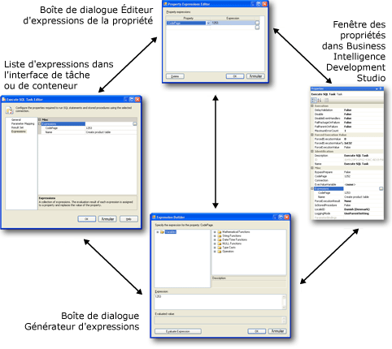

# Expressions de propriété dans des packages
  Une expression de propriété est une expression affectée à une propriété pour permettre la mise à jour dynamique de la propriété au moment de l'exécution. Par exemple, une expression de propriété peut mettre à jour la ligne À utilisée par une tâche Envoyer un message en insérant une adresse électronique qui est stockée dans une variable.  
  
 Une expression peut être ajoutée à un package, une tâche, une boucle Foreach, une boucle For, une séquence, un énumérateur Foreach, un gestionnaire d'événements, un gestionnaire de connexions aux niveaux des packages ou du projet, ou un module fournisseur d'informations. Toute propriété de ces objets qui est en lecture/écriture peut implémenter une expression de propriété. [!INCLUDE[ssISnoversion](../../includes/ssisnoversion-md.md)] prend également en charge l'utilisation d'expressions de propriété dans certaines propriétés personnalisées de composants de flux de données. Les variables et les contraintes de précédence ne prennent pas en charge les expressions de propriété, mais elles incluent des propriétés spéciales dans lesquelles vous pouvez utiliser des expressions.  
  
 Les expressions de propriété peuvent être mises à jour de différentes manières :  
  
-   Les variables définies par l'utilisateur peuvent être incluses dans des configurations de package, puis mises à jour lorsque le package est déployé. À l'exécution, l'expression de propriété est évaluée à l'aide de la valeur de variable mise à jour.  
  
-   Les variables système incluses dans les expressions sont mises à jour à l'exécution, ce qui modifie les résultats de l'évaluation des propriétés.  
  
-   Les fonctions de date et d'heure sont calculées à l'exécution et fournissent les valeurs mises à jour aux expressions de propriété.  
  
-   Les variables dans les expressions peuvent être mises à jour par les scripts exécutés par la tâche de script et le composant de script.  
  
 Les expressions sont générées à l'aide du langage d'expression [!INCLUDE[msCoName](../../includes/msconame-md.md)] [!INCLUDE[ssISnoversion](../../includes/ssisnoversion-md.md)] . Les expressions peuvent utiliser des variables système ou définies par l'utilisateur, ainsi que des opérateurs, des fonctions et des conversions de type fournis par le langage d'expressions.  
  
> [!NOTE]  
>  Les noms des variables définies par l'utilisateur et des variables système respectent la casse.  
  
 Pour plus d’informations, consultez [Expressions Integration Services &#40;SSIS&#41;](../../integration-services/expressions/integration-services-ssis-expressions.md).  
  
 Une utilisation importante des expressions de propriété consiste à personnaliser les configurations pour chaque instance déployée d'un package. Cela permet la mise à jour dynamique des propriétés de package dans différents environnements. Par exemple, vous pouvez créer une expression de propriété qui affecte une variable à la chaîne de connexion d'un gestionnaire de connexions, puis mettre à jour la variable lorsque le package est déployé, ce qui garantit que la chaîne de connexion est correcte à l'exécution. Les configurations de package sont chargées avant l'évaluation des expressions de propriété.  
  
 Une propriété ne peut utiliser qu'une expression de propriété et une expression de propriété ne peut s'appliquer qu'à une propriété. Cependant, vous pouvez générer plusieurs expressions de propriété identiques et les affecter à différentes propriétés.  
  
 Certaines propriétés sont définies à l'aide de valeurs provenant d'énumérateurs. Lorsque vous faites référence au membre d'énumérateur dans une expression de propriété, vous devez utiliser la valeur numérique équivalant au nom convivial du membre de l'énumérateur. Par exemple, si une expression de propriété définit la propriété **LoggingMode** qui utilise une valeur de l'énumération **DTSLoggingMode** , l'expression de la propriété doit utiliser 0, 1 ou 2 à la place des noms conviviaux **Enabled**, **Disabled**ou **UseParentSetting**. Pour plus d’informations, consultez la page [Constantes énumérées dans des expressions de propriété](../../integration-services/expressions/enumerated-constants-in-property-expressions.md).  
  
## Interface utilisateur de l'expression de propriété  
 [!INCLUDE[ssISnoversion](../../includes/ssisnoversion-md.md)] fournit un ensemble d'outils pour la création et la gestion d'expressions de propriété.  
  
-   La page **Expressions** , trouvée dans les éditeurs personnalisés pour les tâches, le conteneur de boucles For et les conteneurs Foreach. La page **Expressions** vous permet de modifier des expressions et d'afficher une liste des expressions de propriété utilisées par une tâche, une boucle For ou une boucle Foreach.  
  
-   La fenêtre **Propriétés** vous permet de modifier des expressions et d'afficher une liste des expressions de propriété utilisées par un package ou les objets d'un package.  
  
-   La boîte de dialogue **Éditeur d'expressions de la propriété** , pour la création, la mise à jour et la suppression des expressions de propriété.  
  
-   La boîte de dialogue **Générateur d'expressions** permet de générer une expression à l'aide d'outils graphiques. La boîte de dialogue **Générateur d'expression** peut évaluer des expressions pour vous permettre de les vérifier, sans que le résultat de l'évaluation soit affecté à la propriété.  
  
 Le schéma suivant montre les interfaces utilisateur que vous pouvez utiliser pour ajouter, modifier et supprimer des expressions de propriété.  
  
   
  
 Dans la fenêtre **Propriétés** et dans la page **Expressions** , cliquez sur le bouton de navigation **(…)** au niveau de la collection **Expressions** pour ouvrir la boîte de dialogue **Éditeur d’expressions de la propriété** . L'Éditeur d'expressions de la propriété permet de mapper une propriété à une expression et de taper une expression de propriété. Si vous souhaitez utiliser les outils d’expression graphique pour créer, puis valider l’expression, cliquez sur le bouton de navigation **(…)** au niveau de l’expression pour ouvrir la boîte de dialogue **Générateur d’expressions** , puis créez ou modifiez et éventuellement validez l’expression.  
  
 Vous pouvez également ouvrir la boîte de dialogue **Générateur d'expression** à partir de la boîte de dialogue **Éditeur d'expressions de la propriété** .  
  
#### Pour travailler avec les expressions de propriété  
  
-   [Ajouter ou modifier une expression de propriété](../../integration-services/expressions/add-or-change-a-property-expression.md)  
  
### Définition d'expressions de propriété de composants de flux de données  
 Si vous construisez un package dans [!INCLUDE[ssBIDevStudioFull](../../includes/ssbidevstudiofull-md.md)], les propriétés des composants de flux de données qui prennent en charge des expressions de propriété sont exposées dans la tâche de flux de données à laquelle ils appartiennent. Pour ajouter, modifier ou supprimer les expressions de propriété de composants de flux de données, cliquez avec le bouton droit sur la tâche de flux de données pour le flux de données auquel les composants de flux de données appartiennent, puis cliquez sur **Propriétés**. La fenêtre Propriétés répertorie les propriétés des composants de flux de données avec lesquels vous pouvez utiliser des expressions de propriété. Par exemple, pour créer ou modifier une expression de propriété pour la propriété SamplingValue d’une transformation d’échantillonnage de lignes nommée SampleCustomer, cliquez avec le bouton droit sur la tâche de flux de données pour le flux de données auquel la transformation d’échantillonnage de lignes appartient, puis cliquez sur **Propriétés**. La propriété SamplingValue figure dans la liste de la fenêtre Propriétés et utilise le format [SampleCustomer].[SamplingValue].  
  
 Dans la fenêtre Propriétés, vous ajoutez, modifiez et supprimez des expressions de propriété pour les composants de flux de données de la même manière que les expressions de propriété d'autres types d'objets [!INCLUDE[ssISnoversion](../../includes/ssisnoversion-md.md)] . La fenêtre Propriétés donne également accès aux diverses boîtes de dialogue et aux divers générateurs permettant d'ajouter, de modifier ou de supprimer des expressions de propriété pour des composants de flux de données. Pour plus d'informations sur les propriétés des composants de flux de données pouvant être mis à jour par des expressions de propriété, consultez [Transformation Custom Properties](../../integration-services/data-flow/transformations/transformation-custom-properties.md).  
  
## Chargement d'expressions de propriété  
 Vous ne pouvez pas spécifier ou contrôler le moment où les expressions de propriété sont chargées. Les expressions de propriété sont évaluées et chargées lors de la validation du package et de ses objets. La validation a lieu au moment où vous enregistrez le package, ouvrez le package dans le concepteur [!INCLUDE[ssIS](../../includes/ssis-md.md)] , puis l'exécutez.  
  
 Vous ne verrez donc pas les valeurs mises à jour des propriétés des objets du package qui utilisent des expressions de la propriété dans le concepteur [!INCLUDE[ssIS](../../includes/ssis-md.md)] tant que vous n'avez pas enregistré le package, exécuté le package ou rouvert le package après avoir ajouté des expressions de propriété.  
  
 Les expressions de propriété associées à différents types d'objets (gestionnaires de connexions, modules fournisseurs d'informations et énumérateurs) sont également chargées lorsque des méthodes spécifiques de ce type d'objet sont appelées. Par exemple, les propriétés des gestionnaires de connexions sont chargées avant que [!INCLUDE[ssISnoversion](../../includes/ssisnoversion-md.md)] ne crée une instance de la connexion.  
  
 Les expressions de propriété sont chargées après le chargement des configurations de package. Par exemple, les variables sont d'abord mises à jour par leurs configurations, puis les expressions de propriété qui utilisent les variables sont évaluées et chargées. Cela signifie que les expressions de propriété utilisent toujours les valeurs de variables qui sont définies par des configurations.  
  
> [!NOTE]  
>  Vous ne pouvez pas utiliser l’option **Set** de l’utilitaire **dtexec** pour remplir une expression de propriété.  
  
 Le tableau suivant indique à quel moment les expressions de propriété d' [!INCLUDE[ssISnoversion](../../includes/ssisnoversion-md.md)] sont évaluées et chargées.  
  
|Type d'objet|Charger et évaluer|  
|-----------------|-----------------------|  
|Package, boucle Foreach, boucle For, séquence, tâches et composants de flux de données|Après le chargement de configurations   Avant la validation   Avant l'exécution|  
|Gestionnaires de connexions|Après le chargement de configurations   Avant la validation   Avant l'exécution   Avant la création d'une instance de connexion|  
|Modules fournisseurs d'informations|Après le chargement de configurations   Avant la validation   Avant l'exécution   Avant l'ouverture des journaux|  
|Énumérateurs Foreach|Après le chargement de configurations   Avant la validation   Avant l'exécution   Avant chaque énumération de la boucle|  
  
## Utilisation d'expressions de propriété dans la boucle Foreach  
 Il est souvent utile d'implémenter une expression de propriété pour définir la valeur de la propriété **ConnectionString** des gestionnaires de connexions que les énumérateurs de boucles Foreach utilisent. Après que l’énumérateur a mappé sa valeur actuelle à une variable dans chaque itération de la boucle, l’expression de propriété peut utiliser la valeur de cette variable pour mettre à jour la valeur de la propriété **ConnectionString** de manière dynamique.  
  
 Si vous souhaitez utiliser des expressions de propriété avec la propriété **ConnectionString** des gestionnaires de connexions de fichiers, de fichiers multiples, de fichiers plats et de fichiers plats multiples qu'une boucle Foreach utilise, vous devez tenir compte de certains aspects. Un package peut être configuré pour exécuter plusieurs exécutables simultanément en attribuant à la propriété **MaxConcurrentExecutables** soit une valeur supérieure à 1, soit la valeur -1. La valeur -1 permet au nombre maximal d'exécutables exécutés simultanément d'être égal au nombre de processeurs plus deux. Pour éviter les conséquences négatives d'une exécution parallèle d'exécutables, la propriété **MaxConcurrentExecutables** doit avoir la valeur 1. Si **MaxConcurrentExecutables** n'a pas la valeur 1, la valeur de la propriété **ConnectionString** ne peut pas être garantie et les résultats sont imprévisibles.  
  
 Par exemple, imaginez une boucle Foreach qui énumère des fichiers dans un dossier, récupère les noms de fichiers, puis utilise une tâche d'exécution SQL pour insérer les noms de fichiers dans une table. Si **MaxConcurrentExecutables** n'a pas la valeur 1, des conflits d'écriture peuvent éventuellement survenir si les deux instances de la tâche d'exécution SQL tentent d'écrire simultanément dans la table.  
  
## Exemples d'expressions de propriété  
 Les exemples d'expression suivants montrent comment utiliser les variables système, les opérateurs, les fonctions et les littéraux de chaîne dans les expressions de propriété.  
  
### Expression de propriété pour la propriété LoggingMode d'un package  
 L’expression de propriété suivante peut être utilisée pour définir la propriété LoggingMode d’un package. L'expression utilise les fonctions DAY et GETDATE pour obtenir un entier qui représente la partie jour d'une date. Si le jour est le premier ou le 15, la journalisation est activée ; sinon, elle est désactivée. La valeur 1 est l’équivalent entier du membre d’énumérateur LoggingMode **Enabled**, et la valeur 2 est l’équivalent entier du membre **Disabled**. Vous devez utiliser la valeur numérique à la place du nom du membre d'énumérateur dans l'expression.  
  
 `DAY((DT_DBTIMESTAMP)GETDATE())==1||DAY((DT_DBTIMESTAMP)GETDATE())==15?1:2`  
  
### Expression de propriété pour l'objet d'un message électronique  
 L’expression de propriété suivante peut être utilisée pour définir la propriété Subject d’une tâche d’envoi de message et fournir un objet de courrier électronique. L'expression utilise une combinaison de littéraux de chaîne, de variables système, les opérateurs de concaténation (+) et de conversion, et les fonctions DATEDIFF et GETDATE. Les variables système sont les variables `PackageName` et `StartTime` .  
  
 `"PExpression-->Package: (" + @[System::PackageName] + ") Started:"+  (DT_WSTR, 30) @[System::StartTime] + " Duration:"  +  (DT_WSTR,10) (DATEDIFF( "ss", @[System::StartTime] , GETDATE()  )) + " seconds"`  
  
 Si le nom du package est EmailRowCountPP, s'il a été exécuté le 03/04/2005 et que la durée de l'exécution était de 9 secondes, l'expression s'évalue à la chaîne.  
  
 PExpression-->Package: (EmailRowCountPP) Started:3/4/2005 11:06:18 AM Duration:9 seconds.  
  
### Expression de propriété pour le message d'un message électronique  
 L’expression de propriété suivante peut être utilisée pour définir la propriété MessageSource d’une tâche d’envoi de message. L'expression utilise une combinaison de littéraux de chaîne, de variables définies par l'utilisateur et l'opérateur de concaténation (+). Les variables définies par l’utilisateur sont appelées `nasdaqrawrows`, `nyserawrows`et `amexrawrows`. La chaîne "\n" indique un retour chariot.  
  
 `"Rows Processed: "  +   "\n" +"   NASDAQ: "  +   (dt_wstr,9)@[nasdaqrawrows]   + "\n" + "   NYSE: "  +  (dt_wstr,9)@[nyserawrows]  + "\n" + "   Amex: "  +  (dt_wstr,9)@[amexrawrows]`  
  
 Si `nasdaqrawrows` a pour valeur 7058, `nyserawrows` 3528 et `amexrawrows` 1102, l'expression renvoie la chaîne suivante.  
  
 Lignes traitées :  
  
 NASDAQ: 7058  
  
 NYSE: 3528  
  
 AMEX: 1102  
  
### Expression de propriété pour la propriété exécutable d'une tâche d'exécution de processus  
 L’expression de propriété suivante peut être utilisée pour définir la propriété Executable d’une tâche d’exécution de processus. L'expression utilise une combinaison de littéraux de chaîne, d'opérateurs et de fonctions. L'expression utilise les fonctions DATEPART et GETDATE et l'opérateur conditionnel.  
  
 `DATEPART("weekday", GETDATE()) ==2?"notepad.exe":"mspaint.exe"`  
  
 S'il s'agit du second jour de la semaine, la tâche d'exécution de processus exécute notepad.exe, sinon la tâche exécute mspaint.exe.  
  
### Expression de propriété pour la propriété ConnectionString d'un gestionnaire de connexions de fichier plat  
 L’expression de propriété suivante peut être utilisée pour définir la propriété ConnectionString d’un gestionnaire de connexions de fichier plat. L'expression utilise une seule variable définie par l'utilisateur ( `myfilenamefull`) contenant le chemin d'accès vers un fichier texte.  
  
 `@[User::myfilenamefull]`  
  
> [!NOTE]  
>  Les expressions de propriétés pour les gestionnaires de connexions sont accessibles seulement via la fenêtre Propriétés. Pour visualiser les propriétés d’un gestionnaire de connexions, vous devez sélectionner le gestionnaire de connexions dans la zone **Gestionnaires de connexions** du concepteur [!INCLUDE[ssIS](../../includes/ssis-md.md)] quand la fenêtre Propriétés est ouverte, ou bien cliquer avec le bouton droit sur le gestionnaire de connexions, puis sélectionner **Propriétés**.  
  
### Expression de propriété pour la propriété ConfigString d'un module fournisseur d'informations de fichier texte  
 L’expression de propriété suivante peut être utilisée pour définir la propriété ConfigString d’un module fournisseur d’informations de fichier texte. L’expression utilise une variable définie par l’utilisateur, `varConfigString`, contenant le nom du gestionnaire de connexions de fichiers à utiliser. Le gestionnaire de connexions de fichiers spécifie le chemin d'accès du fichier texte dans lequel des entrées de journal sont écrites.  
  
 `@[User::varConfigString]`  
  
> [!NOTE]  
>  Les expressions de propriété pour les modules fournisseurs d'informations sont accessibles seulement via la fenêtre Propriétés. Pour visualiser les propriétés d’un module fournisseur d’informations, vous devez sélectionner le module fournisseur d’informations sous l’onglet **Explorateur de package** du concepteur [!INCLUDE[ssIS](../../includes/ssis-md.md)] quand la fenêtre Propriétés est ouverte, ou bien cliquer avec le bouton droit sur le module fournisseur d’informations, puis sélectionner **Propriétés**.  
  
## Ressources externes  
  
-   [Expression and Configuration Highlighter (projet CodePlex)](http://go.microsoft.com/fwlink/?LinkId=146625)  
  
-   Article technique, [SSIS Expression Examples](http://go.microsoft.com/fwlink/?LinkId=220761), sur social.technet.microsoft.com  
  
##  Voir aussi  
 [Utiliser des variables dans des packages](http://msdn.microsoft.com/library/7742e92d-46c5-4cc4-b9a3-45b688ddb787)  
  
  
