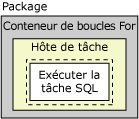
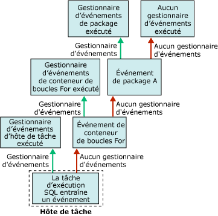

# Gestionnaires d'événements Integration Services (SSIS)
  Lors de l'exécution, les exécutables (packages, conteneurs de boucles Foreach, conteneurs de boucles For, conteneurs de séquences et conteneurs d'hôtes de tâches) déclenchent des événements. Par exemple, un événement OnError se déclenche lorsqu'une erreur se produit. Vous pouvez créer des gestionnaires d'événements personnalisés pour ces événements afin d'étendre les fonctionnalités des packages et les rendre plus faciles à gérer au moment de l'exécution. Les gestionnaires d'événements peuvent réaliser des tâches comme les suivantes :  
  
-   nettoyer l'emplacement de stockage des données temporaires une fois l'exécution d'un package ou d'une tâche terminée ;  
  
-   récupérer les informations système de manière à évaluer la disponibilité des ressources avant exécution d'un package ;  
  
-   actualiser les données d'une table en cas d'échec d'une recherche dans une table de référence ;  
  
-   envoyer un message électronique lorsqu'une erreur ou un avertissement se produit ou lorsqu'une tâche échoue.  
  
 Si un événement ne possède pas de gestionnaire d'événements, il est remonté au conteneur qui se trouve un niveau au-dessus dans la hiérarchie des conteneurs d'un package. Si ce conteneur possède un gestionnaire d'événements, ce dernier est exécuté en réponse à l'événement. Dans le cas contraire, l'événement est remonté au conteneur qui se trouve un niveau au-dessus dans la hiérarchie des conteneurs.  
  
 Le diagramme qui suit montre un package simple composé d'un conteneur de boucles For contenant une tâche d'exécution SQL.  
  
   
  
 Seul le package possède un gestionnaire d’événements (pour son événement **OnError** ). Si une erreur se produit pendant l’exécution de la tâche d’exécution SQL, le gestionnaire d’événements **OnError** du package s’exécute. Le diagramme qui suit montre la séquence d’appels qui conduit à l’exécution du gestionnaire d’événements **OnError** du package.  
  
   
  
 Les gestionnaires d'événements sont membres d'une collection de gestionnaires d'événements. Tous les conteneurs incluent cette collection. Si vous créez le package à l’aide du concepteur [!INCLUDE[ssIS](../includes/ssis-md.md)] , vous pouvez afficher les membres des collections de gestionnaires d’événements dans les dossiers **Gestionnaires d’événements** de l’onglet **Explorateur de package** du concepteur [!INCLUDE[ssIS](../includes/ssis-md.md)] .  
  
 Vous pouvez configurer le conteneur du gestionnaire d'événements de plusieurs manières :  
  
-   indiquez le nom et la description du gestionnaire d'événements ;  
  
-   indiquez si le gestionnaire d'événements s'exécute, si le package échoue en cas d'échec du gestionnaire d'événements et indiquez le nombre d'erreurs autorisées avant échec du gestionnaire d'événements ;  
  
-   spécifiez un résultat d'exécution à renvoyer à la place du résultat d'exécution réel renvoyé au moment de l'exécution par le gestionnaire d'événements ;  
  
-   spécifiez l'option de transaction du gestionnaire d'événements ;  
  
-   spécifiez le mode de journalisation utilisé par le gestionnaire d'événements.  
  
## Contenu du gestionnaire d'événements  
 La création d'un gestionnaire d'événements est similaire à la création d'un package. Un gestionnaire d'événements contient des tâches et des conteneurs qui sont mis en séquence de manière à former un flux de contrôle et peut inclure des flux de données. Le concepteur [!INCLUDE[ssIS](../includes/ssis-md.md)] comprend un onglet **Gestionnaires d’événements** qui permet de créer des gestionnaires d’événements personnalisés.  
  
 Vous pouvez également créer des gestionnaires d'événements par programme. Pour plus d’informations, consultez [Gestion des erreurs et des avertissements](../integration-services/building-packages-programmatically/handling-events-programmatically.md).  
  
## Événements d'exécution  
 Le tableau qui suit énumère les gestionnaires d'événements fournis par [!INCLUDE[ssISnoversion](../includes/ssisnoversion-md.md)] et décrit les événements d'exécution provoquant leur exécution.  
  
|Gestionnaire d'événements|Événement|  
|-------------------|-----------|  
|**OnError**|Gestionnaire d’événements de l’événement **OnError** . Cet événement est déclenché par un exécutable lorsqu'une erreur se produit.|  
|**OnExecStatusChanged**|Gestionnaire d’événements de l’événement **OnExecStatusChanged** . Cet événement est déclenché par un exécutable lorsque son état d'exécution change.|  
|**OnInformation**|Gestionnaire d’événements de l’événement **OnInformation** . Cet événement se déclenche au cours de la validation et de l'exécution d'un exécutable afin de rapporter des informations. Cet événement véhicule des informations uniquement (aucune erreur ni avertissement).|  
|**OnPostExecute**|Gestionnaire d’événements de l’événement **OnPostExecute** . Cet événement est déclenché par un exécutable immédiatement après la fin de son exécution.|  
|**OnPostValidate**|Gestionnaire d’événements de l’événement **OnPostValidate** . Cet événement est déclenché par un exécutable lorsque sa validation est terminée.|  
|**OnPreExecute**|Gestionnaire d’événements de l’événement **OnPreExecute** . Cet événement est déclenché par un exécutable immédiatement avant son exécution.|  
|**OnPreValidate**|Gestionnaire d’événements de l’événement **OnPreValidate** . Cet événement est déclenché par un exécutable lorsque sa validation démarre.|  
|**OnProgress**|Gestionnaire d’événements de l’événement **OnProgress** . Cet événement est déclenché par un exécutable lorsqu'une progression mesurable est réalisée par l'exécutable.|  
|**OnQueryCancel**|Gestionnaire d’événements de l’événement **OnQueryCancel** . Cet événement est déclenché par un exécutable pour déterminer si son exécution doit s'arrêter.|  
|**OnTaskFailed**|Gestionnaire d’événements de l’événement **OnTaskFailed** . Cet événement est déclenché par une tâche lorsqu'elle échoue.|  
|**OnVariableValueChanged**|Gestionnaire d’événements de l’événement **OnVariableValueChanged** . Cet événement est déclenché par un exécutable lorsque la valeur d'une variable change. L'événement est déclenché par l'exécutable sur lequel la variable est définie. Cet événement n’est pas déclenché si vous affectez à la propriété **RaiseChangeEvent** de la variable la valeur **False**. Pour plus d’informations, consultez [Integration Services &#40;SSIS&#41; Variables](../integration-services/integration-services-ssis-variables.md).|  
|**OnWarning**|Gestionnaire d’événements de l’événement **OnWarning** . Cet événement est déclenché par un exécutable lorsqu'un avertissement se produit.|  

## Ajouter un gestionnaire d’événements à un package
Lors de l'exécution, les conteneurs et les tâches déclenchent des événements. Vous pouvez créer des gestionnaires d'événements personnalisés qui répondent à ces événements en exécutant un flux de travail. Vous pouvez ainsi créer un gestionnaire d'événements qui envoie un message électronique lorsqu'une tâche échoue.  
  
 Un gestionnaire d'événements est similaire à un package. Comme un package, il peut définir la portée des variables et inclure un flux de contrôle et des flux de données facultatifs. Vous pouvez créer des gestionnaires d'événements pour les packages, le conteneur de boucles Foreach, le conteneur de boucles For, le conteneur Sequence et toutes les tâches.  
  
 Vous pouvez pour cela utiliser l’aire de conception de l’onglet **Gestionnaires d’événements** du concepteur [!INCLUDE[ssIS](../includes/ssis-md.md)] .  
  
 Quand l’onglet **Gestionnaires d’événements** est actif, les nœuds **Éléments de flux de contrôle** et **Tâches du plan de maintenance** de la Boîte à outils du concepteur [!INCLUDE[ssIS](../includes/ssis-md.md)] contiennent la tâche et les conteneurs permettant de créer le flux de contrôle dans le gestionnaire d’événements. Les nœuds **Sources de flux de données**, **Transformations**et **Destinations du flux de données** contiennent les sources de données, les transformations et les destinations permettant de créer les flux de données dans le gestionnaire d’événements. Pour plus d’informations, consultez [Flux de contrôle](../integration-services/control-flow/control-flow.md) et [Flux de données](../integration-services/data-flow/data-flow.md).  
  
 L’onglet **Gestionnaires d’événements** contient aussi une zone **Gestionnaires de connexions** dans laquelle vous pouvez créer et modifier les gestionnaires de connexions utilisés par les gestionnaires d’événements pour se connecter aux serveurs et aux sources de données. Pour plus d’informations, consultez [Créer des gestionnaires de connexions](http://msdn.microsoft.com/library/6ca317b8-0061-4d9d-b830-ee8c21268345).  
  
### Ajouter un gestionnaire d’événements sous l’onglet Gestionnaires d’événements  
  
1.  Dans [!INCLUDE[ssBIDevStudioFull](../includes/ssbidevstudiofull-md.md)], ouvrez le projet [!INCLUDE[ssISnoversion](../includes/ssisnoversion-md.md)] contenant le package souhaité.  
  
2.  Dans l'Explorateur de solutions, double-cliquez sur le package pour l'ouvrir.  
  
3.  Cliquez sur l’onglet **Gestionnaires d’événements** .  
  
       
  
     La création du flux de contrôle et des flux de données dans le gestionnaire d'événements est identique à la création du flux de contrôle et des flux de données dans un package. Pour plus d’informations, consultez [Flux de contrôle](../integration-services/control-flow/control-flow.md) et [Flux de données](../integration-services/data-flow/data-flow.md).  
  
4.  Dans la liste **Exécutable** , sélectionnez l’exécutable pour lequel vous voulez créer un gestionnaire d’événements.  
  
5.  Dans la liste **Gestionnaire d’événements** , sélectionnez le gestionnaire d’événements que vous voulez créer.  
  
6.  Cliquez sur le lien situé dans l’aire de conception de l’onglet **Gestionnaire d’événements** .  
  
7.  Ajoutez des éléments de flux de contrôle au gestionnaire d'événements et connectez ces éléments à l'aide d'une contrainte de priorité, en faisant glisser la contrainte d'un élément de flux de contrôle à l'autre. Pour plus d’informations, consultez [Control Flow](../integration-services/control-flow/control-flow.md).  
  
8.  Si vous le souhaitez, vous pouvez ajouter une tâche de flux de données puis, dans l’aire de conception de l’onglet **Flux de données** , créer un flux de données pour le gestionnaire d’événements. Pour en savoir plus, voir [Data Flow](../integration-services/data-flow/data-flow.md).  
  
9. Dans le menu **Fichier** , cliquez sur **Enregistrer les éléments sélectionnés** pour enregistrer le package.  

## Définir les propriétés d’un gestionnaire d’événements  
 Vous pouvez définir les propriétés dans la fenêtre **Propriétés** de [!INCLUDE[ssBIDevStudioFull](../includes/ssbidevstudiofull-md.md)] ou par programmation.  
  
 Pour plus d’informations sur la définition de ces propriétés dans [!INCLUDE[ssBIDevStudioFull](../includes/ssbidevstudiofull-md.md)], consultez [Définir les propriétés d’une tâche ou d’un conteneur](http://msdn.microsoft.com/library/52d47ca4-fb8c-493d-8b2b-48bb269f859b).  
  
 Pour plus d'informations sur la définition par programmation de ces propriétés, consultez <xref:Microsoft.SqlServer.Dts.Runtime.DtsEventHandler>.  
  
## Related Tasks  
 Pour plus d’informations sur l’ajout d’un gestionnaire d’événements à un package, consultez [Ajouter un gestionnaire d’événements à un package](http://msdn.microsoft.com/library/5e56885d-8658-480a-bed9-3f2f8003fd78).  
  
  
