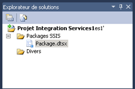

# Projets et solutions Integration Services (SSIS)
  [!INCLUDE[ssNoVersion](../includes/ssnoversion-md.md)] fournit [!INCLUDE[ssBIDevStudioFull](../includes/ssbidevstudiofull-md.md)] pour le développement de packages [!INCLUDE[ssISnoversion](../includes/ssisnoversion-md.md)] .  
  
Les packages [!INCLUDE[ssISnoversion](../includes/ssisnoversion-md.md)] résident dans des projets. Pour créer et utiliser des projets [!INCLUDE[ssISnoversion](../includes/ssisnoversion-md.md)] , vous devez installer l’environnement [!INCLUDE[ssBIDevStudioFull](../includes/ssbidevstudiofull-md.md)] . Pour plus d’informations, consultez [Installer Integration Services](../integration-services/install-windows/install-integration-services.md).  
  
 Quand vous créez un projet [!INCLUDE[ssISnoversion](../includes/ssisnoversion-md.md)] dans [!INCLUDE[ssBIDevStudioFull](../includes/ssbidevstudiofull-md.md)], la boîte de dialogue **Nouveau projet** inclut un modèle **Projet Integration Services** . Ce modèle de projet crée un nouveau projet qui contient un package unique.  
  
## Projets et solutions  
 Les projets sont stockés dans leur solution. Vous pouvez créer une solution, puis ajouter un projet [!INCLUDE[ssISnoversion](../includes/ssisnoversion-md.md)] à cette solution. S’il n’existe aucune solution, [!INCLUDE[ssBIDevStudioFull](../includes/ssbidevstudiofull-md.md)] en crée une automatiquement dès que vous commencez à créer le projet. Une solution peut contenir plusieurs projets de différents types.  
  
> [!TIP]  
>  Par défaut, quand vous créez un projet dans [!INCLUDE[ssBIDevStudio](../includes/ssbidevstudio-md.md)], la solution n’apparaît pas dans le volet **Explorateur de solutions**. Pour modifier ce comportement par défaut, dans le menu **Outils** , cliquez sur **Options**. Dans la boîte de dialogue **Options** , développez **Projets et solutions**, puis cliquez sur **Général**. Dans la page **Général** , sélectionnez **Toujours afficher la solution**.  

## Les solutions contiennent des projets  
 Une solution est un conteneur qui regroupe et gère les projets que vous utilisez lorsque vous développez des solutions d'entreprise de bout en bout. Une solution vous permet de gérer plusieurs projets en une même unité et de regrouper plusieurs projets qui contribuent à une solution d'entreprise.  
  
 Une solution peut contenir des projets de différents types. Si vous souhaitez utiliser le concepteur [!INCLUDE[ssIS](../includes/ssis-md.md)] pour créer un package [!INCLUDE[ssISnoversion](../includes/ssisnoversion-md.md)] , vous travaillez dans un projet [!INCLUDE[ssISnoversion](../includes/ssisnoversion-md.md)] dans une solution fournie par [!INCLUDE[ssBIDevStudioFull](../includes/ssbidevstudiofull-md.md)].  
  
 Lorsque vous créez une nouvelle solution, [!INCLUDE[ssBIDevStudioFull](../includes/ssbidevstudiofull-md.md)] ajoute un dossier Solution à l'Explorateur de solutions et crée des fichiers portant les extensions .sln et .suo :  
  
-   Le fichier *.sln contient des informations sur la configuration de la solution et répertorie les projets de la solution.  
  
-   Le fichier *.suo contient des informations sur vos préférences concernant l'utilisation de la solution.  
  
 [!INCLUDE[ssBIDevStudioFull](../includes/ssbidevstudiofull-md.md)] crée automatiquement une solution lorsque vous créez un projet, mais vous pouvez aussi créer une solution vierge et lui ajouter ultérieurement des projets.  
   
## Les projets Integration Services contiennent des packages  
 Un projet est un conteneur dans lequel vous développez des packages [!INCLUDE[ssISnoversion](../includes/ssisnoversion-md.md)] .  
  
 Dans [!INCLUDE[ssBIDevStudioFull](../includes/ssbidevstudiofull-md.md)], un projet [!INCLUDE[ssISnoversion](../includes/ssisnoversion-md.md)] stocke et groupe les fichiers associés au package. Par exemple, un projet inclut les fichiers requis pour créer une solution d'extraction, de transfert et de chargement (ETL) spécifique.  
  
 Avant de créer un projet [!INCLUDE[ssISnoversion](../includes/ssisnoversion-md.md)] , vous devez vous familiariser avec le contenu de base de ce type de projet. Une fois que vous connaissez le contenu d'un projet, vous pouvez commencer à créer et à utiliser un projet [!INCLUDE[ssISnoversion](../includes/ssisnoversion-md.md)] .  
  
## Dossiers des projets Integration Services  
 Le diagramme qui suit montre les dossiers d'un projet [!INCLUDE[ssISnoversion](../includes/ssisnoversion-md.md)] dans [!INCLUDE[ssBIDevStudioFull](../includes/ssbidevstudiofull-md.md)].  
  
   
  
 Le tableau suivant décrit les dossiers d'un projet [!INCLUDE[ssISnoversion](../includes/ssisnoversion-md.md)] .  
  
|Dossier|Description|  
|------------|-----------------|  
|[!INCLUDE[ssIS](../includes/ssis-md.md)] .|Contient les packages. Pour plus d’informations, consultez [Integration Services &#40;SSIS&#41;, packages](../integration-services/integration-services-ssis-packages.md).|  
|Divers|Contient d'autres fichiers que les fichiers de package.|  
  
## Fichiers des projets Integration Services  
 Lorsque vous ajoutez un nouveau projet [!INCLUDE[ssISnoversion](../includes/ssisnoversion-md.md)] ou un projet existant à une solution, [!INCLUDE[ssBIDevStudioFull](../includes/ssbidevstudiofull-md.md)] crée des fichiers projet portant les extensions .dtproj, .dtproj.user et .database.  
  
-   Le fichier *.dtproj contient des informations sur les configurations du projet et sur d'autres éléments tels que les packages.  
  
-   Le fichier *.dtproj.user contient des informations sur vos préférences de travail avec le projet.  
  
-   Le fichier *.database contient des informations requises par [!INCLUDE[ssBIDevStudioFull](../includes/ssbidevstudiofull-md.md)] pour ouvrir le projet [!INCLUDE[ssISnoversion](../includes/ssisnoversion-md.md)] .  
  
## Ciblage de version dans des projets Integration Services  
 Dans [!INCLUDE[ssBIDevStudioFull](../includes/ssbidevstudiofull-md.md)], vous pouvez créer, gérer et exécuter des packages qui ciblent SQL Server 2016, SQL Server 2014 ou SQL Server 2012.  
  
 Dans l’Explorateur de solutions, cliquez avec le bouton droit sur un projet Integration Services, puis sélectionnez **Propriétés** pour ouvrir les pages de propriétés du projet. Sous l’onglet **Général** de **Propriétés de configuration**, sélectionnez la propriété **TargetServerVersion** , puis choisissez SQL Server 2016, SQL Server 2014 ou SQL Server 2012.  
  
   
 
## Créer un projet Integration Services  
  
1.  Ouvrir [!INCLUDE[ssBIDevStudioFull](../includes/ssbidevstudiofull-md.md)].  
  
2.  Dans le menu **Fichier** , pointez sur **Nouveau**, puis cliquez sur **Projet**.  
  
3.  Dans la boîte de dialogue **Nouveau projet**, dans le volet **Modèles**, sélectionnez **Projet Integration Services**.  
  
     Le modèle **Projet Integration Services** crée un projet [!INCLUDE[ssISnoversion](../includes/ssisnoversion-md.md)] qui contient un package unique vide.  
  
4.  (Facultatif) modifiez le nom et l'emplacement du projet.  
  
     Le nom de la solution est automatiquement mis à jour pour correspondre au nom du projet.  
  
5.  Pour créer un dossier distinct pour le fichier de solution, sélectionnez **Créer le répertoire pour la solution**. Il s'agit de l'option par défaut.  
  
6.  Si un logiciel de contrôle de code source est installé sur l’ordinateur, sélectionnez **Ajouter au contrôle de code source** pour associer le projet au contrôle de code source.  
  
7.  Si le logiciel de contrôle de code source est [!INCLUDE[msCoName](../includes/msconame-md.md)] Visual SourceSafe, la boîte de dialogue **Connexion à Visual SourceSafe** s’ouvre. Dans **Connexion à Visual SourceSafe**, indiquez un nom d’utilisateur, un mot de passe et le nom de la base de données [!INCLUDE[msCoName](../includes/msconame-md.md)] Visual SourceSafe. Cliquez sur **Parcourir** pour localiser la base de données.  
  
    > **REMARQUE :** Pour afficher et modifier le plug-in du contrôle de code source sélectionné et configurer l’environnement du contrôle de code source, cliquez sur **Options** dans le menu **Outils**, puis développez le nœud **Contrôle de code source**.  
  
8.  Cliquez sur **OK** pour ajouter la solution à **Explorateur de solutions** et ajouter le projet à la solution.  
  
## Choisir la version cible d’un projet et de ses packages  
  
1.  Dans l’Explorateur de solutions, cliquez avec le bouton droit sur un projet Integration Services, puis sélectionnez **Propriétés** pour ouvrir les pages de propriétés du projet.  
  
2.  Sous l’onglet **Général** de **Propriétés de configuration**, sélectionnez la propriété **TargetServerVersion** , puis choisissez SQL Server 2016, SQL Server 2014 ou SQL Server 2012.  
  
       
  
 Vous pouvez créer, gérer et exécuter des packages qui ciblent SQL Server 2016, SQL Server 2014 ou SQL Server 2012.  

## Importer un projet existant avec l’Assistant Importation de projet
  
1.  Dans [!INCLUDE[vsprvs](../includes/vsprvs-md.md)], cliquez sur **Nouveau** > **Projet** dans le menu **Fichier** .  
  
2.  Dans la zone **Modèles installés** de la fenêtre **Nouveau projet** , développez **Business Intelligence**, puis cliquez sur **Integration Services**.  
  
3.  Sélectionnez **l’Assistant Importation de projet Integration Services** dans la liste des types de projets.  
  
4.  Tapez le nom du nouveau projet à créer dans la zone de texte **Nom** .  
  
5.  Tapez le chemin ou l’emplacement du projet dans la zone de texte **Emplacement** ou cliquez sur **Parcourir** pour en sélectionner un.  
  
6.  Dans la zone de texte **Nom de solution** , tapez le nom de la solution.  
  
7.  Cliquez sur **OK** pour ouvrir la boîte de dialogue **Assistant Importation de projet Integration Services** .  
  
8.  Cliquez sur **Suivant** pour basculer vers la page **Sélectionner une source** .  
  
9. Si vous importez à partir d’un fichier **.ispac** , tapez le chemin avec le nom de fichier dans la zone de texte **Chemin d’accès** . Cliquez sur **Parcourir** pour accéder au dossier où vous souhaitez que la solution soit stockée et tapez le nom de fichier dans la zone de texte **Nom de fichier** , puis cliquez sur **Ouvrir**.  
  
     Si vous importez à partir d’un **Catalogue Integration Services**, tapez le nom de l’instance de base de données dans la zone de texte **Nom du serveur** ou cliquez sur **Parcourir** et sélectionnez l’instance de base de données contenant le catalogue.  
  
     Cliquez sur **Parcourir** en regard de la zone de texte **Chemin d’accès** , développez le dossier dans le catalogue, sélectionnez le projet que vous souhaitez importer, puis cliquez sur **OK**.  
  
     Cliquez sur **Suivant** pour passer à la page **Vérifier** .  
  
10. Vérifiez les informations et cliquez sur **Importer** pour créer un projet basé sur le projet existant sélectionné.  
  
11. Facultatif : cliquez **Enregistrer le rapport** pour enregistrer les résultats dans un fichier  
  
12. Cliquez sur **Fermer** pour fermer la boîte de dialogue **Assistant Importation de projet Integration Services** .  

## Ajouter un projet à une solution 
 Quand vous ajoutez un projet, vous pouvez créer un nouveau projet vide dans [!INCLUDE[ssISnoversion](../includes/ssisnoversion-md.md)] ou ajouter un projet que vous avez déjà créé pour une autre solution. Vous pouvez uniquement ajouter un projet à une solution existante quand la solution est visible dans [!INCLUDE[ssBIDevStudioFull](../includes/ssbidevstudiofull-md.md)].  
  
### Ajouter un nouveau projet à une solution  
  
1.  Dans [!INCLUDE[ssBIDevStudioFull](../includes/ssbidevstudiofull-md.md)], ouvrez la solution à laquelle vous souhaitez ajouter un nouveau projet [!INCLUDE[ssISnoversion](../includes/ssisnoversion-md.md)] et effectuez l'une des opérations suivantes :  
  
    -   Cliquez avec le bouton droit sur la solution, cliquez sur **Ajouter**, puis sur **Nouveau projet**.  
  
    -   Dans le menu **Fichier** , pointez sur **Ajouter**, puis cliquez sur **Nouveau projet**.  
  
2.  Dans la boîte de dialogue **Ajouter un nouveau projet** , dans le volet **Modèles** , cliquez sur **Projet Integration Services** .  
  
3.  Éventuellement, modifiez le nom et l'emplacement du projet.  
  
4.  Cliquez sur **OK**.  
  
### Ajouter un projet existant à une solution  
  
1.  Dans [!INCLUDE[ssBIDevStudioFull](../includes/ssbidevstudiofull-md.md)], ouvrez la solution à laquelle vous souhaitez ajouter un projet [!INCLUDE[ssISnoversion](../includes/ssisnoversion-md.md)] existant, puis effectuez l'une des opérations suivantes :  
  
    -   Cliquez avec le bouton droit sur la solution, pointez sur **Ajouter**, puis cliquez sur **Projet existant**.  
  
    -   Dans le menu **Fichier** , cliquez sur **Ajouter**, puis sur **Projet existant**.  
  
2.  Dans la boîte de dialogue **Ajouter un projet existant** , recherchez le projet à ajouter, puis cliquez sur **Ouvrir**.  
  
3.  Le projet est ajouté au dossier de la solution dans l' **Explorateur de solutions**.  
  
## Supprimer un projet d’une solution
 Vous ne pouvez supprimer un projet d'une solution que lorsque la solution est visible dans [!INCLUDE[ssBIDevStudioFull](../includes/ssbidevstudiofull-md.md)]. Une fois que la solution est visible, vous pouvez tout supprimer mais devez conserver un projet. Lorsqu'il ne reste qu'un seul projet, [!INCLUDE[ssBIDevStudioFull](../includes/ssbidevstudiofull-md.md)] n'affiche plus le dossier des solutions et vous ne pouvez pas supprimer le dernier projet.  
   
1.  Dans [!INCLUDE[ssBIDevStudioFull](../includes/ssbidevstudiofull-md.md)], ouvrez la solution dans laquelle vous souhaitez supprimer un projet [!INCLUDE[ssISnoversion](../includes/ssisnoversion-md.md)] .  
  
2.  Dans l’Explorateur de solutions, cliquez avec le bouton droit sur le projet, puis cliquez sur **Décharger le projet**.  
  
3.  Cliquez sur **OK** pour confirmer la suppression.  

## Ajouter un élément à un projet  
  
1.  Dans [!INCLUDE[ssBIDevStudioFull](../includes/ssbidevstudiofull-md.md)], ouvrez la solution qui contient le projet [!INCLUDE[ssISnoversion](../includes/ssisnoversion-md.md)] auquel vous souhaitez ajouter un élément.  
  
2.  Dans l’Explorateur de solutions, cliquez avec le bouton droit sur le projet, pointez sur **Ajouter**, puis effectuez l’une des opérations suivantes :  
  
    -   Cliquez sur **Nouvel élément**, puis sélectionnez un modèle dans le volet **Modèles** de la boîte de dialogue **Ajouter un nouvel élément** .  
  
    -   Cliquez sur **Élément existant**, recherchez dans la boîte de dialogue **Ajouter un élément existant** l’élément à ajouter au projet, puis cliquez sur **Ajouter**.  
  
3.  Le nouvel élément apparaît dans le dossier approprié dans l'Explorateur de solutions.  

## Copier des éléments de projet  
Vous pouvez copier des objets dans un projet [!INCLUDE[ssISnoversion](../includes/ssisnoversion-md.md)] ou entre des projets [!INCLUDE[ssISnoversion](../includes/ssisnoversion-md.md)]. Vous pouvez également copier des objets entre les autres types de projets [!INCLUDE[ssBIDevStudioFull](../includes/ssbidevstudiofull-md.md)], [!INCLUDE[ssRSnoversion](../includes/ssrsnoversion-md.md)] et [!INCLUDE[ssASnoversion](../includes/ssasnoversion-md.md)]. Pour pouvoir effectuer une copie entre des projets, il faut qu'ils appartiennent à la même solution [!INCLUDE[ssBIDevStudioFull](../includes/ssbidevstudiofull-md.md)].

1.  Dans [!INCLUDE[ssBIDevStudioFull](../includes/ssbidevstudiofull-md.md)], ouvrez le projet ou la solution [!INCLUDE[ssISnoversion](../includes/ssisnoversion-md.md)] avec lequel vous voulez travailler.  
  
2.  Développez le projet et le dossier de l'élément à partir desquels effectuer la copie.  
  
3.  Cliquez avec le bouton droit sur l’élément, puis cliquez sur **Copier**.  
  
4.  Cliquez avec le bouton droit sur le projet [!INCLUDE[ssISnoversion](../includes/ssisnoversion-md.md)] vers lequel effectuer la copie, puis cliquez sur **Coller**.  
  
     Les éléments sont automatiquement copiés dans le dossier approprié. Si vous copiez dans le projet [!INCLUDE[ssISnoversion](../includes/ssisnoversion-md.md)] des éléments qui ne sont pas des packages, ces éléments sont copiés dans le dossier **Divers**.  
     
