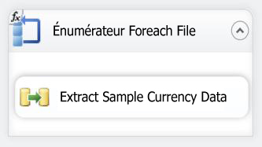
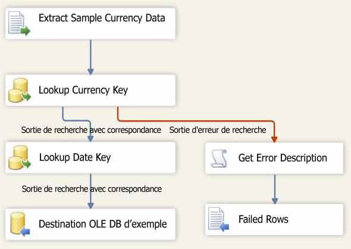

# Leçon 6-3 : Test du package de la leçon 6
Au moment de l'exécution, votre package obtient la valeur de la propriété Directory à partir du paramètre VarFolderName.  
  
Pour vérifier si le package met à jour la propriété Directory avec la nouvelle valeur lors de l'exécution, exécutez tout simplement le package. Étant donné que seuls trois fichiers de données exemple ont été copiés dans le nouveau répertoire, le flux de données ne sera exécuté que trois fois au lieu de parcourir les 14 fichiers du dossier d'origine.  
  
## Vérification de la disposition du package  
Avant de tester le package, vous devez vérifier que le flux de contrôle et le flux de données dans le package de la leçon 6 contiennent les objets affichés dans les diagrammes suivants. Le flux de contrôle doit être identique au flux de contrôle de la leçon 5. Le flux de données doit être identique au flux de données de la leçon 5.  
  
**Flux de contrôle**  
  
  
  
**Flux de données**  
  
  
  
### Pour tester le package du didacticiel de la leçon 6  
  
1.  Dans le menu Déboguer, cliquez sur Démarrer le débogage.  
  
2.  Une fois l'exécution du package terminée, dans le menu Déboguer, cliquez sur Arrêter le débogage.  
  
## Tâche suivante de la leçon  
[Étape 4 : Déploiement du package de la Leçon 6](../integration-services/lesson-6-4-deploying-the-lesson-6-package.md)  
  
  
  
