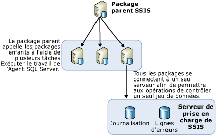

# Équilibrage de charge de packages sur des serveurs distants à l'aide de l'Agent SQL Server
  Lorsque plusieurs packages doivent être exécutés, il convient d'utiliser d'autres serveurs disponibles. Cette méthode qui consiste à utiliser d'autres serveurs pour exécuter des packages lorsque les packages sont tous sous le contrôle d'un package parent est qualifiée d'équilibrage de charge. Dans [!INCLUDE[ssNoVersion](../../includes/ssnoversion-md.md)] [!INCLUDE[ssISnoversion](../../includes/ssisnoversion-md.md)], l'équilibrage de charge est une procédure manuelle qui doit être mise en œuvre par les propriétaires des packages. L'équilibrage de charge n'est pas exécuté automatiquement par les serveurs. En outre, les packages qui sont exécutés sur des serveurs distants doivent être des packages complets, et non des tâches individuelles contenues dans d'autres packages.  
  
 L'équilibrage de charge peut être utile dans les scénarios suivants :  
  
-   Des packages peuvent être exécutés simultanément.  
  
-   Des packages sont volumineux et, s'ils sont exécutés en séquence, peuvent s'exécuter plus longtemps que la période impartie au traitement.  
  
 Les administrateurs et les architectes peuvent déterminer si l'utilisation de serveurs supplémentaires pour le traitement sera avantageuse pour leurs processus.  
  
## Illustration de l'équilibrage de charge  
 Le schéma ci-dessous représente un package parent sur un serveur. Le package parent contient plusieurs tâches Exécuter le travail de l'Agent SQL Server. Chaque tâche dans le package parent appelle un Agent SQL Server sur un serveur distant. Ces serveurs distants contiennent des travaux de l'Agent SQL Server qui incluent une étape appelant un package sur ce serveur.  
  
   
  
 Les étapes requises pour l'équilibrage de charge dans cette architecture ne sont pas de nouveaux concepts. L'équilibrage de charge est plutôt obtenu en utilisant autrement des concepts existants et des objets SSIS communs.  
  
## Exécution de packages sur une instance distante à l'aide de l'Agent SQL Server  
 Dans l'architecture de base pour l'exécution de packages distants, un package central réside sur l'instance de SQL Server qui contrôle les autres packages distants. Le schéma montre ce package central, nommé le SSIS parent. L'instance où réside ce package parent contrôle l'exécution des travaux de l'Agent SQL Server qui s'exécutent sur les packages enfants. Les packages enfants ne sont pas exécutés selon une planification fixe contrôlée par l'Agent SQL Server sur le serveur distant. Les packages enfants sont plutôt démarrés par l'Agent SQL Server lorsqu'ils sont appelés par le package parent et ils s'exécutent sur l'instance de SQL Server sur laquelle réside l'Agent SQL Server.  
  
 Avant que vous puissiez exécuter un package distant à l'aide de l'Agent SQL Server, vous devez configurer les packages parents et enfants et configurer les travaux de l'Agent SQL Server qui contrôlent les packages enfants. Les sections suivantes fournissent d'autres informations sur la création, la configuration, l'exécution et la maintenance de packages exécutés sur des serveurs distants. Ce processus comporte plusieurs étapes :  
  
-   Création des packages enfants et installation de ceux-ci sur des serveurs distants.  
  
-   Création des travaux de l'Agent SQL Server sur les instances distantes qui exécuteront les packages.  
  
-   Création du package parent.  
  
-   Déterminez le scénario de journalisation pour les packages enfants.  
  
## Implémentation de packages enfants
  Quand vous implémentez un équilibrage de charge avec [!INCLUDE[ssISnoversion](../../includes/ssisnoversion-md.md)], des packages enfants sont installés sur d’autres serveurs pour tirer parti du temps UC ou serveur disponible. Pour créer et exécuter les packages enfants, les opérations suivantes sont nécessaires :  
  
-   Conception des packages enfants.  
  
-   Déplacement des packages sur le serveur distant.  
  
-   Création d'un travail de SQL Server Agent sur le serveur distant qui contient une étape exécutant le package enfant.  
  
-   Test et débogage du travail de SQL Server Agent et des packages enfants.  
  
 Lorsque vous concevez les packages enfants, les packages n'ont pas de limites dans leur conception, et vous pouvez inclure toutes les fonctionnalités souhaitées. Cependant, si le package accède à des données, vous devez vous assurer que le serveur qui exécute le package a accès aux données.  
  
 Pour identifier le package parent qui exécute les packages enfants, dans [!INCLUDE[ssBIDevStudioFull](../../includes/ssbidevstudiofull-md.md)] , cliquez avec le bouton droit sur le package dans l’Explorateur de solutions et sélectionnez **Package de point d’entrée**.  
  
 Une fois que les packages enfants ont été conçus, l'étape suivante consiste à les déployer sur les serveurs distants.  
  
### Déplacement du package enfant sur le serveur distant.  
 Il existe plusieurs façons de déplacer des packages sur d'autres serveurs. Les deux méthodes suggérées sont les suivantes :  
  
-   Exportation des packages à l'aide de [!INCLUDE[ssManStudioFull](../../includes/ssmanstudiofull-md.md)].  
  
-   Déploiement de packages en créant un utilitaire de déploiement pour le projet qui contient les packages que vous voulez déployer, puis en exécutant l'Assistant Installation de package pour installer les packages sur le système de fichiers ou sur une instance de [!INCLUDE[ssNoVersion](../../includes/ssnoversion-md.md)]. Pour plus d’informations, consultez [Déploiement de packages hérités &#40;SSIS&#41;](../../integration-services/packages/legacy-package-deployment-ssis.md).  
  
 Vous devez recommencer le déploiement sur chaque serveur distant à utiliser.  
  
### Création des travaux de SQL Server Agent  
 Une fois que les packages enfants ont été déployés sur les divers serveurs, créez un travail de SQL Server Agent sur chaque serveur contenant un package enfant. Le travail de SQL Server Agent contient une étape qui exécute le package enfant lors de l'appel de l'agent du travail. Les travaux de SQL Server Agent ne sont pas des travaux planifiés ; ils exécutent les packages enfants uniquement lorsqu'ils sont appelés par le package parent. La notification de la réussite ou de l'échec du travail au package parent reflète la réussite ou l'échec du travail de SQL Server Agent et l'aboutissement de son appel, et non la réussite ou l'échec du package enfant ou son éventuelle exécution.  
  
### Débogage des travaux de SQL Server Agent et des packages enfants.  
 Vous pouvez tester les travaux de SQL Server Agent et leurs packages enfants à l'aide de l'une des méthodes suivantes :  
  
-   Exécution de chaque package enfant dans le concepteur SSIS, en cliquant sur **Déboguer** / **Exécuter sans débogage**.  
  
-   Exécution du travail individuel de SQL Server Agent sur l’ordinateur distant à l’aide de [!INCLUDE[ssManStudioFull](../../includes/ssmanstudiofull-md.md)], pour vérifier que le package fonctionne.  
  
 Pour plus d’informations sur la résolution des problèmes liés aux packages que vous exécutez à partir des travaux de [!INCLUDE[ssNoVersion](../../includes/ssnoversion-md.md)] Agent, consultez [Un package SSIS ne s’exécute pas lorsque vous appelez le package SSIS à partir d’une étape de travail de SQL Server Agent](http://support.microsoft.com/kb/918760) dans la Base de connaissances du support technique [!INCLUDE[msCoName](../../includes/msconame-md.md)] .  
  
 SQL Server Agent vérifie l'accès au sous-système pour un proxy et donne accès au proxy à chaque exécution de l'étape de travail.  
  
 Vous pouvez créer un proxy dans [!INCLUDE[ssManStudioFull](../../includes/ssmanstudiofull-md.md)].  

## Implémentation du package parent
  Lors d'un équilibrage de charge de packages SSIS entre serveurs, l'étape suivante après la création et le déploiement des packages enfants, puis la création des travaux de SQL Server Agent distants pour les exécuter, consiste à créer le package parent. Le package parent contient de nombreuses tâches Exécuter le travail de SQL Server Agent, chaque tâche étant responsable de l'appel d'un travail de SQL Server Agent qui exécute l'un des packages enfants. Les tâches Exécuter le travail de SQL Server Agent dans le package parent exécutent les différents travaux de SQL Server Agent. Chaque tâche dans le package parent contient des informations précisant notamment comment établir la connexion au serveur distant et quel travail exécuter sur ce serveur. Pour plus d'informations, consultez [Execute SQL Server Agent Job Task](../../integration-services/control-flow/execute-sql-server-agent-job-task.md).  
  
 Pour identifier le package parent qui exécute les packages enfants, dans [!INCLUDE[ssBIDevStudioFull](../../includes/ssbidevstudiofull-md.md)] , cliquez avec le bouton droit sur le package dans l’Explorateur de solutions et sélectionnez **Package de point d’entrée**.  
  
### Liste des packages enfants  
 Si vous déployez votre projet qui contient un package parent et des packages enfants sur le serveur [!INCLUDE[ssISnoversion](../../includes/ssisnoversion-md.md)] , vous pouvez afficher une liste des packages enfants qui sont exécutés par le package parent. Lorsque vous exécutez le package parent, un rapport **Vue d'ensemble** sur ce package est généré automatiquement dans [!INCLUDE[ssManStudioFull](../../includes/ssmanstudiofull-md.md)]. Ce rapport répertorie les packages enfants qui ont été exécutés par la tâche Exécuter le package contenue dans le package parent, comme illustré par l'image ci-dessous.  
  
   
  
 Pour plus d'informations sur l'accès au rapport **Vue d'ensemble** , consultez [Reports for the Integration Services Server](../../integration-services/performance/monitor-running-packages-and-other-operations.md#reports).  
  
### Contraintes de priorité dans le package parent  
 Lorsque vous créez des contraintes de priorité entre les tâches Exécuter le travail de SQL Server Agent dans le package parent, ces contraintes de priorité contrôlent uniquement le moment de démarrage des travaux de SQL Server Agent sur les serveurs distants. Les contraintes de priorité ne peuvent pas recevoir d'informations sur la réussite ou l'échec des packages enfants qui sont exécutés à partir à des étapes des travaux de SQL Server Agent.  
  
 Cela signifie que le succès ou l'échec d'un package enfant ne se propage pas au parent, puisque la seule fonction de la tâche Exécuter le travail de SQL Server Agent dans le package parent consiste à demander au travail de SQL Server Agent d'exécuter le package enfant. Une fois que le travail de SQL Server Agent a été appelé, le package parent reçoit un résultat de <xref:Microsoft.SqlServer.Dts.Runtime.DTSExecResult.Success>.  
  
 L'échec de ce scénario signifie uniquement que l'appel de la tâche Exécuter le travail de SQL Server Agent a échoué. Cette situation peut notamment se produire lorsque le serveur distant est hors service et que l'agent ne répond pas. Cependant, tant que l'agent se déclenche, le package a exécuté sa tâche avec succès.  
  
> [!NOTE]  
>  Vous pouvez utiliser une tâche d’exécution SQL qui contient une instruction Transact-SQL **sp_start_job N'nom_package'**. Pour plus d’informations, consultez [sp_start_job &#40;Transact-SQL&#41;](../../relational-databases/system-stored-procedures/sp-start-job-transact-sql.md).  
  
### Environnement de débogage  
 Lors du test du package parent, utilisez l'environnement de débogage du concepteur en l'exécutant à l'aide des commandes Déboguer / Démarrer le débogage (F5). Vous pouvez également utiliser l'utilitaire d'invite de commandes, **dtexec**. Pour plus d’informations, voir [dtexec Utility](../../integration-services/packages/dtexec-utility.md).  

## Journalisation des packages à charge équilibrée sur les serveurs distants
  Il est plus facile pour un administrateur de gérer les journaux de tous les packages enfants en cours d'exécution sur différents serveurs lorsque tous ces packages enfants utilisent le même module fournisseur d'informations et qu'ils écrivent tous dans la même destination. Une manière de créer un fichier journal commun pour tous les packages enfants est de configurer les packages enfants de telle sorte qu'ils inscrivent leurs événements dans un module fournisseur d'informations SQL Server. Vous pouvez configurer tous les packages pour qu'ils utilisent la même base de données, le même serveur et la même instance du serveur.  
  
 Pour afficher les fichiers journaux, l'administrateur n'a à se connecter qu'à un seul serveur pour afficher les fichiers journaux de tous les packages enfants.  
  
 Pour plus d’informations sur l’activation de la journalisation dans un package, consultez [Journalisation d’Integration Services (SSIS)](../../integration-services/performance/integration-services-ssis-logging.md).  

## Related Tasks  
 [Travaux de SQL Server Agent pour les packages](../../integration-services/packages/sql-server-agent-jobs-for-packages.md)  
  
  
