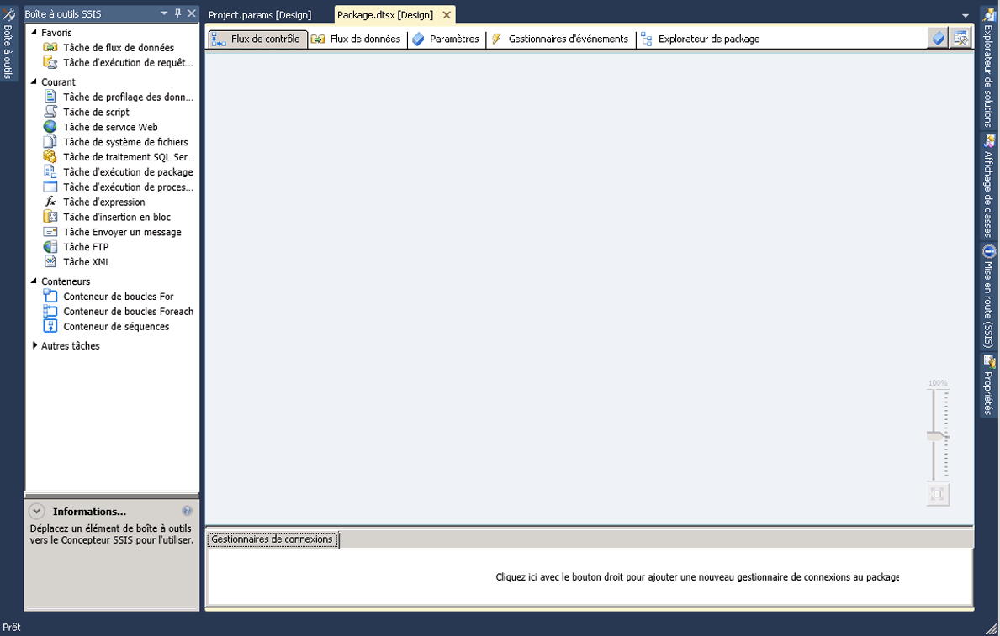

# Concepteur SSIS
  [!INCLUDE[ssIS](../includes/ssis-md.md)] est un outil graphique permettant de créer et de gérer des packages [!INCLUDE[ssISnoversion](../includes/ssisnoversion-md.md)] . [!INCLUDE[ssIS](../includes/ssis-md.md)] est disponible dans [!INCLUDE[ssBIDevStudioFull](../includes/ssbidevstudiofull-md.md)] , en tant que projet [!INCLUDE[ssISnoversion](../includes/ssisnoversion-md.md)] .  
  
 Vous pouvez utiliser le concepteur [!INCLUDE[ssIS](../includes/ssis-md.md)] pour effectuer les tâches suivantes :  
  
-   construire le flux de contrôle dans un package ;  
  
-   construire les flux de données dans un package ;  
  
-   ajouter des gestionnaires d'événements au package et aux objets du package ;  
  
-   afficher le contenu du package ;  
  
-   au moment de l'exécution, afficher la progression de l'exécution du package.  
  
 Le diagramme qui suit montre le concepteur [!INCLUDE[ssIS](../includes/ssis-md.md)] et la fenêtre **Boîte à outils** .  
  
   
  
 [!INCLUDE[ssISnoversion](../includes/ssisnoversion-md.md)] comprend des boîtes de dialogue et des fenêtres supplémentaires permettant d'ajouter des fonctionnalités aux packages, tandis que [!INCLUDE[ssBIDevStudioFull](../includes/ssbidevstudiofull-md.md)] en propose d'autres pour configurer l'environnement de développement et l'utilisation de packages. Pour plus d’informations, consultez [Interface utilisateur d’Integration Services](../integration-services/integration-services-user-interface.md).  
  
 [!INCLUDE[ssIS](../includes/ssis-md.md)] ne dépend pas du service [!INCLUDE[ssISnoversion](../includes/ssisnoversion-md.md)] (celui qui gère et surveille les packages) ; la création ou la modification de packages dans le concepteur [!INCLUDE[ssIS](../includes/ssis-md.md)] ne requiert pas que ce service soit en cours d'exécution. Toutefois, si vous arrêtez ce service alors que le concepteur [!INCLUDE[ssIS](../includes/ssis-md.md)] est ouvert, vous ne pouvez plus ouvrir les boîtes de dialogue fournies par le concepteur [!INCLUDE[ssIS](../includes/ssis-md.md)] et vous risquez de recevoir le message d'erreur « Le serveur RPC n'est pas disponible ». Pour réinitialiser le concepteur [!INCLUDE[ssIS](../includes/ssis-md.md)] et continuer à utiliser le package, vous devez fermer le concepteur, quitter [!INCLUDE[ssBIDevStudioFull](../includes/ssbidevstudiofull-md.md)], puis rouvrir [!INCLUDE[ssBIDevStudioFull](../includes/ssbidevstudiofull-md.md)], le projet [!INCLUDE[ssISnoversion](../includes/ssisnoversion-md.md)] et le package.  
  
## Annuler et rétablir  
 Vous pouvez annuler et rétablir au maximum 20 actions dans le concepteur [!INCLUDE[ssIS](../includes/ssis-md.md)] . Pour un package, les opérations annuler/rétablir sont disponibles dans les onglets **Flux de contrôle**, **Flux de données**, **Gestionnaires d’événements**et **Paramètres** , et dans la fenêtre **Variables** . Pour un projet, ces opérations sont disponibles dans la fenêtre **Paramètres du projet** .  
  
 Vous ne pouvez pas annuler/rétablir les modifications apportées à la nouvelle **Boîte à outils SSIS**.  
  
 Lorsque vous apportez des modifications à un composant à l'aide de l'éditeur de composant, vous annulez et rétablissez les modifications en tant qu'ensemble au lieu d'annuler et rétablir des modifications individuelles. L'ensemble de modifications apparaît en tant qu'action unique dans la liste déroulante d'annulation et de rétablissement.  
  
 Pour annuler une action, cliquez sur le bouton Annuler de la barre d’outils, sur l’élément de menu **Modifier/Annuler** ou appuyez sur Ctrl+Z. Pour rétablir une action, cliquez sur le bouton Rétablir de la barre d’outils ou sur l’élément de menu **Modifier/Rétablir** , ou appuyez sur CTRL+Y. Vous pouvez annuler et rétablir plusieurs actions en cliquant sur la flèche en regard du bouton de la barre d’outils, en mettant en surbrillance plusieurs actions de la liste déroulante, puis en cliquant dans la liste.  
  
## Parties du concepteur SSIS  
 [!INCLUDE[ssIS](../includes/ssis-md.md)] comprend cinq onglets permanents : un pour créer le flux de contrôle du package, un pour les flux de données, un pour les paramètres et un pour les gestionnaires d'événements, ainsi qu'un onglet pour afficher le contenu du package. Au moment de l'exécution, un sixième onglet apparaît pour indiquer la progression de l'exécution d'un package et les résultats de l'exécution une fois celle-ci terminée.  
  
 Par ailleurs, le concepteur [!INCLUDE[ssIS](../includes/ssis-md.md)] contient une zone nommée Gestionnaires de connexions qui permet d'ajouter et de configurer les gestionnaires de connexions utilisés par un package pour se connecter aux données.  
  
### Onglet Flux de contrôle  
 Le flux de contrôle d'un package est construit sur l'aire de conception de l'onglet **Flux de contrôle** . Vous devez faire glisser des éléments de la **Boîte à outils** vers la surface de dessin, puis les relier en un flux de contrôle en cliquant sur l'icône d'un élément, puis en faisant glisser la flèche vers un autre élément.  
  
 Pour plus d’informations, consultez [Control Flow](../integration-services/control-flow/control-flow.md).  
  
### Onglet Flux de données  
 Si un package contient une tâche de flux de données, vous pouvez ajouter des flux de données au package. Les flux de données d'un package sont construits sur la surface de dessin de l'onglet **Flux de données** . Vous devez faire glisser des éléments de la **Boîte à outils** vers la surface de dessin, puis les relier en un flux de données en cliquant sur l'icône d'un élément, puis en faisant glisser la flèche vers un autre élément.  
  
 Pour en savoir plus, voir [Data Flow](../integration-services/data-flow/data-flow.md).  
  
### Onglet paramètres  
 Les paramètres d'Integration Services (SSIS) vous permettent d'affecter des valeurs aux propriétés des packages au moment de l'exécution du package. Vous pouvez créer des paramètres de projet au niveau du projet et des paramètres de package au niveau du package. Les paramètres du projet sont utilisés pour fournir une entrée externe que le projet reçoit à un ou plusieurs packages du projet. L'utilisation de paramètres de package vous permet de modifier l'exécution du package sans avoir à modifier et à redéployer le package. Cet onglet vous permet de gérer les paramètres du package.  
  
 Pour plus d’informations sur les paramètres, consultez [Paramètres Integration Services (SSIS)](integration-services-ssis-package-and-project-parameters.md).  
  
> **IMPORTANT**  Les paramètres sont disponibles uniquement pour les projets développés pour le modèle de déploiement de projet. Par conséquent, vous verrez l'onglet Paramètres uniquement pour les packages qui font partie d'un projet configuré pour utiliser le modèle de déploiement du projet.  
  
### Onglet Gestionnaires d'événements  
 Les événements d'un package sont construits sur la surface de dessin de l'onglet **Gestionnaires d'événements** . Sous l'onglet **Gestionnaires d'événements** , vous devez sélectionner le package ou l'objet du package pour lequel vous voulez créer un gestionnaire d'événements, puis sélectionner l'événement à associer au gestionnaire d'événements. Un gestionnaire d'événements contient un flux de contrôle et des flux de données facultatifs.  
  
 Pour en savoir plus, voir [Add an Event Handler to a Package](http://msdn.microsoft.com/library/5e56885d-8658-480a-bed9-3f2f8003fd78).  
  
### Onglet Explorateur de package  
 Les packages peuvent être complexes et inclure de nombreuses tâches, gestionnaires de connexions, variables et autres éléments. L'Explorateur de package permet d'afficher une liste complète des éléments du package.  
  
 Pour plus d’informations, consultez [Afficher des objets de packages](../integration-services/view-package-objects.md).  
  
### Onglet Progression/Résultats d'exécution  
 L'onglet **Progression** indique la progression de l'exécution du package. À la fin de l'exécution du package, les résultats de l'exécution sont disponibles sous l'onglet **Résultats d'exécution** .  
  
> **REMARQUE :** Pour activer ou désactiver l’affichage de messages sous l’onglet **Progression** , basculez l’option **Création de rapports de progression de débogage** dans le menu **SSIS** .  
  
#### Zone Gestionnaires de connexion  
 Ajoutez et modifiez les gestionnaires de connexions utilisés par un package dans la zone **Gestionnaires de connexions** . [!INCLUDE[ssISnoversion](../includes/ssisnoversion-md.md)] inclut des gestionnaires de connexions permettant de se connecter à différentes sources de données, telles que des fichiers texte, des bases de données OLE DB et des fournisseurs .NET.  
  
 Pour plus d’informations, consultez [Connexions Integration Services &#40;SSIS&#41;](../integration-services/connection-manager/integration-services-ssis-connections.md) et [Créer des gestionnaires de connexions](http://msdn.microsoft.com/library/6ca317b8-0061-4d9d-b830-ee8c21268345).  
 
## Onglet Flux de contrôle
Utilisez l'onglet **Flux de contrôle** du concepteur [!INCLUDE[ssIS](../includes/ssis-md.md)] pour créer le flux de contrôle dans un package [!INCLUDE[ssISnoversion](../includes/ssisnoversion-md.md)] .  
  
 Pour créer le flux de contrôle, faites glisser les objets graphiques qui représentent les tâches et les conteneurs [!INCLUDE[ssIS](../includes/ssis-md.md)] de la **Boîte à outils** vers la surface de dessin de l'onglet **Flux de contrôle** , puis connectez-les en faisant glisser le connecteur d'un objet vers un autre. Chaque ligne de raccordement représente une contrainte de priorité qui spécifie l'ordre d'exécution des tâches et des conteneurs.  
  
 En outre, vous pouvez utiliser le Concepteur [!INCLUDE[ssIS](../includes/ssis-md.md)] pour ajouter les fonctionnalités suivantes à l'onglet **Flux de contrôle** :  
  
-   mettre en œuvre l'enregistrement dans un journal ;  
  
-   créer des configurations de package ;  
  
-   signer le package à l'aide d'un certificat ;  
  
-   gérer les variables ;  
  
-   ajouter des annotations.  
  
-   configurer des points d'arrêt.  
  
 Pour ajouter ces fonctions à des tâches ou des conteneurs individuels dans le Concepteur [!INCLUDE[ssIS](../includes/ssis-md.md)] , cliquez avec le bouton droit sur l'objet situé sur la surface de dessin, puis sélectionnez l'option.  
 
## Onglet Flux de données
Utilisez l'onglet **Flux de données** du concepteur [!INCLUDE[ssIS](../includes/ssis-md.md)] pour créer des flux de données dans un package [!INCLUDE[ssISnoversion](../includes/ssisnoversion-md.md)] .  
  
 Pour créer le flux de données, faites glisser les objets graphiques qui représentent les sources, les transformations et les destinations de la **Boîte à outils** vers la surface de dessin de l'onglet **Flux de données** , puis connectez-les pour créer les chemins d'accès qui définissent la séquence dans laquelle les transformations sont exécutées.  
  
 Cliquez avec le bouton droit sur un chemin d’accès, puis cliquez sur **Visionneuses de données** pour ajouter des visionneuses de données permettant d’afficher les données avant et après chaque objet du flux de données.  
  
 Vous pouvez également utiliser le concepteur [!INCLUDE[ssIS](../includes/ssis-md.md)] pour ajouter les fonctionnalités suivantes à l'onglet **Flux de données** :  
  
-   gérer les variables ;  
  
-   ajouter des annotations.  
  
 Pour ajouter ces fonctions dans le concepteur [!INCLUDE[ssIS](../includes/ssis-md.md)] , cliquez avec le bouton droit sur la surface de dessin, puis sélectionnez l'option choisie.  
 
## Onglet Gestionnaires d'événements
  Utilisez l’onglet **Gestionnaires d’événements** du concepteur [!INCLUDE[ssIS](../includes/ssis-md.md)] pour créer un flux de contrôle dans un package [!INCLUDE[ssISnoversion](../includes/ssisnoversion-md.md)] . Un gestionnaire d'événements est exécuté en réponse à un événement déclenché par le package ou par une tâche ou un conteneur du package.  
  
## Options  
 **Exécutable**  
 Sélectionnez l'exécutable pour lequel vous souhaitez créer un gestionnaire d'événements. L'exécutable peut être un package ou une tâche ou des conteneurs du package.  
  
 **Gestionnaire d’événements**  
 Sélectionnez un type de gestionnaire d'événements. Créez le gestionnaire d’événements en faisant glisser les éléments à partir de la **Boîte à outils**.  
  
 **Supprimer**  
 Sélectionnez un gestionnaire d’événements et supprimez-le du package en cliquant sur **Supprimer**.  
  
 **Cliquez ici pour créer un \<nom de gestionnaire d’événements\> pour le fichier exécutable \<nom du fichier exécutable\>**  
 Cliquez pour créer le gestionnaire d'événements.  
  
 Pour créer le flux de contrôle, faites glisser les objets graphiques qui représentent les tâches et les conteneurs [!INCLUDE[ssIS](../includes/ssis-md.md)] de la **Boîte à outils** vers l’onglet **Gestionnaires d’événements** , puis connectez-les en utilisant des contraintes de priorité pour définir leur ordre d’exécution.  
  
 Par ailleurs, pour ajouter des annotations, cliquez avec le bouton droit dans l’aire de conception puis, dans le menu qui s’affiche, cliquez sur **Ajouter une annotation**.  
 
## Onglet Explorateur de package
Utilisez l'onglet **Explorateur de package** du Concepteur [!INCLUDE[ssIS](../includes/ssis-md.md)] pour afficher une vue hiérarchique de tous les éléments d'un package : configurations, connexions, gestionnaires d'événements, objets exécutables tels que les tâches et les conteneurs, modules fournisseurs d'informations, contraintes de précédence et variables. Si un package contient une tâche de flux de données, l'onglet **Explorateur de package** comporte un nœud qui contient une vue hiérarchique de tous les composants de flux de données.  
  
 Cliquez avec le bouton droit sur un élément du package, puis cliquez sur **Propriétés** pour afficher les propriétés de l’élément dans la fenêtre **Propriétés** , ou cliquez sur **Supprimer** pour supprimer l’élément. 
 
## Onglet Progression
Utilisez l'onglet **Progression** du concepteur [!INCLUDE[ssIS](../includes/ssis-md.md)] pour afficher la progression d'un package [!INCLUDE[ssISnoversion](../includes/ssisnoversion-md.md)] exécuté dans [!INCLUDE[ssBIDevStudioFull](../includes/ssbidevstudiofull-md.md)]. L'onglet **Progression** répertorie l'heure de début, l'heure de fin et le temps écoulé pour la validation et l'exécution du package et de ses exécutables, les informations ou les avertissements éventuels pour le package, les notifications sur la progression, la réussite ou l'échec du package et les messages d'erreur éventuels générés pendant l'exécution du package.  
  
 Pour activer ou désactiver l'affichage de messages sous l'onglet **Progression** , basculez l'option **Création de rapports de progression de débogage** dans le menu **SSIS** . La désactivation du rapport de progression peut aider à améliorer les performances lors de l'exécution d'un package complexe dans [!INCLUDE[ssBIDevStudio](../includes/ssbidevstudio-md.md)].  
  
 Une fois l'exécution du package terminée, l'onglet **Progression** devient l'onglet **Résultats d'exécution** .  
 
## Zone Gestionnaires de connexion
Les packages utilisent des gestionnaires de connexion pour se connecter aux sources de données telles que les fichiers, les bases de données relationnelles et les serveurs.  
  
 Utilisez la zone **Gestionnaires de connexion** du concepteur [!INCLUDE[ssIS](../includes/ssis-md.md)] pour ajouter, supprimer, modifier, renommer et copier et coller les gestionnaires de connexion.  
  
 Cliquez avec le bouton droit dans cette zone puis, dans le menu qui s'affiche, cliquez sur l'option de la tâche à exécuter.
 
## Related Tasks  
  
-   [Créer des packages dans les outils de données SQL Server](../integration-services/create-packages-in-sql-server-data-tools.md)  
  
##  Voir aussi  
 [Interface utilisateur d’Integration Services](../integration-services/integration-services-user-interface.md)  
  
  
