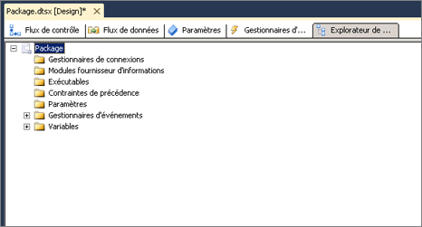

# Afficher des objets de packages
  Dans le concepteur [!INCLUDE[ssIS](../includes/ssis-md.md)] , l'onglet **Explorateur de package** fournit un aperçu du package. Cet affichage reflète la hiérarchie de conteneur de l'architecture [!INCLUDE[ssISnoversion](../includes/ssisnoversion-md.md)] . Le conteneur de packages est situé en haut de la hiérarchie et vous pouvez développer le package pour afficher les connexions, les exécutables, les gestionnaires d'événements, les fournisseurs d'informations, les contraintes de précédence et les variables du package.  
  
 Les exécutables, qui sont les conteneurs et les tâches du package, peuvent inclure des gestionnaires d'événements, des contraintes de précédence et des variables. [!INCLUDE[ssISnoversion](../includes/ssisnoversion-md.md)] prend en charge une hiérarchie imbriquée de conteneurs, et les conteneurs de boucles For, de boucles Foreach et de séquences peuvent inclure d'autres exécutables.  
  
 Si un package contient un flux de données, l' **Explorateur de package** répertorie la tâche de flux de données et inclut un dossier **Composants** qui répertorie les composants du flux de données.  
  
 À partir de l'onglet **Explorateur de package** , vous pouvez supprimer des objets d'un package et accéder à la fenêtre **Propriétés** afin d'afficher les propriétés des objets.  
  
 Le schéma suivant illustre l'arborescence d'un package simple.  
  
   
  
## Afficher la structure et le contenu d’un package  
  
1.  Dans [!INCLUDE[ssBIDevStudioFull](../includes/ssbidevstudiofull-md.md)], ouvrez le projet [!INCLUDE[ssISnoversion](../includes/ssisnoversion-md.md)] contenant le package à afficher dans l' **Explorateur de package**.  
  
2.  Cliquez sur l'onglet **Explorateur de package** .  
  
3.  Pour afficher le contenu des dossiers **Variables**, **Contraintes de précédence**, **Gestionnaires d'événements**, **Gestionnaires de connexions**, **Modules fournisseurs d'informations**ou **Exécutables** , développez chaque dossier.  
  
4.  Selon la structure du package, développez les dossiers de niveau inférieur.  
  
## Afficher les propriétés d’un objet de package
  
-   Cliquez avec le bouton droit sur un objet, puis cliquez sur **Propriétés** pour ouvrir la fenêtre **Propriétés** .  
  
## Supprimer un objet d’un package  
  
-   Cliquez avec le bouton droit sur un objet, puis cliquez sur **Supprimer**. 
 
##  Voir aussi  
 [Tâches Integration Services](../integration-services/control-flow/integration-services-tasks.md)   
 [Conteneurs Integration Services](../integration-services/control-flow/integration-services-containers.md)   
 [Contraintes de précédence](../integration-services/control-flow/precedence-constraints.md)   
 [Variables Integration Services &#40;SSIS&#41;](../integration-services/integration-services-ssis-variables.md)   
 [Gestionnaires d’événements Integration Services &#40;SSIS&#41](../integration-services/integration-services-ssis-event-handlers.md)   
 [Journalisation Integration Services &#40;SSIS&#41;](../integration-services/performance/integration-services-ssis-logging.md)  
  
  
