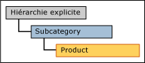
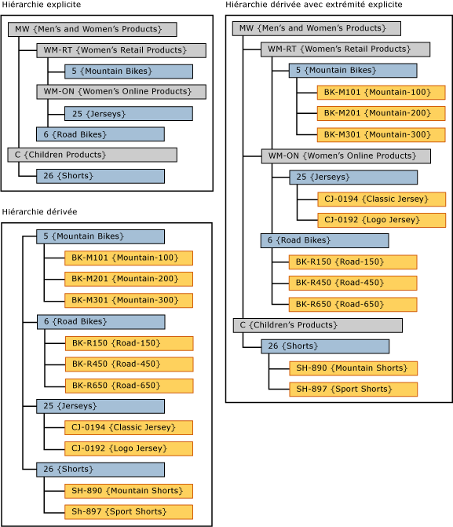

# Hiérarchies dérivées avec un niveau supérieur composé d'une hiérarchie explicite (Master Data Services)
  Dans [!INCLUDE[ssMDSshort](../includes/ssmdsshort-md.md)], si une hiérarchie dérivée inclut une hiérarchie explicite, les niveaux de la hiérarchie explicite sont utilisés comme niveaux supérieurs de la hiérarchie dérivée.  
  
 La hiérarchie explicite doit être basée sur la même entité que celle située au sommet de la hiérarchie dérivée.  
  
 Dans l’interface utilisateur de [!INCLUDE[ssMDSmdm](../includes/ssmdsmdm-md.md)] , vous créez ce type de hiérarchie en faisant glisser une hiérarchie explicite au sommet d’une hiérarchie dérivée.  
  
   
  
## Exemple de hiérarchie dérivée avec niveau supérieur  
 Dans cet exemple, les membres de la hiérarchie explicite proviennent de l'entité Subcategory. Dans la hiérarchie dérivée, les membres de niveau supérieur proviennent également de l'entité Subcategory.  
  
   
  
 En utilisant la hiérarchie explicite au sommet d'une hiérarchie dérivée, la hiérarchie dérivée devient déséquilibrée.  
  
## Règles  
  
-   Une hiérarchie dérivée avec un niveau supérieur ne peut inclure qu'une seule hiérarchie explicite.  
  
-   Vous pouvez utiliser la même hiérarchie explicite comme niveau supérieur dans plusieurs hiérarchies dérivées.  
  
-   Vous ne pouvez pas affecter d'autorisations de membre de hiérarchie à des hiérarchies dérivées avec un niveau supérieur d'une hiérarchie dérivée. Si vous affectez des autorisations individuellement à la hiérarchie explicite ou à la hiérarchie dérivée, les autorisations s'appliquent aux deux hiérarchies.  
  
## Tâches associées  
  
|Description de la tâche|Rubrique|  
|----------------------|-----------|  
|Créer une hiérarchie dérivée.|[Créer une hiérarchie dérivée &#40;Master Data Services&#41;](../master-data-services/create-a-derived-hierarchy-master-data-services.md)|  
|Créer une hiérarchie explicite.|[Créer une hiérarchie explicite &#40;Master Data Services&#41;](../master-data-services/create-an-explicit-hierarchy-master-data-services.md)|  
|Supprimer une hiérarchie dérivée existante.|[Supprimer une hiérarchie dérivée &#40;Master Data Services&#41;](../master-data-services/delete-a-derived-hierarchy-master-data-services.md)|  
|||  
  
## Contenu connexe  
  
-   [Hiérarchies dérivées &#40;Master Data Services&#41;](../master-data-services/derived-hierarchies-master-data-services.md)  
  
-   [Hiérarchies explicites &#40;Master Data Services&#41;](../master-data-services/explicit-hierarchies-master-data-services.md)  
  
  
