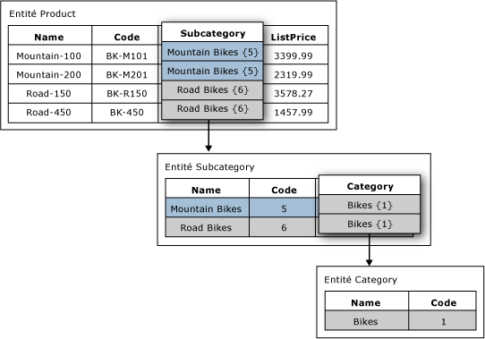

# Attributs basés sur un domaine (Master Data Services)

[!INCLUDE[appliesto-ss-xxxx-xxxx-xxx-md-winonly](../includes/appliesto-ss-xxxx-xxxx-xxx-md-winonly.md)]

  Dans [!INCLUDE[ssMDSshort](../includes/ssmdsshort-md.md)], un attribut basé sur un domaine est un attribut dont les valeurs sont remplies par les membres d'une autre entité. Vous pouvez considérer un attribut basé sur un domaine sous la forme d'une liste contrainte ; les attributs basés sur un domaine empêchent les utilisateurs d'entrer des valeurs d'attribut qui sont valides. Pour sélectionner une valeur d'attribut, l'utilisateur doit choisir dans une liste.  
  
## Exemple d'attribut basé sur un domaine  
 Dans l'image suivante, l'entité Product a un attribut basé sur un domaine appelé Subcategory. L'attribut Subcategory est rempli par les valeurs de l'entité Subcategory.  
  
 L'entité Subcategory a un attribut basé sur un domaine appelé Category. L'attribut Category est rempli par les valeurs de l'entité Category.  
  
   
  
## Utiliser des attributs basés sur un domaine dans la même entité  
 Vous pouvez utiliser la même entité en tant qu'attribut basé sur un domaine de plusieurs entités. Par exemple, vous pouvez créer une entité appelée YesNoIndicator avec les membres : Yes, No et Maybe. Vous pouvez créer un attribut basé sur un domaine nommé InStock et utiliser l'entité YesNoIndicator comme source. Vous pouvez également créer un autre attribut basé sur un domaine nommé Approved et utiliser l'entité YesNoIndicator comme source. Lorsque vous voulez que les utilisateurs choisissent dans une liste des membres de l'entité YesNoIndicator, vous pouvez utiliser l'entité comme attribut basé sur un domaine.  
  
## Les attributs basés sur un domaine forment les hiérarchies dérivées  
 Les relations d'attributs basés sur un domaine sont à la base des hiérarchies dérivées. Pour plus d’informations, consultez [Hiérarchies dérivées &#40;Master Data Services&#41;](../master-data-services/derived-hierarchies-master-data-services.md).  
  
## Related Tasks  
  
|Description de la tâche|Rubrique|  
|----------------------|-----------|  
|Créer un attribut basé sur un domaine qui provient d'une entité existante.|[Créer un attribut basé sur un domaine &#40;Master Data Services&#41;](../master-data-services/create-a-domain-based-attribute-master-data-services.md)|  
|Créez une entité.|[Créer une entité &#40;Master Data Services&#41;](../master-data-services/create-an-entity-master-data-services.md)|  
  
## Contenu associé  
  
-   [Hiérarchies dérivées &#40;Master Data Services&#41;](../master-data-services/derived-hierarchies-master-data-services.md)  
  
-   [Attributs &#40;Master Data Services&#41;](../master-data-services/attributes-master-data-services.md)  
  
-   [Entités &#40;Master Data Services&#41;](../master-data-services/entities-master-data-services.md)  
  
  
